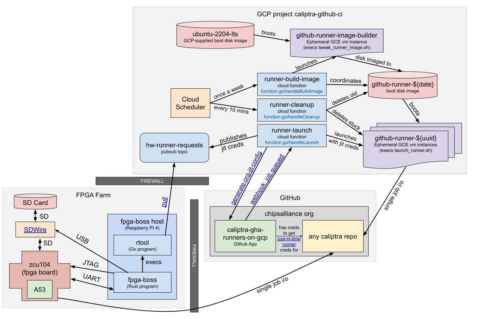

# Caliptra fpga-boss

A utility for flashing, resetting, and communicating over UART with zcu104 FPGA
boards used for testing Caliptra firmware.

## What do I need to use this?

You need:

* A linux host with USB. A cheap SBC like a Raspberry PI works well.
* A [Xilinx zcu104 FPGA dev board](https://www.xilinx.com/products/boards-and-kits/zcu104.html), with the FTDI/JTAG USB port plugged into the linux host.
* An FPGA SD image built from [../fpga-image](../fpga-image)

To use the flashing feature, you will need

* An [SDWire](https://wiki.tizen.org/SDWire) SD mux or compatible clone.

## How do I determine the `--zcu104` parameter for my hardware?

This is the USB port path to the FTDI chip on the ZCU104 dev board, which will
remain the consistent whenever the device is plugged into this port. To discover
the value:

```sh
sudo dmesg | grep 'idVendor=0403, idProduct=6011'
[1349669.647027] usb 1-14.3: New USB device found, idVendor=0403, idProduct=6011, bcdDevice= 8.00 
```

In this case, the USB path is `1-14.3`.


## How do I determine the `--sdwire` parameter for my hardware?

This is the USB port path of the USB hub built into the SDWire0 (SDWire contains
a hub connected to a FTDI chip and SD USB controller chip).

```sh
$ sudo dmesg | grep 'idVendor=04e8, idProduct=6001'
[1349552.217882] usb 1-14.6.2: New USB device found, idVendor=04e8, idProduct=6001, bcdDevice=10.00
```

The shell snippet above finds the port path of the FTDI chip. To get the port path of
the hub, remove the '.2' suffix. For example, `1-14.6.2` becomes `--sdwire=1-14.6`.

## What is the `--boss_ftdi` argument for?

fpga-boss can also be used with a FTDI
[C232HM-DDHS](https://ftdichip.com/products/c232hm-ddhsl-0-2/) cable for
control of a Raspberry Pi with the `console` subcommand, (and the `flash`
subcommand if you have an SDWire plugged into the PI's SD slot). To use:

* C232HM-DDHS black wire should be plugged into Raspberry PI GPIO pin 6 (Ground)
* C232HM-DDHS yellow wire should be plugged into Raspberry PI GPIO pin 8 (UART TXD)
* C232HM-DDHS orange wire should be plugged into Raspberry PI GPIO pin 10 (UART RXD)
* C232HM-DDHS green wire can be plugged into the RUN pin of J2 (for reset control)

## Can you give me an example of how I might use fpga-boss?

Start by generating an image (or download one pre-built by the [fpga-image workflow](../../.github/workflows/fpga-image.yml).

```sh
$ sudo apt-get -y install debootstrap binfmt-support qemu-user-static u-boot-tool
$ cd ci-tools/fpga-image
$ sudo bash build.sh
```

### To flash the image to the SD card and take the FPGA out of reset:

```
$ cd ci-tools/fpga-boss
$ cargo run -- --zcu104 1-14.3 --sdwire 1-14.6 flash ../fpga-image/out/image.img
Block device associated with 1-14.2.1 is /dev/sda
Flashing ../fpga-image/out/image.img to /dev/sda
Waiting for attached sd card to be noticed by OS
```

If you run into permission-denied errors, you may need to tweak your udev rules
to make the above USB devices accessible to your user. Alternately, run
fpga-boss as root.

### To observe the UART output of the now booting FPGA:

```
$ cargo run -- --zcu104 1-14.3 --sdwire 1-14.2  console
To exit terminal type Ctrl-T then Q


U-Boot 2020.01 (May 14 2021 - 10:06:32 +0000)

Model: ZynqMP ZCU104 RevC
Board: Xilinx ZynqMP
<snip>
```

## How is fpga-boss used for Caliptra CI?

We have four zcu104 boards connected to a Raspberry pi running four instances of
`fpga-boss serve`:

```
# fpga-boss --zcu104 x-x.x --sdwire x-x.x serve image.img -- /path/to/rtool receive_jitconfig
```

The serve subcommand runs in a loop that does the following:

* Ensure that the sd card contains contains image.img, flashing if necessary.
* Take the zcu104 out of reset, monitoring its boot over UART.
* Once the zcu104 has booted, invoke the provided shell command
  `path/to/rtool receive_jitconfig`, and read the
  [jitconfig](https://docs.github.com/en/rest/actions/self-hosted-runners#create-configuration-for-a-just-in-time-runner-for-an-organization) from
  stdout.
* Talk to the zcu104 over UART and ask it to invoke the GHA runner
  with the provided jitconfig.
* Monitor the UART, waiting for the GHA runner to terminate after it
  runs a single job.
* Put the FPGA back into reset, and go back to step 1.



