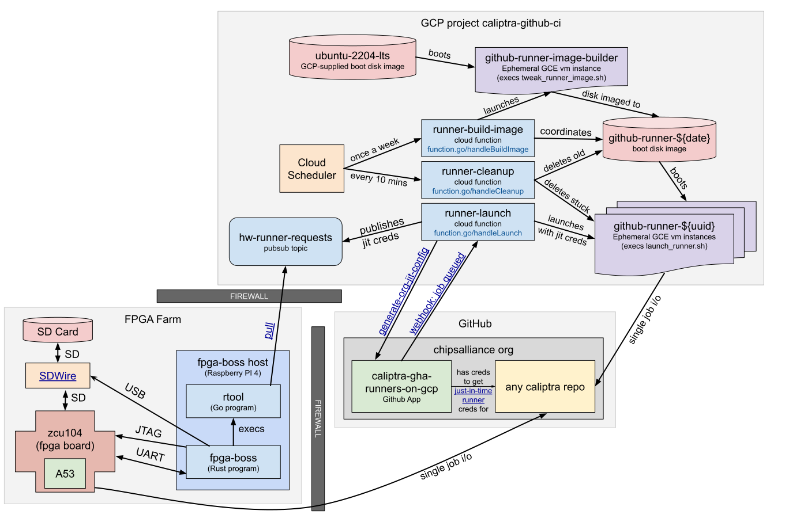

# Caliptra GitHub GCP Runner Infrastructure

Infrastructure that launches self-hosted GitHub Actions runners inside ephemeral Google
Compute Engine VMs.

## Why should I use this?

Self-hosted runners can run for longer than the 6-hour max for GitHub's built-in
action runners, can easily use powerful virtual machines (up to 32-core), and
can run preinstalled proprietary software such as FPGA EDA tools.

## Why shouldn't I use this?

It makes it harder for non-caliptra members to execute the workflow. Jobs
that rely on GCP runners cannot easily be launched in forked repositories until
a PR has been created in the chipsalliance repo and approved for execution by a
caliptra member.

## How do I use this?

In your github workflow file, add a runs-on line:

```text
jobs:
  my_slow_job:
    runs-on: e2-standard-2
    timeout-minutes: 720
```

## What OS do the runners use?

Ubuntu 22.04

## What is preinstalled on the runner VMs?

See [tweak_runner_image.sh](./scripts/tweak_runner_image.sh)

## Supported runs-on-labels

The runs-on-label maps to specific
[GCE instance types](https://cloud.google.com/compute/docs/general-purpose-machines#e2_machine_types).
Unless your job has particularly high memory requirements, prefer the highcpu
instances when 4 or more cores are needed, as they are cheaper.

```text
"e2-highcpu-2"
"e2-highcpu-4"
"e2-highcpu-8"
"e2-highcpu-16"
"e2-highcpu-32"
"e2-standard-2"
"e2-standard-4"
"e2-standard-8"
"e2-standard-16"
"e2-standard-32"
"n2d-highcpu-64"
"n2d-highcpu-80"
"n2d-highcpu-96"
```

## Architecture



The `caliptra-github-ci` project is hosted by a GCP organization named `caliptra.org`, funded by Google
and adminstrated by [korran](https://github.com/korran/),
[bluegate010](https://github.com/bluegate010/), and
[andreslagarcavilla](https://github.com/andreslagarcavilla).

A GitHub App has been installed in the chipsalliance org with privileges for the caliptra
repos. It monitors GitHub for the [workflow_job
queued](https://docs.github.com/en/webhooks-and-events/webhooks/webhook-events-and-payloads?actionType=queued#workflow_job)
event. The event webhook invokes the "runner-launch" cloud function, which
uses its App credentials to retrieve
[just-in-time](https://docs.github.com/en/rest/actions/self-hosted-runners?apiVersion=2022-11-28#create-configuration-for-a-just-in-time-runner-for-an-organization)
credentials for a single-use runner. The "runner-launch" cloud function launches
a github-runner VM and gives it the single-use jit credentials. After the VM boots,
it execs the [github actions-runner](https://github.com/actions/runner/releases), which proceeds to retrieve a job from GitHub
with the specified runs-on label and execute it. Once the job finishes, it shuts
down the VM, which is eventually deleted by the "runner-cleanup" cloud function.
If the VM is still running after more than N hours, the "runner-cleanup" cloud
function will terminate the VM and delete it.

## How can I launch my own infrastructure?

See the [deployment documentation](deployments/README.md). The
[source for the cloud functions](./function.go) and
[terraform configuration](./deployments/main.tf) for deploying the GCP project
are available.
