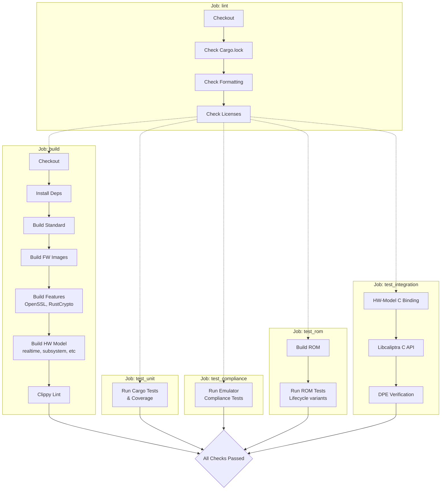
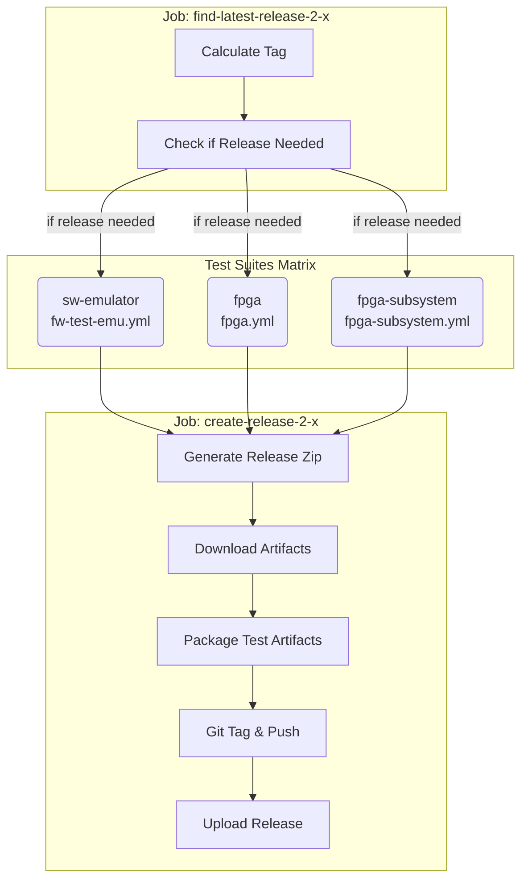

# CI Architecture

> **Note:** Portions of the Continuous Integration (CI) infrastructure are actively being migrated to the [chipsalliance/caliptra-infra](https://github.com/chipsalliance/caliptra-infra) repository. Some scripts or tools referenced here may be moved or refactored in the future.

> **Note:** The Verilator Hardware Model workflow is currently inactive. Work to fix and re-enable it is tracked in [issue #2652](https://github.com/chipsalliance/caliptra-sw/issues/2652).

## System Overview

## Build and Test Workflow

### How it works

The **Build and Test** workflow (`build-test.yml`) is the primary CI pipeline that runs on every push to `main` and every pull request. Its goal is to ensure code quality, build stability, and functional correctness across various components.

**1. Linting (`lint`):**
   - This job acts as a gatekeeper. It checks for:
     - **Formatting:** Ensures code adheres to `cargo fmt` standards.
     - **Licenses:** Verifies all files have the correct license headers.
     - **Cargo Lock:** Ensures `Cargo.lock` is in sync with `Cargo.toml`.

**2. Building (`build`):**
   - This job compiles the entire workspace and validates that everything builds correctly.
   - **Standard Build:** Compiles the project with default settings.
   - **Firmware:** Builds the specific firmware images (ROM, FMC, Runtime).
   - **Feature Permutations:** Builds key crates with different feature flags (e.g., `openssl` vs. `rustcrypto`) to ensure optional dependencies are compatible.
   - **Hardware Model:** Builds the hardware model with various configurations (`fpga_realtime`, `fpga_subsystem`).
   - **Clippy:** Runs the Rust linter to catch common mistakes and enforce best practices.

**3. Unit Testing (`test_unit`):**
   - Runs the standard Cargo test suite (`cargo test`).
   - Includes specific tests for the `ocp-lock` feature.
   - Also runs tests for the `fpga-boss` tool.

**4. Compliance Testing (`test_compliance`):**
   - Verifies the emulator against the standard RISC-V architecture tests.
   - Clones the `riscv-arch-test` repository and runs the compliance suite.

**5. ROM Testing (`test_rom`):**
   - Focuses on the ROM firmware.
   - Builds the ROM and runs it in the emulator under different device lifecycle states (`unprovisioned`, `manufacturing`, `production`).

**6. Integration Testing (`test_integration`):**
   - Tests the integration between different components.
   - **C Binding:** Verifies the C bindings for the hardware model.
   - **Libcaliptra:** Tests the C API for the Caliptra library.
   - **DPE:** Verifies the Device Identifier Composition Engine (DICE) Protection Environment.

**7. Final Verification (`all_checks_passed`):**
   - A simple "fan-in" job that succeeds only if all the previous testing jobs (`build`, `test_unit`, `test_compliance`, `test_rom`, `test_integration`) have passed. This is often used as a branch protection rule.

## Nightly Release Workflow

### How it works

The Nightly Release workflow (`nightly-release.yml`) automates the creation and publication of nightly builds. It ensures that new releases are only created when there are changes and after rigorous testing.

**1. Identification and Triggering:**
   - The workflow runs on a schedule (Tuesday-Saturday at 2:11 AM PST) or via manual dispatch.
   - **Job: `find-latest-release-2-x`**: This job determines if a new release is necessary.
     - It calculates a potential new tag based on the date and an incrementing index (e.g., `release_vYYYYMMDD_N-2.x`).
     - It checks if there have been commits since the last release tag.
     - If changes are detected, it sets `create_release=true` and outputs the `new_release_tag` and `release_ref`.

**2. Validation (Test Suites):**
   - If a release is needed, multiple test suites run in parallel using a matrix strategy to cover different configurations.
     - **`sw-emulator`**: Runs firmware tests on the software emulator (calls `fw-test-emu.yml`).
     - **`fpga`**: Runs tests on the FPGA model (calls `fpga.yml`).
     - **`fpga-subsystem`**: Runs FPGA subsystem tests (calls `fpga-subsystem.yml`).
   - These jobs produce test artifacts (logs, results) which are later packaged.

**3. Release Creation:**
   - **Job: `create-release-2-x`**: Runs only if the previous validation jobs succeed.
   - **Generation**: Executes `ci-tools/release/build_release.sh` to generate the release artifacts.
     - **Binaries**: Builds ROM, FMC, and Runtime firmware binaries (both standard and "fake" variants for testing).
     - **Bundles**: Creates image bundles with different key types (LMS, MLDSA).
     - **Source & Models**: Copies RTL source (`hw/latest/rtl`), `libcaliptra`, and FPGA model files.
     - **Verification**: Calculates an RTL hash to ensure integrity.
     - **Documentation**: Generates `release_notes.txt` containing version info, commit hashes, and the RTL hash.
     - **Zipping**: Packages everything into a single `caliptra_<tag>.zip`.
   - **Artifact Packaging**: Downloads artifacts from the validation jobs and zips them into `test_artifacts_<tag>.zip`.
   - **Tagging**: Pushes the new git tag to the repository.
   - **Publishing**: Uses `softprops/action-gh-release` to create a GitHub release and upload the two zip files.

**Tools Involved:**
- **`ci.sh`**: The central script for local and CI build/test tasks.
- **`ci-tools/release/build_release.sh`**: The core script for assembling the release package.
  - Invokes `cargo run ... --bin image` to generate firmware images.
  - Uses `zip` to archive the workspace.
- **`ci-tools/release/tools/generate_rtl_file_list.sh`** & **`rtl_hash.sh`**: Used to generate a deterministic hash of the RTL source for verification.
- **GitHub Actions**: Orchestrates the dependencies, matrix strategies, and releases.

### Creating Releases for 2.0 and 1.0 Branches

Releases for the `caliptra-2.0` and `caliptra-1.0` branches can be triggered manually using the "Workflow Dispatch" feature in GitHub Actions.

**Steps:**

1. Navigate to the **Actions** tab in the GitHub repository.
2. Select the appropriate workflow from the sidebar:
   - For **caliptra-2.0**: Select **Nightly Release 2.x**.
   - For **caliptra-1.0**: Select **Nightly Release**.
3. Click the **Run workflow** button.
4. In the "Use workflow from" dropdown menu, select the target branch:
   - **caliptra-2.0** for 2.x releases.
   - **caliptra-1.0** for 1.x releases.
5. Click the green **Run workflow** button.

The workflow will then proceed to:
1. Check if a new release is needed (i.e., if there are new commits since the last tag).
2. Run the relevant test suites (SW Emulator, FPGA, etc.).
3. If tests pass, generate and publish the release with the appropriate version tag (e.g., `release_vYYYYMMDD_N-2.x` or `release_vYYYYMMDD_N`).
