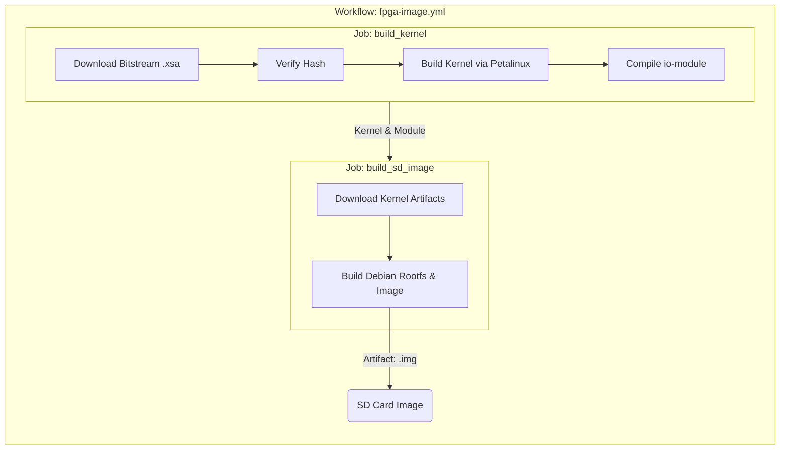
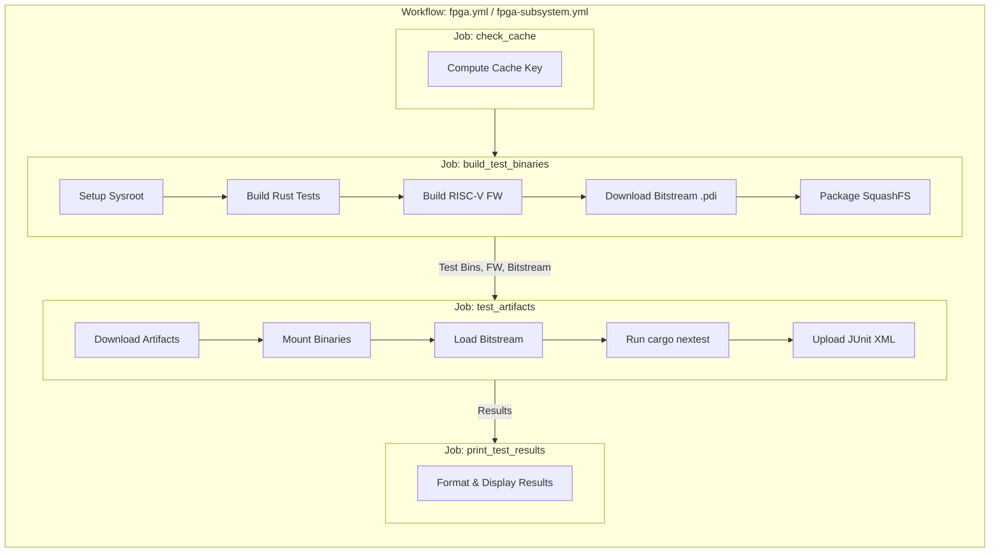

# FPGA CI Workflow

The Caliptra CI infrastructure utilizes FPGA emulation to verify hardware and firmware interactions on real hardware. This process involves building a bootable SD card image for the FPGA and then running specific test suites on it.

## 1. Building the FPGA Image

The FPGA image creation is handled by the workflow defined in `.github/workflows/fpga-image.yml`. This workflow produces the necessary artifacts to boot the Xilinx VCK190 evaluation kit.

### Workflow: `fpga-image.yml`

This workflow runs on a schedule (Tuesday/Thursday) or when changes are made to FPGA-related files. It creates two variants of the image: `core` and `subsystem`.

#### **Job: `build_kernel`**
- **Purpose:** Builds the Linux kernel and modules tailored for the VCK190 board with the Caliptra bitstream.
- **Key Steps:**
    1.  **Downloads the Bitstream:** Fetches the specific `.xsa` (Xilinx Support Archive) file (either `core` or `subsystem` variant) from a Google Cloud Storage bucket.
    2.  **Verifies Hash:** Ensures the downloaded bitstream matches the expected SHA256 hash.
    3.  **Builds Kernel:** Uses Petalinux tools (mounted from a pre-configured volume) to build the kernel (`BOOT.BIN`, `Image`, `image.ub`, etc.).
    4.  **Compiles Modules:** Builds the custom `io-module` kernel driver.
    5.  **Artifacts:** Uploads the kernel tarball (`vck190-kernel-*.tar.gz`) and the kernel module (`io-module-*.ko`) as artifacts.

#### **Job: `build_sd_image`**
- **Purpose:** Packages the kernel and a Debian-based root filesystem into a bootable SD card image (`.img`).
- **Key Steps:**
    1.  **Downloads Kernel:** Retrieves the artifacts from the `build_kernel` job.
    2.  **Builds Image:** Uses a script (`ci-tools/fpga-image/build.sh`) to assemble the final image. This process involves:
        - Setting up a Debian filesystem (using `debootstrap`).
        - Installing the kernel and modules.
        - Configuring boot scripts.
    3.  **Artifacts:** Uploads the final SD card image (`caliptra-fpga-image-*.img`) as an artifact.

---

## 2. Running FPGA Tests

Once the infrastructure is ready, tests are executed on the FPGA hardware using self-hosted runners connected to the physical boards.

### Workflow: `fpga.yml` (Core Tests) & `fpga-subsystem.yml` (Subsystem Tests)

These workflows are triggered by pull requests or the nightly release process. They follow a similar structure:

#### **Job: `check_cache`**
- **Purpose:** Optimizes build times by checking if valid artifacts already exist for the current commit.
- **Key Steps:** Computes a unique cache key based on the git tree hash of the FPGA source code and RTL.

#### **Job: `build_test_binaries`**
- **Purpose:** Cross-compiles the test binaries and firmware for the FPGA's AArch64 architecture.
- **Key Steps:**
    1.  **Sysroot Setup:** Restores or builds a Debian sysroot for cross-compilation.
    2.  **MCU ROM:** (Subsystem only) Builds the MCU ROM firmware.
    3.  **Test Binaries:** Compiles the Rust test suite using `cargo nextest archive` with specific features (e.g., `fpga_realtime` or `fpga_subsystem`).
    4.  **Firmware:** Builds the Caliptra firmware (ROM, FMC, Runtime) for the RISC-V target.
    5.  **Bitstream:** Downloads the appropriate bitstream (`.pdi` file).
    6.  **Packaging:** Compresses the test binaries into a squashfs image (`caliptra-test-binaries.sqsh`) to save space and transfer time.

#### **Job: `test_artifacts` / `test_artifacts_subsystem`**
- **Purpose:** Executes the tests on the physical FPGA board.
- **Runner:** Runs on self-hosted runners (`vck190` or `vck190-subsystem`).
- **Key Steps:**
    1.  **Downloads Artifacts:** Retrieves the test binaries, firmware, and bitstream.
    2.  **Mounts Binaries:** Mounts the squashfs image containing the tests.
    3.  **Loads Bitstream:** Flashes the FPGA with the bitstream using the FPGA manager.
    4.  **Executes Tests:**
        - Runs `cargo nextest` to execute the tests.
        - Tests communicate with the Caliptra hardware via the `uio` driver and memory-mapped IO.
        - Tests are partitioned to run in parallel across multiple runs if configured.
    5.  **Uploads Results:** Saves the JUnit XML test results for reporting.

#### **Job: `print_test_results`**
- **Purpose:** Aggregates and displays the test results in the GitHub Actions summary.
- **Key Steps:** Downloads the XML results and uses a custom tool (`test-printer`) to format the output.

---

## 3. The FPGA Startup Script

The behavior of the FPGA image upon boot is controlled by `ci-tools/fpga-image/startup-script.sh`. This script is crucial for setting up the environment for the GitHub Actions runner.

### Key Functions:

1.  **Overlay File System Setup:**
    - To allow modifications to the read-only root filesystem (common in embedded images), the script creates an `overlayfs`.
    - It mounts a `tmpfs` (RAM disk) over the root `/`. This ensures that any changes made during the session (like installing packages or downloading artifacts) are discarded upon reboot, keeping the base image clean.
    - It uses `pivot_root` to switch to this new overlay system and recursively calls itself to proceed with the boot process.

2.  **Network & Time Configuration:**
    - Sets a random MAC address for the ethernet interface to avoid conflicts on the network.
    - Waits for a network connection (pinging google.com).
    - Syncs the system time via NTP, which is essential for SSL/TLS connections used by the GitHub Actions runner.

3.  **Kernel Module Loading:**
    - Inserts the `io-module.ko` kernel module. This custom driver is responsible for handling communication between the Linux userspace and the Caliptra hardware logic (via UIO).

4.  **Communication with Host (`fpga-boss`):**
    - The script prints a "sentinel" string (`36668aa492b1c83cdd3ade8466a0153d --- Command input`) to the serial console (UART).
    - This signals to the host machine (running `fpga-boss`) that the FPGA is ready to receive commands.
    - It waits for input, primarily the `runner-jitconfig` command.

5.  **Executing the Runner:**
    - When it receives the `runner-jitconfig` command with a base64-encoded token, it launches the GitHub Actions runner (`run.sh --jitconfig ...`).
    - This registers the FPGA as a self-hosted runner for the repository, allowing it to pick up jobs from the `fpga.yml` workflow.

6.  **Cleanup:**
    - Once the runner completes its job, the script emits a completion sentinel (`3297327285280f1ffb8b57222e0a5033 --- ACTION IS COMPLETE`).
    - This tells the host controller that the job is done, and the board can be power-cycled or reset for the next run.