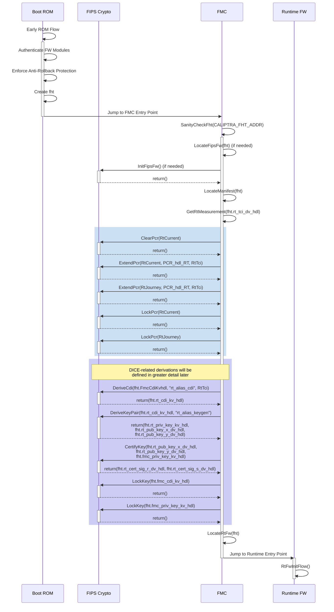

# Caliptra - FMC Specification v1.0

## Scope

Caliptra is an open-source Hardware Root of Trust for Measurement (RTM). This document is the architecture specification for Caliptra First Mutable Code (FMC).
As an architecture specification for FMC, this document describes the following topics:

1. Provide high level requirements
2. Describe FMC load and measurement flow
3. Describe FMC functionality
4. Define FMC boot flows

## Glossary

| Term                | Description                                                               |
| :------------------ | :------------------------------------------------------------------------ |
| DCCM                | Data Closely Coupled Memory                                               |
| DICE                | Device Identifier Composition Engine                                      |
| FHT                 | Firmware Handoff Table                                                    |
| FMC                 | First Mutable Code                                                        |
| FW                  | Firmware                                                                  |
| ICCM                | Instruction Closely Coupled Memory                                        |
| PCR                 | Platform Configuration Register                                           |
| RoT                 | Root of Trust                                                             |
| RT                  | Runtime                                                                   |
| RTM                 | Root of Trust for Measurement                                             |
| TCI                 | Trusted Component Identifier                                              |
| SVN                 | Security Version Number                                                   |

## Overview

First Mutable Code (FMC) is the first field-updatable firmware module in the Caliptra boot sequence. It is loaded, cryptographically verified,
and executed by the Caliptra ROM.

### Pre-conditions / assumptions

It is assumed that the Caliptra ROM has already performed a series of steps to prepare the Caliptra environment before calling the FMC entry point. The
following is a brief overview of those expectations. Further details can be found in the Caliptra ROM Specification.

- ROM is responsible for initializing its ROM-based FIPS Crypto Module
    *(Note that this requirement is dependent on the chosen FIPS boundary. It only applies if there is a discrete FIPS ROM module that is isolated from the
  rest of the ROM. This is not expected to be the case for the first generation of Caliptra.)*
- ROM is responsible for locating the image containing all of Caliptra’s mutable firmware and loading it into ICCM.
- ROM is responsible for authentication of the Manifest and each individual FW Module loaded to ICCM.
- ROM is responsible for ensuring that the Anti-Rollback Protection is enforced for all mutable firmware modules.
- ROM is responsible for creating Caliptra’s initial DICE identity and extending it with measurements of the FMC Module.
- ROM jumps to the Caliptra FMC entry point.

At the time the Caliptra FMC entry point is executed, the Caliptra memory space will look like one of the following diagrams (dependent upon selected FIPS
Crypto boundary):

  *Current POR: All Caliptra FW in FIPS boundary*

  *Alternate: Caliptra ROM and FW each have discrete FIPS modules*

  *Alternate: Caliptra ROM implements FIPS Module used by all other components*

### FMC responsibilities

FMC can be thought of as essentially a small, mutable extension of the ROM. Its primary purpose is to bridge execution from the immutable ROM code, prepare the
environment for the main runtime firmware, and then execute that runtime firmware. As such, the code should be kept to the bare minimum needed to perform that
task. “Feature-creep” in this area is undesirable, and all efforts shall be made to avoid it.

- FMC must initialize the FW-based FIPS Crypto Module that is loaded alongside it. This initialization must be completed before any cryptographic operations can
  be performed.
    *(Note that this requirement is dependent on the chosen FIPS boundary. It only applies if there is a discrete FIPS firmware module that is loaded
  separately from the FMC FW module. This is not expected to be the case for the first generation of Caliptra.)*
- FMC must measure the Runtime Firmware Module using services from the FIPS Crypto Module.
- FMC must extend the Caliptra DICE identity to the Runtime Firmware Module using FIPS Crypto services, generating artifacts CDIRT,
  AliasKeyPairRT, and certifying PublicKeyRT.
- At any time during its flow, the FMC *MAY* be required to execute a workaround for an RTL or ROM bug that was discovered after Caliptra hardware was frozen.
  The nature, feasibility, and timing of such a workaround will be dependent on the specific details of the bug.
- FMC must make the CDIRT, AliasKeyPairRT, and CertRT available to the Runtime Firmware Module, while making its own
  CDIFMC and PrivateKeyFMC unavailable.
- FMC must execute the Runtime Firmware Module.

## Firmware handoff table

The Firmware Handoff Table is a data structure that is resident at a well-known location in DCCM. It is initially populated by ROM and modified by FMC as a way
to pass parameters and configuration information from one firmware layer to the next.

Table revisions with the same Major Version must remain backward compatible (i.e. fields may be added to the end of the table, or fields may be deprecated, but
fields may not be changed or removed). Table revisions with different Major Versions may or may not be compatible.

*Note: All fields are little-endian unless otherwise specified.*

| Field                 | Size (bytes) | Written By | Description                                                                                              |
|:----------------------|:-------------|:-----------|:---------------------------------------------------------------------------------------------------------|
| fht_marker            | 4            | ROM        | Magic Number marking start of FHT. Value must be 0x54484643, ‘CFHT’ when viewed as little-endian ASCII.  |
| fht_major_ver         | 2            | ROM        | Major version of FHT.                                                                                    |
| fht_minor_ver         | 2            | ROM, FMC   | Minor version of FHT. Initially written by ROM but may be changed to a higher version by FMC.            |
| manifest_load_addr    | 4            | ROM        | Physical base address of Manifest in DCCM SRAM.                                                          |
| fips_fw_load_addr_hdl | 4            | ROM        | Handle of base address of FIPS Module in ROM or ICCM SRAM. May be 0xFF if there is no discrete module.   |
| rt_fw_entry_point_hdl | 4            | ROM        | Handle of entry point of Runtime FW Module value in data vault. SRAM.                                    |
| fmc_tci_dv_hdl        | 4            | ROM        | Handle of FMC TCI value in the Data Vault.                                                               |
| fmc_cdi_kv_hdl        | 4            | ROM        | Handle of FMC CDI value in the Key Vault. Value of 0xFF indicates not present.                           |
| fmc_priv_key_kv_hdl   | 4            | ROM        | Handle of FMC Private Alias Key in the Key Vault.                                                        |
| fmc_pub_key_x_dv_hdl  | 4            | ROM        | Handle of FMC Public Alias Key X Coordinate in the Data Vault.                                           |
| fmc_pub_key_y_dv_hdl  | 4            | ROM        | Handle of FMC Public Alias Key Y Coordinate in the Data Vault                                            |
| fmc_cert_sig_r_dv_hdl | 4            | ROM        | Handle of FMC Certificate Signature R Component in the Data Vault.                                       |
| fmc_cert_sig_s_dv_hdl | 4            | ROM        | Handle of FMC Certificate Signature S Component in the Data Vault.                                       |
| fmc_svn_dv_hdl        | 4            | ROM        | Handle of FMC SVN value in the Data Vault.                                                               |
| rt_tci_dv_hdl         | 4            | ROM        | Handle of RT TCI value in the Data Vault.                                                                |
| rt_cdi_kv_hdl         | 4            | FMC        | Handle of RT CDI value in the Key Vault.                                                                 |
| rt_priv_key_kv_hdl    | 4            | FMC        | Handle of RT Private Alias Key in the Key Vault.                                                         |
| rt_svn_dv_hdl         | 4            | FMC        | Handle of RT SVN value in the Data Vault.                                                                |
| rt_min_svn_dv_hdl     | 4            | FMC        | Handle of Min RT SVN value in the Data Vault.                                                            |
| ldevid_tbs_addr       | 4            | ROM        | Local Device ID TBS Address.                                                                             |
| fmcalias_tbs_addr     | 4            | ROM        | FMC Alias TBS Address.                                                                                   |
| ldevid_tbs_size       | 2            | ROM        | Local Device ID TBS Size.                                                                                |
| fmcalias_tbs_size     | 2            | ROM        | FMC Alias TBS Size.                                                                                      |
| pcr_log_addr          | 4            | ROM        | PCR Log Address.                                                                                         |
| pcr_log_index         | 4            | ROM        | Last empty PCR log entry slot index.                                                                     |
| meas_log_addr         | 4            | ROM        | Measurement Log Address.                                                                                 |
| meas_log_index        | 4            | ROM        | Last empty Measurement log entry slot index.                                                             |
| fuse_log_addr         | 4            | ROM        | Fuse Log Address.                                                                                        |
| rt_dice_pub_key       | 96           | FMC        | RT Alias DICE Public Key.                                                                                |
| rt_dice_sign          | 96           | FMC        | RT Alias DICE signature.                                                                                 |
| ldevid_cert_sig_r_dv_hdl | 4         | ROM        | Handle of LDevId Certificate Signature R Component in the Data Vault.                                    |
| ldevid_cert_sig_s_dv_hdl | 4         | ROM        | Handle of LDevId Certificate Signature S Component in the Data Vault.                                    |
| idev_dice_pub_key     | 96           | ROM        | Initial Device ID Public Key.                                                                            |
| rom_info_addr         | 4            | ROM        | Address of ROMInfo struct describing the ROM digest and git commit.                                      |
| rtalias_tbs_size      | 2            | FMC        | RT Alias TBS Size.                                                                                       |
| reserved              | 1650         |            | Reserved for future use.                                                                                 |

*FHT is currently defined to be 2048 bytes in length.*

### fht_marker

This is a "magic number" used to identify the start of the table, allowing the FMC or RT firmware modules to determine that the FHT has been populated. The
expected value 0x54484643 will appear as ASCII ‘CFHT’ when viewed as a hex dump.

### fht_major_ver & fht_minor_ver

The Major and Minor version numbers of the Firmware Handoff Table. All FHT versions with the same Major version number must remain backward compatible.
Therefore, fields must remain at constant offsets, and no fields may be redefined. It is possible to deprecate existing fields or define new fields within the
reserved space at the end of the table by incrementing the Minor version number

For example, a Caliptra ROM is be frozen with FHT version 1.0. During later stages of development, it is found that an additional 4 byte data field must be
passed from FMC to Runtime. During boot, the ROM will populate the FHT as version 1.0. When FMC executes, it will update the table version to 1.1 and add the
additional data to the first 4 bytes of the reserved space at the end of the FHT.

### manifest_load_addr

This is the physical address of the location in SRAM where ROM has placed a complete copy of the Firmware Manifest. This must remain resident such that firmware
is able to re-run firmware integrity checks on-demand (required by FIPS 140-3).

### fips_fw_load_addr_hdl

*Future feature, not currently supported.* This field provides the Handle of the DV entry that stores the physical address of the location in ROM or SRAM where a discrete FIPS Crypto module resides. If a
discrete FIPS module does not exist, then this field shall be 0xFF and ROM, FMC, and RT FW must all carry their own code for accessing crypto resources and
keys.

### rt_fw_entry_point_hdl

This field provides the Handle of the DV entry that stores the physical address of the Entry Point of Runtime FW Module in ICCM SRAM.

### fmc_tci_dv_hdl

This field provides the Handle into the Data Vault where the TCIFMC is stored. TCIFMC is a SHA-384 Hash of the FMC Module.

### fmc_cdi_kv_hdl

This field provides the Handle into the Key Vault where the CDIFMC is stored.

### fmc_priv_key_kv_hdl

This field provides the Handle into the Key Vault where the PrivateKeyFMC is stored.

### fmc_pub_key_x_dv_hdl, fmc_pub_key_y_dv_hdl

These fields provide the indices into the Data Vault where the PublicKeyFMC X and Y coordinates are stored.

### fmc_cert_sig_r_dv_hdl, fmc_cert_sig_s_dv_hdl

These fields provide the indices into the Data Vault where the SignatureFMC R and S coordinates are stored.

### fmc_svn_dv_hdl

This field provides the Handle into the Data Vault where the SVNFMC is stored.

### rt_tci_dv_hdl

This field provides the Handle into the Data Vault where the TCIRT is stored. TCIRT is a SHA-384 Hash of the RT FW Module.

### rt_cdi_kv_hdl

This field provides the Handle into the Key Vault where the CDIRT is stored.

### rt_priv_key_kv_hdl

This field provides the Handle into the Key Vault where the PrivateKeyRT is stored.

### rt_svn_dv_hdl

This field provides the Handle into the Data Vault where the SVNRT is stored.

### rt_min_svn_dv_hdl

This field provides the Handle into the Data Vault where the Min-SVNRT is stored. Upon cold-boot this is set to SVNRT. On subsequent boots this is set to MIN(SVNRT, Min-SVNRT).

### ldevid_tbs_addr

This field provides the address of the *To Be Signed* portion of the LDevID certificate.

### fmcalias_tbs_addr

This field provides the address of the *To Be Signed* portion of the FMC Alias certificate.

### ldevid_tbs_size

This field provides the size of the *To Be Signed* portion of the LDevID certificate.

### fmcalias_tbs_size

This field provides the size of the *To Be Signed* portion of the FMC Alias certificate.

### pcr_log_addr

Address in DCCM of the PCR log

### pcr_log_index

Index within the PCR log of the next available log entry

### meas_log_addr

Address in DCCM of the stashed measurement log

### meas_log_index

Index within the measurement log of the next available log entry

### fuse_log_addr

This field provides the address of the Fuse Log

### rt_dice_pub_key

This field provides the Runtime Alias Public Key.

### rt_dice_sign

This field provides the Runtime Alias certificate signature.

### ldevid_cert_sig_r_dv_hdl, ldevid_cert_sig_s_dv_hdl

These fields provide the indices into the Data Vault where the SignatureLDevId R and S coordinates are stored.

### idev_dice_pub_key

This field provides the IDevID Public Key.

### rom_info_addr

This field provides the address of the RomInfo structure.

### rtalias_tbs_size

This field provides the size of the *To Be Signed* portion of the Runtime Alias certificate.

### rt_hash_chain_max_svn

This field informs firmware of the maximum RT SVN, which value was used
to determine the length of RT FW's hash chain.

### rt_hash_chain_kv_hdl

This field provides the Handle into the Key Vault where RT's hash chain is stored.

### reserved

This area is reserved for definition of additional fields that may be added during Minor version updates of the FHT.

## PCR registers

FMC has the responsibility to update 2 PCR registers. 
FMC updates PCR3 to reflect the firmware update Journey with measurements of RT firmware and FW Manifest. This register is only cleared on cold reset. 
FMC updates PCR2 to reflect only the Current running firmware with measurements of RT firmware and FW Manifest. This register is cleared on all reset types. 
FMC locks its PCR registers before handing control to RT firmware so that they may not be cleared later in the boot.

## FMC boot flow

The following list of steps are to be performed by FMC on each boot when ROM jumps to its entry point. Any failures are considered fatal.

1. FMC locates the Firmware Handoff Table (FHT) responsible for passing vital configuration and other data from one firmware layer to the next. This is found
   at well-known address CALIPTRA_FHT_ADDR.
1. FMC sanity checks FHT by verifying that fht.fht_marker == ‘CFHT’ and version is known/supported by FMC.
1. FMC locates the discrete FW-based FIPS Crypto Module in ICCM using fht.fips_fw_base_addr (if not 0xFFFF_FFFF) and calls its initialization routine. Otherwise FMC
   utilizes the ROM-based FIPS Crypto Module or its own internal FIPS Crypto services in implementations without a discrete FW-based FIPS Crypto Module.
1. FMC locates the Manifest at fht.manifest_load_addr.
1. FMC reads the measurement of the Runtime FW Module, TCIRT, from the Data Vault that has previously been validated by ROM.
1. FMC reads the manifest address of the Image Bundle from the HandOff Table, and calculates the SHA-384 TCIMAN
1. FMC clears Current PCR
1. FMC extends Current and Journey PCR registers with TCIRT.
1. FMC extends Current and Journey PCR registers with TCIMAN.
1. FMC locks Current and Journey PCR registers.
1. FMC derives CDIRT from CDIFMC mixed with TCIRT and TCIMAN, then stores it in the Key Vault.
1. FMC updates fht.rt_cdi_kv_hdl in the FHT.
1. FMC derives AliasKeyPairRT from CDIRT. The Private Key is stored in the Key Vault while the Public Key X and Y coordinates are stored
   in the Data Vault.
1. FMC updates fht.rt_priv_key_kv_hdl, fht.rt_pub_key_x_dv_hdl, and fht.rt_pub_key_y_dv_hdl in the FHT.
1. FMC generates an x509 certificate with PubKeyRT as the subject and signed by PrivKeyFMC.
1. FMC stores the CertRT signature in the Data Vault.
1. FMC updates fht.rt_cert_sig_r_dv_hdl and fht.rt_cert_sig_r_dv_hdl in the FHT.
1. FMC ensures that CDIFMC and PrivateKeyFMC are locked to block further usage until the next boot.
1. FMC locates the Runtime FW Module in ICCM at fht.rt_fw_load_addr.
1. FMC jumps to the Runtime FW Module entry point at fht.rt_fw_entry_point.

**Pre-conditions:**

- Vault state as follows:

| Slot | Key Vault | PCR Bank | Data Vault 48 Byte (Sticky) | Data Vault 4 Byte (Sticky) |
|------|-----------|----------|-----------------------------|----------------------------|
| 0 | | | 🔒LDevID Pub Key X | 🔒FMC SVN |
| 1 | | | 🔒LDevID Pub Key Y | 🔒Manufacturer Public Key Index |
| 2 | | | 🔒LDevID Cert Signature R |
| 3 | | | 🔒LDevID Cert Signature S |
| 4 | | | 🔒Alias FMC Pub Key X |
| 5 | | | 🔒Alias FMC Pub Key Y |
| 6 | Alias FMC CDI (48 bytes) | | 🔒Alias FMC Cert Signature R |
| 7 | Alias FMC Private Key (48 bytes) | | 🔒Alias FMC Cert Signature S |
| 8 |  | | 🔒FMC Digest |
| 9 |  | | 🔒Owner PK Hash |

  *FMC Boot Sequence*

**Post-conditions:**

- Vault state as follows:

| Slot | Key Vault | PCR Bank | Data Vault 48 Byte (Sticky) | Data Vault 4 Byte (Sticky) |
|------|-----------|----------|-----------------------------|----------------------------|
| 0 | | | 🔒LDevID Pub Key X | 🔒FMC SVN |
| 1 | | | 🔒LDevID Pub Key Y | 🔒Manufacturer Public Key Index |
| 2 | | | 🔒LDevID Cert Signature R |
| 3 | | | 🔒LDevID Cert Signature S |
| 4 | Alias RT CDI (48 bytes) | | 🔒Alias FMC Pub Key X |
| 5 | Alias RT Private Key (48 bytes)| | 🔒Alias FMC Pub Key Y |
| 6 | Alias FMC CDI (48 bytes) | | 🔒Alias FMC Cert Signature R |
| 7 | Alias FMC Private Key (48 bytes) | | 🔒Alias FMC Cert Signature S |
| 8 |  | | 🔒FMC Digest |
| 9 |  | | 🔒Owner PK Hash |

## Resets

FMC does not distinguish between cold boots or any other type of reset. Instead, FMC is designed such that it always performs the same set of operations
regardless of which reset path caused it to be executed.

## Update and recovery

FMC does not participate in Caliptra update/recovery flows. FMC is designed such that it does not perform any different steps during update
and simply behaves the same as it does during other cold/warm resets.

## Fake FMC

Fake FMC is a variation of the FMC intended to be used in the verification/enabling stages of development. The purpose is to greatly reduce the boot time for pre-Si environments by eliminating certain steps from the boot flow.

**Differences from normal FMC:**
Currently, Fake FMC directly proceeds to runtime without generating the RT Alias Cert. In the future, there will be a static cert and a corresponding private key will be used by runtime to support the DICE challenge flow.

**How to use:**

- Fake FMC is provided in the release along with the normal collateral.
- The image builder exposes the argument "fake" that can be used to generate the fake versions

Fake FMC should be used with the Fake ROM. Details can be found in the ROM readme.

## Future

- Current POR is for FIPS Crypto boundary to encompass all of Caliptra FW, including ROM, FMC, and Runtime. With this boundary, there is no need for any
  dedicated crypto module, and each layer of FW will include the library code it needs to access any required crypto functionality. In the future, if a more
  strict FIPS boundary is created, FMC will need to be changed to handle crypto operations differently. Depending on where it is implemented, it may or may not
  have to initilize the FIPS Crypto module, and it may need to use a different calling convention.
