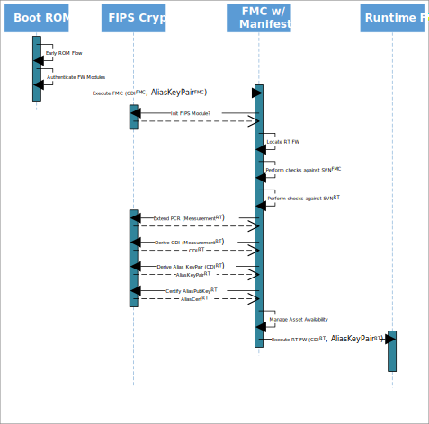

# Caliptra - FMC Specification v0.2

## Version History

| Date       | Version | Description                                                              |
| :--------- | :------ | :----------------------------------------------------------------------- |
| 01/18/2023 | 0.1     | Document Created, Boot flow defined                                      |
| 01/31/2023 | 0.1     | Added Overview and Pre-Conditions sections                               |
| 02/10/2023 | 0.2     | Incorporate feedback and decisions from Caliptra WG meetings             |

## Scope

Caliptra is an open-source Hardware Root of Trust for Measurement (RTM). This document is the architecture specification for Caliptra First Mutable Code (FMC).
As an architecture specification for FMC, this document describes the following topics:

1. Provide high level requirements
2. Describe FMC load and measurement flow
3. Describe FMC functionality
4. Define FMC boot flows

## Glossary

| Term                | Description                                                               |
| :------------------ | :------------------------------------------------------------------------ |
| DCCM                | Data Closely Coupled Memory                                               |
| DICE                | Device Identifier Composition Engine                                      |
| FMC                 | First Mutable Code                                                        |
| FW                  | Firmware                                                                  |
| ICCM                | Instruction Closely Coupled Memory                                        |
| RoT                 | Root of Trust                                                             |
| RT                  | Runtime                                                                   |
| RTM                 | Root of Trust for Measurement                                             |
| SVN                 | Security Version Number                                                   |

## Overview

First Mutable Code (FMC) is the first field-updatable firmware module in the Caliptra boot sequence. It is loaded, cryptographically verified,
and executed by the Caliptra ROM.

### Pre-Conditions / Assumptions

It is assumed that the Caliptra ROM has already performed a series of steps to prepare the Caliptra environment before calling the FMC entry point. The
following is a brief overview of those expectations. Further details can be found in the Caliptra ROM Specification.

- ROM is responsible for initializing its ROM-based FIPS Crypto Module
    *(Note that this requirement is dependent on the chosen FIPS boundary. It only applies if there is a discrete FIPS ROM module that is isolated from the
  rest of the ROM. This is not expected to be the case for the first generation of Caliptra.)*
- ROM is responsible for locating the image containing all of Caliptra’s mutable firmware and loading it into ICCM.
- ROM is responsible for authentication of the Manifest and each individual FW Module loaded to ICCM.
- ROM is responsible for ensuring that the SVNFMC  is greater than or equal to the fused minimum value.
- ROM is responsible for creating Caliptra’s initial DICE identity and extending it with measurements of all components of the logical Caliptra FMC Bundle.
- ROM jumps to the Caliptra FMC entry point.

At the time the Caliptra FMC entry point is executed, the Caliptra memory space will look like one of the following diagram (dependant upon selected FIPS Crypto
boundary):

  *Current POR: All Caliptra FW in FIPS boundary*

  *Alternate: Caliptra ROM and FW each have discrete FIPS modules*

  *Alternate: Caliptra ROM implements FIPS Module used by all other components*

### FMC Responsibilities

FMC can be thought of as essentially a small, mutable extension of the ROM. Its primary purpose is to bridge execution from the immutable ROM code, prepare the
environment for the main runtime firmware, and then execute that runtime firmware. As such, the code should be kept to the bare minimum needed to perform that
task. “Feature-creep” is undesirable, and all efforts shall be made to avoid it.

- FMC must initialize the FW-based FIPS Crypto Module that is loaded alongside it. This initialization must be completed before any cryptographic operations can
  be performed.
    *(Note that this requirement is dependent on the chosen FIPS boundary. It only applies if there is a discrete FIPS firmware module that is loaded
  separately from the FMC FW module. This is not expected to be the case for the first generation of Caliptra.)*
- FMC must measure the Runtime Firmware Module using services from the FIPS Crypto Module.
- FMC must extend the Caliptra DICE identity to the Runtime Firmware Module using FIPS Crypto services, generating artifacts CDIRT and
  AliasKeyPairRT.
- At any time during its flow, the FMC *MAY* be required to execute a workaround for an RTL or ROM bug that was discovered after Caliptra hardware was frozen.
  The nature, feasibility, and timing of such a workaround will be dependent on the specific details of the bug.
- FMC must make the CDIRT and AliasKeyPairRT available to the Runtime Firmware Module, while making its own CDIFMC and
  PrivateKeyFMC unavailable.
- FMC must execute the Runtime Firmware Module.

## FMC Boot Flow

The following list of steps are to be performed by FMC on each boot when ROM jumps to its entry point:

1. FMC locates the discrete FW-based FIPS Crypto Module in ICCM (if present) and calls its initialization routine. Otherwise FMC utilizes the ROM-based FIPS
   Crypto
   Module or its own internal FIPS Crypto services in implementations without a discrete FW-based FIPS Crypto Module.
1. FMC locates the Runtime (RT) FW Image in ICCM.
1. FMC checks if MIN_SVNFMC is > FUSE_SVNFMC.  **TBD: Or is this ROM responsibility?**
   1. If it is, FMC indicates to SoC that fuse increment is needed.
1. FMC checks that SVNRT is >= MIN_SVNRT.  **TBD: Or is this ROM responsibility?**
   1. If not, this image is invalid. Enter recovery flow.
1. FMC checks that SVNRT is >= FUSE_SVNRT.  **TBD: Or is this ROM responsibility?**
   1. If not, this image has been revoked. Enter recovery flow.
1. FMC reads the measurement of the Runtime FW Module - MeasurementRT - from the Manifest that has previously been validated by ROM.
1. FMC extends Caliptra PCR register with MeasurementRT.
1. FMC derives CDIRT from CDIFMC mixed with MeasurementRT.
1. FMC derives AliasKeyPairRT from CDIRT.
1. FMC generates an x509 certificate with PubKeyRT as the subject and signed by PrivKeyFMC.
1. FMC ensures that CDIRT and AliasKeyPairRT are made available for use by RT FW Module.
1. FMC ensures that CDIFMC and PrivateKeyFMC are destroyed.
1. **TBD: Does FMC erase Manifest or is it useful to keep around?**
1. FMC jumps to the RT FW Module entry point

  *FMC Boot Sequence*

## FMC Firmware Update Flow

**TBD: Is this section needed?**

## FMC Recovery Flow

*Section to be filled in*

## Opens and ToDo Items

- Document how CDI/KeyPair/Cert is stored and passed to next layer
- Document FW Update flow for FMC. TBD if there is any difference that is needed.
  - Impact of Hitless update?
- Determine which PCR register should be used for RT measurement
- Document error handling and recovery flows (resiliency)
- Current POR is for FIPS Crypto boundary to encompass all of Caliptra FW, including ROM, FMC, and Runtime. With this boundary, there is no need for any
  dedicated crypto module, and each layer of FW will include the library code it needs to access any required crypto functionality. In the future, if a more
  strict FIPS boundary is created, FMC will need to be changed to handle crypto operations differently.
