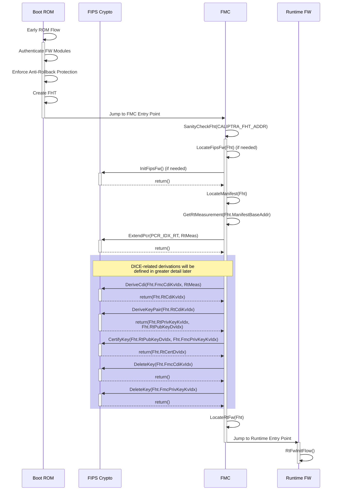

# Caliptra - FMC Specification v0.4

## Version History

| Date       | Version | Description                                                                        |
| :--------- | :------ | :----------------------------------------------------------------------------------|
| 01/18/2023 | 0.1     | Document Created, Boot flow defined                                                |
| 01/31/2023 | 0.1.1   | Added Overview and Pre-Conditions sections                                         |
| 02/10/2023 | 0.2     | Incorporate feedback and decisions from Caliptra WG meetings                       |
| 02/27/2023 | 0.4     | Update for decision that Anti-Rollback will be entirely handled by ROM             |
|            |         | Add details/clarifications in FMC Boot steps including where to store artifacts    |
|            |         | Add Firmware Handoff Table (FHT) definition                                        |

## Scope

Caliptra is an open-source Hardware Root of Trust for Measurement (RTM). This document is the architecture specification for Caliptra First Mutable Code (FMC).
As an architecture specification for FMC, this document describes the following topics:

1. Provide high level requirements
2. Describe FMC load and measurement flow
3. Describe FMC functionality
4. Define FMC boot flows

## Glossary

| Term                | Description                                                               |
| :------------------ | :------------------------------------------------------------------------ |
| DCCM                | Data Closely Coupled Memory                                               |
| DICE                | Device Identifier Composition Engine                                      |
| FHT                 | Firmware Handoff Table                                                    |
| FMC                 | First Mutable Code                                                        |
| FW                  | Firmware                                                                  |
| ICCM                | Instruction Closely Coupled Memory                                        |
| RoT                 | Root of Trust                                                             |
| RT                  | Runtime                                                                   |
| RTM                 | Root of Trust for Measurement                                             |
| SVN                 | Security Version Number                                                   |

## Overview

First Mutable Code (FMC) is the first field-updatable firmware module in the Caliptra boot sequence. It is loaded, cryptographically verified,
and executed by the Caliptra ROM.

### Pre-Conditions / Assumptions

It is assumed that the Caliptra ROM has already performed a series of steps to prepare the Caliptra environment before calling the FMC entry point. The
following is a brief overview of those expectations. Further details can be found in the Caliptra ROM Specification.

- ROM is responsible for initializing its ROM-based FIPS Crypto Module
    *(Note that this requirement is dependent on the chosen FIPS boundary. It only applies if there is a discrete FIPS ROM module that is isolated from the
  rest of the ROM. This is not expected to be the case for the first generation of Caliptra.)*
- ROM is responsible for locating the image containing all of Caliptra’s mutable firmware and loading it into ICCM.
- ROM is responsible for authentication of the Manifest and each individual FW Module loaded to ICCM.
- ROM is responsible for ensuring that the Anti-Rollback Protection is enforced for all mutable firmware modules.
- ROM is responsible for creating Caliptra’s initial DICE identity and extending it with measurements of the FMC Module.
- ROM jumps to the Caliptra FMC entry point.

At the time the Caliptra FMC entry point is executed, the Caliptra memory space will look like one of the following diagrams (dependant upon selected FIPS
Crypto boundary):

  *Current POR: All Caliptra FW in FIPS boundary*

  *Alternate: Caliptra ROM and FW each have discrete FIPS modules*

  *Alternate: Caliptra ROM implements FIPS Module used by all other components*

### FMC Responsibilities

FMC can be thought of as essentially a small, mutable extension of the ROM. Its primary purpose is to bridge execution from the immutable ROM code, prepare the
environment for the main runtime firmware, and then execute that runtime firmware. As such, the code should be kept to the bare minimum needed to perform that
task. “Feature-creep” in this area is undesirable, and all efforts shall be made to avoid it.

- FMC must initialize the FW-based FIPS Crypto Module that is loaded alongside it. This initialization must be completed before any cryptographic operations can
  be performed.
    *(Note that this requirement is dependent on the chosen FIPS boundary. It only applies if there is a discrete FIPS firmware module that is loaded
  separately from the FMC FW module. This is not expected to be the case for the first generation of Caliptra.)*
- FMC must measure the Runtime Firmware Module using services from the FIPS Crypto Module.
- FMC must extend the Caliptra DICE identity to the Runtime Firmware Module using FIPS Crypto services, generating artifacts CDIRT,
  AliasKeyPairRT, and certifying PrivateKeyRT.
- At any time during its flow, the FMC *MAY* be required to execute a workaround for an RTL or ROM bug that was discovered after Caliptra hardware was frozen.
  The nature, feasibility, and timing of such a workaround will be dependent on the specific details of the bug.
- FMC must make the CDIRT, AliasKeyPairRT, and CertRT available to the Runtime Firmware Module, while making its own
  CDIFMC and PrivateKeyFMC unavailable.
- FMC must execute the Runtime Firmware Module.

## Firmware Handoff Table

The Firmware Handoff Table is a data structure that is resident at a well-known location in DCCM. It is initially populated by ROM and modified by FMC as a way
to pass parameters and configuration information from one firmware layer to the next.

Table revisions with the same Major Version must remain backward compatible (i.e. fields may be added to the end of the table, or fields may be deprecated, but
fields may not be changed or removed). Table revisions with different Major Versions may or may not be compatible.

*Note: All fields are little endian unless otherwise specified.*

| Field             | Size (bytes) | Populated By | Description                                                                                                |
|:------------------|:-------------|:-------------|:-----------------------------------------------------------------------------------------------------------|
| FhtMarker         | 4            | ROM          | Magic Number marking start of the table. The value must be 0x43464854 (‘CFHT’ in ASCII).                   |
| FhtMajorVer       | 2            | ROM          | Major version of FHT.                                                                                      |
| FhtMinorVer       | 2            | ROM, FMC     | Minor version of FHT. Initially written by ROM but may be changed to a higher version by FMC.              |
| ManifestBaseAddr  | 4            | ROM          | Base address of Manifest in DCCM SRAM.                                                                     |
| FipsFwBaseAddr    | 4            | ROM          | Base address of FIPS Module in ROM or ICCM SRAM. May be NULL if there is no discrete module.               |
| RtFwBaseAddr      | 4            | ROM          | Base address of Runtime FW Module in ICCM SRAM.                                                            |
| FmcCdiKvIdx       | 1            | ROM, FMC     | Index of FMC CDI value in the Key Vault. Value of 0xFF indicates not present.                              |
| FmcPrivKeyKvIdx   | 1            | ROM, FMC     | Index of FMC Private Alias Key in the Key Vault.                                                           |
| FmcPubKeyDvIdx    | 1            | ROM          | Index of FMC Public Alias Key in the Data Vault.                                                           |
| FmcCertDvIdx      | 1            | ROM          | Index of FMC Certificate Signature in the Data Vault.                                                      |
| RtCdiKvIdx        | 1            | FMC, RT      | Index of RT CDI value in the Key Vault.                                                                    |
| RtPrivKeyKvIdx    | 1            | FMC, RT      | Index of RT Private Alias Key in the Key Vault.                                                            |
| RtPubKeyDvIdx     | 1            | FMC          | Index of RT Public Alias Key in the Data Vault.                                                            |
| RtCertDvIdx       | 1            | FMC          | Index of RT Certificate Signature in the Data Vault.                                                       |
| Reserved          | 20           |              | Reserved for future use.                                                                                   |

*FHT is currently defined to be 48 bytes in length.*

## FMC Boot Flow

The following list of steps are to be performed by FMC on each boot when ROM jumps to its entry point:

1. FMC locates the Firmware Handoff Table (FHT) responsible for passing vital configuration and other data from one firmware layer to the next. This is found
   at well-known address CALIPTRA_FHT_ADDR.
1. FMC sanity checks FHT by verifying that Fht.FhtMarker == ‘CFHT’ and version is known/supported by FMC.
1. FMC locates the discrete FW-based FIPS Crypto Module in ICCM using Fht.FipsFwBaseAddr (if not NULL) and calls its initialization routine. Otherwise FMC
   utilizes the ROM-based FIPS Crypto Module or its own internal FIPS Crypto services in implementations without a discrete FW-based FIPS Crypto Module.
1. FMC locates the Manifest at Fht.ManifestBaseAddr.
1. FMC reads the measurement of the Runtime FW Module, MeasurementRT, from the Manifest that has previously been validated by ROM.
1. FMC extends Caliptra PCR registers with MeasurementRT.
1. FMC derives CDIRT from CDIFMC mixed with MeasurementRT and stores it in the Key Vault.
1. FMC updates RtCdiKvIdx in the FHT.
1. FMC derives AliasKeyPairRT from CDIRT. The Private Key is stored in the Key Vault while the Public Key is stored in the Data Vault.
1. FMC updates RtPrivKeyKvIdx and RtPubKeyDvIdx in the FHT.
1. FMC generates an x509 certificate with PubKeyRT as the subject and signed by PrivKeyFMC.
1. FMC stores the CertRT signature in the Data Vault.
1. FMC updates RtCertDvIdx in the FHT.
1. FMC ensures that CDIFMC and PrivateKeyFMC are destroyed or locked from further use.
1. FMC locates the Runtime FW Module in ICCM using Fht.RtFwBaseAddr.
1. FMC jumps to the Runtime FW Module entry point.

  *FMC Boot Sequence*

## FMC Firmware Update Flow

**TBD: Is this section needed?**

## FMC Recovery Flow

*Section to be filled in.*

## Opens and ToDo Items

- Document FW Update flow for FMC. TBD if there is any difference that is needed.
  - Impact of Hitless update?
- Determine which PCR registers should be used for RT measurement
  - One for current FW
  - One for journey
- Document error handling and recovery flows (resiliency)

## Future

- Current POR is for FIPS Crypto boundary to encompass all of Caliptra FW, including ROM, FMC, and Runtime. With this boundary, there is no need for any
  dedicated crypto module, and each layer of FW will include the library code it needs to access any required crypto functionality. In the future, if a more
  strict FIPS boundary is created, FMC will need to be changed to handle crypto operations differently. Depending on where it is implemented, it may or may not
  have to initilize the FIPS Crypto module, and it may need to use a different calling convention.
