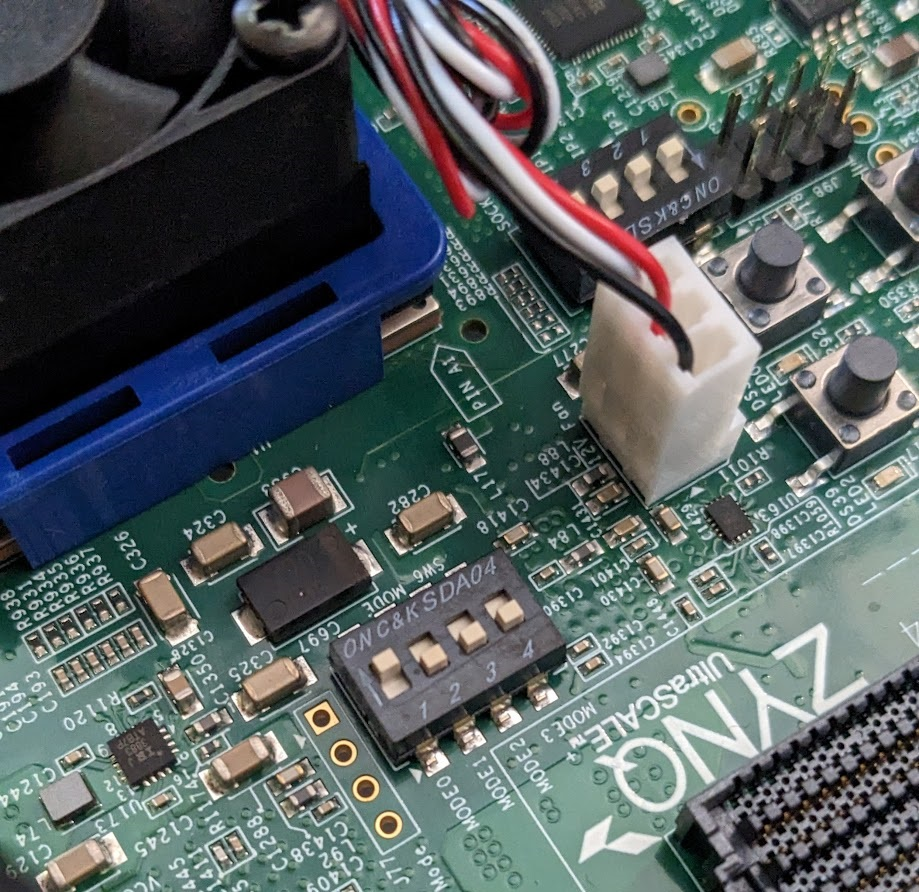

_*SPDX-License-Identifier: Apache-2.0<BR>
<BR>
<BR>
Licensed under the Apache License, Version 2.0 (the "License");<BR>
you may not use this file except in compliance with the License.<BR>
You may obtain a copy of the License at<BR>
<BR>
http://www.apache.org/licenses/LICENSE-2.0 <BR>
<BR>
Unless required by applicable law or agreed to in writing, software<BR>
distributed under the License is distributed on an "AS IS" BASIS,<BR>
WITHOUT WARRANTIES OR CONDITIONS OF ANY KIND, either express or implied.<BR>
See the License for the specific language governing permissions and<BR>
limitations under the License.*_<BR>

# **Caliptra FPGA Guide** #
FPGA provides a fast environment for software development and testing that uses Caliptra RTL.
The Zynq's Programmable Logic is programmed with the Caliptra RTL and FPGA specific SoC wrapper logic including a connection to the Processing System AXI bus.
The Processing System ARM cores then act as the SoC Security Processor with memory mapped access to Caliptra's public register space.


### Requirements: ###
 - Vivado
   - Version v2022.2
 - FPGA
   - [ZCU104 Development Board](https://www.xilinx.com/products/boards-and-kits/zcu104.html)

### ZCU104 ###
#### Processing system one time setup: ####
1. Install ZCU104 SD card image
   - https://ubuntu.com/download/amd-xilinx
1. Configure SW6 to boot from SD1.
   - Mode SW6[4:1]: OFF, OFF, OFF, ON
     
1. Install rustup using Unix directions: https://rustup.rs/#

#### Serial port configuration: ####
Serial port settings for connection over USB.
 - Speed: 115200
 - Data bits: 8
 - Stop bits: 1
 - Parity: None
 - Flow control: None

### FPGA build steps: ###
The FPGA build process uses Vivado's batch mode to procedurally create the Vivado project using fpga_configuration.tcl.
This script provides a number of configuration options for features that can be enabled using "-tclargs OPTION=VALUE OPTION=VALUE"

| Option    | Purpose
| ------    | -------
| BUILD     | Automatically start building the FPGA.
| GUI       | Open the Vivado GUI.
| JTAG      | Assign JTAG signals to Zynq PS GPIO.
| ITRNG     | Enable Caliptra's ITRNG.
| CG_EN     | Removes FPGA optimizations and allows clock gating.
| HW_LATEST | Use hw/latest instead of hw/1.0.

 - Build FPGA image without GUI
    - `vivado -mode batch -source fpga_configuration.tcl -tclargs BUILD=TRUE`
    - Above command creates a bitstream located at: caliptra_build/caliptra_fpga.bin
    - To check the git revision a bitstream was generated with
      - `xxd -s 0x88 -l 8 caliptra_build/caliptra_fpga.bin`
      - Result should be `3001 a001 xxxx xxxx`. 3001 a001 is a command to write the USR_ACCESS register and the rest is the hash.
 - Launch Vivado with GUI
    - `vivado -mode batch -source fpga_configuration.tcl -tclargs GUI=TRUE`
    - Run Synthesis: `launch_runs synth_1`
    - [Optional] Set Up Debug signals on Synthesized Design
    - Run Implementation: `launch_runs impl_1`
    - Generate Bitstream: `write_bitstream -bin_file \tmp\caliptra_fpga`

### Loading and execution Steps: ###
[setup_fpga.sh](setup_fpga.sh) performs platform setup that is needed after each boot.
 - Disables CPU IDLE. Vivado HW Manager access during IDLE causes crashes.
 - Reduces fan speed by setting the GPIO pin connected to the fan controller FULLSPD pin to output.
   - https://support.xilinx.com/s/question/0D52E00006iHuopSAC/zcu104-fan-running-at-max-speed?language=en_US
 - Builds and installs the rom_backdoor and io_module kernel modules.
 - Sets the clock for the FPGA logic.
 - Installs the provided FPGA image.

```shell
sudo ./hw/fpga/setup_fpga.sh caliptra_fpga.bin

CPTRA_UIO_NUM=4 cargo test --features=fpga_realtime,itrng -p caliptra-test smoke_test::smoke_test
```

### Processing System - Programmable Logic interfaces ###
#### AXI Memory Map ####
 - SoC adapter for driving caliptra-top signals
   - 0x80000000 - Generic Input Wires
   - 0x80000008 - Generic Output Wires
   - 0x80000010-0x8000002C - Deobfuscation key (256 bit)
   - 0x80000030 - Control
     - `[0] -> cptra_pwrgood`
     - `[1] -> cptra_rst_b`
     - `[3:2] -> device_lifecycle`
     - `[4] -> debug_locked`
   - 0x80000034 - Status
     - `[0] <- cptra_error_fatal`
     - `[1] <- cptra_error_non_fatal`
     - `[2] <- ready_for_fuses`
     - `[3] <- ready_for_fw`
     - `[4] <- ready_for_runtime`
   - 0x80000038 - PAUSER
     - `[31:0] -> PAUSER to Caliptra APB`
   - 0x80001000 - Log FIFO data. Reads pop data from FIFO.
     - `[7:0] -> Next log character`
     - `[8] -> Log character valid`
   - 0x80001004 - Log FIFO register
     - `[0] -> Log FIFO empty`
     - `[1] -> Log FIFO full (probably overrun)`
   - 0x80001008 - ITRNG FIFO data. Write loads data to FIFO.
     - `[31:0] -> 32 bits of random data to be fed to itrng_data 4 bits at a time`
   - 0x8000100C - ITRNG FIFO status.
     - `[0] -> ITRNG FIFO empty`
     - `[1] -> ITRNG FIFO full`
     - `[2] -> ITRNG FIFO reset`
 - ROM Backdoor - 32K
   - `0x82000000 - 0x82007FFF`
 - Caliptra SoC register interface
   - `0x90000000`
#### Interrupts ####
 - 89 - Log FIFO half full.

### JTAG debug
Requirements:
- Security state must have either debug_locked == false or lifecycle == manuf.
- Set "debug = true" in firmware profile to provide line information to GDB.
- openocd 0.12.0 (must be configured with --enable-sysfsgpio)
- gdb-multiarch

#### Debugger launch procedure ####
Caliptra's JTAG pins are directly connected to EMIO GPIO pins bridging the PS and PL. OpenOCD is run on the ARM core and uses SysFs to interface with the GPIO pins.
1. Invoke OpenOCD server
    - `sudo openocd --file caliptra-sw/hw/fpga/openocd_caliptra.txt`
1. Connect client(s) for debug
    - GDB: `gdb-multiarch [bin] -ex 'target remote localhost:3333'`
    - Telnet: `telnet localhost 4444`

#### Caliptra SoC interface registers ####
Over Telnet connection to OpenOCD: `riscv.cpu riscv dmi_read [addr]`

#### JTAG testing ####
Test requirements for both OpenOCD and GDB:
- JTAG port is accessible when debug_locked == true or lifecycle == manufacturing. The port is inaccessible otherwise.
- Read access to ROM space using 8, 16, 32, and 64 bit reads.
- Read and write access to DCCM using 8, 16, 32, and 64 bit accesses.
- Access to ICCM using 32 and 64 bit reads, 32 bit writes.
- Access to VEER core registers.
- HW and SW breakpoints halt the CPU.
- Watchpoints on DCCM and Caliptra register access halt the CPU.
 
Test requirements exclusive to GDB:
- Basic commands all work (step, next, frame, info, bt, ni, si, etc.).
 
Test requirements exclusive to OpenOCD:
- Basic commands all work (reg, step, resume, etc.).
- Access to VEER CSRs.
- Access to Debug Module registers.
- Caliptra registers exposed to JTAG RW/RO status matches.
