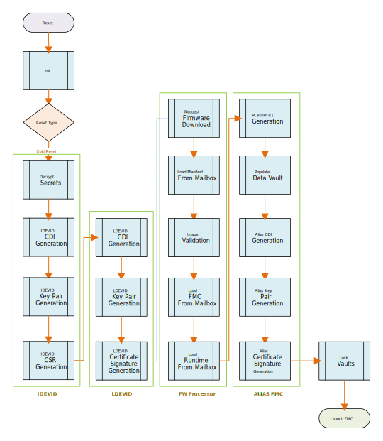
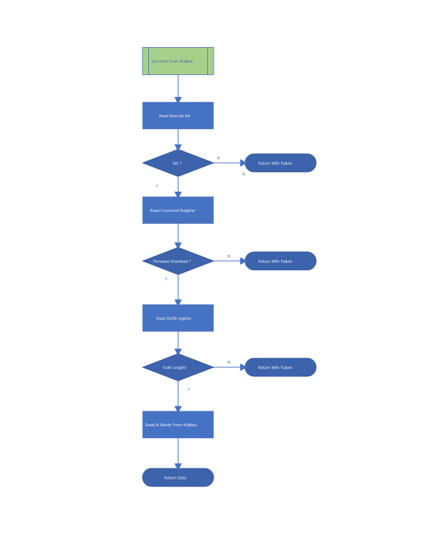
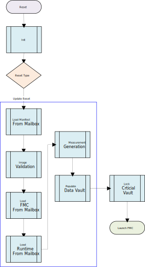
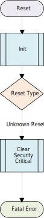
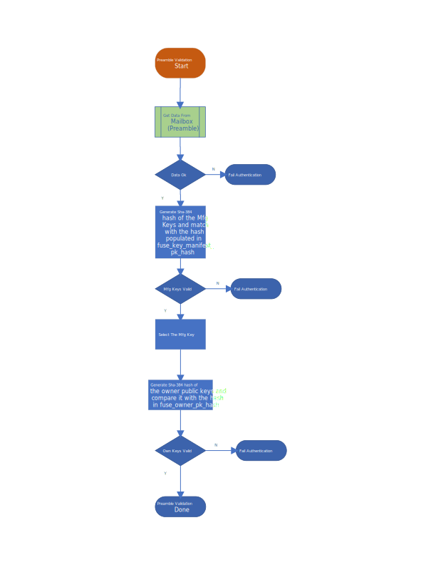
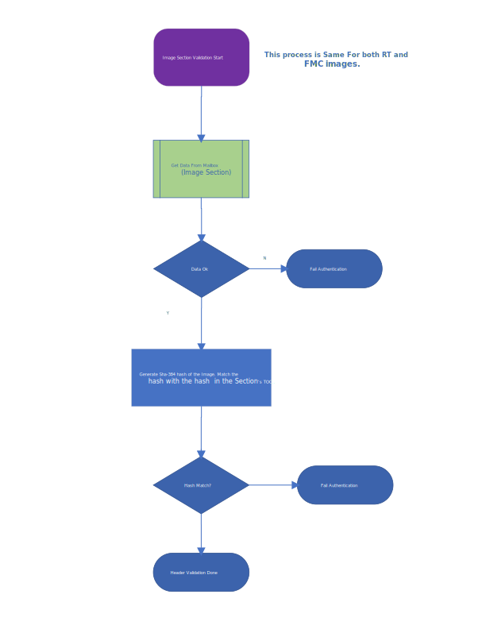

# Caliptra - ROM Specification v1.0

## Scope

Caliptra is an open-source Hardware Root of Trust for Measurement (RTM). This document is the architecture specification
for Caliptra Read Only Memory Code (ROM). As an architecture specification for ROM, this document describes the
following topics:

1. Provide high level architecture and requirements
2. Describe ROM DICE Layering Architecture
3. Describe ROM functionality
4. Define ROM boot flows

   - Cold Reset Flow
   - Warm Reset Flow
   - Update Reset Flow
   - Unknown/Spurious Reset Flow

5. Cryptographic Derivations

## Glossary

| Term                | Description                                                               |
| :------------------ | :------------------------------------------------------------------------ |
| CDI                 | Compound Device Identity                                                  |
| CSR                 | Certificate Signing Request                                               |
| DCCM                | Data Closely Coupled Memory                                               |
| DICE                | Device Identifier Composition Engine                                      |
| FHT                 | Firmware Handoff Table                                                    |
| FMC                 | First Mutable Code                                                        |
| FW                  | Firmware                                                                  |
| ICCM                | Instruction Closely Coupled Memory                                        |
| IDEVID              | Initial Device ID DICE Layer                                              |
| RoT                 | Root of Trust                                                             |
| RT                  | Runtime                                                                   |
| RTM                 | Root of Trust for Measurement                                             |
| TCI                 | Trusted Component Identifier                                              |
| UDS                 | Unique Device Secret                                                      |
| SVN                 | Security Version Number                                                   |
| X509                | Digital Certificate Standard                                              |

## Fuse and architectural registers

Following are the main FUSE & Architectural Registers used by the Caliptra ROM for DICE Derivations:

| Register                        | Width (bits) | Description                                             |
| :------------------------------ | :------------|  :----------------------------------------------------- |
| CPTRA_SECURITY_STATE            | 32           | Security State of the device. Contains two fields:  <br> **LIFECYCLE_STATE**: Unprovisioned, Manufacturing or Production  <br> **DEBUG_ENABLED**: Boolean indicating if debug is enabled or not |
| FUSE_UDS_SEED                   | 384          | Obfuscated UDS                                          |
| FUSE_FIELD_ENTROPY              | 384          | Obfuscated Field Entropy                                |
| FUSE_KEY_MANIFEST_PK_HASH       | 384          | Hash of the four ECC and thirty-two LMS Manufacturer Public Keys   |
| FUSE_KEY_MANIFEST_PK_HASH_MASK  | 32           | Manufacturer ECC Public Key Revocation Mask             |
| FUSE_LMS_REVOCATION             | 32           | Manufacturer LMS Public Key Revocation Mask             |
| FUSE_LMS_VERIFY                 | 32           | LMS Verification flag: <br> **0** - Verify Caliptra firmware images with ECDSA-only  <br> **1** - Verify Caliptra firmware images with both ECDSA and LMS |
| FUSE_OWNER_PK_HASH              | 384          | Owner ECC and LMS Public Key Hash                       |
| FUSE_FMC_KEY_MANIFEST_SVN       | 32           | FMC Security Version Number                             |
| FUSE_RUNTIME_SVN                | 128          | Runtime Security Version Number                         |
| FUSE_ANTI_ROLLBACK_DISABLE      | 1            | Disable SVN checking for FMC & Runtime when bit is set  |
| FUSE_IDEVID_CERT_ATTR           | 768          | FUSE containing information for generating IDEVID CSR  <br> **Word 0**: X509 Key Id Algorithm (2 bits) 1: SHA1, 2: SHA256, 2: SHA384, 3: Fuse <br> **Word 1,2,3,4,5**: Subject Key Id <br> **Words 7,8**: Unique Endpoint ID  |
| CPTRA_DBG_MANUF_SERVICE_REG     | 16           | Manufacturing Services: <br> **Bit 0**: IDEVID CSR upload  <br> **Bit 1**: Random Number Generator Unavailable <br> **Bit 30**: Fake ROM enable in production lifecycle mode <br> **Bit 31**: Fake ROM image verify enable           |

## Firmware image bundle

The Caliptra Firmware image has two main components:

- ### **Firmware manifest**

- ### **Firmware images**

The firmware manifest is a combination of preamble and a signed header. It has
public keys, signatures and table of contents which refer to the various
firmware images contained in the bundle.


### Firmware manifest

Firmware manifest consists of preamble, header and table of contents.

#### Preamble

It is the unsigned portion of the manifest. Preamble contains the signing public keys and signatures. ROM is responsible for parsing the preamble. ROM performs the following steps:

- Loads the preamble from the mailbox.
- Calculates the hash of the four Manufacturer ECC and thirty-two LMS (if LMS verification is enabled) Public Keys in the preamble and compares it against the hash in the fuse (FUSE_KEY_MANIFEST_PK_HASH). If the hashes do not match, the boot fails.
- Selects the appropriate Manufacturer Public Key(s) based on fuse (FUSE_KEY_MANIFEST_PK_HASH_MASK for ECC public key, FUSE_LMS_REVOCATION for LMS public key)

*Note: All fields are little endian unless specified*

| Field | Size (bytes) | Description|
|-------|--------|------------|
| Firmware Manifest Marker | 4 | Magic Number marking the start of the package manifest. The value must be 0x434D414E (‘CMAN’ in ASCII)|
| Firmware Manifest Size | 4 | Size of the full manifest structure |
| Manufacturer ECC Public Key 1 | 96 | ECC P-384 public key used to verify the Firmware Manifest Header Signature. <br> **X-Coordinate:** Public Key X-Coordinate (48 bytes) <br> **Y-Coordinate:** Public Key Y-Coordinate (48 bytes) |
| Manufacturer ECC Public Key 2 | 96 | ECC P-384 public key used to verify the Firmware Manifest Header Signature. <br> **X-Coordinate:** Public Key X-Coordinate (48 bytes) <br> **Y-Coordinate:** Public Key Y-Coordinate (48 bytes) |
| Manufacturer ECC Public Key 3 | 96 | ECC P-384 public key used to verify the Firmware Manifest Header Signature. <br> **X-Coordinate:** Public Key X-Coordinate (48 bytes) <br> **Y-Coordinate:** Public Key Y-Coordinate (48 bytes) |
| Manufacturer ECC Public Key 4 | 96 | ECC P-384 public key used to verify the Firmware Manifest Header Signature. <br> **X-Coordinate:** Public Key X-Coordinate (48 bytes) <br> **Y-Coordinate:** Public Key Y-Coordinate (48 bytes) |
| Manufacturer LMS Public Key 1 | 48 | LMS public key used to verify the Firmware Manifest Header Signature. <br> **tree_type:** LMS Algorithm Type (4 bytes) <br> **otstype:** LMS Ots Algorithm Type (4 bytes) <br> **id:**  (16 bytes) <br> **digest:**  (24 bytes) |
| Manufacturer LMS Public Key 2 | 48 | LMS public key used to verify the Firmware Manifest Header Signature. <br> **tree_type:** LMS Algorithm Type (4 bytes) <br> **otstype:** LMS Ots Algorithm Type (4 bytes) <br> **id:**  (16 bytes) <br> **digest:**  (24 bytes) |
|...<Manufacturer LMS Public Key 32> | | |
| ECC Public Key Index Hint | 4 | The hint to ROM to indicate which ECC public key it should first use.  |
| LMS Public Key Index Hint | 4 | The hint to ROM to indicate which LMS public key it should first use.  |
| Manufacturer ECC Signature | 96 | Manufacturer ECDSA P-384 signature of the Firmware Manifest header hashed using SHA2-384. <br> **R-Coordinate:** Random Point (48 bytes) <br> **S-Coordinate:** Proof (48 bytes) |
| Manufacturer LMS Signature | 1620 | Manufacturer LMS signature of the Firmware Manifest header hashed using SHA2-384. <br> **q:** Leaf of the Merkle tree where the OTS public key appears (4 bytes) <br> **ots:** Lmots Signature (1252 bytes) <br> **tree_type:** Lms Algorithm Type (4 bytes) <br> **tree_path:** Path through the tree from the leaf associated with the LM-OTS signature to the root. (360 bytes) |
| Owner ECC Public Key | 96 | ECC P-384 public key used to verify the Firmware Manifest Header Signature. <br> **X-Coordinate:** Public Key X-Coordinate (48 bytes) <br> **Y-Coordinate:** Public Key Y-Coordinate (48 bytes)|
| Owner LMS Public Key | 48 | LMS public key used to verify the Firmware Manifest Header Signature. <br> **tree_type:** LMS Algorithm Type (4 bytes) <br> **otstype:** LMS Ots Algorithm Type (4 bytes) <br> **id:**  (16 bytes) <br> **digest:**  (24 bytes) |
| Owner ECC Signature | 96 | Manufacturer ECDSA P-384 signature of the Firmware Manifest header hashed using SHA2-384. <br> **R-Coordinate:** Random Point (48 bytes) <br> **S-Coordinate:** Proof (48 bytes) |
| Owner LMS Signature | 1620 | Owner LMS signature of the Firmware Manifest header hashed using SHA2-384. <br> **q:** Leaf of the Merkle tree where the OTS public key appears (4 bytes) <br> **ots:** Lmots Signature (1252 bytes) <br> **tree_type:** Lms Algorithm Type (4 bytes) <br> **tree_path:** Path through the tree from the leaf associated with the LM-OTS signature to the root. (360 bytes) |
| Reserved | 8 | Reserved 8 bytes |
<br>

#### Header

The header contains the security version and SHA2-384 hash of the table of contents. Header is the only signed component in the image. Signing the header is enough as the table of contents contains the hashes of the individual firmware images. This technique reduces the number of signature verifications required to be performed during boot.

| Field | Size (bytes) | Description|
|-------|--------|------------|
| Revision | 8 | 8-byte version of the firmware image bundle |
| Vendor ECC public key index | 4 | The hint to ROM to indicate which ECC public key it should first use. |
| Vendor LMS public key index | 4 | The hint to ROM to indicate which LMS public key it should first use. |
| Flags | 4 | Feature flags. <br> **Bit0:** - Interpret the pl0_pauser field. If not set, all PAUSERs are PL1 <br>**Bit1-Bit31:** Reserved |
| TOC Entry Count | 4 | Number of entries in TOC. |
| PL0 PAUSER | 4 | The PAUSER with PL0 privileges. |
| TOC Digest | 48 | SHA2-384 Digest of table of contents. |
| Vendor Data | 40 | Vendor Data. <br> **Not Before:** Vendor Start Date [ASN1 Time Format] For LDEV-Id certificate (15 bytes) <br> **Not After:** Vendor End Date [ASN1 Time Format] For LDEV-Id certificate (15 bytes) <br> **Reserved:** (10 bytes) |
| Owner Data | 40 | Owner Data. <br> **Not Before:** Owner Start Date [ASN1 Time Format] For LDEV-Id certificate. Takes preference over vendor start date (15 bytes) <br> **Not After:** Owner End Date [ASN1 Time Format] For LDEV-Id certificate. Takes preference over vendor end date (15 bytes) <br> **Reserved:** (10 bytes) |

#### Table of contents

It contains the image information and SHA-384 hash of individual firmware images.
| Field | Size (bytes) | Description|
|-------|--------|------------|
| TOC Entry Id | 4 | TOC Entry Id. The fields can have following values: <br> **0x0000_0001:** FMC  <br> **0x0000_0002:** Runtime |
| Image Type | 4 | Image Type that defines format of the image section <br> **0x0000_0001:** Executable |
| Image Revision | 20 | Git Commit hash of the build |
| Image Version | 4 | Firmware release number |
| Image SVN | 4 | Security Version Number for the Image. This field is compared against the fuses (FMC SVN or RUNTIME SVN. |
| Image Minimum SVN | 4 | Minimum Security Version Number for the Image. This field is compared against the fuses (FMC SVN or RUNTIME SVN. |
| Image Load Address | 4 | Load address |
| Image Entry Point | 4 | Entry point to start the execution from  |
| Image Offset | 4 | Offset from beginning of the image |
| Image Size | 4 | Image Size |
| Image Hash | 48 | SHA2-384 hash of image |

### Image

| Field | Size (bytes) | Description   |
|-------|--------------|---------------|
| Data  | N            | Image content |

## Cryptographic primitives

The following sections define the various cryptographic primitives used by Caliptra ROM:
| Group | Operation |Description |
|-------|--------|------------|
| Deobfuscation Engine | `doe_decrypt_uds(kv_slot, iv)` | Decrypt UDS to the specified key vault slot with specified initialization vector<br>**Input**:<br> ***kv_slot*** - key vault slot to decrypt the uds to<br>***iv*** - initialization vector |
|   | `doe_decrypt_fe(kv_slot, iv)` | Decrypt Field Entropy to the specified key vault slot with specified initialization vector <br>**Input**:<br>***kv_slot*** - key vault slot to decrypt the field entropy to<br>***iv*** - initialization vector |
|   | `doe_clear_secrets()` | Clear UDS Fuse Register, Field Entropy Fuse Register and Obfuscation key |
| Hashed Message Authentication Code | `hmac384_mac(key,data,mac_kv_slot)` | Calculate the mac using a caller provided key and data. The resultant mac is stored in key vault slot<br>**Input**:<br>***key*** - caller specified key<br>data - data<br>***mac_kv_slot*** - key vault slot to store the mac to |
|   | `hmac384_mac(kv_slot,data,mac_kv_slot)` | Calculate the mac using a caller provided key and data. The resultant mac is stored in key vault slot <br>**Input**: <br>***kv_slot*** - key vault slot to use the key from<br>***data*** - data<br>***mac_kv_slot*** - key vault slot to store the mac to |
| Elliptic Curve Cryptography | `ecc384_keygen(seed_kv_slot, priv_kv_slot) -> pub_key` | Generate ECC384 Key Pair.<br>**Input**:<br>***seed_key_slot*** - key vault slot to use as seed for key generation<br>***priv_kv_slot*** - key vault slot to store the private key to<br>**Output**:<br>***pub-key*** - public key associated with the private key |
|   | `ecc384_sign(priv_kv_slot, data) -> sig` | ECC384 signing operation<br>**Input**:<br>***priv_kv_slot*** - key vault slot to use a private key from<br>***data*** - data to sign<br>**Output**:<br>***sig*** - signature |
| | `ecc384_verify(pub_key, data, sig) -> CaliptraResult<Array4xN<12, 48>>` | ECC384 verify operation<br>**Input**:<br>***pub-key*** -public key<br>data - data to verify<br>sig - signature<br>**Output**:<br>***Ecc384Result*** - verify.r value on success, else an error |
| Secure Hash Algorithm | `sha384_digest(data) -> digest` | Calculate the digest of the data<br>**Input**:<br>***data*** - data to verify<br>**Output**:<br>***digest*** - digest of the data |
| Key Vault | `kv_clear(kv_slot)` | Key Vault slot to clear<br>**Input**:<br>***kv_slot*** - key vault slot to clear |
| Data Vault | `dv48_store(data, dv_slot)` | Store the 48-byte data in the specified data vault slot<br>**Input**:<br>***data*** - data to store<br>***dv_slot*** - data vault slot |
| | `dv48_lock_wr(dv_slot)` | Write Lock the 48-byte data vault slot<br>Input<br>***dv_slot*** - data vault slot |
| | `dv4_store(data, dv_slot)` | Store the 4- byte data in the specified data vault slot<br>Input<br>***data*** - data to store<br>***dv_slot*** - data vault slot |
| | `dv4_lock_wr(dv_slot)` | Write Lock the 4-byte data vault slot<br>Input<br>***dv_slot*** - data vault slot |
| Platform Configuration Registers | `pcr_extend(pcr_slot, data)` | Perform PCR extend operation on a PCR with specified data<br>**Input**:<br>***pcr_slot*** - PCR slot to hash extend<br>***data*** – data |
| | `pcr_read(pcr_slot) -> measurement` | Read the PCR slot<br>**Input**:<br>***pcr_slot*** - PCR slot to read<br>**Output**:<br>***measurement*** - Accumulated measurement |
| | `pcr_lock_clear(pcr_slot)` | Lock for Clear PCR slot<br>**Input**:<br>***pcr_slot*** - pcr slot |
| | `pcr_clear(pcr_slot)` | Clear PCR slot<br>**Input**:<br>***pcr_slot*** - pcr slot |
| X509 | `gen_tbs(type, pub_key) -> tbs` | Generate X509 Certificate or CSR `To Be Signed` portion<br>**Input**:<br>***type*** - Can be IDEVID_CSR, LDEVID_CERT or ALIAS_FMC_CERT<br>pub-key -public key<br>**Output**:<br>***tbs*** - DER encoded `To Be Signed` portion |
<br>

## Well known cryptographic constants

| Constant | Size (bytes) | Description |
|----------|--------------|-------------|
| DOE_IV | 16 | Initialization vector specified by the ROM for deobfuscating the UDS and Field Entropy. |
<br>

## Cold reset flow



ROM performs all the necessary crypto derivations on cold reset. No crypto derivations are performed during warm reset or update reset.

Note that KvSlot3 is generally used as a temporary location for derived keying material during ECC keygen.

### Initialization

The initialization step involves a traditional startup script for microcontroller. The initialization script performs following:

- Resets instruction counter
- Disables interrupts
- Clears all general purpose registers
- Sets up memory region attributes (Cacheable & Side effects)
- Sets up stack pointer
- Sets up NMI and Exception handler
- Zeros ICCM & DCCM memories (to initialize ECC)
- Jumps to Rust entry point

### Decrypt secrets

DICE Unique Device Secret (UDS) is stored in an SOC backed fuse (or derived from PUF). The raw UDS is not directly used. UDS is deobfuscated using Deobfuscation Engine. UDS is provisioned by the Silicon Vendor.

Field Entropy is used to mitigate certain classes of supply chain attacks.  Field Entropy is programmed by the owner of the device in a secure environment in the owner’s facility. Field Entropy programmed in fuses is not directly used. Field Entropy is put through the deobfuscation engine to randomize it.

Both UDS and Field Entropy are available only during cold reset of Caliptra.

**Pre-conditions:**

- Caliptra subsystem is being cold reset
- Obfuscation Key loaded in deobfuscation engine
- UDS and Field Entropy loaded in Caliptra Fuse Registers
- Keys Slot 0 - 31 are empty and Usage Bits are all cleared
- PCR 0 - 31 are all cleared
- Data Vault is all cleared

**Actions:**

1. Decrypt UDS to Key Vault Slot 0

    `doe_decrypt_uds(KvSlot0, DOE_IV)`

2. Decrypt Field Entropy to Key Vault Slot 1

    `doe_decrypt_uds(KvSlot1, DOE_IV)`

3. Clear class secrets (Clears UDS, Field Entropy and Obfuscation Key cleared)

    `doe_clear_secrets()`

**Post-conditions:**

- UDS Fuse Register and Field Entropy Fuse register cleared
- Obfuscation Key cleared from Deobfuscation Engine
- Vault State is as follows:

| Slot | Key Vault | PCR Bank | Data Vault 48 Byte (Sticky) | Data Vault 4 Byte (Sticky) |
|------|-----------|----------|-----------------------------|----------------------------|
| 0 | UDS (48 bytes) | | | |
| 1 | Field Entropy (32 bytes) | | | |

### Initial Device ID DICE layer

Initial Device ID Layer is used to generate Manufacturer CDI & Private Key.  This layer represents the manufacturer or silicon vendor DICE Identity. During manufacturing,  ROM can be requested to create Certificate Signing Request (CSR) via JTAG.

**Pre-conditions:**

- UDS is loaded in Key Vault Slot 0

**Actions:**

1. Derive the CDI using ROM specified label and UDS in Slot 0 as data and store the resultant mac in KeySlot6

    `hmac384_kdf(KvSlot0, b"idevid_cdi", KvSlot6)`

2. Clear the UDS in key vault

    `kv_clear(KvSlot0)`

3. Derive ECC Key Pair using CDI in Key Vault Slot6 and store the generated private key in KeySlot7

    `IDevIDSeed = hmac384_kdf(KvSlot6, b"idevid_keygen", KvSlot3)`
    `IDevIdPubKey = ecc384_keygen(KvSlot3, KvSlot7)`
    `kv_clear(KvSlot3)`

*(Note: Steps 4-7 are performed if CSR download is requested via CPTRA_DBG_MANUF_SERVICE_REG register)*

4. Generate the `To Be Signed` DER Blob of the IDevId CSR

    `IDevIdTbs = gen_tbs(IDEVID_CSR, IDevIdPubKey)`

5. Sign the IDevID `To Be Signed` DER Blob with IDevId Private Key in Key Vault Slot 7

    `IDevIdTbsDigest = sha384_digest(IDevIdTbs)`
    `IDevIdCertSig = ecc384_sign(KvSlot7, IDevIdTbsDigest)`

6. Verify the signature of IDevID `To Be Signed` Blob

    `IDevIdTbsDigest = sha384_digest(IDevIdTbs)`
    `Result = ecc384_verify(IDevIdPubKey, IDevIdTbsDigest, IDevIdCertSig)`

7. Upload the CSR to mailbox and wait for JTAG to read the CSR out of the mailbox.

**Post-conditions:**

- Vault state as follows:

| Slot | Key Vault | PCR Bank | Data Vault 48 Byte (Sticky) | Data Vault 4 Byte (Sticky) |
|------|-----------|----------|-----------------------------|----------------------------|
| 1 |Field Entropy (32 bytes) | | | |
| 6 |IDevID CDI (48 bytes) | | | |
| 7 |IDevID Private Key (48 bytes) | | | |

### Local Device ID DICE layer

Local Device ID Layer derives the Owner CDI & ECC Keys. This layer represents the owner DICE Identity as it is mixed with the Field Entropy programmed by the Owner.

**Pre-conditions:**

- Field Entropy is loaded in Key Vault Slot 1
- IDevID CDI is stored in Key Vault Slot 6
- IDevID Private Key is stored in Key Vault Slot 7

**Actions:**

1. Derive the CDI using IDevID CDI in Key Vault Slot6 as HMAC Key and Field Entropy stored in Key Vault Slot1 as data. The resultant mac is stored back in Slot 6

    `hmac384_mac(KvSlot6, b"ldevid_cdi", KvSlot6)`
    `hmac384_mac(KvSlot6, KvSlot1, KvSlot6)`

*(Note: this uses a pair of HMACs to incorporate the diversification label, rather than a single KDF invocation, due to hardware limitations when passing KV data to the HMAC hardware as a message.)*

2. Clear the Field Entropy in Key Vault Slot 1

    `kv_clear(KvSlot1)`

3. Derive ECC Key Pair using CDI in Key Vault Slot6 and store the generated private key in KeySlot5.

    `LDevIDSeed = hmac384_kdf(KvSlot6, b"ldevid_keygen", KvSlot3)`
    `LDevIdPubKey = ecc384_keygen(KvSlot3, KvSlot5)`
    `kv_clear(KvSlot3)`

4. Store and lock (for write) the LDevID Public Key in Data Vault (48 bytes) Slot 2 and Slot 3

    `dv48_store(LDevIdPubKey.X, Dv48Slot2)`
    `dv48_lock_wr(Dv48Slot2)`
    `dv48_store(LDevIdPubKey.Y, Dv48Slot3)`
    `dv48_lock_wr(Dv48Slot3)`

5. Generate the `To Be Signed` DER Blob of the LDevId Certificate

    `LDevIdTbs = gen_cert_tbs(LDEVID_CERT, IDevIdPubKey, LDevIdPubKey)`

6. Sign the LDevID `To Be Signed` DER Blob with IDevId Private Key in Key Vault Slot 7

    `LDevIdTbsDigest = sha384_digest(LDevIdTbs)`
    `LDevIdCertSig = ecc384_sign(KvSlot7, LDevIdTbsDigest)`

7. Clear the IDevId Private Key in Key Vault Slot 7

    `kv_clear(KvSlot7)`

8. Verify the signature of LDevID `To Be Signed` Blob

    `LDevIdTbsDigest = sha384_digest(LDevIdTbs)`
    `Result = ecc384_verify(LDevIdPubKey, LDevIdTbsDigest, LDevIdCertSig)`

9. Store and lock (for write) the LDevID Certificate Signature in the sticky Data Vault (48 bytes) Slot 0 & Slot 1

    `dv48_store(LDevIdCertSig.R, Dv48Slot0)`
    `dv48_lock_wr(Dv48Slot0)`
    `dv48_store(LDevIdCertSig.S, Dv48Slot1)`
    `dv48_lock_wr(Dv48Slot1)`

**Post-conditions:**

- Vault state as follows:

| Slot | Key Vault | PCR Bank | Data Vault 48 Byte (Sticky) | Data Vault 4 Byte (Sticky) |
|------|-----------|----------|-----------------------------|----------------------------|
| 0 | | | 🔒LDevID Cert Signature R | |
| 1 | | | 🔒LDevID Cert Signature S | |
| 2 | | | 🔒LDevID Pub Key X | |
| 3 | | | 🔒LDevID Pub Key Y | |
| 5 | LDevID Private Key (48 bytes) | | | |
| 6 | LDevID CDI (48 bytes) | | | |

### Handling commands from mailbox

ROM supports the following set of commands before handling the FW_DOWNLOAD command (described in section 9.6). Once the FW_DOWNLOAD is issued, ROM stops processing any additional mailbox commands.

1. **STASH_MEASUREMENT**: Up to eight measurements can be sent to the ROM for recording. Format of a measurement is documented at [Stash Measurement command](https://github.com/chipsalliance/caliptra-sw/blob/main/runtime/README.md#stash_measurement).
2. **VERSION**: Get version info about the module. [Version command](https://github.com/chipsalliance/caliptra-sw/blob/main/runtime/README.md#version).
3. **SELF_TEST_START**: This command is used to invoke the FIPS Known-Answer-Tests (aka KAT) on demand. [Self Test Start command](https://github.com/chipsalliance/caliptra-sw/blob/main/runtime/README.md#self_test_start).
4. **SELF_TEST_GET_RESULTS**: This command is used to check if a SELF_TEST command is in progress. [Self Test Get Results command](https://github.com/chipsalliance/caliptra-sw/blob/main/runtime/README.md#self_test_get_results).
5. **SHUTDOWN**: This command is used clear the hardware crypto blocks including the keyvault. [Shutdown command](https://github.com/chipsalliance/caliptra-sw/blob/main/runtime/README.md#shutdown).
6. **CAPABILITIES**: This command is used to query the ROM capabilities. Capabilities is a 128-bit value with individual bits indicating a specific capability. Currently, the only capability supported is ROM_BASE (bit 0). [Capabilities command](https://github.com/chipsalliance/caliptra-sw/blob/main/runtime/README.md#capabilities).

### Downloading images from mailbox

The following is the sequence of the steps that are required to download the parts of firmware image from mailbox.

- ROM asserts READY_FOR_FIRMWARE signal.
- Poll for the execute bit to be set. This bit is set as the last step to transfer the control of the command to the Caliptra ROM.
- Read the command register and ensure the command is FW_DOWNLOAD.
- Read the data length register and validate the value in it.
- Read N dwords from the mailbox DATAOUT register.  Execute the command.
- Once the entire data is processed, clear the execute bit.
  - This should be the last step. Clearing this bit transfers the control back to the originator of the command.
- On failure, a non-zero status code will be reported in the `CPTRA_FW_ERROR_NON_FATAL` register



### Image validation

See Firmware [Image Validation Process](#firmware-image-validation-process).

### Alias FMC DICE layer & PCR extension

Alias FMC Layer includes the measurement of the FMC and other security states. This layer is used to assert a composite identity which includes the security state, FMC measurement along with the previous layer identities.

**Pre-conditions:**

- LDevID CDI is stored in Key Vault Slot 6
- LDevID Private Key is stored in Key Vault Slot 5
- Firmware Image Bundle is successfully loaded and verified from the Mailbox
- ROM has following information from Firmware Image Bundle
- FMC_DIGEST - Digest of the FMC
- FMC_SVN - SVN for FMC
- MANUFACTURER_PK - Manufacturer Public Key(s) used to verify the firmware image bundle
- MANUFACTURER_PK_INDEX - Index of the MANUFACTURER_PK in the firmware image bundle

**Actions:**

1. PCR0 is the Current PCR. PCR 1 is the Journey PCR. PCR0 is cleared by ROM upon each cold and update resets, before it is extended with FMC measurements. PCR0 and PCR1 are locked for clear by the ROM on every reset. Subsequent layers may continue to extend PCR0 as runtime updates are performed.

    ```text
    pcr_clear(Pcr0)
    pcr_extend(Pcr0 && Pcr1, [
        CPTRA_SECURITY_STATE.LIFECYCLE_STATE,
        CPTRA_SECURITY_STATE.DEBUG_ENABLED,
        FUSE_ANTI_ROLLBACK_DISABLE,
        ECC_VENDOR_PK_INDEX,
        FMC_SVN,
        FMC_FUSE_SVN (or 0 if `FUSE_ANTI_ROLLBACK_DISABLE`),
        LMS_VENDOR_PK_INDEX,
        ROM_VERIFY_CONFIG,
        OWNER_PK_HASH_FROM_FUSES (0 or 1),
    ])
    pcr_extend(Pcr0 && Pcr1, MANUFACTURER_PK)
    pcr_extend(Pcr0 && Pcr1, OWNER_PK)
    pcr_extend(Pcr0 && Pcr1, FMC_TCI)
    pcr_lock_clear(Pcr0 && Pcr1)
    ```

2. CDI for Alias is derived from PCR0. For the Alias FMC CDI Derivation, LDevID CDI in Key Vault Slot6 is used as HMAC Key and contents of PCR0 are used as data. The resultant mac is stored back in Slot 6.

    `Pcr0Measurement = pcr_read(Pcr0)`
    `hmac384_kdf(KvSlot6, b"fmc_alias_cdi", Pcr0Measurement, KvSlot6)`

3. Derive Alias FMC ECC Key Pair using CDI in Key Vault Slot6 and store the generated private key in KeySlot7.

    `AliasFmcSeed = hmac384_kdf(KvSlot6, b"fmc_alias_keygen", KvSlot3)`
    `AliasFmcPubKey = ecc384_keygen(KvSlot3, KvSlot7)`
    `kv_clear(KvSlot3)`

4. Store and lock (for write) the FMC Public Key in Data Vault (48 bytes) Slot 6 & Slot 7

    `dv48_store(FmcPubKey.X, Dv48Slot6)`
    `dv48_lock_wr(Dv48Slot6)`
    `dv48_store(FmcPubKey.Y, Dv48Slot7)`
    `dv48_lock_wr(Dv48Slot7)`

5. Generate the `To Be Signed` DER Blob of the Alias FMC Certificate

    `AliasFmcTbs = gen_cert_tbs(ALIAS_FMC_CERT, LDevIdPubKey, AliasFmcPubKey)`

6. Sign the Alias FMC `To Be Signed` DER Blob with LDevId Private Key in Key Vault Slot 5

    `AliasFmcTbsDigest = sha384_digest(AliasFmcTbs)`
    `AliasFmcTbsCertSig = ecc384_sign(KvSlot5, AliasFmcTbsDigest)`

7. Clear the LDevId Private Key in Key Vault Slot 5

    `kv_clear(KvSlot5)`

8. Verify the signature of Alias FMC `To Be Signed` Blob

    `AliasFmcTbsDigest = sha384_digest(AliasFmcTbs)`
    `Result = ecc384_verify(AliasFmcPubKey, AliasFmcDigest , AliasFmcTbsCertSig)`

9. Store and lock (for write) the LDevID Certificate Signature in the sticky Data Vault (48 bytes) Slot 4 and Slot 5

    `dv48_store(FmcTbsCertSig.R, Dv48Slot4)`
    `dv48_lock_wr(Dv48Slot4)`

    `dv48_store(FmcTbsCertSig.S, Dv48Slot5)`
    `dv48_lock_wr(Dv48Slot5)`

10. Lock critical state needed for warm and update reset in Data Vault

    `dv48_store(FMC_DIGEST, Dv48Slot8)`
    `dv48_lock_wr(Dv48Slot8)`

    `dv4_store(FMC_SVN, Dv4Slot0)`
    `dv4_lock_wr(Dv4Slot0)`

    `dv48_store(FUSE_OWNER_PK_HASH, Dv48Slot9)`
    `dv48_lock_wr(Dv48Slot9)`

    `dv4_store(MANUFACTURER_ECC_PK_INDEX, Dv4Slot3)`
    `dv4_lock_wr(Dv4Slot3)`

    `dv4_store(MANUFACTURER_LMS_PK_INDEX, Dv4Slot4)`
    `dv4_lock_wr(Dv4Slot4)`
    **Note**: If LMS validation is not enabled, a value of 0xFFFFFFFF is stored.

    `dv4_store(ROM_COLD_BOOT_STATUS, Dv4Slot1)`
    `dv4_lock_wr(Dv4Slot1)`
    **Note**: A value of 0x140 is stored on a successful cold boot.

**Post-conditions:**

- Vault state as follows:

| Slot | Key Vault                        | Data Vault 48 Byte (Sticky)   | Data Vault 4 Byte (Sticky) |
|------|----------------------------------|-------------------------------|----------------------------|
| 0    |                                  | 🔒LDevID Cert Signature R    | 🔒FMC SVN |
| 1    |                                  | 🔒LDevID Cert Signature S    | 🔒ROM Cold Boot Status |
| 2    |                                  | 🔒LDevID Pub Key X           | 🔒FMC Entry Point |
| 3    |                                  | 🔒LDevID Pub Key Y           | 🔒Manufacturer ECC Public Key Index |
| 4    |                                  | 🔒Alias FMC Cert Signature R | 🔒Manufacturer LMS Public Key Index |
| 5    |                                  | 🔒Alias FMC Cert Signature S | |
| 6    | Alias FMC CDI (48 bytes)         | 🔒Alias FMC Pub Key X        | |
| 7    | Alias FMC Private Key (48 bytes) | 🔒Alias FMC Pub Key Y        | |
| 8    |                                  | 🔒FMC Digest                 | |
| 9    |                                  | 🔒Owner PK Hash              | |

## Warm reset flow


## Update reset flow


<br> *(Note: Please note that Image validation for the update reset flow has some differences as compared to the cold boot flow. Please refer to the Image Validation Section for further details.)

## Unknown/spurious reset flow



## Firmware image validation process

The basic flow for validating the firmware involves the following:

- Validate the manufacturing keys in the preamble
- Validate the owner keys in the preamble
- Select the manufacturer keys
- Once both the validations are complete, download the header from the mailbox.
- Validate the Manifest Header using the selected Manufacturer keys against the manufacturer signature.
- Validate the Manifest Header using the owner key(s) against the owner signature.
- On the completion of the last two validations, it is assured that the header portion is authentic.
- Load both the TOC entries from the mailbox.
- Validate the downloaded TOC data against the TOC hash in the header.
- This marks the TOC data as valid. The next step is to use the TOC Hash to validate image sections.
- Download the FMC Image portion of the Image.
- Validate the FMC Image against the hash in the TOC entry for the FMC.
  - If this is a cold reset, the FMC version number should be stored in a register.
- Download the RT Image part of the firmware Image.
- Validate the RT Image against the hash in the TOC entry for the RT.
- If all the above validations are complete, the entire image is validated.
- Let the SOC know that the firmware download command is complete.
- On failure, a non-zero status code will be reported in the `CPTRA_FW_ERROR_FATAL` register

### **Overall validation flow**


#### **Pre-conditions**

The following are the pre-conditions that should be satisfied:

- Caliptra has transitioned through the BOOTFSM and all the fuses that are required for the validation are already populated by SOC.
- The FUSES programmed by the soc are
  - fuse_key_manifest_pk_hash : This fuse contains the hash of the manufacturer keys present in preamble.
  - fuse_key_manifest_pk_hash_mask : This is the bitmask of the ECC keys which are revoked.
  - fuse_lms_revocation : This is the bitmask of the LMS keys which are revoked.
  - fuse_owner_pk_hash : The hash of the owner public key(s) in preamble.
  - fuse_lms_verify: This fuse indicates if verification with LMS key is enabled.
  - fuse_key_manifest_svn : Used in FMC validation to make sure that the version number is good.
  - fuse_runtime_svn : Used in RT validation to make sure that the runtime image's version number is good.
- The SOC has written the data to the mailbox.
- The SOC has written the data length in the DLEN mailbox register.
- The SOC has put the FW_DOWNLOAD command in the command register.
- The SOC has set the execute bit in the mailbox execute register.
<br> *( NOTE: At this time the interrupts are not enabled. Writing a execute bit will not generate an interrupt. The validation and update flow will need to be invoked externally.)*

## Preamble validation: Validate the manufacturing keys

- Load the preamble bytes from the mailbox.
- There are four ECC and thirty-two LMS manufacturing keys in the preamble.
- fuse_key_manifest_pk_hash is the fuse that contains the hash of all the ECC and LMS manufacturing keys.
- To validate the key region, take the hash of all the ECC and LMS keys and compare it against the hash in fuse.
- If the hash does not match, fail the image validation.
- If the hash matches, all the ECC and LMS keys are validated.

### Preamble validation: Manufacturing key selection

- Since there are four ECC key slots in the preamble, we will need to select one key out of four.
- fuse_key_manifest_pk_hash_mask is the mask which revokes an ECC key.
  - If bit-0 is set, that key is disabled. All other higher bits which are zeros, are still enabled.
  - If all the bits are zeros, all the keys are enabled.
  - If bit-0 and bit-1 are set, all higher slot bits (2 and 3) are enabled.
- Select the key using the Public Key Index Hint field in the preamble. This key should not be disabled using the fuse_key_manifest_pk_hash_mask fuse.
  - If the key is disabled, fail the validation.
  - If the key is enabled, select the key.
- Repeat the above procedure for LMS keys using the fuse_lms_revocation for key revocation.
- At this time, we have validated all the four ECC and thirty-two LMS keys and selected the ECC and LMS key that will be used for validation of the header against the manufacturer header signature field.

### Preamble validation: Validate the owner key

- There is one slot each for the owner ECC and LMS keys in the image preamble.
- fuse_owner_pk_hash contains the hash of the owner public keys.
- The validation of owner public keys is done by hashing the owner public keys from the preamble and comparing the hash against the value in the fuse_owner_pk_hash.
- If the hash matches, the owner public keys are valid.
- If the hash match fails, fail the image validation.

## Preamble validation steps



## Header validation

- Load the header portion of the firmware image from the mailbox.
- Header is the only signed component. There are two signatures generated for the header.
- First signature is generated using one of the manufacturing keys.
- Second signature is generated using the owner public key.
- To validate the header, hash and then verify that the ECC manufacturer signature in the preamble is for the hash.
- If the manufacturer signature matches, proceed with the owner signature validation. If the signature does not match, fail the validation. Repeat the same procedure with LMS manufacturer key if LMS verification is enabled.
- The hash is already generated. Verify the signature for the above hash using the ECC owner public key. Repeat the same procedure with LMS owner key if LMS verification is enabled.

## Header validation steps


## Table of contents validation

- At this point all the previous steps of validation are complete.
- The Preamble and the header are validated.
- Load both the TOCs (FMC TOC and RT TOC) from the mailbox.
- Generate the hash of the entire TOC data.
- Compare the hash of the TOC data with the hash in the header.
- If the hash matches, the TOC data is valid.
- Ensure that Fw.Svn >= Fuse.Svn.

<br> *(Note: Same SVN Validation is done for the FMC and RT)

<br>

## Table of contents validation steps


## Validating image sections

- Once the TOC is validated, the image section associated with each TOC needs validation.
- The hash for each image section is stored in the TOC data.
- Load the FMC Image section. The Offset and the size of the section is present in TOC.
- Calculate the SHA-384 hash of the FMC image section.
- Compare the hash with the hash available in the FMC TOC.
- If the hash matches, the FMC image section is validated. If the hash does not match, reject the image.
- Load the RT Image section from the mail box. The offset and the size of the section is present in the TOC.
- Calculate the SHA-384 hash of the RT image section.
- Compare the hash with the hash in the RT TOC.
- If the hash matches, the RT image section is validated. If the hash does not match, reject the image.

## Image section validation steps



## Differences in operating mode of the validation code

- The validation code operates in three modes.
  - Cold Boot Mode
  - Warm Boot Mode
  - Update Reset Mode
- Cold Boot Mode
  - Validation of the entire image is done using the steps described above.
  - Save the hash of the FMC portion of the image in a separate register.
  - Copy the FMC and RT image's text and data section in the appropriate ICCM and DCCM memory regions.
  - The data vault is saved with the following values:-
    - LDevId Dice Signature.
    - LDevId Dice Public Key.
    - Fmc Dice Signature.
    - Fmc Public Key.
    - Digest of the FMC part of the image.
    - Digest of the ECC and LMS owner public keys portion of preamble.
    - FMC SVN.
    - ROM Cold Boot Status.
    - Fmc Entry Point.
    - ECC Vendor public key index.
    - LMS Vendor public key index.
- Warm Boot Mode
  - In this mode there is no validation or load required for any parts of the image.
  - All the contents of ICCM and DCCM are preserved.
- Update Reset Mode
  - The image is exactly the same as the initial image which was verified on the cold boot, except that the RT part of the image is changed.
  - We need to validate the entire image exactly as described in the cold boot flow. In addition to that, also validate the image to make sure that no other part (except the RT image section) is altered.
  - The validation flow will look like the following:
    - Validate the preamble exactly like in cold boot flow.
      - Validate the vendor public key indices from the values in data vault (value saved during cold boot). Fail the validation if there is a mismatch. This is done to make sure that the key being used is the same key that was used during cold boot.
      - Validate the owner public key digest against the owner public key digest in data vault (value saved during cold boot). This ensures that the owner keys have not changed since last cold boot.
    - Validate the header exactly like in cold boot.
    - Validate the toc exactly like in cold boot.
    - We still need to make sure that the digest of the FMC which was stored in the data vault register at cold boot
      still matches the FMC image section.
  - If validation fails during ROM boot, the new RT image will not be copied from
    the mailbox. ROM will boot the existing FMC/Runtime images. Validation
    errors will be reported via the CPTRA_FW_ERROR_NON_FATAL register.

## Fake ROM

Fake ROM is a variation of the ROM intended to be used in the verification/enabling stages of development. The purpose is to greatly reduce the boot time for pre-Si environments by eliminating certain steps from the boot flow. Outside of these omissions, the behavior is intended to be the same as normal ROM.

Fake ROM is only available in production mode if the enable bit is set in the CPTRA_DBG_MANUF_SERVICE_REG (see section above).

**Differences from normal ROM:**

Fake ROM reduces boot time by doing the following:

1. Skipping the DICE cert derivation and instead providing a static, "canned" cert chain for LDEV and FMC Alias
2. Skipping the known answer tests (KATs)
3. Skipping verification of the FW image received - This can optionally still be performed, see CPTRA_DBG_MANUF_SERVICE_REG

**How to use:**

- Fake ROM is provided in the release along with the normal collateral.
- The image builder exposes the argument "fake" that can be used to generate the fake versions

To fully boot to runtime, the fake version of FMC should also be used. Details can be found in the FMC readme.
