# Caliptra - ROM Specification v2.1

*Spec Version: 1.0*

## Scope

Caliptra is an open-source Hardware Root of Trust for Measurement (RTM). This document is the architecture specification
for Caliptra Read Only Memory Code (ROM). As an architecture specification for ROM, this document describes the
following topics:

1. Provide high level architecture
2. Describe ROM DICE Layering Architecture
3. Describe ROM functionality
4. Define ROM boot flows

   - Cold Reset Flow
   - Warm Reset Flow
   - Update Reset Flow
   - Unknown/Spurious Reset Flow

5. Cryptographic Derivations

## Spec Opens
- Describe in-memory logs

## Glossary

| Term                | Description                                                               |
| :------------------ | :------------------------------------------------------------------------ |
| CDI                 | Compound Device Identity                                                  |
| CSR                 | Certificate Signing Request                                               |
| DCCM                | Data Closely Coupled Memory                                               |
| DICE                | Device Identifier Composition Engine                                      |
| ECC                 | Elliptic Curve Cryptography                                               |
| FHT                 | Firmware Handoff Table                                                    |
| FMC                 | First Mutable Code                                                        |
| FW                  | Firmware                                                                  |
| ICCM                | Instruction Closely Coupled Memory                                        |
| IDEVID              | Initial Device ID DICE Layer                                              |
| MLDSA               | Module-Lattice-Based Digital Signature Algorithm                          |
| RoT                 | Root of Trust                                                             |
| RT                  | Runtime                                                                   |
| RTM                 | Root of Trust for Measurement                                             |
| TCI                 | Trusted Component Identifier                                              |
| UDS                 | Unique Device Secret                                                      |
| SVN                 | Security Version Number                                                   |
| X509                | Digital Certificate Standard                                              |

## Fuse and architectural registers

Following are the main FUSE & Architectural Registers used by the Caliptra ROM for DICE Derivations:

### Fuse Registers
| Register                        | Width (bits) | Description                                             |
| :------------------------------ | :------------|  :----------------------------------------------------- |
| FUSE_UDS_SEED                   | 512          | Obfuscated UDS. Stored as `[u32; 16]` — see [Fuse value byte ordering](#fuse-value-byte-ordering). |
| FUSE_FIELD_ENTROPY              | 256          | Obfuscated Field Entropy. Stored as `[u32; 8]` — see [Fuse value byte ordering](#fuse-value-byte-ordering). |
| FUSE_VENDOR_PK_HASH             | 384          | Hash of the ECC and LMS or MLDSA Manufacturer Public Key Descriptors. Stored as `[u32; 12]` — see [Public key hash byte ordering](#public-key-hash-byte-ordering-dword-reversal). |
| FUSE_ECC_REVOCATION             | 4            | Manufacturer ECC Public Key Revocation Mask             |
| FUSE_LMS_REVOCATION             | 32           | Manufacturer LMS Public Key Revocation Mask             |
| FUSE_MLDSA_REVOCATION           | 4            | Manufacturer MLDSA Public Key Revocation Mask           |
| FUSE_FIRMWARE_SVN               | 128          | Firmware Security Version Number. 128-bit bitmap — see [Fuse value byte ordering](#fuse-value-byte-ordering). |
| FUSE_ANTI_ROLLBACK_DISABLE      | 1            | Disable SVN checking for firmware when bit is set       |
| FUSE_IDEVID_CERT_ATTR           | 768          | FUSE containing information for generating IDEVID CSR  <br> **Word 0:bits[0-2]**: ECDSA X509 Key Id Algorithm (3 bits) 0: SHA1, 1: SHA256, 2: SHA384, 3: SHA512, 4: Fuse <br> **Word 0:bits[3-5]**: MLDSA X509 Key Id Algorithm (3 bits) 0: SHA1, 1: SHA256, 2: SHA384, 3: SHA512, 4: Fuse <br> **Word 1,2,3,4,5**: ECDSA Subject Key Id <br> **Word 6,7,8,9,10**: MLDSA Subject Key Id <br> **Words 11**: UEID type as defined in the [IETF EAT specification](https://www.rfc-editor.org/rfc/rfc9711.html#section-4.2.1.1) <br> **Words 12,13,14,15**: Manufacturer Serial Number |
| FUSE_MANUF_DEBUG_UNLOCK_TOKEN    | 512           | SHA-512 digest of secret value for manufacturing debug unlock authorization. Stored as `[u32; 16]` — see [Fuse value byte ordering](#fuse-value-byte-ordering). |
| FUSE_PQC_KEY_TYPE                | 2             | One-hot encoded selection of PQC key type for firmware validation. <br> **Bit 0**: MLDSA <br> **Bit 1**: LMS |
| FUSE_HEK_SEED                   | 256           | OCP HEK Seed. Stored as `[u32; 8]` — see [Fuse value byte ordering](#fuse-value-byte-ordering). |
| FUSE_SOC_MANIFEST_SVN            | 128           | SoC Manifest Security Version Number. 128-bit bitmap — see [Fuse value byte ordering](#fuse-value-byte-ordering). |
| FUSE_SOC_MANIFEST_MAX_SVN        | 8             | Maximum SoC Manifest Security Version Number            |
| FUSE_SOC_STEPPING_ID             | 16            | SoC Stepping Identifier                                 |
| FUSE_IDEVID_MANUF_HSM_ID         | 128           | Manufacturer HSM Identifier. Stored as `[u32; 4]` — see [Fuse value byte ordering](#fuse-value-byte-ordering). |

### Architectural Registers
| Register                        | Width (bits) | Description                                             |
| :------------------------------ | :------------|  :----------------------------------------------------- |
| CPTRA_OWNER_PK_HASH             | 384          | Owner ECC and LMS or MLDSA Public Key Hash. Stored as `[u32; 12]` — see [Public key hash byte ordering](#public-key-hash-byte-ordering-dword-reversal). |

### Entropy Source Configuration Registers

The ROM configures the entropy source (CSRNG) during initialization using the following registers:

| Register                         | Field/Bits    | Description                                             |
| :------------------------------- | :------------ | :------------------------------------------------------ |
| SS_STRAP_GENERIC[2]              | [15:0]  | Health test window size for FIPS mode (default: 512). This is the window size for all health tests when entropy is tested in FIPS mode. |
| SS_STRAP_GENERIC[2]              | [31]    | Entropy bypass mode. When set to 1, enables bypass mode (`es_type`) to allow entropy characterization directly without passing through conditioning. |
| CPTRA_I_TRNG_ENTROPY_CONFIG_0    | [15:0]  | Adaptive Proportion test high threshold (default: 1536). The test fails if any window has more than this threshold of 1's. |
| CPTRA_I_TRNG_ENTROPY_CONFIG_0    | [31:16] | Adaptive Proportion test low threshold (default: 512). The test fails if any window has less than this threshold of 1's. |
| CPTRA_I_TRNG_ENTROPY_CONFIG_1    | [15:0]  | Repetition Count test threshold (default: 41). The test fails if an RNG wire repeats the same bit this many times in a row. |
| CPTRA_I_TRNG_ENTROPY_CONFIG_1    | [31:16] | Alert threshold (default: 2). Number of health check failures before an alert is triggered. |

**Notes:**
- If any threshold value is set to 0, the ROM uses the default value specified above.
- These configuration values are stored in persistent storage after first read to prevent malicious modification (reloaded on cold reset).
- In debug mode (`debug_locked == false`), entropy source configuration registers remain unlocked for characterization.
- In production mode, ROM locks the entropy source configuration after programming to prevent modification.

For a comprehensive overview of the SOC interface registers, please refer to the following link::
https://chipsalliance.github.io/caliptra-rtl/main/external-regs/?p=caliptra_top_reg.generic_and_fuse_reg

## Firmware image bundle

The Caliptra Firmware image has two main components:

- **Firmware manifest**

- **Firmware images**

The firmware manifest is a combination of preamble and a signed header. It has
public keys, public key hashes, signatures and table of contents which refer to the various
firmware images contained in the bundle.

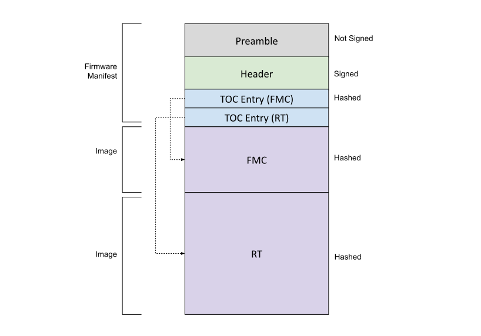

### Firmware manifest

Firmware manifest consists of preamble, header and table of contents.

#### Preamble

It is the unsigned portion of the manifest. Preamble contains the signing public keys and signatures. ROM is responsible for parsing the preamble. ROM performs the following steps:

- Loads the preamble from the mailbox.
- Calculates the hash of ECC and LMS or MLDSA [Public Key Descriptors](#Public-Key-Descriptor) in the preamble and compares it against the hash in the fuse (FUSE_VENDOR_PK_HASH). If the hashes do not match, the boot fails.
- Verifies the active Manufacturer Public Key(s) based on fuse (FUSE_ECC_REVOCATION for ECC public key, FUSE_LMS_REVOCATION for LMS public key or FUSE_MLDSA_REVOCATION for MLDSA public key)

*Note: All fields are little endian unless specified*

*Preamble*

| Field | Size (bytes) | Description|
|-------|--------|------------|
| Firmware Manifest Marker | 4 | Magic Number marking the start of the package manifest. The value must be 0x434D4E32 (‘CMN2’ in ASCII)|
| Firmware Manifest Size | 4 | Size of the full manifest structure |
| Firmware Manifest Type | 4 |  **Byte0:** - Type <br> 0x1 – ECC & MLDSA Keys <br> 0x3 – ECC & LMS Keys <br> **Byte1-Byte3:** Reserved |
| Manufacturer ECC Key Descriptor | 196 | Public Key Descriptor for ECC keys |
| Manufacturer LMS or MLDSA Key Descriptor | 1540 | Public Key Descriptor for LMS (1540 bytes) or MLDSA (196 bytes + 1344 unused bytes) keys |
| Active ECC Key Index | 4 | Public Key Hash Index for the active ECC key |
| Active ECC Key | 96 | ECC P-384 public key used to verify the Firmware Manifest Header Signature <br> **X-Coordinate:** Public Key X-Coordinate (48 bytes, big endian) <br> **Y-Coordinate:** Public Key Y-Coordinate (48 bytes, big endian) |
| Active LMS or MLDSA Key Index | 4 | Public Key Hash Index for the active LMS or MLDSA key |
| Active LMS or MLDSA Key | 2592 | LMS public key (48 bytes + 2544 unused bytes) used to verify the Firmware Manifest Header Signature. <br> **tree_type:** LMS Algorithm Type (4 bytes, big endian) Must equal 12. <br> **otstype:** LM-OTS Algorithm Type (4 bytes, big endian) Must equal 7. <br> **id:**  (16 bytes) <br> **digest:**  (24 bytes) <br><br>**OR**<br><br>MLDSA-87 public key used to verify the Firmware Manifest Header Signature. <br> (2592 bytes, little endian)|
| Manufacturer ECC Signature | 96 | Manufacturer ECC P-384 signature of the Firmware Manifest header hashed using SHA2-384. <br> **R-Coordinate:** Random Point (48 bytes) <br> **S-Coordinate:** Proof (48 bytes) |
| Manufacturer LMS or MLDSA Signature | 4628 | Manufacturer LMS signature (1620 bytes + 3008 unused bytes) of the Firmware Manifest header hashed using SHA2-384. <br> **q:** Leaf of the Merkle tree where the OTS public key appears (4 bytes) <br> **ots:** Lmots Signature (1252 bytes) <br> **tree_type:** Lms Algorithm Type (4 bytes) <br> **tree_path:** Path through the tree from the leaf associated with the LM-OTS signature to the root. (360 bytes) <br><br>**OR**<br><br> Vendor MLDSA-87 signature of the Firmware Manifest header hashed using SHA2-512 (4627 bytes + 1 Reserved byte, little endian)|
| Owner ECC Public Key | 96 | ECC P-384 public key used to verify the Firmware Manifest Header Signature. <br> **X-Coordinate:** Public Key X-Coordinate (48 bytes) <br> **Y-Coordinate:** Public Key Y-Coordinate (48 bytes)|
| Owner LMS or MLDSA Public Key | 2592 | LMS public key (48 bytes + 2544 unused bytes) used to verify the Firmware Manifest Header Signature. <br> **tree_type:** LMS Algorithm Type (4 bytes) <br> **otstype:** LMS Ots Algorithm Type (4 bytes) <br> **id:**  (16 bytes) <br> **digest:**  (24 bytes) <br><br>**OR**<br><br>MLDSA-87 public key used to verify the Firmware Manifest Header Signature. <br> (2592 bytes, little endian)|
| Owner ECC Signature | 96 | Manufacturer ECC P-384 signature of the Firmware Manifest header hashed using SHA2-384. <br> **R-Coordinate:** Random Point (48 bytes) <br> **S-Coordinate:** Proof (48 bytes) |
| Owner LMS or MLDSA Signature | 4628 | Owner LMS signature (1620 bytes + 3008 unused bytes) of the Firmware Manifest header hashed using SHA2-384. <br> **q:** Leaf of the Merkle tree where the OTS public key appears (4 bytes) <br> **ots:** Lmots Signature (1252 bytes) <br> **tree_type:** Lms Algorithm Type (4 bytes) <br> **tree_path:** Path through the tree from the leaf associated with the LM-OTS signature to the root. (360 bytes) <br><br>**OR**<br><br> Owner MLDSA-87 signature of the Firmware Manifest header hashed using SHA2-512 (4627 bytes + 1 Reserved byte, little endian) |
| Reserved | 8 | Reserved 8 bytes |
<br>

#### ECC Manufacturer Public Key Descriptor

| Field | Size (bytes) | Description|
|-------|--------|------------|
| Key Descriptor Version | 2 | Version of the Key Descriptor. The value must be 0x1 for Caliptra 2.x |
| Reserved | 1 | Reserved  |
| Key Hash Count | 1 | Number of valid public key hashes  |
| Public Key Hash(es) | 48 * n | List of valid and invalid (if any) SHA2-384 public key hashes. ECDSA: n = 4. Each hash is stored in reversed-dword format (see [Public key hash byte ordering](#public-key-hash-byte-ordering-dword-reversal)). |

#### PQC Manufacturer Public Key Descriptor

| Field | Size (bytes) | Description|
|-------|--------|------------|
| Key Descriptor Version | 2 | Version of the Key Descriptor. The value must be 0x1 for Caliptra 2.x |
| Key Type | 1 | Type of the key in the descriptor <br>  0x1 - MLDSA <br> 0x3 - LMS |
| Key Hash Count | 1 | Number of valid public key hashes  |
| Public Key Hash(es) | 48 * n | List of valid and invalid (if any) SHA2-384 public key hashes. n = 32 for both LMS and MLDSA (the struct always allocates 32 slots; for MLDSA only the first 4 are populated and the rest are zero). Each hash is stored in reversed-dword format (see [Public key hash byte ordering](#public-key-hash-byte-ordering-dword-reversal)). |

#### Header

The header contains the security version and SHA2-384 hash of the table of contents. Header is the only signed component in the image. Signing the header is enough as the table of contents contains the hashes of the individual firmware images. This technique reduces the number of signature verifications required to be performed during boot.

| Field | Size (bytes) | Description|
|-------|--------|------------|
| Revision | 8 | 8-byte version of the firmware image bundle |
| Vendor ECC public key hash index | 4 | The hint to ROM to indicate which ECC public key hash it should use to validate the active ECC public key. |
| Vendor LMS or MLDSA public key hash index | 4 | The hint to ROM to indicate which LMS or MLDSA public key hash it should use to validate the active public key. |
| Flags | 4 | Feature flags. <br> **Bit0:** - Interpret the pl0_pauser field. If not set, all PAUSERs are PL1 <br>**Bit1-Bit31:** Reserved |
| TOC Entry Count | 4 | Number of entries in TOC. |
| PL0 PAUSER | 4 | The PAUSER with PL0 privileges. |
| TOC Digest | 48 | SHA2-384 Digest of table of contents. |
| Vendor Data | 40 | Vendor Data. <br> **Not Before:** Vendor Start Date [ASN1 Time Format] For Alias FMC and Alias RT certificates (15 bytes) <br> **Not After:** Vendor End Date [ASN1 Time Format] For Alias FMC and Alias RT certificates (15 bytes) <br> **Reserved:** (10 bytes) |
| Owner Data | 40 | Owner Data. <br> **Not Before:** Owner Start Date [ASN1 Time Format] For Alias FMC and Alias RT certificates. Takes preference over vendor start date (15 bytes) <br> **Not After:** Owner End Date [ASN1 Time Format] For Alias FMC and Alias RT certificates. Takes preference over vendor end date (15 bytes) <br> **Reserved:** (10 bytes) |

#### Table of contents

It contains the image information and SHA-384 hash of individual firmware images.
| Field | Size (bytes) | Description|
|-------|--------|------------|
| TOC Entry Id | 4 | TOC Entry Id. The fields can have following values: <br> **0x0000_0001:** FMC  <br> **0x0000_0002:** Runtime |
| Image Type | 4 | Image Type that defines format of the image section <br> **0x0000_0001:** Executable |
| Image Revision | 20 | Git Commit hash of the build |
| Image Version | 4 | Firmware release number |
| Image SVN | 4 | Security Version Number for the image. It is compared to FW SVN fuses. FMC TOC entry's SVN field is ignored. |
| Reserved | 4 | Reserved field |
| Image Load Address | 4 | Load address |
| Image Entry Point | 4 | Entry point to start the execution from  |
| Image Offset | 4 | Offset from beginning of the image |
| Image Size | 4 | Image Size |
| Image Hash | 48 | SHA2-384 hash of image |

### Image

| Field | Size (bytes) | Description   |
|-------|--------------|---------------|
| Data  | N            | Image content |

## Cryptographic primitives

The following sections define the various cryptographic primitives used by Caliptra ROM:
| Group | Operation |Description |
|-------|--------|------------|
| Deobfuscation Engine | `doe_decrypt_uds(kv_slot, iv)` | Decrypt UDS to the specified key vault slot with specified initialization vector<br>**Input**:<br> ***kv_slot*** - key vault slot to decrypt the uds to<br>***iv*** - initialization vector |
|   | `doe_decrypt_fe(kv_slot, iv)` | Decrypt Field Entropy to the specified key vault slot with specified initialization vector <br>**Input**:<br>***kv_slot*** - key vault slot to decrypt the field entropy to<br>***iv*** - initialization vector |
|   | `doe_clear_secrets()` | Clear UDS Fuse Register, Field Entropy Fuse Register and Obfuscation key |
| Hashed Message Authentication Code | `hmac_mac(key,data,mac_kv_slot,mode)` | Calculate the MAC using a caller provided key and data. The resultant MAC is stored in key vault slot<br>**Input**:<br>***key*** - caller specified key<br>data - data<br>***mac_kv_slot*** - key vault slot to store the MAC to<br>***mode*** - HMAC384 or HMAC512 |
|   | `hmac_mac(kv_slot,data,mac_kv_slot)` | Calculate the MAC using a caller provided key and data. The resultant MAC is stored in key vault slot <br>**Input**: <br>***kv_slot*** - key vault slot to use the key from<br>***data*** - data<br>***mac_kv_slot*** - key vault slot to store the MAC to<br>***mode*** - HMAC384 or HMAC512 |
| | `hmac512_mac(key,data,mac_kv_slot)` | Calculate the MAC using a caller provided key and data. The resultant MAC is stored in key vault slot<br>**Input**:<br>***key*** - caller specified key<br>data - data<br>***mac_kv_slot*** - key vault slot to store the MAC to |
|   | `hmac512_mac(kv_slot,data,mac_kv_slot)` | Calculate the MAC using a caller provided key and data. The resultant MAC is stored in key vault slot <br>**Input**: <br>***kv_slot*** - key vault slot to use the key from<br>***data*** - data<br>***mac_kv_slot*** - key vault slot to store the MAC to |
| Elliptic Curve Cryptography | `ecc384_keygen(seed_kv_slot, priv_kv_slot) -> pub_key` | Generate ECC384 Key Pair.<br>**Input**:<br>***seed_key_slot*** - key vault slot to use as seed for key generation<br>***priv_kv_slot*** - key vault slot to store the private key to<br>**Output**:<br>***pub-key*** - public key associated with the private key |
|   | `ecc384_sign(priv_kv_slot, data) -> sig` | ECC384 signing operation<br>**Input**:<br>***priv_kv_slot*** - key vault slot to use a private key from<br>***data*** - data to sign<br>**Output**:<br>***sig*** - signature |
| | `ecc384_verify(pub_key, data, sig) -> CaliptraResult<Array4xN<12, 48>>` | ECC384 verify operation<br>**Input**:<br>***pub-key*** -public key<br>data - data to verify<br>sig - signature<br>**Output**:<br>***Ecc384Result*** - verify.r value on success, else an error |
| Module-Lattice-Based Digital Signature Algorithm | `mldsa87_keygen(seed_kv_slot) -> pub_key` | Generate Mldsa87 Key Pair.<br>**Input**:<br>***seed_key_slot*** - key vault slot to use as seed for key generation<br>**Output**:<br>***pub-key*** - public key associated with the private key |
|   | `mldsa87_sign(seed_kv_slot, data) -> sig` | Mldsa87 signing operation<br>**Input**:<br>***seed_kv_slot*** - key vault slot to use as seed for key generation for signing<br>***data*** - data to sign<br>**Output**:<br>***sig*** - signature |
| | `mldsa87_verify(pub_key, data, sig) -> Mldsa87Result` | Mldsa87 verify operation<br>**Input**:<br>***pub-key*** -public key<br>data - data to verify<br>sig - signature<br>**Output**:<br>***Mldsa87Result*** - '0xAAAAAAAA' value on success, '0x55555555' on error |
| Secure Hash Algorithm | `sha384_digest(data) -> digest` | Calculate the digest of the data<br>**Input**:<br>***data*** - data to verify<br>**Output**:<br>***digest*** - digest of the data |
| Key Vault | `kv_clear(kv_slot)` | Key Vault slot to clear<br>**Input**:<br>***kv_slot*** - key vault slot to clear |
| Data Vault | `dv48_store(data, dv_slot)` | Store the 48-byte data in the specified data vault slot<br>**Input**:<br>***data*** - data to store<br>***dv_slot*** - data vault slot |
| | `dv48_lock_wr(dv_slot)` | Write Lock the 48-byte data vault slot<br>Input<br>***dv_slot*** - data vault slot |
| | `dv4_store(data, dv_slot)` | Store the 4- byte data in the specified data vault slot<br>Input<br>***data*** - data to store<br>***dv_slot*** - data vault slot |
| | `dv4_lock_wr(dv_slot)` | Write Lock the 4-byte data vault slot<br>Input<br>***dv_slot*** - data vault slot |
| Platform Configuration Registers | `pcr_extend(pcr_slot, data)` | Perform PCR extend operation on a PCR with specified data<br>**Input**:<br>***pcr_slot*** - PCR slot to hash extend<br>***data*** – data |
| | `pcr_read(pcr_slot) -> measurement` | Read the PCR slot<br>**Input**:<br>***pcr_slot*** - PCR slot to read<br>**Output**:<br>***measurement*** - Accumulated measurement |
| | `pcr_lock_clear(pcr_slot)` | Lock for Clear PCR slot<br>**Input**:<br>***pcr_slot*** - pcr slot |
| | `pcr_clear(pcr_slot)` | Clear PCR slot<br>**Input**:<br>***pcr_slot*** - pcr slot |
| X509 | `gen_tbs(type, pub_key) -> tbs` | Generate X509 Certificate or CSR `To Be Signed` portion<br>**Input**:<br>***type*** - Can be IDEVID_CSR, LDEVID_CERT or ALIAS_FMC_CERT<br>pub-key -public key<br>**Output**:<br>***tbs*** - DER encoded `To Be Signed` portion |
<br>

## Well known cryptographic constants

| Constant | Size (bytes) | Description |
|----------|--------------|-------------|
| DOE_IV | 16 | Initialization vector specified by the ROM for deobfuscating the UDS and Field Entropy. |
<br>

## Cold reset flow

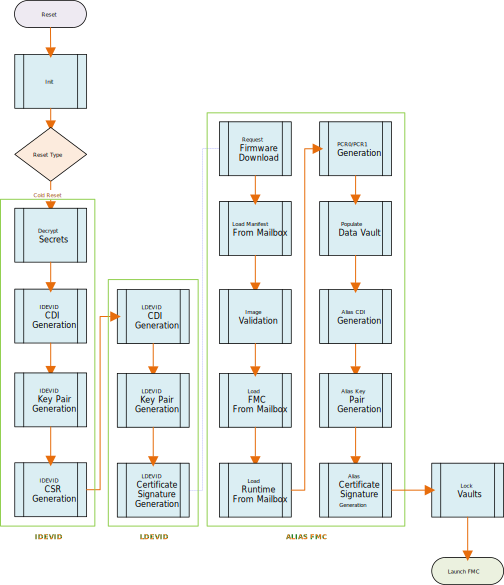

ROM performs all the necessary crypto derivations on cold reset. No crypto derivations are performed during warm reset or update reset.

Note that KvSlot3 is generally used as a temporary location for derived keying material during ECC keygen.

### Initialization

The initialization step involves a traditional startup script for microcontroller. The initialization script performs following:

- Resets instruction counter
- Disables interrupts
- Clears all general purpose registers
- Sets up memory region attributes (Cacheable & Side effects)
- Sets up stack pointer
- Sets up NMI and Exception handler
- Zeros ICCM & DCCM memories (to initialize ECC)
- Jumps to Rust entry point

The following flows are conducted exclusively when the ROM is operating in SUBSYSTEM mode.

### Manufacturing Flows:
The following flows are conducted when the ROM is operating in the manufacturing mode, indicated by a value of `DEVICE_MANUFACTURING` (0x1) in the `CPTRA_SECURITY_STATE` register `device_lifecycle` bits.

#### UDS Provisioning
1. On reset, the ROM checks if the `UDS_PROGRAM_REQ` bit in the `SS_DBG_MANUF_SERVICE_REG_REQ` register is set. If the bit is set, ROM initiates the UDS seed programming flow by setting the `UDS_PROGRAM_IN_PROGRESS` bit in the `SS_DBG_MANUF_SERVICE_REG_RSP` register. If the flow fails at some point past reading the REQ bits, the flow will be aborted and an error returned.

2. ROM then retrieves the following values:
    - A 512-bit value from the iTRNG.
    - The UDS Seed programming base address from the `SS_UDS_SEED_BASE_ADDR_L` and `SS_UDS_SEED_BASE_ADDR_H` registers.
    - The Fuse Controller's base address from the `SS_OTP_FC_BASE_ADDR_L` and `SS_OTP_FC_BASE_ADDR_H` registers.

3. ROM then retrieves the UDS granularity from the `CPTRA_GENERIC_INPUT_WIRES` register0 Bit31 to learn if the fuse row is accessible with 32-bit or 64-bit granularity.  If the bit is reset, it indicates 64-bit granularity; otherwise, it indicates 32-bit granularity.

4. ROM computes the following values:
    - DAI_IDLE bit offset: (`SS_STRAP_GENERIC` register0 >> 16) & 0xFFFF
    - `DIRECT_ACCESS_CMD` offset: (`SS_STRAP_GENERIC` register1) & 0xFFFF + Fuse Controller's base address.

4. ROM then performs the following steps until all the 512 bits of the UDS seed are programmed:
    1. The ROM verifies the idle state of the DAI by reading the `STATUS` register `DAI_IDLE` bit (offset retrieved above) of the Fuse Controller, located at offset 0x10 from the Fuse Controller's base address.
    2. If the granularity is 32-bit, the ROM writes the next word from the UDS seed to the `DIRECT_ACCESS_WDATA_0` register. If the granularity is 64-bit, the ROM writes the next two words to `the DIRECT_ACCESS_WDATA_0` and `DIRECT_ACCESS_WDATA_1` registers, located at offsets 0x8 and 0xC respectively from the `DIRECT_ACCESS_CMD` register.
    3. The ROM writes the lower 32 bits of the UDS Seed programming base address to the `DIRECT_ACCESS_ADDRESS` register, located at offset 0x4 from the `DIRECT_ACCESS_CMD` register.
    4. The ROM triggers the UDS seed write command by writing 0x2 to the `DIRECT_ACCESS_CMD` register..
    5. The ROM increments the `DIRECT_ACCESS_ADDRESS` register by 4 for 32-bit granularity or 8 for 64-bit granularity and repeats the process for the remaining words of the UDS seed.

5. The ROM continuously polls the Fuse Controller's `STATUS` register until the DAI state returns to idle.

6. After completing the write operation, ROM triggers the partition  digest operation performing the following steps:
    1. The ROM writes the lower 32 bits of the UDS Seed programming base address to the `DIRECT_ACCESS_ADDRESS` register.
    2. The ROM triggers the digest calculation command by writing 0x4 to the `DIRECT_ACCESS_CMD` register.
    3. The ROM continuously polls the Fuse Controller's `STATUS` register until the DAI state returns to idle.

7. ROM updates the `UDS_PROGRAM_SUCCESS` or the `UDS_PROGRAM_FAIL` bit in the `SS_DBG_MANUF_SERVICE_REG_RSP` register to indicate the outcome of the operation.

8. ROM then resets the `UDS_PROGRAM_IN_PROGRESS` bit in the `SS_DBG_MANUF_SERVICE_REG_RSP` register to indicate completion of the programming.

9. The manufacturing process then polls this bit and continues with the fuse burning flow as outlined by the fuse controller specifications and SOC-specific VR methodologies.

#### Debug Unlock

**Note:** All mailbox command requests start with a 4-byte `MailboxReqHeader` (containing a checksum field), while response payloads start with an 8-byte `MailboxRespHeader` (containing checksum and FIPS status fields).

1. On reset, the ROM checks if the `MANUF_DBG_UNLOCK_REQ` bit in the `SS_DBG_MANUF_SERVICE_REG_REQ` register and the `DEBUG_INTENT` bit in `SS_DEBUG_INTENT` register are set.

2. If they are set, the ROM sets the `TAP_MAILBOX_AVAILABLE` & `MANUF_DBG_UNLOCK_IN_PROGRESS` bits in the `SS_DBG_MANUF_SERVICE_REG_RSP` register, then enters a loop, awaiting a `TOKEN` command on the mailbox. The payload of this command is a 256-bit value.

3. The ROM performs a SHA-512 operation on the token to generate the input token digest.

4. The ROM compares the `FUSE_MANUF_DBG_UNLOCK_TOKEN` fuse register with the input token digest.

5. The ROM completes the mailbox command.

6. If the input token digest and fuse token digests match, the ROM authorizes the debug unlock by setting the `SS_DBG_MANUF_SERVICE_REG_RSP` register `MANUF_DBG_UNLOCK_SUCCESS` bit to 1.

7. If the token digests do not match, the ROM blocks the debug unlock by setting the the `SS_DBG_MANUF_SERVICE_REG_RSP` register `MANUF_DBG_UNLOCK_FAIL` bit to 1.

8. The ROM sets the `SS_DBG_MANUF_SERVICE_REG_RSP` register `MANUF_DBG_UNLOCK_IN_PROGRESS` and `TAP_MAILBOX_AVAILABLE` bits to 0.


### Production Flows
The following flows are conducted when the ROM is operating in the production mode, indicated by a value of `DEVICE_PRODUCTION` (0x3) in the `CPTRA_SECURITY_STATE` register `device_lifecycle` bits.

#### Debug Unlock

**Note:** All mailbox command requests start with a 4-byte `MailboxReqHeader` (containing a checksum field), while response payloads start with an 8-byte `MailboxRespHeader` (containing checksum and FIPS status fields).

1. On reset, the ROM checks if the `PROD_DEBUG_UNLOCK_REQ` bit in the `SS_DBG_MANUF_SERVICE_REG_REQ` register and the `DEBUG_INTENT` in `SS_DEBUG_INTENT` register are set.

2. If they are set, the ROM sets the `TAP_MAILBOX_AVAILABLE` & `PROD_DBG_UNLOCK_IN_PROGRESS` bits in the `SS_DBG_MANUF_SERVICE_REG_RSP` register.

3. ROM enters a polling loop, awaiting a `AUTH_DEBUG_UNLOCK_REQ` command (Id: 0x50445552) on the mailbox. The payload for this command is of the following format:

| Field            | Size (bytes) | Description                                        |
|------------------|--------------|----------------------------------------------------|
| Length           | 4            | Length of the message in DWORDs. This should be 2. |
| Unlock Level     | 1            | Debug unlock Level (Number 1-8).                   |
| Reserved         | 3            | Reserved field.                                    |

3. On failure, ROM does the following:
      - `PROD_DBG_UNLOCK_FAIL` bit in `SS_DBG_MANUF_SERVICE_REG_RSP` register to 1.
      - `PROD_DBG_UNLOCK_IN_PROGRESS` bit in `SS_DBG_MANUF_SERVICE_REG_RSP` register to 0.

4. The ROM validates the payload and on successful validation sends the following payload as the response:

| Field                    | Size (bytes) | Description                                        |
|--------------------------|--------------|----------------------------------------------------|
| Length                   | 4            | Length of the message in DWORDs. This should be 21.                                          |
| Unique Device Identifier | 32           | Device identifier of the Caliptra Device.          |
| Challenge                | 48           | Random number.                                     |

5. On failure, ROM sets the registers outlined in step 3.

6. The SOC then sends the following payload via the `AUTH_DEBUG_UNLOCK_TOKEN` mailbox command (0x50445554):

| Field                    | Size (bytes) | Description                                                                           |
|--------------------------|--------------|---------------------------------------------------------------------------------------|
| Length                   | 4            | Length of the message in DWORDs. This should be 0x753.                                |
| Unique Device Identifier | 32           | Device identifier sent in `AUTH_DEBUG_UNLOCK_CHALLENGE` mailbox command payload.      |
| Unlock Level             | 1            | Debug unlock Level (Number 1-8).                                                      |
| Reserved                 | 3            | Reserved field.                                                                       |
| Challenge                | 48           | Random number sent in `AUTH_DEBUG_UNLOCK_CHALLENGE` mailbox command payload.          |
| ECC Public Key           | 96           | ECC P-384 public key used to verify the Message Signature <br> **X-Coordinate:** Public Key X-Coordinate (48 bytes) <br> **Y-Coordinate:** Public Key Y-Coordinate (48 bytes). See [Byte order of cryptographic fields](../../runtime/README.md#byte-order-of-cryptographic-fields). |
| MLDSA Public Key         | 2592         | MLDSA-87 public key used to verify the Message Signature. See [Byte order of cryptographic fields](../../runtime/README.md#byte-order-of-cryptographic-fields). |
| ECC Signature            |  96          | ECC P-384 signature of the Message hashed using SHA2-384. <br> **R-Coordinate:** Random Point (48 bytes) <br> **S-Coordinate:** Proof (48 bytes). See [Byte order of cryptographic fields](../../runtime/README.md#byte-order-of-cryptographic-fields). |
| MLDSA Signature          | 4628         | MLDSA-87 signature of the Message hashed using SHA2-512 (4627 bytes + 1 Reserved byte). See [Byte order of cryptographic fields](../../runtime/README.md#byte-order-of-cryptographic-fields). |

7. On receiving this payload, ROM performs the following validations:
    - Ensures the value in the `Length` field matches the size of the payload.
    - Confirms that the `Debug unlock level` is not zero and does not exceed the value specified in the `SS_NUM_OF_PROD_DEBUG_UNLOCK_AUTH_PK_HASHES` register.
    - Calculates the address of the public key hash fuse as follows: <br>
        **SS_PROD_DEBUG_UNLOCK_AUTH_PK_HASH_REG_BANK_OFFSET register value + ( (Debug Unlock Level - 1) * SHA2-384 hash size (48 bytes) )**
    - Retrieves the SHA2-384 hash (48 bytes) from the calculated address using DMA assist.
    - Computes the SHA2-384 hash of the message formed by concatenating the ECC and MLDSA public keys in the payload. See [Production debug unlock public key hashes: byte ordering](#production-debug-unlock-public-key-hashes-byte-ordering) for the exact byte order and fuse programming details.
    - Compares the retrieved and computed hashes. It the comparison fails, the ROM blocks the debug unlock request by setting the registers outlined in step 3.
    - Upon hash comparison failure, the ROM exits the payload validation flow and completes the mailbox command.

4. The ROM proceeds with payload validation by verifying the ECC and MLDSA signatures over the `Challenge`, `Device Identifier`, `Reserved` and `Unlock Category` fields within the payload. Should the validation fail, the ROM blocks the debug unlock by setting the registers outlined in item 3. Conversely, if the signature validation succeeds, the ROM authorizes the debug unlock by configuring the following settings:

      - `PROD_DBG_UNLOCK_SUCCESS` bit in `SS_DBG_MANUF_SERVICE_REG_RSP` register to 1.
      - Setting the Debug unlock level in the `SS_SOC_DBG_UNLOCK_LEVEL` register as one hot encoded value (1 << (Level - 1))
      - `PROD_DBG_UNLOCK_IN_PROGRESS` bit in `SS_DBG_MANUF_SERVICE_REG_RSP` register to 0.

5. ROM then completes the mailbox command with success.

6. The ROM sets the `SS_DBG_MANUF_SERVICE_REG_RSP` register `PROD_DBG_UNLOCK_IN_PROGRESS` and `TAP_MAILBOX_AVAILABLE` bits to 0.

### Known Answer Test (KAT)

To certify a cryptographic module, pre-operational self-tests must be performed when the system is booted. Implementing KATs is required for FIPS certification. However, regardless of FIPS certification, it is considered a security best practice to ensure that the supported cryptographic algorithms are functioning properly to guarantee correct security posture.

KAT execution is described as two types:

* Pre-operational Self-Test (POST)
* Conditional Algorithm Self-Test (CAST)

ROM performs the following POST tests to ensure that needed cryptographic modules are functioning correctly and are operational before any cryptographic operations are performed:

 - SHA1
 - SHA2-256
 - SHA2-384
 - SHA2-512
 - SHA2-512-ACC
 - ECC-384
 - ECDH
 - HMAC-384Kdf
 - HMAC-512Kdf
 - HKDF-384
 - HKDF-512
 - KDF-CMAC
 - LMS
 - MLDSA-87
 - AES-256-ECB
 - AES-256-CBC
 - AES-256-CMAC
 - AES-256-CTR
 - AES-256-GCM

### DICE Flow

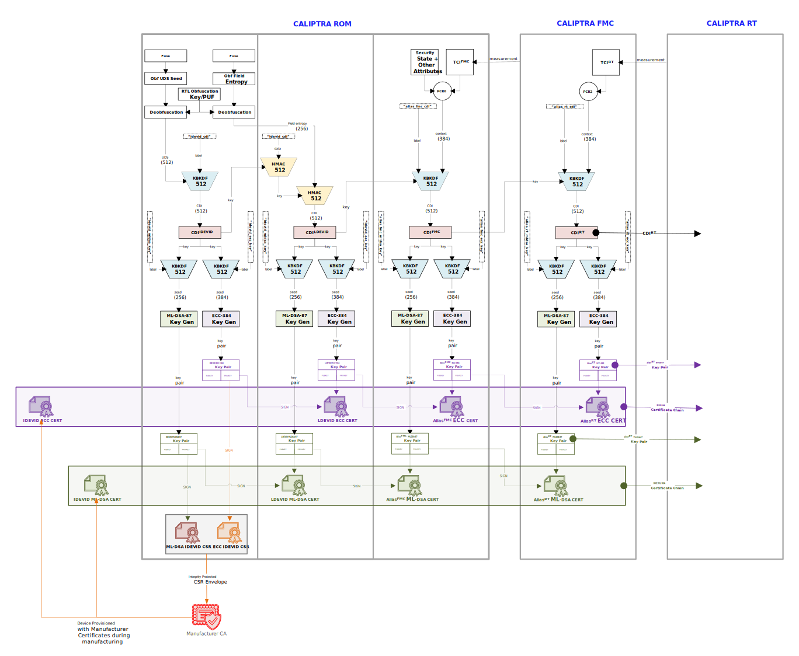

### Decrypt secrets

DICE Unique Device Secret (UDS) is stored in an SOC backed fuse (or derived from PUF). The raw UDS is not directly used. UDS is deobfuscated using Deobfuscation Engine. UDS is provisioned by the Silicon Vendor.

Field Entropy is used to mitigate certain classes of supply chain attacks.  Field Entropy is programmed by the owner of the device in a secure environment in the owner’s facility. Field Entropy programmed in fuses is not directly used. Field Entropy is put through the deobfuscation engine to randomize it.

Both UDS and Field Entropy are available only during cold reset of Caliptra.

**Pre-conditions:**

- Caliptra subsystem is being cold reset
- Obfuscation Key loaded in deobfuscation engine
- UDS and Field Entropy loaded in Caliptra Fuse Registers
- Keys Slot 0 - 23 are empty and Usage Bits are all cleared
- PCR 0 - 31 are all cleared
- DCCM datavault is cleared

**Actions:**

1. Decrypt UDS to Key Vault Slot 0

    `doe_decrypt_uds(KvSlot0, DOE_IV)`

2. Decrypt Field Entropy to Key Vault Slot 1

    `doe_decrypt_fe(KvSlot1, DOE_IV)`

3. Clear class secrets (Clears UDS, Field Entropy and Obfuscation Key cleared)

    `doe_clear_secrets()`

**Post-conditions:**

- UDS Fuse Register and Field Entropy Fuse register cleared
- Obfuscation Key cleared from Deobfuscation Engine
- Vault State is as follows:

| Slot | Key Vault                |
|------|-----------------------   |
| 0    | UDS (64 bytes)           |
| 1    | Field Entropy (32 bytes) |

### Initial Device ID DICE layer

Initial Device ID Layer is used to generate Manufacturer CDI & Private Keys. This layer represents the manufacturer or silicon vendor DICE Identity. During manufacturing, ROM can be requested to create Certificate Signing Request (CSR) via JTAG.

**Pre-conditions:**

- UDS is in Key Vault Slot 0

**Actions:**

1. Derive the CDI using ROM specified label and UDS in Key Vault Slot 0 as data and store the resultant MAC in Key Vault Slot 6.

    `hmac512_kdf(KvSlot0, b"idevid_cdi", KvSlot6)`

2. Clear the UDS in the key vault.

    `kv_clear(KvSlot0)`

3. Derive ECC Key Pair using CDI in Key Vault Slot 6 and store the generated private key in Key Vault Slot 7.

    `IDevIDSeedEcdsa = hmac512_kdf(KvSlot6, b"idevid_ecc_key", KvSlot3)`

    `IDevIdPubKeyEcdsa = ecc384_keygen(KvSlot3, KvSlot7)`

    `kv_clear(KvSlot3)`

    Derive the MLDSA Key Pair using CDI in Key Vault Slot 6 and store the key generation seed in Key Vault Slot 8.

    `IDevIDSeedMldsa = hmac512_kdf(KvSlot6, b"idevid_mldsa_key", KvSlot8)`

    `IDevIdPubKeyMldsa = mldsa87_keygen(KvSlot8)`

*(Note: Steps 4-12 are performed if CSR download is requested via CPTRA_DBG_MANUF_SERVICE_REG register)*

4. Generate the `To Be Signed` DER Blob of the IDevId CSR with the ECDSA public key.

    `IDevIdTbsEcdsa = gen_tbs(IDEVID_CSR, IDevIdPubKeyEcdsa)`

5. Sign the IDevID `To Be Signed` DER Blob with IDevId ECDSA Private Key in Key Vault Slot 7.

    `IDevIdTbsDigestEcdsa = sha384_digest(IDevIdTbsEcdsa)`

    `IDevIdCertSigEcdsa = ecc384_sign(KvSlot7, IDevIdTbsDigestEcdsa)`

6. Verify the signature of IDevID `To Be Signed` Blob.

    `Result = ecc384_verify(IDevIdPubKeyEcdsa, IDevIdTbsDigestEcdsa, IDevIdCertSigEcdsa)`

7. Generate the `To Be Signed` DER Blob of the IDevId CSR with the MLDSA public key.

    `IDevIdTbsMldsa = gen_tbs(IDEVID_CSR, IDevIdPubKeyMldsa)`

8. Sign the IDevID `To Be Signed` DER Blob with IDevId MLDSA Private Key generated from the seed in Key Vault Slot 8.

    `IDevIdTbsDigestMldsa = sha512_digest(IDevIdTbsMldsa)`

    `IDevIdCertSigMldsa = mldsa87_sign(KvSlot8, IDevIdTbsDigestMldsa)`

9. Verify the signature of IDevID `To Be Signed` Blob.

    `Result = mldsa87_verify(IDevIdPubKeyMldsa, IDevIdTbsDigestMldsa, IDevIdCertSigMldsa)`

10. Generate the MACs over the tbs digests as follows:

    `IDevIdTbsEcdsaMac = hmac_mac(VendorSecretKvSlot, b"idevid_ecc_csr", IDevIdTbsDigestEcdsa, HmacMode::Hmac384)`

    `IDevIdTbsMldsaMac = hmac512_mac(VendorSecretKvSlot, b"idevid_mldsa_csr",IDevIdTbsDigestMldsa, HmacMode::Hmac512)`

11. Upload the CSR(s) to mailbox and wait for JTAG to read the CSR out of the mailbox. Format of the CSR payload is documented below:

#### IDevID CSR Format

*Note: All fields are little endian unless specified*

| Field          | Size (bytes) | Description                                                                                     |
|----------------|--------------|-------------------------------------------------------------------------------------------------|
| Marker         | 4            | Magic Number marking the start of the CSR payload. The value must be 0x435352 (‘CSR’ in ASCII). |
| Size           | 4            | Size of the entire CSR payload.                                                                 |
| ECC CSR Size   | 4            | Size of the ECC CSR in bytes.                                                                   |
| ECC CSR        | 512          | ECC CSR buffer. Actual CSR size is indicated by 'ECC CSR Size'.                                 |
| MLDSA CSR Size | 4            | Size of the MLDSA CSR in bytes.                                                                 |
| MLDSA CSR      | 7680         | MLDSA CSR bytes. Actual CSR size is indicated by 'MLDSA CSR Size'.                              |
| CSR MAC        | 64           | HMAC-512 MAC, computed over the envelope bytes up to but not including this field.       |

**Post-conditions:**

- Vault state is as follows:

| Slot | Key Vault                             |
|------|---------------------------------------|
| 1    | Field Entropy (32 bytes)              |
| 6    | IDevID CDI (64 bytes)                 |
| 7    | IDevID ECDSA Private Key (48 bytes)   |
| 8    | IDevID MLDSA Key Pair Seed (32 bytes) |

 | DCCM Datavault                 |
 |--------------------------------|
 | 🔒IDevID Cert ECDSA Signature |
 | 🔒IDevID ECDSA Pub Key        |
 | 🔒IDevID Cert MLDSA Signature |
 | 🔒IDevID MLDSA Pub Key        |

#### UEID (Unique Endpoint Identifier)

The UEID is a 17-byte identifier that is embedded (as an X.509 extension) in the
IDevID CSR, the LDevID certificate, and the FMC Alias certificate. Its value is
derived entirely from fuses.

##### Source fuses

The UEID is assembled from 5 consecutive 32-bit words of the
`FUSE_IDEVID_CERT_ATTR` fuse bank (see the [Fuse Registers](#fuse-registers)
table):

| Fuse word | `IdevidCertAttr` variant      | Usage in UEID                           |
|-----------|-------------------------------|-----------------------------------------|
| 11        | `UeidType`                    | UEID type byte (see RFC 9711 §4.2.1.1)  |
| 12        | `ManufacturerSerialNumber1`   | First 4 bytes of the endpoint serial    |
| 13        | `ManufacturerSerialNumber2`   | Next 4 bytes of the endpoint serial     |
| 14        | `ManufacturerSerialNumber3`   | Next 4 bytes of the endpoint serial     |
| 15        | `ManufacturerSerialNumber4`   | Last 4 bytes of the endpoint serial     |

Only the low byte of word 11 is used; the high 3 bytes of that word are
discarded. Each of the four serial-number words is written to the UEID buffer
in **little-endian** order (the natural byte order of the u32 register).

##### Byte layout

```
     byte 0      byte 1 ─ byte 4   byte 5 ─ byte 8   byte 9 ─ byte 12   byte 13 ─ byte 16
  ┌──────────┐ ┌────────────────┐ ┌────────────────┐ ┌─────────────────┐ ┌─────────────────┐
  │ UeidType │ │ MfgSerialNum1  │ │ MfgSerialNum2  │ │  MfgSerialNum3  │ │  MfgSerialNum4  │
  │ (byte 0) │ │  (LE u32)      │ │  (LE u32)      │ │   (LE u32)      │ │   (LE u32)      │
  └──────────┘ └────────────────┘ └────────────────┘ └─────────────────┘ └─────────────────┘
```

This assembly is implemented in `caliptra_drivers::FuseBank::ueid` in
`drivers/src/fuse_bank.rs`, returning a `[u8; 17]`.

##### Placement in the certificate / CSR

The 17-byte UEID is placed in the TCG DICE "Ueid" X.509 extension (OID
`2.23.133.5.4.4`, not marked critical). The extension's `extnValue`
`OCTET STRING` contains a DER-encoded `SEQUENCE { ueid OCTET STRING }`, as
defined by the TCG DICE specification. The DER bytes written into the TBS
template are:

| DER bytes                 | Meaning                                                 |
|---------------------------|---------------------------------------------------------|
| `30 1F`                   | `SEQUENCE`, length 31 — the `Extension`                 |
| `06 06 67 81 05 05 04 04` | `OID 2.23.133.5.4.4` (`tcg-dice-Ueid`)                  |
| `04 15`                   | `OCTET STRING`, length 21 — the `extnValue` wrapper     |
| `30 13`                   |   inner `SEQUENCE`, length 19 — the `TcgUeid` structure |
| `04 11`                   |     inner `OCTET STRING`, length 17 — the UEID value    |
| `XX XX … XX` (17 B)       |       the 17 UEID bytes assembled above                 |

The template slot for the 17 UEID bytes sits at a fixed offset in the TBS
template (e.g. `UEID_OFFSET = 312` for `InitDevIdCsrTbsEcc384`); the ROM copies
the UEID returned by `FuseBank::ueid` directly into that slot with no further
transformation. See `x509/gen/src/x509.rs::make_tcg_ueid_ext` for the generator
and `x509/build/*` for the resulting pre-baked templates.

##### End-to-end example

Given the following example fuse values (as programmed by the integration test
`cert_test_with_ueid` in `rom/dev/tests/rom_integration_tests/test_image_validation.rs`):

| Fuse word | Field                          | Value         |
|-----------|--------------------------------|---------------|
| 11        | `UeidType`                     | `0x0000_0001` |
| 12        | `ManufacturerSerialNumber1`    | `0x0403_0201` |
| 13        | `ManufacturerSerialNumber2`    | `0x0807_0605` |
| 14        | `ManufacturerSerialNumber3`    | `0x0C0B_0A09` |
| 15        | `ManufacturerSerialNumber4`    | `0x100F_0E0D` |

Step-by-step:

1. `FuseBank::ueid` reads the five fuse words and takes the low byte of word 11:
   `ueid_type = 0x01`.
2. Each serial-number word is converted to little-endian bytes:
   - `0x04030201 → 01 02 03 04`
   - `0x08070605 → 05 06 07 08`
   - `0x0C0B0A09 → 09 0A 0B 0C`
   - `0x100F0E0D → 0D 0E 0F 10`
3. The 17-byte UEID is:
   `01 01 02 03 04 05 06 07 08 09 0A 0B 0C 0D 0E 0F 10`
   (byte 0 is the type; bytes 1–16 are the endpoint serial).
4. The UEID is wrapped in the DER framing shown above and emitted verbatim in
   the IDevID CSR, LDevID certificate, and FMC Alias certificate. The resulting
   bytes on the wire for the Ueid extension are:
   `30 1F 06 06 67 81 05 05 04 04 04 15 30 13 04 11 01 01 02 03 04 05 06 07 08 09 0A 0B 0C 0D 0E 0F 10`.

The `cert_test_with_ueid` test programs exactly these fuses, boots the ROM,
retrieves the IDevID ECC CSR, LDevID cert, and FMC Alias cert from the UART
log, and asserts that the hex-encoded bytes
`010102030405060708090A0B0C0D0E0F10` appear in all three — confirming both the
fuse-to-UEID assembly and the DER placement described here.

### Local Device ID DICE layer

Local Device ID Layer derives the Owner CDI, ECC and MLDSA Keys. This layer represents the owner DICE Identity as it is mixed with the Field Entropy programmed by the Owner.

**Pre-conditions:**

- Field Entropy is loaded in Key Vault Slot 1
- IDevID CDI is stored in Key Vault Slot 6
- IDevID Private Key is stored in Key Vault Slot 7
- IDevID MLDSA Key Generation Seed is stored in Key Vault Slot 8

**Actions:**

1. Derive the stable identity root secret from IDevID and store the resultant MAC in Key Vault Slot 0.

    `hmac512_mac(KvSlot0, b"stable_identity_root_idev", KvSlot6)`

2. Derive the LDevID CDI using IDevID CDI in Key Vault Slot 6 as HMAC Key and Field Entropy stored in Key Vault Slot 1 as data. The resultant MAC is stored back in Key Vault Slot 6.

    `hmac512_mac(KvSlot6, b"ldevid_cdi", KvSlot6)`

    `hmac512_mac(KvSlot6, KvSlot1, KvSlot6)`

*(Note: this uses a pair of HMACs to incorporate the diversification label, rather than a single KDF invocation, due to hardware limitations when passing KV data to the HMAC hardware as a message.)*

3. Clear the Field Entropy in Key Vault Slot 1.

    `kv_clear(KvSlot1)`

4. Derive the stable identity root secret from LDevID and store the resultant MAC in Key Vault Slot 1.

    `hmac512_mac(KvSlot1, b"stable_identity_root_ldev", KvSlot6)`

5. Derive ECDSA Key Pair using CDI in Key Vault Slot 6 and store the generated private key in Key Vault Slot 5.

    `LDevIDSeed = hmac512_kdf(KvSlot6, b"ldevid_ecc_key", KvSlot3)`

    `LDevIdPubKeyEcdsa = ecc384_keygen(KvSlot3, KvSlot5)`

    `kv_clear(KvSlot3)`

6. Derive the MLDSA Key Pair using CDI in Key Vault Slot 6 and store the key generation seed in Key Vault Slot 4.

    `LDevIDSeed = hmac512_kdf(KvSlot6, b"ldevid_mldsa_key", KvSlot4)`

    `LDevIdPubKeyMldsa = mldsa87_keygen(KvSlot4)`

7. Store and lock (for write) the LDevID ECDSA and MLDSA Public Keys in the DCCM datavault.

8. Generate the `To Be Signed` DER Blob of the ECDSA LDevId Certificate.

    `LDevIdTbsEcdsa = gen_cert_tbs(LDEVID_CERT, IDevIdPubKeyEcdsa, LDevIdPubKeyEcdsa)`

9. Sign the LDevID `To Be Signed` DER Blob with IDevId ECDSA Private Key in Key Vault Slot 7.

    `LDevIdTbsDigestEcdsa = sha384_digest(LDevIdTbsEcdsa)`

    `LDevIdCertSigEcdsa = ecc384_sign(KvSlot7, LDevIdTbsDigestEcdsa)`

10. Clear the IDevId ECDSA Private Key in Key Vault Slot 7.

    `kv_clear(KvSlot7)`

11. Verify the signature of LDevID `To Be Signed` Blob.

    `Result = ecc384_verify(IDevIdPubKeyEcdsa, LDevIdTbsDigestEcdsa, LDevIdCertSigEcdsa)`

12. Generate the `To Be Signed` DER Blob of the MLDSA LDevId Certificate.

    `LDevIdTbsMldsa = gen_cert_tbs(LDEVID_CERT, IDevIdPubKeyMldsa, LDevIdPubKeyMldsa)`

13. Sign the LDevID `To Be Signed` DER Blob with the IDevId MLDSA Private Key derived from the seed in Key Vault Slot 8.

    `LDevIdTbsDigestMldsa = sha512_digest(LDevIdTbsMldsa)`

    `LDevIdCertSigMldsa = mldsa87_sign(KvSlot8, LDevIdTbsDigestMldsa)`

14. Clear the IDevId Mldsa seed in Key Vault Slot 8.

    `kv_clear(KvSlot8)`

15. Verify the signature of LDevID `To Be Signed` Blob.

    `Result = mldsa87_verify(IDevIdPubKeyMldsa, LDevIdTbsDigestMldsa, LDevIdCertSigMldsa)`

16. Store and lock (for write) the LDevID Certificate ECDSA and MLDSA Signatures in the DCCM datavault.


**Post-conditions:**

- Vault state is as follows:

 | Slot | Key Vault                                     |
 |------|-----------------------------------------------|
 | 0    | Stable identity root IDevID secret (64 bytes) |
 | 1    | Stable identity root LDevID secret (64 bytes) |
 | 4    | LDevID Key Pair Seed - MLDSA (32 bytes)       |
 | 5    | LDevID Private Key - ECDSA (48 bytes)         |
 | 6    | LDevID CDI (64 bytes)                         |

 | DCCM Datavault                 |
 |--------------------------------|
 | 🔒IDevID Cert ECDSA Signature |
 | 🔒IDevID ECDSA Pub Key        |
 | 🔒IDevID Cert MLDSA Signature |
 | 🔒IDevID MLDSA Pub Key        |
 | 🔒LDevID Cert ECDSA Signature |
 | 🔒LDevID ECDSA Pub Key        |
 | 🔒LDevID Cert MLDSA Signature |
 | 🔒LDevID MLDSA Pub Key        |

### Firmware Processor Stage
During this phase, the ROM executes specific mailbox commands. Based on the operational mode (SUBSYSTEM versus PASSIVE), the ROM also initiates the download of the firmware image. This download is conducted either through a mailbox command or via the Recovery Register Interface.

#### Handling commands from mailbox

ROM supports the following set of commands before handling the FW_DOWNLOAD command in PASSIVE mode (described in section 9.6) or RI_DOWNLOAD_FIRMWARE/RI_DOWNLOAD_ENCRYPTED_FIRMWARE command in SUBSYSTEM mode. Once the FW_DOWNLOAD, RI_DOWNLOAD_FIRMWARE, or RI_DOWNLOAD_ENCRYPTED_FIRMWARE is issued, ROM stops processing any additional mailbox commands.

1. **STASH_MEASUREMENT**: Up to eight measurements can be sent to the ROM for recording. Sending more than eight measurements will result in an FW_PROC_MAILBOX_STASH_MEASUREMENT_MAX_LIMIT fatal error. Format of a measurement is documented at [Stash Measurement command](https://github.com/chipsalliance/caliptra-sw/blob/main/runtime/README.md#stash_measurement).
2. **VERSION**: Get version info about the module. [Version command](https://github.com/chipsalliance/caliptra-sw/blob/main/runtime/README.md#version).
3. **SELF_TEST_START**: This command is used to invoke the FIPS Known-Answer-Tests (aka KAT) on demand. [Self Test Start command](https://github.com/chipsalliance/caliptra-sw/blob/main/runtime/README.md#self_test_start).
4. **SELF_TEST_GET_RESULTS**: This command is used to check if a SELF_TEST command is in progress. [Self Test Get Results command](https://github.com/chipsalliance/caliptra-sw/blob/main/runtime/README.md#self_test_get_results).
5. **SHUTDOWN**: This command is used clear the hardware crypto blocks including the keyvault. [Shutdown command](https://github.com/chipsalliance/caliptra-sw/blob/main/runtime/README.md#shutdown).
6. **CAPABILITIES**: This command is used to query the ROM capabilities. Capabilities is a 128-bit value with individual bits indicating a specific capability. Capabilities are documented in the [Capabilities command](https://github.com/chipsalliance/caliptra-sw/blob/main/runtime/README.md#capabilities).
7. **GET_IDEVID_CSR**: This command is used to fetch the IDevID CSR from ROM. [Fetch IDevIDCSR command](https://github.com/chipsalliance/caliptra-sw/blob/main/runtime/README.md#get_idevid_csr).
8. **CM_DERIVE_STABLE_KEY**: This command is used to derive a stable key for Device Ownership Transfer or other flows. [CM_DERIVE_STABLE_KEY](https://github.com/chipsalliance/caliptra-sw/blob/main/runtime/README.md#cm_derive_stable_key)
9. **CM_HMAC**: This command uses derived stable keys for Device Ownership Transfer or other flows. [CM_HMAC](https://github.com/chipsalliance/caliptra-sw/blob/main/runtime/README.md#cm_hmac)
10. **ECDSA384_SIGNATURE_VERIFY**: This command verifies ECDSA384 signatures for Device Ownership Transfer or other flows. [ECDSA384_SIGNATURE_VERIFY](https://github.com/chipsalliance/caliptra-sw/blob/main/runtime/README.md#ecdsa384_signature_verify)
11. **MLDSA87_SIGNATURE_VERIFY**: This command verifies MLDSA87 signatures for Device Ownership Transfer or other flows. [MLDSA87_SIGNATURE_VERIFY](https://github.com/chipsalliance/caliptra-sw/blob/main/runtime/README.md#mldsa87_signature_verify)
12. **CM_RANDOM_GENERATE**: This command returns random numbers from Caliptra's RNG for Device Ownership Transfer or other flows. [CM_RANDOM_GENERATE](https://github.com/chipsalliance/caliptra-sw/blob/main/runtime/README.md#cm_random_generate)
13. **CM_SHA**: This ROM-only command (ROM 2.0.1+ only) computes a SHA-384 or SHA-512 hash of input data in a single operation. This is useful for MCU ROM to verify signatures and hashes against Vendor PK hash without needing its own hash implementation. Unlike the runtime CM_SHA_INIT/CM_SHA_UPDATE/CM_SHA_FINAL commands, this is a one-shot operation that does not support streaming or contexts. See [CM_SHA](#cm_sha) below for details.
14. **GET_LDEV_ECC384_CERT**: This command fetches an LDevID ECC384 certificate signed by the ECC384 IDevID private key. [GET_LDEV_ECC384_CERT](https://github.com/chipsalliance/caliptra-sw/blob/main/runtime#get_ldev_ecc384_cert)
15. **GET_LDEV_MLDSA87_CERT**: This command fetches an LDevID MLDSA87 certificate signed by the MLDSA87 IDevID private key. [GET_LDEV_MLDSA87_CERT](https://github.com/chipsalliance/caliptra-sw/blob/main/runtime#get_ldev_mldsa87_cert)
16. **INSTALL_OWNER_PK_HASH**: This command saves the owner public key hash to persistent data. [INSTALL_OWNER_PK_HASH](https://github.com/chipsalliance/caliptra-sw/blob/main/runtime#install_owner_pk_hash)
17. **OCP_LOCK_REPORT_HEK_METADATA**: This command allows the MCU to report HEK seed state and metadata to the ROM, which determines if the HEK is available. See the [OCP LOCK specification](https://github.com/chipsalliance/Caliptra/blob/main/doc/ocp_lock/releases/OCP_LOCK_Specification_v1.0_RC2.pdf) for details.
18. **ZEROIZE_UDS_FE**

Zeroizes (sets to 0xFFFFFFFF) the UDS (Unique Device Secret) and/or FE (Field Entropy) partitions in the OTP fuse controller. This command is typically used during device decommissioning or ownership transfer flows.

The command accepts a flags field where each bit controls a specific partition. Multiple partitions can be zeroized in a single command by setting multiple flag bits.

The zeroization process follows these steps for each partition:
1. Clears the zeroization marker first to mask potential ECC errors during power failures
2. Zeroizes the seed data
3. Clears the partition digest

All operations are verified to return 0xFFFFFFFF before proceeding.

Command Code: `0x5A45_5546` ("ZEUF")

*Table: `ZEROIZE_UDS_FE` input arguments*

| **Name**  | **Type** | **Description**
| --------  | -------- | ---------------
| chksum    | u32      | Checksum over other input arguments, computed by the caller. Little endian.
| flags     | u32      | Partition flags. See ZEROIZE_UDS_FE_FLAGS below.

*Table: `ZEROIZE_UDS_FE_FLAGS` input flags*

| **Name**           | **Value** | **Description**
| ------------------ | --------- | ---------------
| ZEROIZE_UDS_FLAG   | 1 << 0    | Zeroize UDS partition
| ZEROIZE_FE0_FLAG   | 1 << 1    | Zeroize FE partition 0
| ZEROIZE_FE1_FLAG   | 1 << 2    | Zeroize FE partition 1
| ZEROIZE_FE2_FLAG   | 1 << 3    | Zeroize FE partition 2
| ZEROIZE_FE3_FLAG   | 1 << 4    | Zeroize FE partition 3

*Table: `ZEROIZE_UDS_FE` output arguments*

| **Name**      | **Type** | **Description**
| --------      | -------- | ---------------
| chksum        | u32      | Checksum over other output arguments, computed by Caliptra. Little endian.
| dpe_result    | u32      | Result code, 0 on success.

#### CM_SHA

This ROM-only command computes a SHA-384 or SHA-512 hash of input data in a single one-shot operation. This command is designed for MCU ROM to verify signatures and hashes (e.g., against Vendor PK hash) without requiring its own hash implementation.

**Note:** This command is only available in ROM. Runtime firmware should use the streaming CM_SHA_INIT, CM_SHA_UPDATE, and CM_SHA_FINAL commands instead, which support contexts and incremental hashing.

Command Code: `0x434D_5348` ("CMSH")

*Table: `CM_SHA` input arguments*

| **Name**       | **Type**      | **Description**
| -------------- | ------------- | ---------------
| chksum         | u32           | Checksum over other input arguments, computed by the caller. Little endian.
| hash_algorithm | u32           | Hash algorithm: 1 = SHA-384, 2 = SHA-512. Value 0 is reserved and will return an error.
| input_size     | u32           | Size of input data in bytes. Maximum 262,132 bytes (256 KB minus 12-byte header overhead) in passive mode, and 16,372 bytes in subsystem mode for 2.1 (16 KB minus overhead).
| input          | u8[input_size]| Input data to hash. Variable size up to the mailbox capacity.

*Table: `CM_SHA` output arguments*

| **Name**      | **Type**      | **Description**
| ------------- | ------------- | ---------------
| chksum        | u32           | Checksum over other output arguments, computed by Caliptra. Little endian.
| fips_status   | u32           | FIPS status. 0 = approved mode.
| data_len      | u32           | Length of hash output in bytes. 48 for SHA-384, 64 for SHA-512.
| hash          | u8[data_len]  | The computed hash value. Variable size based on algorithm.

#### Downloading firmware image from mailbox

There are two modes in which the ROM executes: PASSIVE mode or SUBSYSTEM mode. Following is the sequence of the steps that are performed to download the firmware image from mailbox in PASSIVE mode.

- ROM asserts READY_FOR_FIRMWARE signal.
- Poll for the execute bit to be set. This bit is set as the last step to transfer the control of the command to the Caliptra ROM.
- Read the command register and ensure the command is FW_DOWNLOAD.
- Read the data length register and validate the value in it.
- Read N dwords from the mailbox DATAOUT register.  Execute the command.
- Once the entire data is processed, clear the execute bit.
  - This should be the last step. Clearing this bit transfers the control back to the originator of the command.
- On failure, a non-zero status code will be reported in the `CPTRA_FW_ERROR_NON_FATAL` register

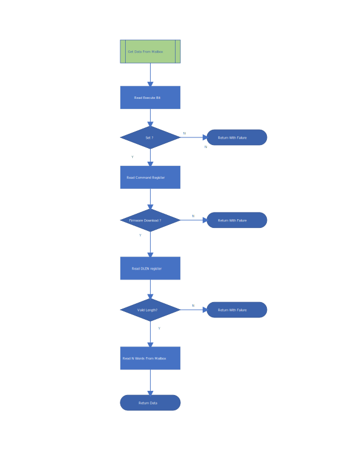

Following is the sequence of steps that are performed to download the firmware image into the mailbox in SUBSYSTEM mode.

ROM supports two commands for firmware download in SUBSYSTEM mode:
- **RI_DOWNLOAD_FIRMWARE** (Command Code: `0x5249_4644` / "RIFD"): Standard firmware download. After downloading and validating the firmware, the runtime will activate the MCU firmware immediately.
- **RI_DOWNLOAD_ENCRYPTED_FIRMWARE** (Command Code: `0x5249_4645` / "RIFE"): Encrypted firmware download. Sets the boot mode to `EncryptedFirmware`, which signals to the runtime that the MCU firmware is encrypted and should not be activated until it has been decrypted using the `CM_AES_GCM_DECRYPT_DMA` command.

1. On receiving the RI_DOWNLOAD_FIRMWARE or RI_DOWNLOAD_ENCRYPTED_FIRMWARE mailbox command, set the RI PROT_CAP2 register version to 1.1 and the `Agent Capability` field bits:
    - `Device ID`
    - `Device Status`
    - `Push C-image support`
    - `Flashless boot`
    - `FIFO CMS support`
2. Set the RI DEVICE_STATUS_0 register, `Device Status` field  to 0x3 ('Recovery mode - ready to accept recovery image') and
`Recovery Reason Code` field to 0x12 ('Flashless/Streaming Boot (FSB)').
3. Set the RI RECOVERY_STATUS register, `Device Recovery Status` field to 0x1 ('Awaiting recovery image') and `Recovery Image Index` field to 0 (Firmware Image).
4. Loop on the `payload_available` bit in the `DMA Status0` register for the firmware image info to be available.
5. Read the image size from RI INDIRECT_FIFO_CTRL_1 register. Image size is in DWORDs.
6. Initiate image download from the recovery interface to the mailbox sram:
  a. Write the payload length to the DMA widget 'Byte Count' register.
  b. Write the block size with a value of 256 to the DMA widget 'Block Size' register.
  c. Write the source address to the DMA widget 'Source Address - Low' and 'Source Address - High' registers.
  d. Acquire the mailbox lock.
  e. Write DMA widget 'Control' register.
    - Set `Read Route` bits to 0x1 (AXI RD -> Mailbox)
    - Set `Read Addr fixed` bit.
    - Set Bit0 (GO)
  f. Read DMA widget `Status0` register in a loop if `Busy' bit is 0.
  g. Image is downloaded into mailbox sram.
7. Set RI `DEVICE_STATUS` register, `Device Status` field to 0x4 (`Recovery Pending (waiting for activation)`)
8. Loop on RI `RECOVERY_CTRL` register `Activate Recovery Image` field to wait for processing the image.
9. Set RI `RECOVERY_STATUS` register `Device Recovery Status` field to 0x2 (`Booting recovery image`).
10. Validate the image per the [Image Validation Process](#firmware-image-validation-process).
11. Reset the `RECOVERY_CTRL` register `Activate Recovery Image` field by writing 0x1.
12. If the validation is succesful, set the `DEVICE_STATUS` register `Device Status` field to 0x5 (`Running Recovery Image ( Recover Reason Code not populated)`)
13. If the validation fails, set the `RECOVERY_STATUS` register `Device Recovery Status` field to 0xc (`Recovery failed`) and `DEVICE_STATUS` register `Device Status` field to 0xF (`Fatal Error (Recover Reason Code not populated)`).
14. Release the mailbox lock.

#### Image validation

See Firmware [Image Validation Process](#firmware-image-validation-process).

### Derivation of the key ladder for Stable Identity

Stable Identity calls for a secret that remains stable across firmware updates, but which can ratchet forward when major firmware vulnerabilities are fixed. Caliptra ROM implements this feature in terms of a "key ladder".

The key ladder is initialized from the LDevID CDI during cold-boot. The key ladder length is inversely related to the firmware's SVN. Each step of the ladder is an SVN-unique key. The key for SVN X can be obtained by applying a one-way cryptographic operation to the key for SVN X+1. In this manner, firmware with a given SVN can wield keys bound to its SVN or older, but cannot wield keys bound to newer SVNs.

To comply with FIPS, the one-way cryptographic operation used to compute keys is an SP 800-108 KDF.

When the key ladder is initialized at cold-boot, it is bound to the lifecycle state and debug-locked. This ensures that the keys of the ladder will change across lifecycle or debug state transtions.

Across update-resets, ROM tracks the minimum SVN that has run since cold-boot. It ensures that the ladder's length always corresponds to that minimum SVN. The key ladder can only be shortened (and thereby give access to newer SVNs' keys) by cold-booting into firmware with a newer SVN and re-initializing the ladder.

#### Cold-boot

ROM initializes a key ladder for the firmware. LDevID CDI in Key Vault Slot6 is used as an HMAC Key, and the data is a fixed string. The resultant MAC is stored in Slot 2.

    KeyLadderContext = lifecycle state || debug_locked state

    hmac512_kdf(KvSlot6, label: b"si_init", context: KeyLadderContext, KvSlot2)

    Loop (MAX_FIRMWARE_SVN - (current firmware SVN)) times:

        hmac512_kdf(KvSlot2, label: b"si_extend", context: None, KvSlot2)

#### Update-reset

During update-reset, the key ladder initialized at cold boot is lengthened if necessary, such that its length always corresponds with the minimum SVN since cold boot.

    old_min_svn = [retrieved from data vault]
    new_min_svn = min(old_min_svn, new_fw_svn)
    [store new_min_svn in data vault]

    Loop (`old_min_svn` - `new_min_svn`) times:

        hmac512_kdf(KvSlot2, label: b"si_extend", context: None, KvSlot2)

### Alias FMC DICE layer & PCR extension

Alias FMC Layer includes the measurement of the FMC and other security states. This layer is used to assert a composite identity which includes the security state, FMC measurement along with the previous layer identities.

**Pre-conditions:**

- LDevID CDI is stored in Key Vault Slot 6
- LDevID MLDSA Key Pair Seed is stored in Key Vault Slot 4
- LDevID ECDSA Private Key is stored in Key Vault Slot 5
- Firmware Image Bundle is successfully loaded and verified from the Mailbox
- ROM has following information from Firmware Image Bundle
- FMC_DIGEST - Digest of the FMC
- FW_SVN - SVN for the firmware
- MANUFACTURER_PK - Manufacturer Public Key(s) used to verify the firmware image bundle
- MANUFACTURER_PK_INDEX - Index of the MANUFACTURER_PK in the firmware image bundle

**Actions:**

1. PCR0 is the Current PCR. PCR 1 is the Journey PCR. PCR0 is cleared by ROM upon each cold and update resets, before it is extended with FMC measurements. PCR0 and PCR1 are locked for clear by the ROM on every reset. Subsequent layers may continue to extend PCR0 as runtime updates are performed.

    ```text
    pcr_clear(Pcr0)
    pcr_extend(Pcr0 && Pcr1, [
        CPTRA_SECURITY_STATE.LIFECYCLE_STATE,
        CPTRA_SECURITY_STATE.DEBUG_ENABLED,
        FUSE_ANTI_ROLLBACK_DISABLE,
        VENDOR_ECC_PK_INDEX,
        FW_SVN,
        FW_FUSE_SVN (or 0 if `FUSE_ANTI_ROLLBACK_DISABLE`),
        VENDOR_PQC_PK_INDEX,
        PQC_KEY_TYPE,
        OWNER_PK_HASH_FROM_FUSES (0 or 1),
    ])
    pcr_extend(Pcr0 && Pcr1, MANUFACTURER_PK)
    pcr_extend(Pcr0 && Pcr1, OWNER_PK)
    pcr_extend(Pcr0 && Pcr1, FMC_TCI)
    pcr_lock_clear(Pcr0 && Pcr1)
    ```

2. CDI for Alias is derived from PCR0. For the Alias FMC CDI Derivation, LDevID CDI in Key Vault Slot6 is used as HMAC Key and contents of PCR0 are used as data. The resultant MAC is stored back in Slot 6.

    `Pcr0Measurement = pcr_read(Pcr0)`

    `hmac512_kdf(KvSlot6, label: b"alias_fmc_cdi", context: Pcr0Measurement, KvSlot6)`

3. Derive Alias FMC ECDSA Key Pair using CDI in Key Vault Slot 6 and store the generated private key in Key Vault Slot 7.

    `AliasFmcSeedEcdsa = hmac512_kdf(KvSlot6, b"fmc_alias_ecc_key", KvSlot3)`

    `AliasFmcPubKeyEcdsa = ecc384_keygen(KvSlot3, KvSlot7)`

    `kv_clear(KvSlot3)`

    Derive the Alias FMC MLDSA Key Pair using CDI in Key Vault Slot 6 and store the key pair generation seed in Key Vault Slot 8.

    `AliasFmcSeedMldsa = hmac512_kdf(KvSlot6, b"fmc_alias_mldsa_key", KvSlot8)`

    `AliasFmcPubKeyMldsa = mldsa87_keygen(KvSlot8)`

4. Store and lock (for write) the FMC ECDSA and MLDSA Public Keys in the DCCM datavault.

5. Generate the `To Be Signed` DER Blob of the ECDSA Alias FMC Certificate.

    `AliasFmcTbsEcdsa = gen_cert_tbs(ALIAS_FMC_CERT, LDevIdPubKeyEcdsa, AliasFmcPubKeyEcdsa)`

6. Sign the Alias FMC `To Be Signed` DER Blob with the LDevId ECDSA Private Key in Key Vault Slot 5.

    `AliasFmcTbsDigestEcdsa = sha384_digest(AliasFmcTbsEcdsa)`

    `AliasFmcTbsCertSigEcdsa = ecc384_sign(KvSlot5, AliasFmcTbsDigestEcdsa)`

7. Clear the LDevId Private Key in Key Vault Slot 5.

    `kv_clear(KvSlot5)`

8. Verify the signature of Alias FMC `To Be Signed` ECDSA Blob.

    `Result = ecc384_verify(LDevIdPubKeyEcdsa, AliasFmcDigestEcdsa, AliasFmcTbsCertSigEcdsa)`

9. Generate the `To Be Signed` DER Blob of the MLDSA Alias FMC Certificate.

    `AliasFmcTbsMldsa = gen_cert_tbs(ALIAS_FMC_CERT, LDevIdPubKeyMldsa, AliasFmcPubKeyMldsa)`

10. Sign the Alias FMC `To Be Signed` DER Blob with the LDevId MLDSA Private Key generated from the seed in Key Vault Slot 4.

    `AliasFmcTbsDigestMldsa = sha512_digest(AliasFmcTbsMldsa)`

    `AliasFmcTbsCertSigMldsa = mldsa87_sign(KvSlot4, AliasFmcTbsDigestMldsa)`

11. Clear the LDevId MLDSA key generation seed in Key Vault Slot 4.

    `kv_clear(KvSlot4)`

12. Verify the signature of Alias FMC `To Be Signed` MLDSA Blob.

    `Result = mldsa87_verify(LDevIdPubKeyMldsa, AliasFmcDigestMldsa, AliasFmcTbsCertSigMldsa)`

13. Store and lock (for write) the Alias FMC Certificate ECDSA and MLDSA Signatures in the DCCM datavault.

14. Lock critical state needed for warm and update reset in the DCCM datavault.

    `dccm_dv_store(FMC_DIGEST, lock_for_wr)`

    `dccm_dv_store(FW_SVN, lock_for_wr)`

    `dccm_dv_store(FUSE_OWNER_PK_HASH, lock_for_wr)`

    `dccm_dv_store(MANUFACTURER_ECC_PK_INDEX, lock_for_wr)`

    `dccm_dv_store(MANUFACTURER_PQC_PK_INDEX, lock_for_wr)`

    `dccm_dv_store(ROM_COLD_BOOT_STATUS, lock_for_wr)`

    **Note**: A value of 0x140 is stored on a successful cold boot.

**Post-conditions:**

- Vault state as follows:

 | Slot | Key Vault                                     |
 |------|-----------------------------------------------|
 | 0    | Stable identity root IDevID secret (64 bytes) |
 | 1    | Stable identity root LDevID secret (64 bytes) |
 | 6    | Alias FMC CDI (48 bytes)                      |
 | 7    | Alias FMC Private Key - ECDSA (48 bytes)      |
 | 8    | Alias FMC Key Pair Seed - MLDSA (32 bytes)    |

 | DCCM datavault                         |
 |----------------------------------------|
 | 🔒IDevID Cert ECDSA Signature         |
 | 🔒IDevID ECDSA Pub Key                |
 | 🔒IDevID Cert MLDSA Signature         |
 | 🔒IDevID MLDSA Pub Key                |
 | 🔒LDevID Cert ECDSA Signature R       |
 | 🔒LDevID Cert ECDSA Signature S       |
 | 🔒LDevID Cert MLDSA Signature         |
 | 🔒LDevID Pub Key ECDSA X              |
 | 🔒LDevID Pub Key ECDSA Y              |
 | 🔒LDevID Pub Key MLDSA                |
 | 🔒Alias FMC Cert ECDSA Signature R    |
 | 🔒Alias FMC Cert ECDSA Signature S    |
 | 🔒Alias FMC Cert MLDSA Signature      |
 | 🔒FW SVN                              |
 | 🔒ROM Cold Boot Status                |
 | 🔒FMC Entry Point                     |
 | 🔒Manufacturer ECDSA Public Key Index |
 | 🔒Manufacturer PQC Public Key Index   |
 | 🔒Alias FMC ECDSA Pub Key X           |
 | 🔒Alias FMC ECDSA Pub Key Y           |
 | 🔒Alias FMC MLDSA Pub Key             |
 | 🔒FMC Digest                          |
 | 🔒Owner PK Hash                       |

### Locking of memory regions and registers
 ROM locks the following entities to prevent any updates:

 - **Cold Reset Unlockable values:**
 These values are unlocked on a Cold Reset:
    - FMC TCI
    - FMC Entry Point
    - Owner Pub Key Hash
    - Ecc Vendor Pub Key Index
    - PQC Vendor Pub Key Index
    - ROM Cold Boot Status

 - **Warm Reset unlockable values:**
 These values are unlocked on a Warm or Cold Reset:
    - RT TCI
    - RT Entry Point
    - FW SVN
    - Manifest Addr
    - ROM Update Reset Status

 - **PCR values**
    - FMC_CURRENT
    - FMC_JOURNEY
    - STASH_MEASUREMENT

 - **ICCM**

### Launch FMC
The ROM initializes and populates the Firmware Handoff Table (FHT) to relay essential parameters to the FMC. The format of the FHT is documented [here](https://github.com/chipsalliance/caliptra-sw/blob/main/fmc/README.md#firmware-handoff-table). Upon successful population, the ROM transfers execution control to the FMC.

## Warm reset flow
ROM does not perform any DICE derivations or firmware validation during warm reset.


### Initialization
ROM performs the same initialization sequence as specified [here](#Initialization)

### Locking of memory regions and registers
ROM locks the following entities to prevent any updates:

 - **Warm Reset unlockable values:**
    - RT TCI
    - RT Entry Point
    - FW SVN
    - Manifest Addr
    - ROM Update Reset Status

 - **PCR values**
    - FMC_CURRENT
    - FMC_JOURNEY
    - STASH_MEASUREMENT

 - **ICCM**

## Update reset flow

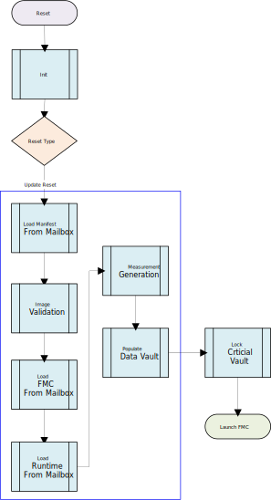
<br> *(Note: Please note that Image validation for the update reset flow has some differences as compared to the cold boot flow. Please refer to the Image Validation Section for further details.)

## Unknown/spurious reset flow

### Initialization
ROM performs the same initialization sequence as specified [here](#Initialization)

### Error handling
The ROM executes the following operations:
  - Updates the `cptra_fw_error_fatal` and `cptra_fw_error_non_fatal` registers with the error code ROM_UNKNOWN_RESET_FLOW (0x01040020) error code.
  - Zeroizes the following cryptographic hardware modules:
    - Ecc384
    - Hmac384
    - Sha256
    - Sha384
    - Sha2-512-384Acc
    - KeyVault
  - Stops the WatchDog Timer.
  - Enters an infinite loop, awaiting a reset.
<br><br>

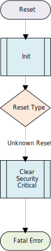

## Firmware image validation process

The basic flow for validating the firmware involves the following:

- Validating the manufacturer key descriptors in the preamble.
- Validating the active manufacturer keys with the corresponding hash in the key descriptors.
- Validating the owner key descriptors in the preamble.
- Validating the owner keys with the hash in the key descriptors.
- Validating the active manufacturer keys against the key revocation fuses.
- Validating the Manifest Header using the active manufacturer keys against the manufacturer signatures.
- Validating the Manifest Header using the owner keys against the owner signatures.
- On the completion of these validations, it is assured that the header portion is authentic.
- Loading the FMC and Rutime (RT) TOC entries from the mailbox.
- Validating the TOCs against the TOC hash in the header.
- On successful validation, it is assured that the TOCs are valid. The next step is to use the Hash entry in the TOCs to validate the image sections.
- Downloading the FMC Image portion of the firmware Image.
- Validating the FMC Image against the hash in the TOC entry for the FMC.
  - If this is a cold reset, the FMC version number should be stored in a register.
- Downloading the RT Image part of the firmware Image.
- Validating the RT Image against the hash in the TOC entry for the RT.
- On the successful completion of these validations, the entire image is validated.
- Indicating to the SOC of validation success by completing the mailbox command.
- On validation failure, reporting the appropriate error in the `CPTRA_FW_ERROR_FATAL` register and invoking the [error handler](#Error-handling)

### **Overall validation flow**

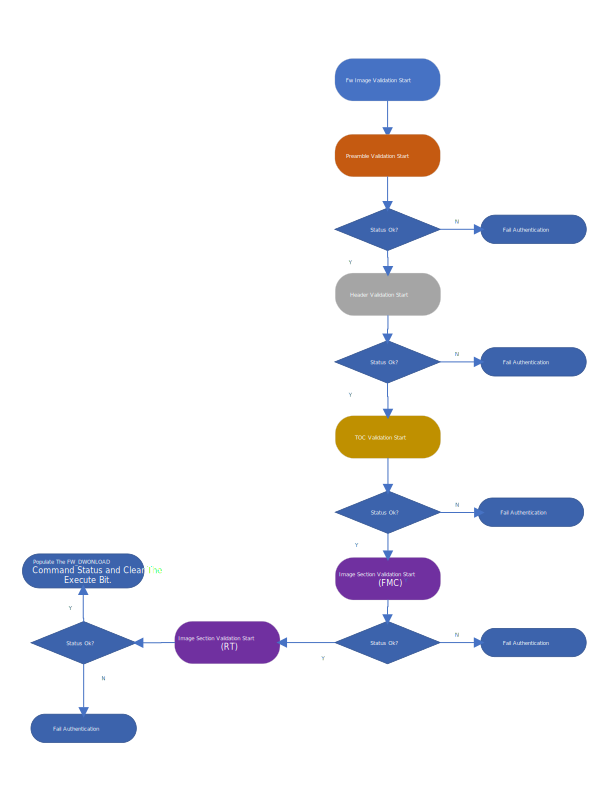

#### **Pre-conditions**

The following are the pre-conditions that should be satisfied:

- Caliptra has transitioned through the BOOTFSM and all the fuses that are required for the validation are already populated by SOC.
- The FUSES programmed by the soc are
  - fuse_vendor_pk_hash : This fuse contains the hash of the manufacturer key descriptors present in the preamble.
  - fuse_ecc_revocation : This is the bitmask of the ECC keys which are revoked.
  - fuse_lms_revocation : This is the bitmask of the LMS keys which are revoked.
  - fuse_mldsa_revocation : This is the bitmask of the MLDSA keys which are revoked.
  - fuse_owner_pk_hash : The hash of the owner public keys in preamble.
  - fuse_firmware_svn : Used in FW validation to make sure that the firmware image's SVN is good.
  - fuse_pqc_key_type: This bitmask specifies the enabled PQC key type for firmware validation, indicating either MLDSA or LMS.
- The SOC has written the data to the mailbox.
- The SOC has written the data length in the DLEN mailbox register.
- The SOC has put the FW_DOWNLOAD command in the command register.
- The SOC has set the execute bit in the mailbox execute register.
<br> *( NOTE: At this time the interrupts are not enabled. Writing a execute bit will not generate an interrupt. The validation and update flow will need to be invoked externally.)*

## Preamble validation: Validate the manufacturing keys

- Load the preamble bytes from the mailbox.
- Based on the firmware image type, the image includes an ECC key descriptor and either an LMS or MLDSA key descriptor within the preamble. The ECC descriptor encapsulates up to four ECC public key hashes, the LMS descriptor up to 32 public key hashes, and the MLDSA descriptor up to four MLDSA public key hashes.
- The firmware image, depending on its type, incorporates an ECC key and either an LMS or MLDSA manufacturing public key within the preamble. These constitute the active public keys.
- The fuse_vendor_pk_hash fuse holds the SHA2-384 hash of the ECC, and LMS or MLDSA manufacturing key descriptors.
- The key descriptors are validated by generating a SHA2-384 hash of the ECC and LMS or MLDSA key descriptors and comparing it against the hash stored in the fuse. If the hashes do not match, the image validation fails.
- Upon a successful hash match, the ECC, and LMS or MLDSA key descriptors are deemed valid.
- Subsequently, the active manufacturer public keys are validated against one of the hashes in the key descriptors. The specific hash for comparison is identified by the active key indices.

### Preamble validation: Manufacturing key validation

- fuse_ecc_revocation serves as the bitmask for revoking ECC keys.
  - If bit-n is set, the nth key is disabled. All other bits that are zeros indicate the keys are still enabled.
  - If all the bits are zeros, all ECC keys remain enabled.
- Ensure that the Active Key Index in the preamble is not disabled by the fuse_ecc_revocation fuse.
  - If the key is disabled, the validation process fails.
  - **Note: The last key index is never revoked, regardless of the fuse value.**
- Repeat the above procedure for LMS or MLDSA keys using the fuse_lms_revocation or fuse_mldsa_revocation fuses, respectively, for key revocation. The last key index for PQC keys is also never revoked.

### Preamble validation: Validate the Owner key

- The preamble includes a designated slot for the owner ECC key and a slot for either LMS or MLDSA keys.
- The fuse_owner_pk_hash contains the hash of the owner public keys.
- The validation process for owner public keys involves generating a SHA2-384 hash from the owner public keys within the preamble and comparing it to the hash stored in the fuse_owner_pk_hash register.
- If the computed hash matches the value in fuse_owner_pk_hash, the owner public keys are deemed valid.
- If there is a hash mismatch, the image validation process fails.

### Public key hash byte ordering (dword reversal)

**Important:** Hashes and ECC key coordinates stored in the firmware manifest and fuse registers use
a **reversed-dword format** rather than the standard byte order defined by the SHA specification.

In standard byte order, a SHA2-384 hash is a sequence of 48 bytes exactly as output by tools like
OpenSSL or Python's `hashlib`. In reversed-dword format, the same 48 bytes are grouped into 12
four-byte words (dwords) and the bytes within each dword are reversed.

For example, if the standard SHA2-384 hash begins with `b1 7c a8 77 66 66 57 cc d1 00 e6 92 ...`:

| Standard byte order  | → | Reversed-dword format |
|----------------------|---|-----------------------|
| `b1 7c a8 77`        |   | `77 a8 7c b1`         |
| `66 66 57 cc`        |   | `cc 57 66 66`         |
| `d1 00 e6 92`        |   | `92 e6 00 d1`         |
| ...                   |   | ...                   |

This reversed-dword format applies to:
- **Individual public key hashes** in the ECC and PQC key descriptors within the preamble
- **FUSE_VENDOR_PK_HASH** and **CPTRA_OWNER_PK_HASH** fuse/register values (which are `[u32; 12]` arrays)
- **ECC public key coordinates** (X and Y), which are stored as `[u32; 12]` arrays in the preamble

Note: LMS public key fields (`tree_type`, `otstype`, `id`, `digest`) follow the LMS specification
encoding and are **not** subject to dword reversal. MLDSA public keys are stored as raw byte arrays
and are also **not** subject to dword reversal.

For a detailed description of byte ordering conventions for all mailbox cryptographic fields
(including ECC, ML-DSA, and SHA digest fields with OpenSSL examples), see the
[Byte order of cryptographic fields](../../runtime/README.md#byte-order-of-cryptographic-fields)
section in the Runtime README.

### Computing public key hashes: step-by-step example

The following example walks through the computation of the **vendor PK descriptor hash**
using the test public keys from `image/fake-keys/src/lib.rs` with PQC key type **LMS (type 3)**.

#### Step 1: Hash each vendor ECC public key

Each ECC-384 public key has X and Y coordinates, each stored as `[u32; 12]`. To hash a key,
serialize the struct to 96 bytes by writing each `u32` word in reversed-dword format, then
compute SHA2-384 of those 96 bytes.

**ECC Key 0:**
```
X (standard byte order): c69fe67f 97ea3e42 21a7a603 6c2e070d 1657327b c3f1e7c1
                          8dccb9e4 ffda5c3f 4db0a1c0 567e0973 17bf4484 39696a07
Y (standard byte order): c126b913 5fc82572 8f1cd403 19109430 994fe3e8 74a8b026
                          be14794d 27789964 7735fde8 328afd84 cd4d4aa8 72d40b42

X (reversed-dword):      7fe69fc6 423eea97 03a6a721 0d072e6c 7b325716 c1e7f1c3
                          e4b9cc8d 3f5cdaff c0a1b04d 73097e56 8444bf17 076a6939
Y (reversed-dword):      13b926c1 7225c85f 03d41c8f 30941019 e8e34f99 26b0a874
                          4d7914be 64997827 e8fd3577 84fd8a32 a84a4dcd 420bd472

Input to SHA384 = X_reversed || Y_reversed (96 bytes)
SHA384 (standard):       84facd34 227de869 1fbb7d33 49306e0f 250a3659 53a6cc6b
                          629d4616 32f73cfd 768152bb 8a03a255 5a1b1f1f c3923faa
SHA384 (reversed-dword): 34cdfa84 69e87d22 337dbb1f 0f6e3049 59360a25 6bcca653
                          16469d62 fd3cf732 bb528176 55a2038a 1f1f1b5a aa3f92c3
```

**ECC Key 1:**
```
X (standard): a6309750 f0a05ddb 956a7f86 2812ec4f ec454e95 3b53dbfb
              9eb54140 15ea7507 084af93c b7fa33fe 51811ad5 e754232e
Y (standard): ef5a5987 7a0ce0be 2621d2a9 8bf3c5df af7b3d6d 97f24183
              a4a42038 58c39b86 272ef548 e572b937 1ecf1994 1b8d4ea7

SHA384 (standard):       fe89195f 7fab8ebb 2818d935 837493c2 378525ef 686ed220
                          09b9a399 f23f1f42 2f5ae1f3 ba1c3083 1a68a456 9c01fc96
SHA384 (reversed-dword): 5f1989fe bb8eab7f 35d91828 c2937483 ef258537 20d26e68
                          99a3b909 421f3ff2 f3e15a2f 83301cba 56a4681a 96fc019c
```

**ECC Key 2:**
```
X (standard): a0d25693 c4251e48 185615b0 a6c27f6d e62c39f5 a9a32f75
              9553226a 4d1926c1 7928910f b7adc1b6 89996733 10134881
Y (standard): bbdf72d7 07c08100 d54fcdad b1567bb0 0522762b 76b8dc4a
              846c175a 3fbd0501 9bdc8118 4be5f33c bb21b41d 93a8c523

SHA384 (standard):       f397ba45 b5801ddf b732078d ffdf792f b584a73f b055acaf
                          ef39f31d 5b88c7d5 2753a45a 0c76b098 90d8e335 7be87f26
SHA384 (reversed-dword): 45ba97f3 df1d80b5 8d0732b7 2f79dfff 3fa784b5 afac55b0
                          1df339ef d5c7885b 5aa45327 98b0760c 35e3d890 267fe87b
```

**ECC Key 3:**
```
X (standard): 002a82b6 8e03e9a0 fd3b4c14 ca2cb3e8 14350a71 0e43956d
              21694fb4 f34485e8 f0e33583 f7ea142d 50e16f8b 0225bb95
Y (standard): 5802641c 7c45a4a2 408e03a6 a4100a92 50fcc468 d238cd0d
              449cc3e5 1abc25e7 0b05c426 843dcd6f 944ef6ff fa53ec5b

SHA384 (standard):       8ba8acb6 b98da9dc 8ffce0bc eba86454 4acbbd6e 3f31466e
                          5d532565 0bfc9e3b c8afb2b5 c33e20f5 06992143 83f33bc1
SHA384 (reversed-dword): b6aca88b dca98db9 bce0fc8f 5464a8eb 6ebdcb4a 6e46313f
                          6525535d 3b9efc0b b5b2afc8 f5203ec3 43219906 c13bf383
```

#### Step 2: Hash each vendor LMS public key

Each LMS public key is a 48-byte struct: `tree_type` (u32), `otstype` (u32), `id` (16 bytes),
`digest` (24 bytes). The binary serialization is hashed directly.

**LMS Key 0:**
```
tree_type=0x0000000c, otstype=0x00000007
id:     4908a17b cadb1829 1e289058 d5a8e3e8
digest: 64ad3eb8 be6864f1 7ccda38b de35edaa 6c0da527 645407c6

Serialized (48 bytes): 0000000c 00000007 4908a17b cadb1829 1e289058 d5a8e3e8
                        64ad3eb8 be6864f1 7ccda38b de35edaa 6c0da527 645407c6
SHA384 (standard):       fc2c1b6f 56f732d1 fd876f3f ef757cbb a2b1c64b cc148298
                          d7508262 4bdf27cb 23d6b5b6 7169c46f 50b7fc19 92068fec
SHA384 (reversed-dword): 6f1b2cfc d132f756 3f6f87fd bb7c75ef 4bc6b1a2 988214cc
                          628250d7 cb27df4b b6b5d623 6fc46971 19fcb750 ec8f0692
```

**LMS Key 1:**
```
tree_type=0x0000000c, otstype=0x00000007
id:     7cb5369d 64e4281d 046e977c 70d4d0a3
digest: 8ea4701d adf7d700 0564b7d6 1d1c9587 9dd6475c 9c3aae0b

SHA384 (standard):       7b5811fd 8d2b0cf8 9851f12d d2a7c239 f4f3abc5 d928dcc0
                          3b4b891d abbdc67f c7b88436 432e1544 a408bc9c bb503f6b
SHA384 (reversed-dword): fd11587b f80c2b8d 2df15198 39c2a7d2 c5abf3f4 c0dc28d9
                          1d894b3b 7fc6bdab 3684b8c7 44152e43 9cbc08a4 6b3f50bb
```

**LMS Key 2:**
```
tree_type=0x0000000c, otstype=0x00000007
id:     2bbb4b72 c5b41e05 d2fabe76 f41704bd
digest: dcb53f96 24d4c7b3 c9ae4d4c 0e41e08e 3b159396 0fe6a277

SHA384 (standard):       7e08a494 6933d35a 42c0d7b0 0236b10b db14c100 3f82f6a9
                          7d401cb8 e420a7fa 5aab12b3 c4e96bec 49aec770 225a8f88
SHA384 (reversed-dword): 94a4087e 5ad33369 b0d7c042 0bb13602 00c114db a9f6823f
                          b81c407d faa720e4 b312ab5a ec6be9c4 70c7ae49 888f5a22
```

**LMS Key 3:**
```
tree_type=0x0000000c, otstype=0x00000007
id:     42cba2e5 575b5235 7ea7aead ef54074c
digest: 5aa60e27 69251599 3ae8e21f 27ccdded 8ffcd3d2 8efbdec2

SHA384 (standard):       d3734fbc ee2893a3 b1b6519b 6ec78fb8 d7425327 cde1f7aa
                          23012c64 c635219f d4ab1c4d 1b023252 00042884 2e463dbb
SHA384 (reversed-dword): bc4f73d3 a39328ee 9b51b6b1 b88fc76e 275342d7 aaf7e1cd
                          642c0123 9f2135c6 4d1cabd4 5232021b 84280400 bb3d462e
```

#### Step 3: Build the ECC key descriptor (196 bytes)

Concatenate the 4-byte header with the 4 key hashes (each in reversed-dword format):

```
Header (4 bytes): 01 00 00 04     (version=1, reserved=0, key_hash_count=4)
ECC key 0 hash (48 bytes, reversed-dword): 34cdfa84 69e87d22 ... aa3f92c3
ECC key 1 hash (48 bytes, reversed-dword): 5f1989fe bb8eab7f ... 96fc019c
ECC key 2 hash (48 bytes, reversed-dword): 45ba97f3 df1d80b5 ... 267fe87b
ECC key 3 hash (48 bytes, reversed-dword): b6aca88b dca98db9 ... c13bf383

Total: 4 + (4 × 48) = 196 bytes
```

#### Step 4: Build the PQC (LMS) key descriptor (1540 bytes)

```
Header (4 bytes): 01 00 03 20     (version=1, key_type=3=LMS, key_hash_count=32)
LMS key 0 hash (48 bytes, reversed-dword): 6f1b2cfc d132f756 ... ec8f0692
LMS key 1 hash (48 bytes, reversed-dword): fd11587b f80c2b8d ... 6b3f50bb
LMS key 2 hash (48 bytes, reversed-dword): 94a4087e 5ad33369 ... 888f5a22
LMS key 3 hash (48 bytes, reversed-dword): bc4f73d3 a39328ee ... bb3d462e
  ... (keys 0-3 repeated 8 times to fill all 32 slots)

Total: 4 + (32 × 48) = 1540 bytes
```

#### Step 5: Compute the vendor PK descriptor hash

```
Input = ECC descriptor (196 bytes) || PQC descriptor (1540 bytes) = 1736 bytes

SHA384 (standard byte order):
  b17ca877 666657cc d100e692 6c7206b6 0c995cb6 8992c6c9
  baefce72 8af05441 dee1ff41 5adfc187 e1e4edb4 d3b2d909

As [u32; 12] fuse register value:
  [0xb17ca877, 0x666657cc, 0xd100e692, 0x6c7206b6,
   0x0c995cb6, 0x8992c6c9, 0xbaefce72, 0x8af05441,
   0xdee1ff41, 0x5adfc187, 0xe1e4edb4, 0xd3b2d909]
```

### Computing public key hashes: MLDSA step-by-step example

The following example walks through the same computation as the LMS example above, but
using PQC key type **MLDSA (type 1)** with the test keys from `image/fake-keys/src/lib.rs`.

#### MLDSA Step 1: Hash each vendor ECC public key

The ECC keys and their hashes are identical to the LMS example — see
[Step 1 above](#step-1-hash-each-vendor-ecc-public-key). The ECC key descriptor is
independent of the PQC key type.

#### MLDSA Step 2: Hash each vendor MLDSA public key

Each MLDSA-87 public key is a 2592-byte array (`[u32; 648]`). When serialized via
`as_bytes()`, each `u32` word is written in little-endian byte order — for example, the
Rust value `0x3bf1c072` becomes bytes `72 c0 f1 3b` in memory. Unlike LMS keys, MLDSA
keys are not subject to any additional encoding — these raw bytes are hashed directly
with SHA2-384.

**MLDSA Key 0:**
```
Size: 2592 bytes (648 u32 words)
First 24 bytes: 72c0f13b 7d937e22 69b6988d 6daadc3a e78acd11 940cfc0d ...

SHA384 (standard):       f1097978 0adae470 dcd4eeb8 5749a2e4 2e70c055 ebac46e4
                          07c2c404 b46473d8 189117ed 8c83dde4 9f941e6a 1b6c6d4c
SHA384 (reversed-dword): 787909f1 70e4da0a b8eed4dc e4a24957 55c0702e e446aceb
                          04c4c207 d87364b4 ed179118 e4dd838c 6a1e949f 4c6d6c1b
```

**MLDSA Key 1:**
```
Size: 2592 bytes (648 u32 words)
First 24 bytes: f432346c 096d0ec9 04f8d925 1512236b e3fd1ccb bda9ed3a ...

SHA384 (standard):       a57b6f71 ffab9844 de49e9f7 ad61476b 7446e140 517d07b1
                          81447acb a6d7166f 7b89f199 b6e36174 2d0ab01c 540d26de
SHA384 (reversed-dword): 716f7ba5 4498abff f7e949de 6b4761ad 40e14674 b1077d51
                          cb7a4481 6f16d7a6 99f1897b 7461e3b6 1cb00a2d de260d54
```

**MLDSA Key 2:**
```
Size: 2592 bytes (648 u32 words)
First 24 bytes: 2bc91a00 7d3e5a4f e6b3f2ec cb1aaa0d 278d9786 44b25fed ...

SHA384 (standard):       7f2f3c55 e8dd2481 bbee17c1 5d5773a8 01a9c0a6 84b30e47
                          0ae67ecd 1ec3e7ac 19273c71 feb6bb99 10d26dd0 4ace4298
SHA384 (reversed-dword): 553c2f7f 8124dde8 c117eebb a873575d a6c0a901 470eb384
                          cd7ee60a ace7c31e 713c2719 99bbb6fe d06dd210 9842ce4a
```

**MLDSA Key 3:**
```
Size: 2592 bytes (648 u32 words)
First 24 bytes: 378dcb02 a6db3481 d51e9913 14da1567 a211290e f4c3d02f ...

SHA384 (standard):       79fbeb0a 6ebc354b ccf48dd1 5b6c9142 a62af0c5 198c0de1
                          365fbcb0 b2463ee5 103ccae3 4504ab83 04b37886 5c9a28ae
SHA384 (reversed-dword): 0aebfb79 4b35bc6e d18df4cc 42916c5b c5f02aa6 e10d8c19
                          b0bc5f36 e53e46b2 e3ca3c10 83ab0445 8678b304 ae289a5c
```

#### MLDSA Step 3: Build the ECC key descriptor (196 bytes)

Same as the LMS example — the ECC descriptor is independent of PQC key type. See
[Step 3 above](#step-3-build-the-ecc-key-descriptor-196-bytes).

#### MLDSA Step 4: Build the PQC (MLDSA) key descriptor (1540 bytes)

The PQC key descriptor struct always has 32 hash slots (`VENDOR_PQC_MAX_KEY_COUNT`).
For MLDSA, only 4 keys are populated; the remaining 28 slots are zero-filled.

```
Header (4 bytes): 01 00 01 04     (version=1, key_type=1=MLDSA, key_hash_count=4)
MLDSA key 0 hash (48 bytes, reversed-dword): 787909f1 70e4da0a ... 4c6d6c1b
MLDSA key 1 hash (48 bytes, reversed-dword): 716f7ba5 4498abff ... de260d54
MLDSA key 2 hash (48 bytes, reversed-dword): 553c2f7f 8124dde8 ... 9842ce4a
MLDSA key 3 hash (48 bytes, reversed-dword): 0aebfb79 4b35bc6e ... ae289a5c
  ... (keys 4-31 are zero-filled)

Total: 4 + (32 × 48) = 1540 bytes
```

#### MLDSA Step 5: Compute the vendor PK descriptor hash

```
Input = ECC descriptor (196 bytes) || PQC descriptor (1540 bytes) = 1736 bytes

SHA384 (standard byte order):
  30399676 a17e3e97 3677b3ff 862f4bf2 d1932d88 4778453c
  376fe00d c93fb8aa 0770f3eb f3411a08 53e9c57e ce8a2980

As [u32; 12] fuse register value:
  [0x30399676, 0xa17e3e97, 0x3677b3ff, 0x862f4bf2,
   0xd1932d88, 0x4778453c, 0x376fe00d, 0xc93fb8aa,
   0x0770f3eb, 0xf3411a08, 0x53e9c57e, 0xce8a2980]
```

#### Owner PK hash

The owner PK hash is SHA2-384 over the serialized `ImageOwnerPubKeys` struct, which contains:
- `ecc_pub_key`: `{ x: [u32; 12], y: [u32; 12] }` — 96 bytes (in reversed-dword format)
- `pqc_pub_key`: raw byte array of 2592 bytes (for LMS, only the first 48 bytes are meaningful;
   the rest are zero-padded)

Total: 2688 bytes. The SHA2-384 of these bytes is the owner PK hash.

#### Summary of expected hash values using test keys

Using the test keys from `image/fake-keys/src/lib.rs`:

| Hash | PQC Type | Standard byte order (hex) |
|------|----------|---------------------------|
| Vendor PK descriptor hash | LMS (type 3) | `b17ca877666657ccd100e6926c7206b60c995cb68992c6c9baefce728af05441dee1ff415adfc187e1e4edb4d3b2d909` |
| Vendor PK descriptor hash | MLDSA (type 1) | `30399676a17e3e973677b3ff862f4bf2d1932d884778453c376fe00dc93fb8aa0770f3ebf3411a0853e9c57ece8a2980` |
| Owner PK hash | LMS (type 3) | `1b179390e4e6c44422ed553e256c7d675cd93190cb49d88d485aa4ef3906cd492ab3ee3d3ba5f2c990ad13390fed4de5` |
| Owner PK hash | MLDSA (type 1) | `48afdb073c5e0d4ee46490468ef81f2cf57249b6e76a28f5fca4de696a7d3e2ed3efc4e6774318543e95307a54988bd7` |

To convert any of these standard byte order hashes to the `[u32; 12]` fuse register format, group
the hex string into 8-character (4-byte) chunks and interpret each as a 32-bit word:
- `b17ca877666657cc...` → `[0xb17ca877, 0x666657cc, 0xd100e692, ...]`

#### Python script to compute vendor and owner PK hashes

The following Python script computes the vendor PK descriptor hash and owner PK hash from
ECC PEM files and LMS or MLDSA binary key files:

```python
#!/usr/bin/env python3
"""
Compute the Caliptra vendor PK descriptor hash and owner PK hash
from ECC (.pem) and LMS/MLDSA (.bin) public key files.

Usage:
  python3 compute_pk_hashes.py --pqc-key-type <1|3> \\
      --vendor-ecc-pub-keys key0.pem key1.pem key2.pem key3.pem \\
      --vendor-pqc-pub-keys pqc0.bin pqc1.bin ... \\
      --owner-ecc-pub-key owner.pem \\
      --owner-pqc-pub-key owner_pqc.bin

PQC key type: 1 = MLDSA, 3 = LMS

ECC public keys are PEM files (P-384).
LMS public keys are 48-byte binary files (tree_type, otstype, id, digest).
MLDSA public keys are 2592-byte binary files.
"""
import argparse
import hashlib
import struct
import sys

from cryptography.hazmat.primitives.serialization import load_pem_public_key

# Sizes
ECC_PUB_KEY_BYTES = 96          # 2 x 48-byte coordinates
PQC_PUB_KEY_SLOT_BYTES = 2592   # MLDSA key size; LMS keys are 48 bytes, zero-padded
LMS_PUB_KEY_BYTES = 48
MLDSA_PUB_KEY_BYTES = 2592
HASH_BYTES = 48                 # SHA2-384

VENDOR_ECC_MAX_KEYS = 4
VENDOR_LMS_MAX_KEYS = 32
VENDOR_MLDSA_MAX_KEYS = 32  # struct always allocates 32 slots; only first 4 are populated
KEY_DESCRIPTOR_VERSION = 1


def ecc_pub_key_to_reversed_dwords(pem_path: str) -> bytes:
    """Read an ECC P-384 PEM public key and return 96 bytes in reversed-dword format."""
    with open(pem_path, 'rb') as f:
        pub_key = load_pem_public_key(f.read())
    nums = pub_key.public_numbers()
    x_bytes = nums.x.to_bytes(48, 'big')
    y_bytes = nums.y.to_bytes(48, 'big')
    return to_reversed_dwords(x_bytes) + to_reversed_dwords(y_bytes)


def to_reversed_dwords(standard_bytes: bytes) -> bytes:
    """Convert bytes from standard byte order to reversed-dword format.

    Groups the input into 4-byte dwords and reverses the bytes within each dword.
    """
    assert len(standard_bytes) % 4 == 0
    result = bytearray()
    for i in range(0, len(standard_bytes), 4):
        result.extend(standard_bytes[i:i+4][::-1])
    return bytes(result)


def sha384_reversed_dwords(data: bytes) -> bytes:
    """Compute SHA2-384 and return the hash in reversed-dword format."""
    h = hashlib.sha384(data).digest()
    return to_reversed_dwords(h)


def build_ecc_key_descriptor(ecc_pem_paths: list) -> bytes:
    """Build the ECC key descriptor: header + key hashes."""
    n = len(ecc_pem_paths)
    header = struct.pack('<HBB', KEY_DESCRIPTOR_VERSION, 0, n)
    hashes = b''
    for path in ecc_pem_paths:
        key_bytes = ecc_pub_key_to_reversed_dwords(path)
        hashes += sha384_reversed_dwords(key_bytes)
    # Pad to VENDOR_ECC_MAX_KEYS slots
    hashes += b'\x00' * (HASH_BYTES * (VENDOR_ECC_MAX_KEYS - n))
    return header + hashes


def build_pqc_key_descriptor(pqc_bin_paths: list, pqc_key_type: int) -> bytes:
    """Build the PQC key descriptor: header + key hashes."""
    n = len(pqc_bin_paths)
    max_keys = VENDOR_LMS_MAX_KEYS if pqc_key_type == 3 else VENDOR_MLDSA_MAX_KEYS
    header = struct.pack('<HBB', KEY_DESCRIPTOR_VERSION, pqc_key_type, n)
    hashes = b''
    for path in pqc_bin_paths:
        with open(path, 'rb') as f:
            key_bytes = f.read()
        hashes += sha384_reversed_dwords(key_bytes)
    # Pad to max slots
    hashes += b'\x00' * (HASH_BYTES * (max_keys - n))
    return header + hashes


def build_owner_pub_keys(ecc_pem_path: str, pqc_bin_path: str) -> bytes:
    """Build the serialized ImageOwnerPubKeys struct."""
    ecc_bytes = ecc_pub_key_to_reversed_dwords(ecc_pem_path)
    with open(pqc_bin_path, 'rb') as f:
        pqc_bytes = f.read()
    # Pad PQC key to full slot size
    pqc_padded = pqc_bytes + b'\x00' * (PQC_PUB_KEY_SLOT_BYTES - len(pqc_bytes))
    return ecc_bytes + pqc_padded


def hash_to_fuse_words(standard_hash: bytes) -> list:
    """Convert a standard byte order hash to [u32; 12] fuse word format."""
    return [int.from_bytes(standard_hash[i:i+4], 'big') for i in range(0, 48, 4)]


def main():
    parser = argparse.ArgumentParser(
        description='Compute Caliptra vendor PK descriptor hash and owner PK hash')
    parser.add_argument('--pqc-key-type', type=int, required=True, choices=[1, 3],
                        help='PQC key type: 1=MLDSA, 3=LMS')
    parser.add_argument('--vendor-ecc-pub-keys', nargs='+', required=True,
                        help='Vendor ECC P-384 public key PEM files')
    parser.add_argument('--vendor-pqc-pub-keys', nargs='+', required=True,
                        help='Vendor PQC (LMS .bin or MLDSA .bin) public key files')
    parser.add_argument('--owner-ecc-pub-key',
                        help='Owner ECC P-384 public key PEM file')
    parser.add_argument('--owner-pqc-pub-key',
                        help='Owner PQC (LMS .bin or MLDSA .bin) public key file')
    args = parser.parse_args()

    pqc_name = {1: 'MLDSA', 3: 'LMS'}[args.pqc_key_type]

    # Build descriptors
    ecc_desc = build_ecc_key_descriptor(args.vendor_ecc_pub_keys)
    pqc_desc = build_pqc_key_descriptor(args.vendor_pqc_pub_keys, args.pqc_key_type)
    vendor_pub_key_info = ecc_desc + pqc_desc

    # Vendor PK descriptor hash (standard byte order)
    vendor_hash = hashlib.sha384(vendor_pub_key_info).digest()
    vendor_hex = vendor_hash.hex()
    vendor_words = hash_to_fuse_words(vendor_hash)

    print(f"PQC key type: {args.pqc_key_type} ({pqc_name})")
    print()
    print(f"Vendor PK descriptor hash (standard byte order):")
    print(f"  {vendor_hex}")
    print(f"Vendor PK descriptor hash (fuse [u32; 12]):")
    print(f"  {['0x{:08x}'.format(w) for w in vendor_words]}")

    if args.owner_ecc_pub_key and args.owner_pqc_pub_key:
        owner_bytes = build_owner_pub_keys(args.owner_ecc_pub_key, args.owner_pqc_pub_key)
        owner_hash = hashlib.sha384(owner_bytes).digest()
        owner_hex = owner_hash.hex()
        owner_words = hash_to_fuse_words(owner_hash)

        print()
        print(f"Owner PK hash (standard byte order):")
        print(f"  {owner_hex}")
        print(f"Owner PK hash (fuse [u32; 12]):")
        print(f"  {['0x{:08x}'.format(w) for w in owner_words]}")


if __name__ == '__main__':
    main()
```

### Fuse value byte ordering

This section documents the byte ordering convention for every multi-word fuse
register. It uses the same style as the
[Byte order of cryptographic fields](../../runtime/README.md#byte-order-of-cryptographic-fields)
section in the Runtime README: examples show the relationship between standard
tool output (e.g. OpenSSL, Python `hashlib`) and the `u32` word values written
to fuse registers.

> **When adding a new multi-word fuse**, add an entry to the appropriate
> category below so that SoC integrators have a single reference for all fuse
> byte ordering.

#### SHA digest fuses (big-endian words / reversed-dword)

The following fuse registers store SHA digest values as `[u32; N]` arrays using
the same **reversed-dword format** described in
[Public key hash byte ordering](#public-key-hash-byte-ordering-dword-reversal).
Each 4-byte group from the standard hash output (as produced by `openssl dgst`
or Python's `hashlib`) is byte-reversed when stored as a `u32` word.

| Fuse Register | Array Type | Hash Algorithm |
|---|---|---|
| FUSE_VENDOR_PK_HASH | `[u32; 12]` | SHA2-384 of vendor public key descriptors |
| FUSE_MANUF_DEBUG_UNLOCK_TOKEN | `[u32; 16]` | SHA-512 of the manufacturing debug unlock token |

Example — suppose `openssl dgst -sha512` produces a digest starting with:

```
openssl output:     86 9B A8 D5  AD 0F CF 82  02 E5 60 80  ...
                    ~~~~~~~~~~~  ~~~~~~~~~~~  ~~~~~~~~~~~
Fuse register[0]:   0x869BA8D5   [1]: 0xAD0FCF82   [2]: 0x02E56080   ...
```

Each 4-byte group from the OpenSSL output maps directly to one fuse register
word as a big-endian `u32` — the first byte of the group is the most-significant
byte of the word.

On the little-endian RISC-V bus the bytes within each register word appear
reversed at byte addresses:

```
Fuse byte address:  0    1    2    3    4    5    6    7    8    9    A    B   ...
Byte value:         D5   A8   9B   86   82   CF   0F   AD   80   60   E5   02  ...
                    ── register[0] ──   ─── register[1] ──  ── register[2] ──
```

##### Manufacturing debug unlock token: step-by-step

1. Choose a 32-byte random secret (the raw token). This is what the SoC sends
   over the mailbox to unlock debug.

2. Compute SHA-512 of the raw token:
   ```
   $ printf '\xd8\x92\x2c\x55\x79\x2b\x73\x7f\x29\x13\xf3\xe5\xcb\xe6\x54\x75' \
            '\x62\x52\x01\x6e\xae\xe9\x63\xa1\xdd\x4e\x75\x3a\xf7\x87\xf0\x96' \
       | openssl dgst -sha512 -binary | xxd -p -c 64
   869ba8d5ad0fcf8202e560803281da659812ffa2fc28c2d5154cb645ee0c38ec
   4fd9dd8bb0be7deb193f625381383a91ab40bd920fcd9425919e63723c0bf7a8
   ```

3. Split into 4-byte groups and interpret each as a big-endian `u32` to get the
   fuse word values:
   ```
   Fuse [u32; 16] = {
       0x869BA8D5, 0xAD0FCF82, 0x02E56080, 0x3281DA65,
       0x9812FFA2, 0xFC28C2D5, 0x154CB645, 0xEE0C38EC,
       0x4FD9DD8B, 0xB0BE7DEB, 0x193F6253, 0x81383A91,
       0xAB40BD92, 0x0FCD9425, 0x919E6372, 0x3C0BF7A8,
   }
   ```

4. MCU or SoC manager writes these 16 words into the `FUSE_MANUF_DEBUG_UNLOCK_TOKEN` registers from fuses.

#### Architectural register: CPTRA_OWNER_PK_HASH (big-endian words)

**CPTRA_OWNER_PK_HASH** (`[u32; 12]`) uses the same reversed-dword format as
FUSE_VENDOR_PK_HASH. See
[Public key hash byte ordering](#public-key-hash-byte-ordering-dword-reversal)
for details and worked examples.

##### Production debug unlock public key hashes: byte ordering

The production debug unlock flow uses SHA2-384 hashes of the concatenated
ECC and MLDSA public keys to authenticate debug unlock tokens. These hashes
are stored in the MCI register bank at addresses computed from
`SS_PROD_DEBUG_UNLOCK_AUTH_PK_HASH_REG_BANK_OFFSET`.

**Hash input construction:**

The hash is SHA2-384 over the raw mailbox wire bytes of the concatenated
ECC and MLDSA public keys from the `AUTH_DEBUG_UNLOCK_TOKEN` payload.
The mailbox wire format for each key type is:

- **ECC public key (96 bytes)**: Each 4-byte group of the X and Y
  coordinates is **dword-reversed** from the standard OpenSSL output.

  ```
  openssl ec output:  AB CD EF 01  23 45 67 89  ...  (X, 48 bytes)
                      11 22 33 44  55 66 77 88  ...  (Y, 48 bytes)

  Hash input (= mailbox wire bytes):
                      01 EF CD AB  89 67 45 23  ...  (X, dword-reversed)
                      44 33 22 11  88 77 66 55  ...  (Y, dword-reversed)
  ```

- **MLDSA public key (2592 bytes)**: The native MLDSA key bytes are
  used **as-is** — no conversion.

  ```
  MLDSA keygen output: 72 C0 F1 3B  7D 93 7E 22  ...

  Hash input (= mailbox wire bytes):
                       72 C0 F1 3B  7D 93 7E 22  ...  (identical)
  ```

To compute the same hash offline for fuse provisioning, reconstruct the
mailbox wire bytes: dword-reverse the ECC coordinates, keep MLDSA native,
concatenate, and hash:

```
ECC dword-reversed:      01 EF CD AB  89 67 45 23  ...  (96 bytes)
MLDSA native:            72 C0 F1 3B  7D 93 7E 22  ...  (2592 bytes)

hash_input = ECC_dword_reversed || MLDSA_native_bytes  (2688 bytes)

$ openssl dgst -sha384 -binary combined.bin | xxd -p -c 48
→ 3f7a2b91c4e8d0f5...
```

**Provisioning: OpenSSL example**

To prepare `combined_keys.bin`, dword-reverse the ECC raw coordinates
and concatenate with the native MLDSA key bytes. Then compute the hash:

```
$ openssl dgst -sha384 -binary combined_keys.bin | xxd -p -c 48
3f7a2b91c4e8d0f5a1b2c3d4e5f60718293a4b5c6d7e8f90a0b1c2d3e4f5061728394a5b6c
```

Map the digest output to fuse register words — each 4-byte group becomes
one `u32` fuse word (same convention as all other SHA digest fuses):

```
openssl output:     3f 7a 2b 91  c4 e8 d0 f5  a1 b2 c3 d4  ...
                    ~~~~~~~~~~~  ~~~~~~~~~~~  ~~~~~~~~~~~
Fuse word[0]:       0x3F7A2B91   [1]: 0xC4E8D0F5   [2]: 0xA1B2C3D4   ...
```

Write these 12 words to the MCI register bank at offset:

```
SS_PROD_DEBUG_UNLOCK_AUTH_PK_HASH_REG_BANK_OFFSET + ((level - 1) * 48)
```

**Mailbox payload: preparing fields from OpenSSL output**

The `AUTH_DEBUG_UNLOCK_TOKEN` mailbox command fields use the byte order
conventions described in
[Byte order of cryptographic fields](../../runtime/README.md#byte-order-of-cryptographic-fields).
The table below summarizes how to convert OpenSSL tool output into the
mailbox payload bytes for each field:

- **ECC P-384 public key (big-endian words)**: Extract the raw X and Y
  coordinates (48 bytes each) from the PEM key, then **dword-reverse**
  each 4-byte group before writing to the mailbox.

  ```
  # Extract raw X||Y from PEM (96 bytes, big-endian):
  $ openssl ec -pubin -in key.pem -outform DER 2>/dev/null \
      | tail -c 96 | xxd -p -c 48

  OpenSSL raw bytes:  AB CD EF 01  23 45 67 89  ...  (X, 48 bytes)
                      11 22 33 44  55 66 77 88  ...  (Y, 48 bytes)

  Mailbox bytes:      01 EF CD AB  89 67 45 23  ...  (X, dword-reversed)
                      44 33 22 11  88 77 66 55  ...  (Y, dword-reversed)
  ```

- **MLDSA-87 public key (little-endian words)**: Copy the raw key bytes
  produced by an MLDSA implementation (e.g. OpenSSL 3.5+, `fips204` crate)
  **directly** into the mailbox — no conversion needed.

  ```
  MLDSA key bytes:    72 C0 F1 3B  7D 93 7E 22  ...  (2592 bytes)
  Mailbox bytes:      72 C0 F1 3B  7D 93 7E 22  ...  (identical)
  ```

- **ECC P-384 signature (big-endian words)**: Same treatment as the public
  key — dword-reverse each 4-byte group of the R and S coordinates.

- **MLDSA-87 signature (little-endian words)**: Copy raw signature bytes
  directly — no conversion needed. The trailing byte (byte 4628) is
  reserved and should be zero.

**Note:** The hash used for fuse provisioning is computed over the exact
same bytes that appear on the mailbox wire. There is no additional
transformation — the SHA accelerator's internal endianness handling is
transparent and produces `SHA384(wire_bytes)`. Therefore the provisioning
hash and the runtime verification hash are both computed over
`ECC_dword_reversed || MLDSA_native`.

#### SVN fuses (little-endian 128-bit bitmap)

**FUSE_FIRMWARE_SVN** and **FUSE_SOC_MANIFEST_SVN** are 128-bit one-hot encoded bitmaps stored
as `[u32; 4]`. These are **not** cryptographic values — the security version
number equals the bit position of the highest set bit.

The four words form a little-endian 128-bit integer: word\[0\] contains bits
0–31, word\[1\] contains bits 32–63, and so on.

Example — to program SVN 7, set bits 0 through 6:

```
FUSE_FIRMWARE_SVN[0] = 0x0000007F    (bits 0-6 set)
FUSE_FIRMWARE_SVN[1] = 0x00000000
FUSE_FIRMWARE_SVN[2] = 0x00000000
FUSE_FIRMWARE_SVN[3] = 0x00000000
```

Example — SVN 40 means bits 0 through 39 are set:

```
FUSE_FIRMWARE_SVN[0] = 0xFFFFFFFF    (bits 0-31 set)
FUSE_FIRMWARE_SVN[1] = 0x000000FF    (bits 32-39 set)
FUSE_FIRMWARE_SVN[2] = 0x00000000
FUSE_FIRMWARE_SVN[3] = 0x00000000
```

#### Obfuscated seed fuses (big-endian words)

**FUSE_UDS_SEED** (`[u32; 16]`), **FUSE_FIELD_ENTROPY** (`[u32; 8]`), and
**FUSE_HEK_SEED** (`[u32; 8]`) are obfuscated secret values. They use the same
**big-endian word** ordering as SHA digest fuses — each `u32` word maps to 4
bytes in big-endian order.

These values are consumed through an AES de-obfuscation step and are typically
programmed by the manufacturing toolchain. If replicating values for test or
simulation, use the same big-endian word convention when converting between byte
arrays and `[u32; N]` arrays.

#### Scalar and per-word fuses (no byte-ordering concern)

The following fuse registers are single words or per-word indexed values with no
multi-word byte ordering:

| Register | Width | Notes |
|---|---|---|
| FUSE_ECC_REVOCATION | 4 bits | Bitmask |
| FUSE_LMS_REVOCATION | 32 bits | Bitmask |
| FUSE_MLDSA_REVOCATION | 4 bits | Bitmask |
| FUSE_ANTI_ROLLBACK_DISABLE | 1 bit | Boolean |
| FUSE_PQC_KEY_TYPE | 2 bits | One-hot encoded |
| FUSE_SOC_STEPPING_ID | 16 bits | Scalar |
| FUSE_SOC_MANIFEST_MAX_SVN | 8 bits | Scalar |
| FUSE_IDEVID_CERT_ATTR | 24 × u32 | Per-word indexed; each word accessed individually |
| FUSE_IDEVID_MANUF_HSM_ID | 4 × u32 | Opaque identifier, used as-is |

## Preamble validation steps

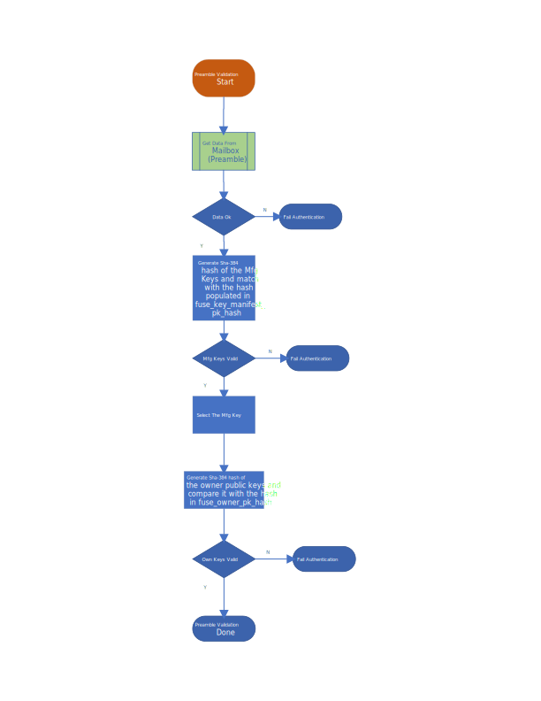

## Header validation

- Retrieve the header portion of the firmware image from the mailbox.
- Note that the header is the sole signed component, featuring two distinct signatures pairs.
- The first signature pair is generated using the active ECC and LMS or MLDSA manufacturing keys.
- The second signature pair is generated using the owner ECC and LMS or MLDSA public keys.
- To validate the header:
  - Compute the SHA2-384 hash of the header.
  - Verify the ECC manufacturer signature in the preamble against the computed hash.
  - If the ECC manufacturer signature is invalid, fail the validation process. If the ECC manufacturer signature is valid, apply the same procedure using the LMS or MLDSA manufacturer key.
  - Similarly, utilize the precomputed hash to verify the signature with the ECC owner public key. Repeat the process using the LMS or MLDSA owner key.

## Header validation steps

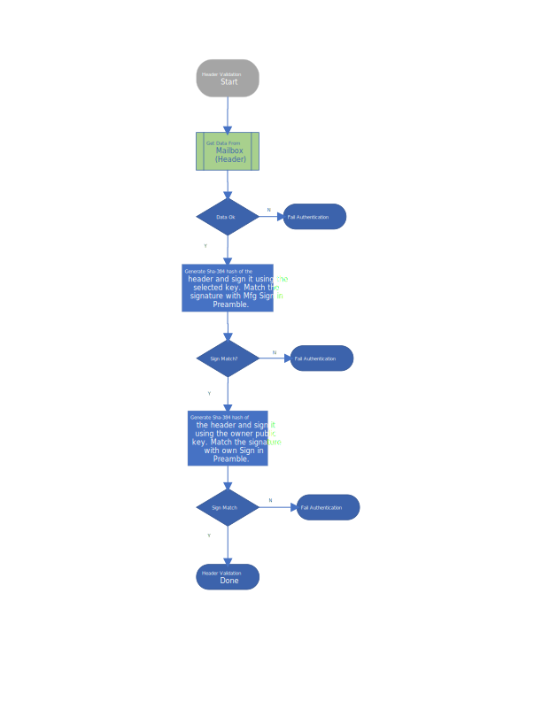

## Table of contents validation

- At this point both the Preamble and the Header have been validated.
- Load the TOC entries (FMC TOC and RT TOC) from the mailbox.
- Compute the SHA2-384 hash of the complete TOC data.
- Compare the computed TOC hash with the hash embedded in the Header.
  - If the hashes match, the TOC data is validated.
- Ensure that Fw.Svn is greater than or equal to Fuse.Svn.

<br> *(Note: Same SVN Validation is done for the FMC and RT)

<br>

## Table of contents validation steps

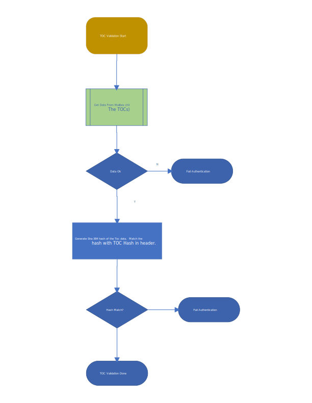

## Validating image sections

- Upon successful validation of the TOC, each image section corresponding to the TOC requires validation.
- The hash for each image section is encapsulated within the TOC data.
- Retrieve the FMC Image section. The offset and size of the section are specified in the TOC.
- Compute the SHA2-384 hash for the FMC image section.
- Compare the computed hash with the hash specified in the FMC TOC.
  - If the hashes match, the FMC image section is considered validated. If the hashes do not match, the image is rejected.
- Retrieve the RT Image section from the mailbox. The offset and size of the section are specified in the TOC.
- Compute the SHA2-384 hash for the RT image section.
Compare the computed hash with the hash specified in the RT TOC.
  - If the hashes match, the RT image section is considered validated. If the hashes do not match, the image is rejected.

## Image section validation steps

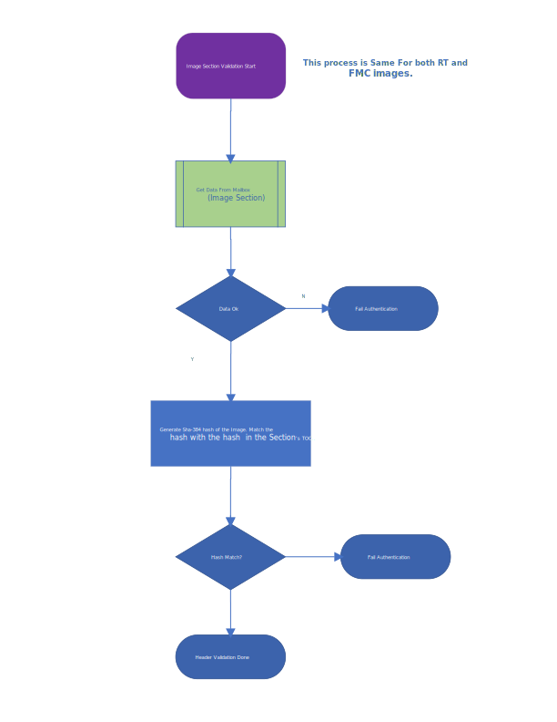

## Differences in operating mode of the validation code

- The validation code operates in three modes.
  - Cold Boot Mode
  - Warm Boot Mode
  - Update Reset Mode
- Cold Boot Mode
  - Validation of the entire image is done using the steps described above.
  - Save the hash of the FMC portion of the image in a separate register.
  - Copy the FMC and RT image's text and data section in the appropriate ICCM and DCCM memory regions.
  - The data vault is saved with the following values:-
    - LDevId Dice ECDSA Signature.
    - LDevId Dice MLDSA Signature.
    - LDevId Dice ECDSA Public Key.
    - LDevId Dice MLDSA Public Key.
    - Alias FMC Dice ECDSA Signature.
    - Alias FMC Dice MLDSA Signature.
    - Alias FMC Public ECDSA Key.
    - Alias FMC Public MLDSA Key.
    - Digest of the FMC part of the image.
    - Digest of the ECC and LMS or MLDSA owner public keys portion of preamble.
    - FW SVN.
    - ROM Cold Boot Status.
    - FMC Entry Point.
    - ECC Vendor public key index.
    - LMS or MLDSA Vendor public key index.
- Warm Boot Mode
  - In this mode there is no validation or load required for any parts of the image.
  - All the contents of ICCM and DCCM are preserved.
- Update Reset Mode
  - The image is exactly the same as the initial image which was verified on the cold boot, except that the RT part of the image is changed.
  - We need to validate the entire image exactly as described in the cold boot flow. In addition to that, also validate the image to make sure that no other part (except the RT image section) is altered.
  - The validation flow will look like the following:
    - Validate the preamble exactly like in cold boot flow.
      - Validate the vendor public key indices from the values in data vault (value saved during cold boot). Fail the validation if there is a mismatch. This is done to make sure that the key being used is the same key that was used during cold boot.
      - Validate the owner public key digest against the owner public key digest in data vault (value saved during cold boot). This ensures that the owner keys have not changed since last cold boot.
    - Validate the header exactly like in cold boot.
    - Validate the toc exactly like in cold boot.
    - We still need to make sure that the digest of the FMC which was stored in the data vault register at cold boot
      still matches the FMC image section.
    - Store the minimum firmware SVN that has run since cold-boot in the data vault.
    - Ratchet the key ladder if necessary.
  - If validation fails during ROM boot, the new RT image will not be copied from
    the mailbox. ROM will boot the existing FMC/Runtime images. Validation
    errors will be reported via the CPTRA_FW_ERROR_NON_FATAL register.

## Fake ROM

Fake ROM is a variation of the ROM intended to be used in the verification/enabling stages of development. The purpose is to greatly reduce the boot time for pre-Si environments by eliminating certain steps from the boot flow. Outside of these omissions, the behavior is intended to be the same as normal ROM.

Fake ROM is only available in production mode if the enable bit is set in the CPTRA_DBG_MANUF_SERVICE_REG (see section above).

**Differences from normal ROM:**

Fake ROM reduces boot time by doing the following:

1. Skipping the DICE cert derivation and instead providing a static, "canned" cert chain for LDEV and FMC Alias
2. Skipping the known answer tests (KATs)
3. Skipping verification of the FW image received - This can optionally still be performed, see CPTRA_DBG_MANUF_SERVICE_REG

**How to use:**

- Fake ROM is provided in the release along with the normal collateral.
- The image builder exposes the argument "fake" that can be used to generate the fake versions

To fully boot to runtime, the fake version of FMC should also be used. Details can be found in the FMC readme.

## Optional UART via Generic Output Wires

For debugging and development purposes, the ROM (when built with the `emu` feature) can output log messages using the `CPTRA_GENERIC_OUTPUT_WIRES[0]` register as an optional UART interface. This provides a simple mechanism for observing ROM execution without requiring a dedicated UART peripheral.

### Protocol

The UART output uses the following encoding in `CPTRA_GENERIC_OUTPUT_WIRES[0]`:

| Bits    | Description                                                                 |
| :------ | :-------------------------------------------------------------------------- |
| [7:0]   | Character data (ASCII printable characters 0x20-0x7E, newline 0x0A, tab 0x09). Non-printable characters are replaced with 0xFE. |
| [8]     | Toggle bit. This bit is toggled every time a new character is written, allowing external observers to detect new characters without introspecting internal signals. |
| [31:9]  | Reserved |

### Usage

- The SOC or testbench can monitor `CPTRA_GENERIC_OUTPUT_WIRES[0]` and detect new characters by observing changes to bit 8.
- When bit 8 changes, the new character is available in bits [7:0].
- If desired, this can be wired to a FIFO or other mechanism for output.
