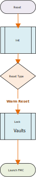
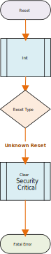

# Caliptra - ROM Specification v0.5.2

## 1. Version History

| Date       | Version | Description                                                              |
| :--------- | :------ | :----------------------------------------------------------------------- |
| 09/18/2022 | 0.1     | Document Created, Boot flow defined                                      |
| 12/30/2022 | 0.1     | Image Format Defined                                                     |
| 12/15/2022 | 0.3     | Added Fuse & Register details                                            |
| 01/20/2023 | 0.4     | Added Certificate Details                                                |
| 02/20/2023 | 0.5     | Added Image Verification Details                                         |
| 03/01/2023 | 0.5.1   | Added Crypto Derivations                                                 |
| 04/27/2023 | 0.5.2   | Added Runtime SVN bit clarification                                      |

## 2. Spec Opens

- Update the spec with support for LMS PQC algorithm for firmware verification
- Update the spec with adding certificate expiration times for vendor and owner
- Update the firmware image format to include the runtime configuration section
- Ability to run production signed firmware that can only run in debug mode
- Add certificate section

## 3. Scope

Caliptra is an open-source Hardware Root of Trust for Measurement (RTM). This document is the architecture specification
for Caliptra Read Only Memory Code (ROM). As an architecture specification for ROM, this document describes the
following topics:

1. Provide high level architecture and requirements
2. Describe ROM DICE Layering Architecture
3. Describe ROM functionality
4. Define ROM boot flows
   - Cold Reset Flow
   - Warm Reset Flow
   - Update Reset Flow
   - Unknown/Spurious Reset Flow
5. Cryptographic Derivations
6. Certificate Formats

## 4. Glossary

| Term                | Description                                                               |
| :------------------ | :------------------------------------------------------------------------ |
| CDI                 | Composite Device Identity                                                 |
| CSR                 | Certificate Signing Request                                               |
| DCCM                | Data Closely Coupled Memory                                               |
| DICE                | Device Identifier Composition Engine                                      |
| FHT                 | Firmware Handoff Table                                                    |
| FMC                 | First Mutable Code                                                        |
| FW                  | Firmware                                                                  |
| ICCM                | Instruction Closely Coupled Memory                                        |
| IDEVID              | Initial Device ID DICE Layer                                              |
| RoT                 | Root of Trust                                                             |
| RT                  | Runtime                                                                   |
| RTM                 | Root of Trust for Measurement                                             |
| TCI                 | Trusted Component Identifier                                              |
| UDS                 | Unique Device Secret                                                      |
| SVN                 | Security Version Number                                                   |
| X509                | Digital Certificate Standard                                              |

## 5. DICE Layers

### 5.1 Initial Device ID (IDEVID) DICE Layer

This layer represents the manufacturer/silicon vendor device identity. This layer's CDI is constructed
using a deobfuscated UDS. A self signed CSR is generated during (or when requested) cold reset.
CSR is provided to the manufacturer/silicon vendor CA for issuing a Manufacturer Device Certificate.

### 5.2 Local Device ID DICE (LDEVID) Layer

This layer represents the owner identity. This layer's CDI is constructed by mixing some entropy
once the owner acquires the devices. The primary purpose of this layer is to mitigate supply
chain attacks via owner providing some entropy via fuses which is further randomized via the
deobfuscation engine. ROM generates a certificate for this layer. The certificate is signed by
the IDEVID private key.

### 5.2 Alias FMC DICE Layer

In traditional DICE architectures, the Alias layer is controlled by the FMC. However, there are no standard
mechanisms available to tie the Alias Certificate back to the manufacturer. Historically,
non-standard X509 certificate extensions [CHECK]. The only standard way currently available is for LDEVID
private key to sign the Alias FMC Certificate. However, LDEVID private key is a critical key
with very limited in-field renewability. Hence LDEVID private key must never leave ROM and must
be cleared prior to ROM exit. This implies we need to do part of the Alias FMC derivations in ROM,
sign the Alias FMC certificate using LDEVID private key.

The CDI for this layer comprises of the security state of the device and TCI (digest/measurement)
of the FMC firmware

## 6. FUSE & Architectural Registers

Following are the main FUSE & Architectural Registers used by the Caliptra ROM for DICE Derivations:

| Register	                      | Width (bits) | Description                                             |
| :------------------------------ | :------------|  :----------------------------------------------------- |
| CPTRA_SECURITY_STATE            | 32	         | Security State of the device. Contains two fields:    **LIFECYCLE_STATE**: Unprovisioned, Manufacturing or Production    **DEBUG_ENABLED**: Boolean indicating if debug is enabled or not |
| FUSE_MANUFACTURER_PK_HASH       | 384          | Hash of the four Manufacturer Public Keys               |
| FUSE_MANUFACTURER_PK_REVOCATION | 4            | Manufacturer Public Key Revocation Mask                 |
| FUSE_OWNER_PK_HASH              | 384          | Owner Public Key Hash                                   |
| FUSE_FMC_SVN                    | 32           | FMC Security Version Number                             |
| FUSE_RUNTIME_SVN                | 64           | Runtime Security Version Number                         |
| FUSE_ANTI_ROLLBACK_DISABLE      | 1            | Disable SVN checking for FMC & Runtime when bit is set  |
| FUSE_IDEVID_CERT_ATTR           | 768          | FUSE containing information for generating IDEVID CSR   |
| CPTRA_DBG_MANUF_SERVICE_REG     | 32           | Manufacturing Services like IDEVID CSR upload           |

## 7. Vaults

Caliptra Hardware has the following vaults for storing various cryptographic material:

1.	**Key Vault**: Used to store sensitive keys (Private Keys & CDI). Firmware cannot read or write the Key Vault content directly. Key Vault has 32 slots. Firmware can refer to the keys in the Key Vault via Slot numbers during cryptographic operations.
2.	**PCR Bank**: Used to store measurements. PCR Bank has 32 PCRs. PCRs can be read or hash extended by the firmware. Direct write to PCR is not possible.
3.	**Data Vault**: Data Vault contains a set of sticky (lock till next cold reset), non-sticky (lock till next update reset [CHECK] Warm reset?) and scratch registers.
    *	10 Sticky 48-byte registers
    *	8 Sticky 4-byte registers
    *	10 Non-Sticky 48-byte registers
    *	10 Non-Sticky 4-byte registers
    *	8 Scratch Registers

## 8. Firmware Image Bundle

The Caliptra Firmware image has two main components:

*	### **Firmware Manifest**: The firmware manifest is a combination of preamble and a signed header. It has public keys, signatures and table of contents which refer to the various firmware images contained in the bundle.
*	### **Firmware Images**: One or more binary images.

### 8.1 Firmware Manifest

Firmware manifest consists of preamble, header and table of contents.

#### 8.1.1 Preamble

It is the unsigned portion of the manifest. Preamble contains the signing public keys and signatures. ROM is responsible for parsing the preamble. ROM performs the following steps:
*	Loads the preamble from the mailbox.
*	Calculates the hash of the four Manufacturer Public Keys in the preamble and compares it against the hash in the fuse (KEY MANIFEST PK HASH). If the hashes do not match, the boot fails.
*	Selects the appropriate Manufacturer Public Key based on fuse (KEY MANIFEST PK HASH MASK)

 *Note: All fields are little endian unless specified*

| Field | Size (bytes) | Description|
|-------|--------|------------|
| Firmware Manifest Marker | 4 | Magic Number marking the start of the package manifest. The value must be 0x434D414E (‘CMAN’ in ASCII)|
| Firmware Manifest Size | 4 | Size of the full manifest structure |
| Manufacturer ECC Public Key 1 | 96 | ECC P-384 public key used to verify the Firmware Manifest Header Signature.   **X-Coordinate:** Public Key X-Coordinate (48 bytes)   **Y-Coordinate:** Public Key Y-Coordinate (48 bytes) |
| Manufacturer ECC Public Key 2 | 96 | ECC P-384 public key used to verify the Firmware Manifest Header Signature.   **X-Coordinate:** Public Key X-Coordinate (48 bytes)   **Y-Coordinate:** Public Key Y-Coordinate (48 bytes) |
| Manufacturer ECC Public Key 3 | 96 | ECC P-384 public key used to verify the Firmware Manifest Header Signature.   **X-Coordinate:** Public Key X-Coordinate (48 bytes)   **Y-Coordinate:** Public Key Y-Coordinate (48 bytes) |
| Manufacturer ECC Public Key 4 | 96 | ECC P-384 public key used to verify the Firmware Manifest Header Signature.   **X-Coordinate:** Public Key X-Coordinate (48 bytes)   **Y-Coordinate:** Public Key Y-Coordinate (48 bytes) |
| Public Key Index Hint | 4 | The hint to ROM to indicate which public key it should first use.  |
| Manufacturer ECC Signature | 96 | Manufacturer ECDSA P-384 signature of the Firmware Manifest header hashed using SHA2-384.   **R-Coordinate:** Random Point (48 bytes)   **S-Coordinate:** Proof (48 bytes) |
| Owner ECC Public Key | 96 | ECC P-384 public key used to verify the Firmware Manifest Header Signature.   **X-Coordinate:** Public Key X-Coordinate (48 bytes)   **Y-Coordinate:** Public Key Y-Coordinate (48 bytes)|
| Owner ECC Signature | 96 | Manufacturer ECDSA P-384 signature of the Firmware Manifest header hashed using SHA2-384.   **R-Coordinate:** Random Point (48 bytes)   **S-Coordinate:** Proof (48 bytes) |
| Reserved | 16 | Reserved 16 bytes |
 

#### 8.1.2 Header

The header contains the security version and SHA-384 hash of the table of contents. Header is the only signed component in the image. Signing the header is enough as the table of contents contains the hashes of the individual firmware images. This technique reduces the number of signature verifications required to be performed during boot.

| Field | Size (bytes) | Description|
|-------|--------|------------|
| Header Version| 4 | Header version. Must be 0x0001 for this spec revision. |
| Revision | 8 | 8-byte version of the firmware image bundle |
| Flags | 4 | Feature flags.   **Bit0:** - Disable Runtime Updates  **Bit1-Bit31:** Reserved |
| TOC Entry Count | 4 | Number of entries in TOC. |
| TOC Digest | 48 | SHA2-384 Digest of table of contents. |

#### 8.1.3 Table of Contents
It contains the image information and SHA-384 hash of individual firmware images.
| Field | Size (bytes) | Description|
|-------|--------|------------|
| TOC Entry Id | 4 | TOC Entry Id. The fields can have following values:   **0x0000_0001:** FMC    **0x0000_0002:** Runtime |
| Image Type | 4 | Image Type that defines format of the image section   **0x0000_0001:** Executable |
| Image Revision | 20 | Git Commit hash of the build |
| Image SVN | 8| Security Version Number for the Image. This field is compared against the fuses (FMC SVN or RUNTIME SVN. |
| Image Minimum SVN | 8| Minimum Security Version Number for the Image. This field is compared against the fuses (FMC SVN or RUNTIME SVN. |
| Image Load Address | 4 | Load address |
| Image Entry Point | 4 | Entry point to start the execution from  |
| Image Offset | 4 | Offset from beginning of the image |
| Image Size | 4 | Image Size |
| Image Hash | 48 | SHA2-384 hash of image |

### 8.2 Image

| Field | Size (bytes) | Description   |
|-------|--------------|---------------|
| Data  | N            | Image content |

## 9. Cryptographic Primitives

The following sections define the various cryptographic primitives used by Caliptra ROM:
| Group | Operation |Description |
|-------|--------|------------|
| Deobfuscation Engine | `doe_decrypt_uds(kv_slot, iv)` | Decrypt UDS to the specified key vault slot with specified initialization vector **Input**:  ***kv_slot*** - key vault slot to decrypt the uds to ***iv*** - initialization vector |
|   | `doe_decrypt_fe(kv_slot, iv)` | Decrypt Field Entropy to the specified key vault slot with specified initialization vector  **Input**: ***kv_slot*** - key vault slot to decrypt the field entropy to ***iv*** - initialization vector |
|   | `doe_clear_secrets()` | Clear UDS Fuse Register, Field Entropy Fuse Register and Obfuscation key |
| Hashed Message Authentication Code | `hmac384_mac(key,data,mac_kv_slot)` | Calculate the mac using a caller provided key and data. The resultant mac is stored in key vault slot **Input**: ***key*** - caller specified key data - data ***mac_kv_slot*** - key vault slot to store the mac to |
|   | `hmac384_mac(kv_slot,data,mac_kv_slot)` | Calculate the mac using a caller provided key and data. The resultant mac is stored in key vault slot  **Input**:  ***kv_slot*** - key vault slot to use the key from ***data*** - data ***mac_kv_slot*** - key vault slot to store the mac to |
| Elliptic Curve Cryptography | `ecc384_keygen(seed_kv_slot, priv_kv_slot) -> pub_key`	| Generate ECC384 Key Pair. **Input**: ***seed_key_slot*** - key vault slot to use as seed for key generation ***priv_kv_slot*** - key vault slot to store the private key to **Output**: ***pub-key*** - public key associated with the private key |
|   | `ecc384_sign(priv_kv_slot, data) -> sig` | ECC384 signing operation **Input**: ***priv_kv_slot*** - key vault slot to use a private key from ***data*** - data to sign **Output**: ***sig*** - signature |
| | `ecc384_verify(pub_key, data, sig) -> Ecc384Result` | ECC384 verify operation **Input**: ***pub-key*** -public key data - data to verify sig - signature **Output**: ***Ecc384Result*** - Ecc384Result::Success if signature verification succeeded else an error |
| Secure Hash Algorithm | `sha384_digest(data) -> digest` | Calculate the digest of the data **Input**: ***data*** - data to verify **Output**: ***digest*** - digest of the data |
| Key Vault | `kv_clear(kv_slot)` | Key Vault slot to clear **Input**: ***kv_slot*** - key vault slot to clear |
| Data Vault | `dv48_store(data, dv_slot)` | Store the 48-byte data in the specified data vault slot **Input**: ***data*** - data to store ***dv_slot*** - data vault slot |
| | `dv48_lock_wr(dv_slot)` | Write Lock the 48-byte data vault slot Input ***dv_slot*** - data vault slot |
| | `dv4_store(data, dv_slot)` | Store the 4- byte data in the specified data vault slot Input ***data*** - data to store ***dv_slot*** - data vault slot |
| | `dv4_lock_wr(dv_slot)` | Write Lock the 4-byte data vault slot Input ***dv_slot*** - data vault slot |
| Platform Configuration Registers | `pcr_extend(pcr_slot, data)` | Perform PCR extend operation on a PCR with specified data **Input**: ***pc_slot*** - PCR slot to hash extend ***data*** – data |
| | `pcr_read(pcr_slot) -> measurement` | Read the PCR slot **Input**: ***pc_slot*** - PCR slot to read **Output**: ***measurement*** - Accumulated measurement |
| | `pcr_lock_clear(pcr_slot)` | Lock for Clear PCR slot **Input**: ***pcr_slot*** - pcr slot |
| | `pcr_clear(pcr_slot)` | Clear PCR slot **Input**: ***pcr_slot*** - pcr slot |
| X509 | `gen_tbs(type, pub_key) -> tbs` | Generate X509 Certificate or CSR `To Be Signed` portion **Input**: ***type*** - Can be IDEVID_CSR, LDEVID_CERT or ALIAS_FMC_CERT pub-key -public key **Output**: ***tbs*** - DER encoded `To Be Signed` portion |
 

## 7. Well Known Cryptographic Constants

| Constant | Size (bytes) | Description |
|----------|--------------|-------------|
| DOE_UDS_IV | 16 | Initialization vector specified by the ROM for deobfuscating the UDS. |
| DOE_FE_IV | 16 | Initialization vector specified by the ROM for deobfuscating Field Entropy. |
 

## 9. Cold Reset Flow

ROM performs all the necessary crypto derivations on cold reset. No crypto derivations are performed during warm reset or update reset.

Note that KvSlot3 is generally used as a temporary location for derived keying material during ECC keygen.

### 9.1 Initialization

The initialization step involves tradition startup script for microcontroller. The initialization script performs following:
- Resets instruction counter
- Disables interrupts
- Clears all general purpose registers
- Sets up memory region attributes (Cachable & Side effects)
- Set up stack pointer
- Zeros ICCM & DCCM memories (to initialize ECC)
- Copy Data section to DCCM (if required)
- Jumps to Rust entry point

### 9.2 Decrypt Secrets
DICE Unique Device Secret (UDS) is stored in an SOC backed fuse (or derived from PUF). The raw UDS is not directly used. UDS is deobfuscated using Deobfuscation Engine. UDS is provisioned by the Silicon Vendor.

Field Entropy is used to mitigate certain classes of supply chain attacks.  Field Entropy is programmed by the owner of the device in a secure environment in the owner’s facility. Field Entropy programmed in fuses is not directly used. Field Entropy is put through the deobfuscation engine to randomize it.

Both UDS and Field Entropy are available only during cold reset of Caliptra.

**Pre-Conditions:**
*	Caliptra subsystem is being cold reset
*	Obfuscation Key loaded in deobfuscation engine
*	UDS and Field Entropy loaded in Caliptra Fuse Registers
*	Keys Slot 0 - 31 are empty and Usage Bits are all cleared
*	PCR 0 - 31 are all cleared
*	Data Vault is all cleared

**Actions:**
1.	Decrypt UDS to Key Vault Slot 0

    `doe_decrypt_uds(KvSlot0, DOE_UDS_IV)`

2.	Decrypt Field Entropy to Key Vault Slot 1

	`doe_decrypt_uds(KvSlot1, DOE_FE_IV)`

3.	Clear class secrets (Clears UDS, Field Entropy and Obfuscation Key cleared)

	`doe_clear_secrets()`

**Post-Conditions:**
*	UDS Fuse Register and Field Entropy Fuse register cleared
*	Obfuscation Key cleared from Deobfuscation Engine
*	Vault State is as follows:

| Slot | Key Vault | PCR Bank | Data Vault 48 Byte (Sticky) | Data Vault 4 Byte (Sticky) |
|------|-----------|----------|-----------------------------|----------------------------|
| 0 | UDS (48 bytes)|
| 1 |Field Entropy (32 bytes) |

### 9.3 Initial Device ID DICE Layer

Initial Device ID Layer is used to generate Manufactured CDI & Private Keys.  This layer represents the manufacturer or silicon vendor DICE Identity. During manufacturing,  ROM can be requested to create Certificate Signing Request (CSR) via JTAG.

**Pre-Conditions:**
* UDS is loaded in Key Vault Slot 0

**Actions:**

1.	Derive the CDI using ROM specified label and UDS in Slot 0 as data and store the resultant mac in KeySlot6

	`hmac384_kdf(KvSlot0, b"idevid_cdi", KvSlot6)`

2.	Clear the UDS in key vault

	`kv_clear(KvSlot0)`

3.	Derive ECC Key Pair using CDI in Key Vault Slot6 and store the generated private key in KeySlot7

    `IDevIDSeed = hmac384_kdf(KvSlot6, b"idevid_keygen", KvSlot3)`
    `IDevIdPubKey = ecc384_keygen(KvSlot3, KvSlot7)`
    `kv_clear(KvSlot3)`

*(Note: Steps 4-7 are performed if CSR download is requested via CPTRA_DBG_MANUF_SERVICE_REG register)*

4.	Generate the `To Be Signed` DER Blob of the IDevId CSR

	`IDevIdTbs = gen_tbs(IDEVID_CSR, IDevIdPubKey)`

5.	Sign the LDevID `To Be Signed` DER Blob with IDevId Private Key in Key Vault Slot 7

	`IDevIdTbsDigest = sha384_digest(IDevIdTbs)`
	`IDevIdCertSig = ecc384_sign(KvSlot7, IDevIdTbsDigest)`

6.	Verify the signature of LDevID `To Be Signed` Blob

	`IDevIdTbsDigest = sha384_digest(IDevIdTbs)`
	`Result = ecc384_verify(IDevIdPubKey, IDevIdTbsDigest, IDevIdCertSig)`

7.  Upload the CSR to mailbox and wait for JTAG to read the CSR out of the mailbox. *(TODO: Add the sequence diagram)*

**Post-Conditions:**
* Vault state as follows:

| Slot | Key Vault | PCR Bank | Data Vault 48 Byte (Sticky) | Data Vault 4 Byte (Sticky) |
|------|-----------|----------|-----------------------------|----------------------------|
| 1 |Field Entropy (32 bytes) |
| 6 |IDevID CDI (48 bytes) |
| 7 |IDevID Private Key (48 bytes) |

### 9.4 Local Device ID DICE Layer

Local Device ID Layer derives the Owner CDI & ECC Keys. This layer represents the owner DICE Identity as it is mixed with the Field Entropy programmed by the Owner.

**Pre-Conditions:**
* Field Entropy is loaded in Key Vault Slot 1
* IDevID CDI is stored in Key Vault Slot 6
* IDevID Private Key is stored in Key Vault Slot 7

**Actions:**

1.	Derive the CDI using IDevID CDI in Key Vault Slot6 as HMAC Key and Field Entropy stored in Key Vault Slot1 as data. The resultant mac is stored back in Slot 6

    `hmac384_mac(KvSlot6, b"ldevid_cdi", KvSlot6)`
	`hmac384_mac(KvSlot6, KvSlot1, KvSlot6)`

*(Note: this uses a pair of HMACs to incorporate the diversification label, rather than a single KDF invocation, due to hardware limitations when passing KV data to the HMAC hardware as a message.)*

2.	Clear the Field Entropy in Key Vault Slot 1

	`kv_clear(KvSlot1)`

3.	Derive ECC Key Pair using CDI in Key Vault Slot6 and store the generated private key in KeySlot5.

    `LDevIDSeed = hmac384_kdf(KvSlot6, b"ldevid_keygen", KvSlot3)`
    `LDevIdPubKey = ecc384_keygen(KvSlot3, KvSlot5)`
    `kv_clear(KvSlot3)`

4.	Store and lock (for write) the LDevID Public Key in Data Vault (48 bytes) Slot 0 & Slot 1

    `dv48_store(LDevIdPubKey.X, Dv48Slot0)`
    `dv48_lock_wr(Dv48Slot0)`
    `dv48_store(LDevIdPubKey.Y, Dv48Slot1)`
    `dv48_lock_wr(Dv48Slot1)`

5.	Generate the `To Be Signed` DER Blob of the LDevId Certificate

	`LDevIdTbs = gen_cert_tbs(LDEVID_CERT, IDevIdPubKey, LDevIdPubKey)`

6.	Sign the LDevID `To Be Signed` DER Blob with IDevId Private Key in Key Vault Slot 7

	`LDevIdTbsDigest = sha384_digest(LDevIdTbs)`
	`LDevIdCertSig = ecc384_sign(KvSlot7, LDevIdTbsDigest)`

7.	Clear the IDevId Private Key in Key Vault Slot 7

	`kv_clear(KvSlot7)`

8.	Verify the signature of LDevID `To Be Signed` Blob

	`LDevIdTbsDigest = sha384_digest(LDevIdTbs)`
	`Result = ecc384_verify(LDevIdPubKey, LDevIdTbsDigest, LDevIdCertSig)`

9.	Store and lock (for write) the LDevID Certificate Signature in the sticky Data Vault (48 bytes) Slot 2 & Slot 3

	`dv48_store(LDevIdCertSig.R, Dv48Slot2)`
    `dv48_lock_wr(Dv48Slot2)`
    `dv48_store(LDevIdCertSig.S, Dv48Slot3)`
    `dv48_lock_wr(Dv48Slot3)`

**Post-Conditions:**
* Vault state as follows:

| Slot | Key Vault | PCR Bank | Data Vault 48 Byte (Sticky) | Data Vault 4 Byte (Sticky) |
|------|-----------|----------|-----------------------------|----------------------------|
| 0 | | | 🔒LDevID Pub Key X |
| 1 | | | 🔒LDevID Pub Key Y |
| 2 | | | 🔒LDevID Cert Signature R |
| 3 | | | 🔒LDevID Cert Signature S |
| 5 | LDevID Private Key (48 bytes) |
| 6 | LDevID CDI (48 bytes) |

### 9.6 Downloading images from Mailbox

The following is the sequence of the steps that are required to download the parts of firmware image from mailbox.

- ROM asserts READY_FOR_FIRMWARE signal.
- Poll for the execute bit to be set. This bit is set as the last step to transfer the control of the command to the Caliptra ROM.
- Read the command register and ensure the command is FW_DOWNLOAD.
- Read the data length register and validate the value in it.
- Read N dwords from the mailbox DATAOUT register.  Execute the command.
- Once the entire data is processed, clear the execute bit.
    - This should be the last step. Clearing this bit transfers the control back to the originator of the command.
- On failure, a non-zero status code will be reported in the `CPTRA_FW_ERROR_NON_FATAL` register

### 9.7 Image Validation

*Refer to Firmware Image Validation Process*

### 9.8 Alias FMC DICE Layer & PCR extension

Alias FMC Layer includes the measurement of the FMC and other security states. This layer is used to assert a composite identity which includes the security state, FMC measurement along with the previous layer identities.

**Pre-Conditions:**
*	LDevID CDI is stored in Key Vault Slot 6
*	LDevID Private Key is stored in Key Vault Slot 5
*	Firmware Image Bundle is successfully loaded and verified from the Mailbox
*	ROM has following information from Firmware Image Bundle
*	FMC_DIGEST - Digest of the FMC
*	FMC_SVN - SVN for FMC
*	MANUFACTURER_PK - Manufacturer Public Key used to verify the firmware image bundle
*	MANUFACTURER_PK_INDEX - Index of the MANUFACTURER_PK in the firmware image bundle

**Actions:**

1.	PCR0 is the Current PCR. PCR 1 is the Journey PCR. PCR0 is cleared by ROM upon each warm reset, before it is extended with FMC measurements. PCR0 and PCR1 are locked for clear by the ROM on every reset. Subsequent layers may continue to extend PCR0 as runtime updates are performed.

    `pcr_clear(Pcr0)`
    `pcr_extend(Pcr0 && Pcr1, CPTRA_SECURITY_STATE.LIFECYCLE_STATE)`
    `pcr_extend(Pcr0 && Pcr1, CPTRA_SECURITY_STATE.DEBUG_ENABLED)`
    `pcr_extend(Pcr0 && Pcr1, FUSE_ANTI_ROLLBACK_DISABLE)`
    `pcr_extend(Pcr0 && Pcr1, MANUFACTURER_PK)`
    `pcr_extend(Pcr0 && Pcr1, FUSE_OWNER_PK_HASH)`
    `pcr_extend(Pcr0 && Pcr1, FMC_DIGEST)`
    `pcr_extend(Pcr0 && Pcr1, FMC_SVN)`
    `pcr_extend(Pcr0 && Pcr1, FMC_FUSE_SVN)` (or 0 if `FUSE_ANTI_ROLLBACK_DISABLE`)
    `pcr_extend(Pcr0 && Pcr1, LMS_VENDOR_PK_INDEX)`
    `pcr_extend(Pcr0 && Pcr1, ROM_VERIFY_CONFIG)`
    `pcr_lock_clear(Pcr0 && Pcr1)`

2.	CDI for Alias is derived from PCR0. For the Alias FMC CDI Derivation,  LDevID CDI in Key Vault Slot6 is used as HMAC Key and contents of PCR0 are used as data. The resultant mac is stored back in Slot 6

	`Pcr0Measurement = pcr_read(Pcr0)`
    `hmac384_kdf(KvSlot6, b"fmc_alias_cdi", Pcr0Measurement, KvSlot6)`

3.	Derive Alias FMC ECC Key Pair using CDI in Key Vault Slot6 and store the generated private key in KeySlot7.

    `AliasFmcSeed = hmac384_kdf(KvSlot6, b"fmc_alias_keygen", KvSlot3)`
    `AliasFmcPubKey = ecc384_keygen(KvSlot3, KvSlot7)`
    `kv_clear(KvSlot3)`

4.	Store and lock (for write) the Alias FMC Public Key in Data Vault (48 bytes) Slot 4 & Slot 5

    `dv48_store(AliasFmcPubKey.X, Dv48Slot4)`
    `dv48_lock_wr(Dv48Slot4)`
    `dv48_store(AliasFmcPubKey.Y, Dv48Slot5)`
    `dv48_lock_wr(Dv48Slot5)`

5.	Generate the `To Be Signed` DER Blob of the Alias FMC Certificate

	`AliasFmcTbs = gen_cert_tbs(ALIAS_FMC_CERT, LDevIdPubKey, AliasFmcPubKey)`

6.	Sign the Alias FMC `To Be Signed` DER Blob with LDevId Private Key in Key Vault Slot 5

	`AliasFmcTbsDigest = sha384_digest(AliasFmcTbs)`
	`AliasFmcTbsCertSig = ecc384_sign(KvSlot5, AliasFmcTbsDigest)`

7.	Clear the LDevId Private Key in Key Vault Slot 5

	`kv_clear(KvSlot5)`

8.	Verify the signature of Alias FMC `To Be Signed` Blob

	`AliasFmcTbsDigest = sha384_digest(AliasFmcTbs)`
	`Result = ecc384_verify(AliasFmcPubKey, AliasFmcDigest , AliasFmcTbsCertSig)`

9.	Store and lock (for write) the LDevID Certificate Signature in the sticky Data Vault (48 bytes) Slot 6 & Slot 7

    `dv48_store(AliasFmcTbsCertSig.R, Dv48Slot6)`
    `dv48_lock_wr(Dv48Slot6)`

    `dv48_store(AliasFmcTbsCertSig.S, Dv48Slot7)`
    `dv48_lock_wr(Dv48Slot7)`

10.	Lock critical state needed for warm and update reset in Data Vault

	`dv48_store(FMC_DIGEST, Dv48Slot8)`
    `dv48_lock_wr(Dv48Slot8)`

    `dv4_store(FMC_SVN, Dv4Slot0)`
    `dv4_lock_wr(Dv4Slot0)`

    `dv48_store(FUSE_OWNER_PK_HASH, Dv48Slot9)`
    `dv48_lock_wr(Dv48Slot9)`

    `dv4_store(MANUFACTURER_PK_INDEX, Dv4Slot1)`
    `dv4_lock_wr(Dv4Slot1)`

**Post-Conditions:**
* Vault state as follows:

| Slot | Key Vault | PCR Bank | Data Vault 48 Byte (Sticky) | Data Vault 4 Byte (Sticky) |
|------|-----------|----------|-----------------------------|----------------------------|
| 0 | | | 🔒LDevID Pub Key X | 🔒FMC SVN |
| 1 | | | 🔒LDevID Pub Key Y | 🔒Manufacturer Public Key Index |
| 2 | | | 🔒LDevID Cert Signature R |
| 3 | | | 🔒LDevID Cert Signature S |
| 4 | | | 🔒Alias FMC Pub Key X |
| 5 | | | 🔒Alias FMC Pub Key Y |
| 6 | Alias FMC CDI (48 bytes) | | 🔒Alias FMC Cert Signature R |
| 7 | Alias FMC Private Key (48 bytes) | | 🔒Alias FMC Cert Signature S |
| 8 |  | | 🔒FMC Digest |
| 9 |  | | 🔒Owner PK Hash |

## 10. Warm Reset Flow

## 11. Update Reset Flow

  *(Note: Please note that Image validation for the update reset flow has some differences as compared to the cold boot flow. Please refer to the Image Validation Section for further details.)

## 12. Unknown/Spurious Reset Flow

## 13. Firmware Image Validation Process

The basic flow for validating the firmware involves the following:

- Validate the manufacturing keys in the preamble
- Validate the owner keys in the preamble
- Select the manufacturer keys
- Once both the validations are complete, download the header from the mailbox.
- Validate the Manifest Header using the selected Manufacturer keys against the manufacturer signature.
- Validate the Manifest Header using the owner key against the owner signature.
- On the completion of the last two validations, it is assured that the header portion is authentic.
- Load both the TOC entries from the mailbox.
- Validate the downloaded TOC data against the TOC hash in the header.
- This marks the TOC data as valid. The next step is to use the TOC Hash to validate image sections.
- Download the FMC Image portion of the Image.
- Validate the FMC Image against the hash in the TOC entry for the FMC.
    - If this is a cold reset, the FMC version number should be stored in a register.
- Download the RT Image part of the firmware Image.
- Validate the RT Image against the hash in the TOC entry for the RT.
- If all the above validations are complete, the entire image is validated.
- Let the SOC know that the firmware download command is complete.
- On failure, a non-zero status code will be reported in the `CPTRA_FW_ERROR_NON_FATAL` register

### 13.1 **Overall Validation Flow**

#### **Pre-Conditions**

The following are the pre-conditions that should be satisfied:
- Caliptra has transitioned through the BOOTFSM and all the fuses that are required for the validation are already populated by SOC.
- The FUSES programmed by the soc are
    - fuse_key_manifest_pk_hash : This fuse contains the hash of the manufacturer keys present in preamble.
    - use_key_manifest_pk_hash_mask : This is the bit mask of the keys which are revoked.
    - fuse_owner_pk_hash : The hash of the owner public key in preamble.
    - fuse_key_manifest_svn : Used in FMC validation, to make sure that the version number is good.
    - fuse_runtime_svn : Used in RT validation, to make sure that the runtime image's version number is good.
- The SOC has written the data to the mailbox.
- The SOC has written the data length in the DLEN mailbox register.
- The SOC has put the FW_DOWNLOAD command in the command register.
- The SOC has set the execute bit in the mailbox execute register.
  *( NOTE: At this time the interrupts are not enabled. Writing a execute bit will not generate an interrupt. The validation and update flow will need to be invoked externally.)*

## 13.2 Preamble Validation: Validate The Manufacturing Keys

- Load the preamble bytes from the mailbox.
- There are four manufacturing keys in the preamble.
- fuse_key_manifest_pk_hash is the fuse that contains the hash of all the four manufacturing keys.
- To validate the key region, take the hash of all the four keys and compare it against the hash in fuse.
- If the hash does not match, fail the image validation.
- If the hash matches, all the four keys are validated.

### 13.2.1 Preamble Validation: Manufacturing Key Selection

- Since there are four key slots in the preamble, we will need to select one key out of four.
- use_key_manifest_pk_hash_mask is the mask which revokes a key.
    - If bit-0 is set, that key is disabled. All other higher bits which are zeros, are still enabled.
    - If all the bits are zeros, all the keys are enabled.
    - If bit-0 and bit-1 are set, all higher slot bits (2 and 3) are enabled.
- Select the key using the Public Key Index Hint field in the preamble. This key should not be disabled using the use_key_manifest_pk_hash_mask fuse.
    - If the key is disabled, fail the validation.
    - If the key is enabled, select the key.
- At this time, we have validated all the four keys and selected the key that will be used for validation of the header against the manufacturer header signature field.
  *(Note: Please note that this is just a hint and you will need to start the header validation with this hint. If the header validation fails, you will still need to try other keys from the other key slots, if they are not disabled.)

### 13.2.2 Preamble Validation: Validate The Owner Key

- There is one slot for the owner key in the image preamble.
- fuse_owner_pk_hash contains the hash of the owner public key.
- The validation of owner public key is done by hashing the owner public key from the preamble and comparing the hash against the hash in the fuse_owner_pk_hash.
- If the hash matches, the owner public key is valid.
- If the hash match fails, fail the image validation.

## Preamble Validation Steps

## 13.3 Header Validation

- Load the header portion of the firmware image from the mailbox.
- Header is the only signed component. There are two signatures generated for the header.
- First signature is generated using one of the manufacturing keys.
- Second signature is generated using the owner public key.
- To validate the header, hash and sign it using the selected manufacturer key and compare with the manufacturer signature in the preamble.
- If the manufacturer signature matches, proceed with the owner signature validation. If the signature does not match, fail the validation.
- The hash is already generated. Sign the above hash using the owner public key and match the signature. If the signature matches, the validation succeeds. If the signature does not match the validation fails.

## Header Validation Steps

## 13.4 Table Of Contents Validation

- At this point all the previous steps of validations are complete.
- The Preamble and the header are validated.
- Load both the TOCs (FMC TOC and RT TOC) from the mailbox.
  *(NOTE: We should be able to use the sha accelerator here. Entire header contents are contiguous) That way we will not need to download the code at all)*
- Generate the hash of the entire TOC data.
- Compare the hash of the TOC data with the hash in the header.
- If the hash matches, the TOC data is valid.
- Once the TOC contents are verified, the last part of TOC validation is the SVN validation.
    - There are two SVN fields that are present in the table of contents.
        - Fw.Svn    : The Current SVN of the image
        - Fw.MinSvn : The Min target SVN for the image
    - The MinSvn is also placed in the fuse.
        - Fuse.svn  : This is the minimum required SVN that the image should have.
    - The following checks are required to pass for SVN validation
        - Fw.Svn >= Fw.MinSvn
        - Fw.MinSvn >= Fuse.Svn
    - In case the Fw.MinSvn is greater than the Fuse.Svn
        - Update the fuse SVN to Fw.MinSvn. To do this there will be a fuse update list that will be maintained and passed to runtime. The runtime will
          notify the SOC to update the fuse data using this list.

  *(Note: The Same SVN Validation is going to be done for the FMC and RT as well)

 

## Table Of Contents Validation Steps

## 13.5 Validating Image Sections

- Once the TOC is validated, the image section associated with each TOC needs validation.
- The hash for each image section is stored in the TOC data.
- Load the FMC Image section. The Offset and the size of the section is present in TOC.
- Calculate the SHA-384 hash of the FMC image section.
- Compare the hash with the hash available in the FMC TOC.
- If the hash matches, the FMC image section is validated. If the hash does not match, reject the image.
- Load the RT Image section from the mail box. The offset and the size of the section is present in the TOC.
- Calcaulte the SHA-384 hash of the RT image section.
- Compare the hash with the hash in the RT TOC.
- If the hash matches, the RT image section is validated. If the hash does not match, reject the image.

## Image Section Validation Steps

## 13.6 Differences In Operating Mode Of The Validation Code

- The validation code operates in three modes.
    - Cold Boot Mode
    - Warm Boot Mode
    - Update Reset Mode
- Cold Boot Mode
    - Validation of the entire image is done using the steps described above.
    - Save the hash of the FMC portion of the image in a separate register.
    - Copy the FMC and RT image's text and data section in the appropriate ICCM and DCCM memory regions.
    - The data vault is saved with the following values:-
        - Vendor public key index in the preamble is save in the data vault. 
        - Digest of the owner public key portion of preamble. 
        - Digest of the FMC part of the image.
- Warm Boot Mode
    - In this mode there is no validation or load required for any parts of the image.
    - All the contents of ICCM and DCCM are preserved since this is a warm reboot.
- Update Reset Mode
    - The image is exactly the same as the initial image which was verified on the cold boot, except that the RT part of the image is changed.
    - We need to validate the entire image exactly as described in the cold boot flow. In addition to that, also validate the image to make sure that no other part (except the RT image section) is altered. 
    - The validation flow will look like the following:
        - Validate the preamble exactly like in cold boot flow. 
            - Validate the vendor public key index from the value in data vault (value saved during cold boot). Fail the validation if there is a mismatch. This is done to make sure that the key being used is the same key that was used during cold boot.
            -  Validate the owner public key digest against the owner public key digest in data vault (value saved during cold boot). This makes sure that the owner key is not changed since last cold boot.
        - Validate the header exactly like in cold boot.
        - Validate the toc exactly like in cold boot.
        - We still need to make sure that the digest of the FMC which was stored in the data vault register at cold boot
          still matches the FMC image section. 
    - If validation fails during ROM boot, the new image will not be copied from
      the mailbox. ROM will boot the existing FMC/Runtime images. Validation
      errors will be reported via the CPTRA_FW_ERROR_NON_FATAL register.
