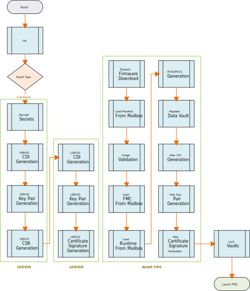
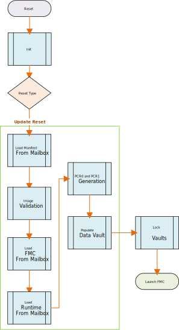

# Caliptra - ROM Specification v2.0

*Spec Version: 0.5*

## Scope

Caliptra is an open-source Hardware Root of Trust for Measurement (RTM). This document is the architecture specification
for Caliptra Read Only Memory Code (ROM). As an architecture specification for ROM, this document describes the
following topics:

1. Provide high level architecture and requirements
2. Describe ROM DICE Layering Architecture
3. Describe ROM functionality
4. Define ROM boot flows

   - Cold Reset Flow
   - Warm Reset Flow
   - Update Reset Flow
   - Unknown/Spurious Reset Flow

5. Cryptographic Derivations

## Spec Opens
- UDS Provisioning flow
- CSR Envelop signing
- Known answer tests
- Manufacturing debug unlock

## Glossary

| Term                | Description                                                               |
| :------------------ | :------------------------------------------------------------------------ |
| CDI                 | Compound Device Identity                                                  |
| CSR                 | Certificate Signing Request                                               |
| DCCM                | Data Closely Coupled Memory                                               |
| DICE                | Device Identifier Composition Engine                                      |
| ECC                 | Elliptic Curve Cryptography                                               |
| FHT                 | Firmware Handoff Table                                                    |
| FMC                 | First Mutable Code                                                        |
| FW                  | Firmware                                                                  |
| ICCM                | Instruction Closely Coupled Memory                                        |
| IDEVID              | Initial Device ID DICE Layer                                              |
| MLDSA               | Module-Lattice-Based Digital Signature Algorithm                          |
| RoT                 | Root of Trust                                                             |
| RT                  | Runtime                                                                   |
| RTM                 | Root of Trust for Measurement                                             |
| TCI                 | Trusted Component Identifier                                              |
| UDS                 | Unique Device Secret                                                      |
| SVN                 | Security Version Number                                                   |
| X509                | Digital Certificate Standard                                              |

## Fuse and architectural registers

Following are the main FUSE & Architectural Registers used by the Caliptra ROM for DICE Derivations:

### Fuse Registers
| Register                        | Width (bits) | Description                                             |
| :------------------------------ | :------------|  :----------------------------------------------------- |
| FUSE_UDS_SEED                   | 512          | Obfuscated UDS                                          |
| FUSE_FIELD_ENTROPY              | 256          | Obfuscated Field Entropy                                |
| FUSE_KEY_MANIFEST_PK_HASH       | 384          | Hash of the ECC and LMS or MLDSA Manufacturer Public Key Descriptors   |
| FUSE_ECC_REVOCATION (FUSE_KEY_MANIFEST_PK_HASH_MASK)  | 32           | Manufacturer ECC Public Key Revocation Mask             |
| FUSE_LMS_REVOCATION             | 32           | Manufacturer LMS Public Key Revocation Mask             |
| FUSE_MLDSA_REVOCATION           | 32           | Manufacturer MLDSA Public Key Revocation Mask           |
| FUSE_OWNER_PK_HASH              | 384          | Owner ECC and LMS or MLDSA Public Key Hash              |
| FUSE_FMC_KEY_MANIFEST_SVN       | 32           | FMC Security Version Number                             |
| FUSE_RUNTIME_SVN                | 128          | Runtime Security Version Number                         |
| FUSE_ANTI_ROLLBACK_DISABLE      | 1            | Disable SVN checking for FMC & Runtime when bit is set  |
| FUSE_IDEVID_CERT_ATTR           | 768          | FUSE containing information for generating IDEVID CSR  <br> **Word 0**: X509 Key Id Algorithm (2 bits) 1: SHA1, 2: SHA256, 2: SHA384, 3: Fuse <br> **Word 1,2,3,4,5**: Subject Key Id <br> **Words 7,8**: Unique Endpoint ID  |
| MANUF_DEBUG_UNLOCK_TOKEN       | 128           | Secret value for manufacturing debug unlock authorization |

### Architectural Registers
Refer to the following link for SOC interface registers:
https://chipsalliance.github.io/caliptra-rtl/main/external-regs/?p=caliptra_top_reg.generic_and_fuse_reg

## Firmware image bundle

The Caliptra Firmware image has two main components:

- ### **Firmware manifest**

- ### **Firmware images**

The firmware manifest is a combination of preamble and a signed header. It has
public keys, public key hashes, signatures and table of contents which refer to the various
firmware images contained in the bundle.


### Firmware manifest

Firmware manifest consists of preamble, header and table of contents.

#### Preamble

It is the unsigned portion of the manifest. Preamble contains the signing public keys and signatures. ROM is responsible for parsing the preamble. ROM performs the following steps:

- Loads the preamble from the mailbox.
- Calculates the hash of ECC and LMS or MLDSA [Public Key Descriptors](#Public-Key-Descriptor) in the preamble and compares it against the hash in the fuse (FUSE_KEY_MANIFEST_PK_HASH). If the hashes do not match, the boot fails.
- Verifies the active Manufacturer Public Key(s) based on fuse (FUSE_ECC_REVOCATION for ECC public key, FUSE_LMS_REVOCATION for LMS public key or FUSE_MLDSA_REVOCATION for MLDSA public key)

*Note: All fields are little endian unless specified*

*Preamble*

| Field | Size (bytes) | Description|
|-------|--------|------------|
| Firmware Manifest Marker | 4 | Magic Number marking the start of the package manifest. The value must be 0x434D414E (‘CMAN’ in ASCII)|
| Firmware Manifest Size | 4 | Size of the full manifest structure |
| Firmware Manifest Type | 4 |  **Byte0:** - Type <br> 0x1 – ECC & LMS Keys <br> 0x2 – ECC & MLDSA Keys <br> **Byte1-Byte3:** Reserved |
| Manufacturer ECC Key Descriptor | 196 | Public Key Descriptor for ECC keys |
| Manufacturer LMS or MLDSA Key Descriptor | 1540 | Public Key Descriptor for LMS (1540 bytes) or MLDSA (196 bytes + 1344 unused bytes) keys |
| Active ECC Key Index | 4 | Public Key Hash Index for the active ECC key |
| Active ECC Key | 96 | ECC P-384 public key used to verify the Firmware Manifest Header Signature <br> **X-Coordinate:** Public Key X-Coordinate (48 bytes, big endian) <br> **Y-Coordinate:** Public Key Y-Coordinate (48 bytes, big endian) |
| Active LMS or MLDSA Key Index | 4 | Public Key Hash Index for the active LMS or MLDSA key |
| Active LMS or MLDSA Key | 2592 | LMS public key (48 bytes + 2544 unused bytes) used to verify the Firmware Manifest Header Signature. <br> **tree_type:** LMS Algorithm Type (4 bytes, big endian) Must equal 12. <br> **otstype:** LM-OTS Algorithm Type (4 bytes, big endian) Must equal 7. <br> **id:**  (16 bytes) <br> **digest:**  (24 bytes) <br><br>**OR**<br><br>MLDSA-87 public key used to verify the Firmware Manifest Header Signature. <br> (2592 bytes)|
| Manufacturer ECC Signature | 96 | Manufacturer ECC P-384 signature of the Firmware Manifest header hashed using SHA2-384. <br> **R-Coordinate:** Random Point (48 bytes) <br> **S-Coordinate:** Proof (48 bytes) |
| Manufacturer LMS or MLDSA Signature | 4628 | Manufacturer LMS signature (1620 bytes + 3008 unused bytes) of the Firmware Manifest header hashed using SHA2-384. <br> **q:** Leaf of the Merkle tree where the OTS public key appears (4 bytes) <br> **ots:** Lmots Signature (1252 bytes) <br> **tree_type:** Lms Algorithm Type (4 bytes) <br> **tree_path:** Path through the tree from the leaf associated with the LM-OTS signature to the root. (360 bytes) <br><br>**OR**<br><br> Vendor MLDSA-87 signature of the Firmware Manifest header hashed using SHA2-512 (4627 bytes + 1 Reserved byte)|
| Owner ECC Key Descriptor | 52 | Public Key Descriptor for ECC key |
| Owner LMS or MLDSA Key Descriptor | 52 | Public Key Descriptor for LMS or MLDSA key |
| Owner ECC Public Key | 96 | ECC P-384 public key used to verify the Firmware Manifest Header Signature. <br> **X-Coordinate:** Public Key X-Coordinate (48 bytes) <br> **Y-Coordinate:** Public Key Y-Coordinate (48 bytes)|
| Owner LMS or MLDSA Public Key | 2592 | LMS public key (48 bytes + 2544 unused bytes) used to verify the Firmware Manifest Header Signature. <br> **tree_type:** LMS Algorithm Type (4 bytes) <br> **otstype:** LMS Ots Algorithm Type (4 bytes) <br> **id:**  (16 bytes) <br> **digest:**  (24 bytes) <br><br>**OR**<br><br>MLDSA-87 public key used to verify the Firmware Manifest Header Signature. <br> (2592 bytes)|
| Owner ECC Signature | 96 | Manufacturer ECC P-384 signature of the Firmware Manifest header hashed using SHA2-384. <br> **R-Coordinate:** Random Point (48 bytes) <br> **S-Coordinate:** Proof (48 bytes) |
| Owner LMS or MLDSA Signature | 4628 | Owner LMS signature (1620 bytes + 3008 unused bytes) of the Firmware Manifest header hashed using SHA2-384. <br> **q:** Leaf of the Merkle tree where the OTS public key appears (4 bytes) <br> **ots:** Lmots Signature (1252 bytes) <br> **tree_type:** Lms Algorithm Type (4 bytes) <br> **tree_path:** Path through the tree from the leaf associated with the LM-OTS signature to the root. (360 bytes) <br><br>**OR**<br><br> Owner MLDSA-87 signature of the Firmware Manifest header hashed using SHA2-512 (4627 bytes + 1 Reserved byte) |
| Reserved | 8 | Reserved 8 bytes |
<br>

#### Public Key Descriptor

| Field | Size (bytes) | Description|
|-------|--------|------------|
| Key Descriptor Version | 1 | Version of the Key Descriptor. The value must be 0x1 for Caliptra 2.x |
| Intent | 1 | Type of the descriptor <br> 0x1 - Vendor  <br> 0x2 - Owner |
| Key Type | 1 | Type of the key in the descriptor <br> 0x1 - ECC  <br> 0x2 - LMS <br> 0x3 - MLDSA |
| Key Hash Count | 1 | Number of valid public key hashes  |
| Public Key Hash(es) | 48 * n | List of valid and invalid (if any) SHA2-384 public key hashes. ECDSA: n = 4, LMS: n = 32, MLDSA: n = 4 |

#### Header

The header contains the security version and SHA2-384 hash of the table of contents. Header is the only signed component in the image. Signing the header is enough as the table of contents contains the hashes of the individual firmware images. This technique reduces the number of signature verifications required to be performed during boot.

| Field | Size (bytes) | Description|
|-------|--------|------------|
| Revision | 8 | 8-byte version of the firmware image bundle |
| Vendor ECC public key hash index | 4 | The hint to ROM to indicate which ECC public key hash it should use to validate the active ECC public key. |
| Vendor LMS or MLDSA public key hash index | 4 | The hint to ROM to indicate which LMS or MLDSA public key hash it should use to validate the active public key. |
| Flags | 4 | Feature flags. <br> **Bit0:** - Interpret the pl0_pauser field. If not set, all PAUSERs are PL1 <br>**Bit1-Bit31:** Reserved |
| TOC Entry Count | 4 | Number of entries in TOC. |
| PL0 PAUSER | 4 | The PAUSER with PL0 privileges. |
| TOC Digest | 48 | SHA2-384 Digest of table of contents. |
| Vendor Data | 40 | Vendor Data. <br> **Not Before:** Vendor Start Date [ASN1 Time Format] For LDEV-Id certificate (15 bytes) <br> **Not After:** Vendor End Date [ASN1 Time Format] For LDEV-Id certificate (15 bytes) <br> **Reserved:** (10 bytes) |
| Owner Data | 40 | Owner Data. <br> **Not Before:** Owner Start Date [ASN1 Time Format] For LDEV-Id certificate. Takes preference over vendor start date (15 bytes) <br> **Not After:** Owner End Date [ASN1 Time Format] For LDEV-Id certificate. Takes preference over vendor end date (15 bytes) <br> **Reserved:** (10 bytes) |

#### Table of contents

It contains the image information and SHA-384 hash of individual firmware images.
| Field | Size (bytes) | Description|
|-------|--------|------------|
| TOC Entry Id | 4 | TOC Entry Id. The fields can have following values: <br> **0x0000_0001:** FMC  <br> **0x0000_0002:** Runtime |
| Image Type | 4 | Image Type that defines format of the image section <br> **0x0000_0001:** Executable |
| Image Revision | 20 | Git Commit hash of the build |
| Image Version | 4 | Firmware release number |
| Image SVN | 4 | Security Version Number for the Image. This field is compared against the fuses (FMC SVN or RUNTIME SVN) |
| Reserved | 4 | Reserved field |
| Image Load Address | 4 | Load address |
| Image Entry Point | 4 | Entry point to start the execution from  |
| Image Offset | 4 | Offset from beginning of the image |
| Image Size | 4 | Image Size |
| Image Hash | 48 | SHA2-384 hash of image |

### Image

| Field | Size (bytes) | Description   |
|-------|--------------|---------------|
| Data  | N            | Image content |

## Cryptographic primitives

The following sections define the various cryptographic primitives used by Caliptra ROM:
| Group | Operation |Description |
|-------|--------|------------|
| Deobfuscation Engine | `doe_decrypt_uds(kv_slot, iv)` | Decrypt UDS to the specified key vault slot with specified initialization vector<br>**Input**:<br> ***kv_slot*** - key vault slot to decrypt the uds to<br>***iv*** - initialization vector |
|   | `doe_decrypt_fe(kv_slot, iv)` | Decrypt Field Entropy to the specified key vault slot with specified initialization vector <br>**Input**:<br>***kv_slot*** - key vault slot to decrypt the field entropy to<br>***iv*** - initialization vector |
|   | `doe_clear_secrets()` | Clear UDS Fuse Register, Field Entropy Fuse Register and Obfuscation key |
| Hashed Message Authentication Code | `hmac384_mac(key,data,mac_kv_slot)` | Calculate the MAC using a caller provided key and data. The resultant MAC is stored in key vault slot<br>**Input**:<br>***key*** - caller specified key<br>data - data<br>***mac_kv_slot*** - key vault slot to store the MAC to |
|   | `hmac384_mac(kv_slot,data,mac_kv_slot)` | Calculate the MAC using a caller provided key and data. The resultant MAC is stored in key vault slot <br>**Input**: <br>***kv_slot*** - key vault slot to use the key from<br>***data*** - data<br>***mac_kv_slot*** - key vault slot to store the MAC to |
| | `hmac512_mac(key,data,mac_kv_slot)` | Calculate the MAC using a caller provided key and data. The resultant MAC is stored in key vault slot<br>**Input**:<br>***key*** - caller specified key<br>data - data<br>***mac_kv_slot*** - key vault slot to store the MAC to |
|   | `hmac512_mac(kv_slot,data,mac_kv_slot)` | Calculate the MAC using a caller provided key and data. The resultant MAC is stored in key vault slot <br>**Input**: <br>***kv_slot*** - key vault slot to use the key from<br>***data*** - data<br>***mac_kv_slot*** - key vault slot to store the MAC to |
| Elliptic Curve Cryptography | `ecc384_keygen(seed_kv_slot, priv_kv_slot) -> pub_key` | Generate ECC384 Key Pair.<br>**Input**:<br>***seed_key_slot*** - key vault slot to use as seed for key generation<br>***priv_kv_slot*** - key vault slot to store the private key to<br>**Output**:<br>***pub-key*** - public key associated with the private key |
|   | `ecc384_sign(priv_kv_slot, data) -> sig` | ECC384 signing operation<br>**Input**:<br>***priv_kv_slot*** - key vault slot to use a private key from<br>***data*** - data to sign<br>**Output**:<br>***sig*** - signature |
| | `ecc384_verify(pub_key, data, sig) -> CaliptraResult<Array4xN<12, 48>>` | ECC384 verify operation<br>**Input**:<br>***pub-key*** -public key<br>data - data to verify<br>sig - signature<br>**Output**:<br>***Ecc384Result*** - verify.r value on success, else an error |
| Module-Lattice-Based Digital Signature Algorithm | `mldsa87_keygen(seed_kv_slot) -> pub_key` | Generate MLDSA87 Key Pair.<br>**Input**:<br>***seed_key_slot*** - key vault slot to use as seed for key generation<br>**Output**:<br>***pub-key*** - public key associated with the private key |
|   | `mldsa87_sign(seed_kv_slot, data) -> sig` | MLDSA87 signing operation<br>**Input**:<br>***seed_kv_slot*** - key vault slot to use as seed for key generation for signing<br>***data*** - data to sign<br>**Output**:<br>***sig*** - signature |
| | `mldsa87_verify(pub_key, data, sig) -> MlDsa87Result` | MLDSA87 verify operation<br>**Input**:<br>***pub-key*** -public key<br>data - data to verify<br>sig - signature<br>**Output**:<br>***MlDsa87Result*** - '0xAAAAAAAA' value on success, '0x55555555' on error |
| Secure Hash Algorithm | `sha384_digest(data) -> digest` | Calculate the digest of the data<br>**Input**:<br>***data*** - data to verify<br>**Output**:<br>***digest*** - digest of the data |
| Key Vault | `kv_clear(kv_slot)` | Key Vault slot to clear<br>**Input**:<br>***kv_slot*** - key vault slot to clear |
| Data Vault | `dv48_store(data, dv_slot)` | Store the 48-byte data in the specified data vault slot<br>**Input**:<br>***data*** - data to store<br>***dv_slot*** - data vault slot |
| | `dv48_lock_wr(dv_slot)` | Write Lock the 48-byte data vault slot<br>Input<br>***dv_slot*** - data vault slot |
| | `dv4_store(data, dv_slot)` | Store the 4- byte data in the specified data vault slot<br>Input<br>***data*** - data to store<br>***dv_slot*** - data vault slot |
| | `dv4_lock_wr(dv_slot)` | Write Lock the 4-byte data vault slot<br>Input<br>***dv_slot*** - data vault slot |
| Platform Configuration Registers | `pcr_extend(pcr_slot, data)` | Perform PCR extend operation on a PCR with specified data<br>**Input**:<br>***pcr_slot*** - PCR slot to hash extend<br>***data*** – data |
| | `pcr_read(pcr_slot) -> measurement` | Read the PCR slot<br>**Input**:<br>***pcr_slot*** - PCR slot to read<br>**Output**:<br>***measurement*** - Accumulated measurement |
| | `pcr_lock_clear(pcr_slot)` | Lock for Clear PCR slot<br>**Input**:<br>***pcr_slot*** - pcr slot |
| | `pcr_clear(pcr_slot)` | Clear PCR slot<br>**Input**:<br>***pcr_slot*** - pcr slot |
| X509 | `gen_tbs(type, pub_key) -> tbs` | Generate X509 Certificate or CSR `To Be Signed` portion<br>**Input**:<br>***type*** - Can be IDEVID_CSR, LDEVID_CERT or ALIAS_FMC_CERT<br>pub-key -public key<br>**Output**:<br>***tbs*** - DER encoded `To Be Signed` portion |
<br>

## Well known cryptographic constants

| Constant | Size (bytes) | Description |
|----------|--------------|-------------|
| DOE_IV | 16 | Initialization vector specified by the ROM for deobfuscating the UDS and Field Entropy. |
<br>

## Cold reset flow



ROM performs all the necessary crypto derivations on cold reset. No crypto derivations are performed during warm reset or update reset.

Note that KvSlot3 is generally used as a temporary location for derived keying material during ECC keygen.

### Initialization

The initialization step involves a traditional startup script for microcontroller. The initialization script performs following:

- Resets instruction counter
- Disables interrupts
- Clears all general purpose registers
- Sets up memory region attributes (Cacheable & Side effects)
- Sets up stack pointer
- Sets up NMI and Exception handler
- Zeros ICCM & DCCM memories (to initialize ECC)
- Jumps to Rust entry point

## DICE flow


### Decrypt secrets

DICE Unique Device Secret (UDS) is stored in an SOC backed fuse (or derived from PUF). The raw UDS is not directly used. UDS is deobfuscated using Deobfuscation Engine. UDS is provisioned by the Silicon Vendor.

Field Entropy is used to mitigate certain classes of supply chain attacks.  Field Entropy is programmed by the owner of the device in a secure environment in the owner’s facility. Field Entropy programmed in fuses is not directly used. Field Entropy is put through the deobfuscation engine to randomize it.

Both UDS and Field Entropy are available only during cold reset of Caliptra.

**Pre-conditions:**

- Caliptra subsystem is being cold reset
- Obfuscation Key loaded in deobfuscation engine
- UDS and Field Entropy loaded in Caliptra Fuse Registers
- Keys Slot 0 - 31 are empty and Usage Bits are all cleared
- PCR 0 - 31 are all cleared
- Data Vault is all cleared

**Actions:**

1. Decrypt UDS to Key Vault Slot 0

    `doe_decrypt_uds(KvSlot0, DOE_IV)`

2. Decrypt Field Entropy to Key Vault Slot 1

    `doe_decrypt_fe(KvSlot1, DOE_IV)`

3. Clear class secrets (Clears UDS, Field Entropy and Obfuscation Key cleared)

    `doe_clear_secrets()`

**Post-conditions:**

- UDS Fuse Register and Field Entropy Fuse register cleared
- Obfuscation Key cleared from Deobfuscation Engine
- Vault State is as follows:

| Slot | Key Vault                |
|------|-----------------------   |
| 0    | UDS (64 bytes)           |
| 1    | Field Entropy (32 bytes) |

### Initial Device ID DICE layer

Initial Device ID Layer is used to generate Manufacturer CDI & Private Keys. This layer represents the manufacturer or silicon vendor DICE Identity. During manufacturing, ROM can be requested to create Certificate Signing Request (CSR) via JTAG.

**Pre-conditions:**

- UDS is in Key Vault Slot 0

**Actions:**

1. Derive the CDI using ROM specified label and UDS in Key Vault Slot 0 as data and store the resultant MAC in Key Vault Slot 6.

    `hmac512_kdf(KvSlot0, b"idevid_cdi", KvSlot6)`

2. Clear the UDS in the key vault.

    `kv_clear(KvSlot0)`

3. Derive ECC Key Pair using CDI in Key Vault Slot 6 and store the generated private key in Key Vault Slot 7.

    `IDevIDSeedEcdsa = hmac512_kdf(KvSlot6, b"idevid_ecc_key", KvSlot3)`

    `IDevIdPubKeyEcdsa = ecc384_keygen(KvSlot3, KvSlot7)`

    `kv_clear(KvSlot3)`

    Derive the MLDSA Key Pair using CDI in Key Vault Slot 6 and store the key generation seed in Key Vault Slot 8.

    `IDevIDSeedMldsa = hmac512_kdf(KvSlot6, b"idevid_mldsa_key", KvSlot8)`

    `IDevIdPubKeyMldsa = mldsa87_keygen(KvSlot8)`

*(Note: Steps 4-11 are performed if CSR download is requested via CPTRA_DBG_MANUF_SERVICE_REG register)*

4. Generate the `To Be Signed` DER Blob of the IDevId CSR with the ECDSA public key.

    `IDevIdTbsEcdsa = gen_tbs(IDEVID_CSR, IDevIdPubKeyEcdsa)`

5. Sign the IDevID `To Be Signed` DER Blob with IDevId ECDSA Private Key in Key Vault Slot 7.

    `IDevIdTbsDigestEcdsa = sha384_digest(IDevIdTbsEcdsa)`

    `IDevIdCertSigEcdsa = ecc384_sign(KvSlot7, IDevIdTbsDigestEcdsa)`

6. Verify the signature of IDevID `To Be Signed` Blob.

    `Result = ecc384_verify(IDevIdPubKeyEcdsa, IDevIdTbsDigestEcdsa, IDevIdCertSigEcdsa)`

7. Generate the `To Be Signed` DER Blob of the IDevId CSR with the MLDSA public key.

    `IDevIdTbsMldsa = gen_tbs(IDEVID_CSR, IDevIdPubKeyMldsa)`

8. Sign the IDevID `To Be Signed` DER Blob with IDevId MLDSA Private Key generated from the seed in Key Vault Slot 8.

    `IDevIdTbsDigestMldsa = sha512_digest(IDevIdTbsMldsa)`

    `IDevIdCertSigMldsa = mldsa87_sign(KvSlot8, IDevIdTbsDigestMldsa)`

10. Verify the signature of IDevID `To Be Signed` Blob.

    `Result = mldsa87_verify(IDevIdPubKeyMldsa, IDevIdTbsDigestMldsa, IDevIdCertSigMldsa)`

11. Upload the CSR(s) to mailbox and wait for JTAG to read the CSR out of the mailbox.

**Post-conditions:**

- Vault state is as follows:

| Slot | Key Vault                             |
|------|---------------------------------------|
| 1    | Field Entropy (32 bytes)              |
| 6    | IDevID CDI (64 bytes)                 |
| 7    | IDevID ECDSA Private Key (48 bytes)   |
| 8    | IDevID MLDSA Key Pair Seed (32 bytes) |

### Local Device ID DICE layer

Local Device ID Layer derives the Owner CDI, ECC and MLDSA Keys. This layer represents the owner DICE Identity as it is mixed with the Field Entropy programmed by the Owner.

**Pre-conditions:**

- Field Entropy is loaded in Key Vault Slot 1
- IDevID CDI is stored in Key Vault Slot 6
- IDevID Private Key is stored in Key Vault Slot 7
- IDevID MLDSA Key Generation Seed is stored in Key Vault Slot 8

**Actions:**

1. Derive the LDevID CDI using IDevID CDI in Key Vault Slot 6 as HMAC Key and Field Entropy stored in Key Vault Slot 1 as data. The resultant MAC is stored back in  Key Vault Slot 6.

    `hmac512_mac(KvSlot6, b"ldevid_cdi", KvSlot6)`

    `hmac512_mac(KvSlot6, KvSlot1, KvSlot6)`

*(Note: this uses a pair of HMACs to incorporate the diversification label, rather than a single KDF invocation, due to hardware limitations when passing KV data to the HMAC hardware as a message.)*

2. Clear the Field Entropy in Key Vault Slot 1.

    `kv_clear(KvSlot1)`

3. Derive ECDSA Key Pair using CDI in Key Vault Slot 6 and store the generated private key in Key Vault Slot 5.

    `LDevIDSeed = hmac512_kdf(KvSlot6, b"ldevid_ecc_key", KvSlot3)`

    `LDevIdPubKeyEcdsa = ecc384_keygen(KvSlot3, KvSlot5)`

    `kv_clear(KvSlot3)`

4. Derive the MLDSA Key Pair using CDI in Key Vault Slot 6 and store the key generation seed in Key Vault Slot 4.

    `LDevIDSeed = hmac512_kdf(KvSlot6, b"ldevid_mldsa_key", KvSlot4)`

    `LDevIdPubKeyMldsa = mldsa87_keygen(KvSlot4)`

5. Store and lock (for write) the LDevID ECDSA and MLDSA Public Keys in the DCCM datavault.

6. Generate the `To Be Signed` DER Blob of the ECDSA LDevId Certificate.

    `LDevIdTbsEcdsa = gen_cert_tbs(LDEVID_CERT, IDevIdPubKeyEcdsa, LDevIdPubKeyEcdsa)`

7. Sign the LDevID `To Be Signed` DER Blob with IDevId ECDSA Private Key in Key Vault Slot 7.

    `LDevIdTbsDigestEcdsa = sha384_digest(LDevIdTbsEcdsa)`

    `LDevIdCertSigEcdsa = ecc384_sign(KvSlot7, LDevIdTbsDigestEcdsa)`

8. Clear the IDevId ECDSA Private Key in Key Vault Slot 7.

    `kv_clear(KvSlot7)`

9. Verify the signature of LDevID `To Be Signed` Blob.

    `Result = ecc384_verify(IDevIdPubKeyEcdsa, LDevIdTbsDigestEcdsa, LDevIdCertSigEcdsa)`

10. Generate the `To Be Signed` DER Blob of the MLDSA LDevId Certificate.

    `LDevIdTbsMldsa = gen_cert_tbs(LDEVID_CERT, IDevIdPubKeyMldsa, LDevIdPubKeyMldsa)`

11. Sign the LDevID `To Be Signed` DER Blob with the IDevId MLDSA Private Key derived from the seed in Key Vault Slot 8.

    `LDevIdTbsDigestMldsa = sha512_digest(LDevIdTbsMldsa)`

    `LDevIdCertSigMldsa = mldsa87_sign(KvSlot8, LDevIdTbsDigestMldsa)`

12. Clear the IDevId Mldsa seed in Key Vault Slot 8.

    `kv_clear(KvSlot8)`

13. Verify the signature of LDevID `To Be Signed` Blob.

    `Result = mldsa87_verify(IDevIdPubKeyMldsa, LDevIdTbsDigestMldsa, LDevIdCertSigMldsa)`

14. Store and lock (for write) the LDevID Certificate ECDSA and MLDSA Signatures in the DCCM datavault.


**Post-conditions:**

- Vault state is as follows:

 | Slot | Key Vault                               |
 |------|-----------------------------------------|
 | 4    | LDevID Key Pair Seed - MLDSA (32 bytes) |
 | 5    | LDevID Private Key - ECDSA (48 bytes)   |
 | 6    | LDevID CDI (64 bytes)                   |

 | DCCM Datavault                 |
 |--------------------------------|
 | 🔒LDevID Cert ECDSA Signature |
 | 🔒LDevID ECDSA Pub Key        |
 | 🔒LDevID Cert MLDSA Signature |
 | 🔒LDevID MLDSA Pub Key        |

### Handling commands from mailbox

ROM supports the following set of commands before handling the FW_DOWNLOAD command in PASSIVE mode (described in section 9.6) or RI_DOWNLOAD_FIRMWARE command in ACTIVE mode. Once the FW_DOWNLOAD or RI_DOWNLOAD_FIRMWARE is issued, ROM stops processing any additional mailbox commands.

1. **STASH_MEASUREMENT**: Up to eight measurements can be sent to the ROM for recording. Sending more than eight measurements will result in an FW_PROC_MAILBOX_STASH_MEASUREMENT_MAX_LIMIT fatal error. Format of a measurement is documented at [Stash Measurement command](https://github.com/chipsalliance/caliptra-sw/blob/main/runtime/README.md#stash_measurement).
2. **VERSION**: Get version info about the module. [Version command](https://github.com/chipsalliance/caliptra-sw/blob/main/runtime/README.md#version).
3. **SELF_TEST_START**: This command is used to invoke the FIPS Known-Answer-Tests (aka KAT) on demand. [Self Test Start command](https://github.com/chipsalliance/caliptra-sw/blob/main/runtime/README.md#self_test_start).
4. **SELF_TEST_GET_RESULTS**: This command is used to check if a SELF_TEST command is in progress. [Self Test Get Results command](https://github.com/chipsalliance/caliptra-sw/blob/main/runtime/README.md#self_test_get_results).
5. **SHUTDOWN**: This command is used clear the hardware crypto blocks including the keyvault. [Shutdown command](https://github.com/chipsalliance/caliptra-sw/blob/main/runtime/README.md#shutdown).
6. **CAPABILITIES**: This command is used to query the ROM capabilities. Capabilities is a 128-bit value with individual bits indicating a specific capability. Currently, the only capability supported is ROM_BASE (bit 0). [Capabilities command](https://github.com/chipsalliance/caliptra-sw/blob/main/runtime/README.md#capabilities).

### Downloading firmware image from mailbox

There are two modes in which the ROM executes: PASSIVE mode or ACTIVE mode. Following is the sequence of the steps that are performed to download the parts of firmware image from mailbox in PASSIVE mode.

- ROM asserts READY_FOR_FIRMWARE signal.
- Poll for the execute bit to be set. This bit is set as the last step to transfer the control of the command to the Caliptra ROM.
- Read the command register and ensure the command is FW_DOWNLOAD.
- Read the data length register and validate the value in it.
- Read N dwords from the mailbox DATAOUT register.  Execute the command.
- Once the entire data is processed, clear the execute bit.
  - This should be the last step. Clearing this bit transfers the control back to the originator of the command.
- On failure, a non-zero status code will be reported in the `CPTRA_FW_ERROR_NON_FATAL` register


Following is the sequence of steps that are performed to download the firmware image into the mailbox in ACTIVE mode.

- On receiving the RI_DOWNLOAD_FIRMWARE mailbox command, set the Recovery Interface (aka RI) PROT_CAP register [Byte11:Bit3] to 1 ('Flashless boot').
- Set the RI DEVICE_STATUS register Byte0 to 0x3 ('Recovery mode - ready to accept recovery image').
- Set the RI DEVICE_STATUS register Byte[2:3] to 0x12 ('Recovery Reason Codes' 0x12 = 0 Flashless/Streaming Boot (FSB)).
- Set the RI RECOVERY_STATUS register [Byte0:Bit[3:0]] to 0x1 ('Awaiting recovery image') and [Byte0:Bit[7:4]] to 0 (Recovery image index).
- Loop on the 'payload_available' signal for the firmware image details to be available.
- Read the image size from RI INDIRECT_FIFO_CTRL register Byte[2:5]. Image size in DWORDs.
- Initiate image download from the recovery interface to the mailbox sram:
  - Write the payload length to the DMA widget 'Byte Count' register.
  - Write the block size with a value of 256 to the DMA widget 'Block Size' register.
  - Write the source address to the DMA widget 'Source Address - Low' and 'Source Address - High' registers.
  - Acquire the mailbox lock.
  - Write DMA widget 'Control' register.
    - Bits[17:16] (Read Route) - 0x1 (AXI RD -> Mailbox)
    - Set Bit20 (Read Addr fixed).
    - Set Bit0 (GO)
  - Read DMA widget 'Status0' register in a loop till Status0.Busy=0 and Status0.Error=0
  - Image is downloaded into mailbox sram.
  - Loop on "image_activated" signal to wait for processing the image.
  - Set RI RECOVERY_STATUS register [Byte0:Bit[0:3]] to 0x2 "Booting recovery image".
  - Validate the image per the [Image Validation Process](#firmware-image-validation-process). 
  - Once validated, set the RECOVERY_CTRL Byte2 to 0xFF.
  - Release the mailbox lock.

### Image validation

See Firmware [Image Validation Process](#firmware-image-validation-process).

### Alias FMC DICE layer & PCR extension

Alias FMC Layer includes the measurement of the FMC and other security states. This layer is used to assert a composite identity which includes the security state, FMC measurement along with the previous layer identities.

**Pre-conditions:**

- LDevID CDI is stored in Key Vault Slot 6
- LDevID MLDSA Key Pair Seed is stored in Key Vault Slot 4
- LDevID ECDSA Private Key is stored in Key Vault Slot 5
- Firmware Image Bundle is successfully loaded and verified from the Mailbox
- ROM has following information from Firmware Image Bundle
- FMC_DIGEST - Digest of the FMC
- FMC_SVN - SVN for FMC
- MANUFACTURER_PK - Manufacturer Public Key(s) used to verify the firmware image bundle
- MANUFACTURER_PK_INDEX - Index of the MANUFACTURER_PK in the firmware image bundle

**Actions:**

1. PCR0 is the Current PCR. PCR 1 is the Journey PCR. PCR0 is cleared by ROM upon each cold and update resets, before it is extended with FMC measurements. PCR0 and PCR1 are locked for clear by the ROM on every reset. Subsequent layers may continue to extend PCR0 as runtime updates are performed.

    ```text
    pcr_clear(Pcr0)
    pcr_extend(Pcr0 && Pcr1, [
        CPTRA_SECURITY_STATE.LIFECYCLE_STATE,
        CPTRA_SECURITY_STATE.DEBUG_ENABLED,
        FUSE_ANTI_ROLLBACK_DISABLE,
        ECC_VENDOR_PK_INDEX,
        FMC_SVN,
        FMC_FUSE_SVN (or 0 if `FUSE_ANTI_ROLLBACK_DISABLE`),
        PQC_VENDOR_PK_INDEX,
        ROM_VERIFY_CONFIG,
        OWNER_PK_HASH_FROM_FUSES (0 or 1),
    ])
    pcr_extend(Pcr0 && Pcr1, MANUFACTURER_PK)
    pcr_extend(Pcr0 && Pcr1, OWNER_PK)
    pcr_extend(Pcr0 && Pcr1, FMC_TCI)
    pcr_lock_clear(Pcr0 && Pcr1)
    ```

2. CDI for Alias is derived from PCR0. For the Alias FMC CDI Derivation, LDevID CDI in Key Vault Slot6 is used as HMAC Key and contents of PCR0 are used as data. The resultant MAC is stored back in Slot 6.

    `Pcr0Measurement = pcr_read(Pcr0)`

    `hmac512_kdf(KvSlot6, label: b"alias_fmc_cdi", context: Pcr0Measurement, KvSlot6)`

3. Derive Alias FMC ECDSA Key Pair using CDI in Key Vault Slot 6 and store the generated private key in Key Vault Slot 7.

    `AliasFmcSeedEcdsa = hmac512_kdf(KvSlot6, b"fmc_alias_ecc_key", KvSlot3)`

    `AliasFmcPubKeyEcdsa = ecc384_keygen(KvSlot3, KvSlot7)`

    `kv_clear(KvSlot3)`

    Derive the Alias FMC MLDSA Key Pair using CDI in Key Vault Slot 6 and store the key pair generation seed in Key Vault Slot 8.

    `AliasFmcSeedMldsa = hmac512_kdf(KvSlot6, b"fmc_alias_mldsa_key", KvSlot8)`

    `AliasFmcPubKeyMldsa = mldsa87_keygen(KvSlot8)`


4. Store and lock (for write) the FMC ECDSA and MLDSA Public Keys in the DCCM datavault.

5. Generate the `To Be Signed` DER Blob of the ECDSA Alias FMC Certificate.

    `AliasFmcTbsEcdsa = gen_cert_tbs(ALIAS_FMC_CERT, LDevIdPubKeyEcdsa, AliasFmcPubKeyEcdsa)`

6. Sign the Alias FMC `To Be Signed` DER Blob with the LDevId ECDSA Private Key in Key Vault Slot 5.

    `AliasFmcTbsDigestEcdsa = sha384_digest(AliasFmcTbsEcdsa)`

    `AliasFmcTbsCertSigEcdsa = ecc384_sign(KvSlot5, AliasFmcTbsDigestEcdsa)`

7. Clear the LDevId Private Key in Key Vault Slot 5.

    `kv_clear(KvSlot5)`

8. Verify the signature of Alias FMC `To Be Signed` ECDSA Blob.

    `Result = ecc384_verify(LDevIdPubKeyEcdsa, AliasFmcDigestEcdsa, AliasFmcTbsCertSigEcdsa)`

9. Generate the `To Be Signed` DER Blob of the MLDSA Alias FMC Certificate.

    `AliasFmcTbsMldsa = gen_cert_tbs(ALIAS_FMC_CERT, LDevIdPubKeyMldsa, AliasFmcPubKeyMldsa)`

10. Sign the Alias FMC `To Be Signed` DER Blob with the LDevId MLDSA Private Key generated from the seed in Key Vault Slot 4.

    `AliasFmcTbsDigestMldsa = sha512_digest(AliasFmcTbsMldsa)`

    `AliasFmcTbsCertSigMldsa = mldsa87_sign(KvSlot4, AliasFmcTbsDigestMldsa)`

11. Clear the LDevId MLDSA key generation seed in Key Vault Slot 4.

    `kv_clear(KvSlot4)`

12. Verify the signature of Alias FMC `To Be Signed` MLDSA Blob.

    `Result = mldsa87_verify(LDevIdPubKeyMldsa, AliasFmcDigestMldsa, AliasFmcTbsCertSigMldsa)`

13. Store and lock (for write) the Alias FMC Certificate ECDSA and MLDSA Signatures in the DCCM datavault.

14. Lock critical state needed for warm and update reset in the DCCM datavault.

    `dccm_dv_store(FMC_DIGEST, lock_for_wr)`

    `dccm_dv_store(FMC_SVN, lock_for_wr)`

    `dccm_dv_store(FUSE_OWNER_PK_HASH, lock_for_wr)`

    `dccm_dv_store(MANUFACTURER_ECC_PK_INDEX, lock_for_wr)`

    `dccm_dv_store(MANUFACTURER_PQC_PK_INDEX, lock_for_wr)`

    `dccm_dv_store(ROM_COLD_BOOT_STATUS, lock_for_wr)`

    **Note**: A value of 0x140 is stored on a successful cold boot.

**Post-conditions:**

- Vault state as follows:

 | Slot | Key Vault                                  |
 |------|--------------------------------------------|
 | 6    | Alias FMC CDI (48 bytes)                   |
 | 7    | Alias FMC Private Key - ECDSA (48 bytes)   |
 | 8    | Alias FMC Key Pair Seed - MLDSA (32 bytes) |

 | DCCM datavault                         |
 |----------------------------------------|
 | 🔒LDevID Cert ECDSA Signature R       |
 | 🔒LDevID Cert ECDSA Signature S       |
 | 🔒LDevID Cert MLDSA Signature         |
 | 🔒LDevID Pub Key ECDSA X              |
 | 🔒LDevID Pub Key ECDSA Y              |
 | 🔒LDevID Pub Key MLDSA                |
 | 🔒Alias FMC Cert ECDSA Signature R    |
 | 🔒Alias FMC Cert ECDSA Signature S    |
 | 🔒Alias FMC Cert MLDSA Signature      |
 | 🔒FMC SVN                             |
 | 🔒ROM Cold Boot Status                |
 | 🔒FMC Entry Point                     |
 | 🔒Manufacturer ECDSA Public Key Index |
 | 🔒Manufacturer PQC Public Key Index   |
 | 🔒Alias FMC ECDSA Pub Key X           |
 | 🔒Alias FMC ECDSA Pub Key Y           |
 | 🔒Alias FMC MLDSA Pub Key             |
 | 🔒FMC Digest                          |
 | 🔒Owner PK Hash                       |

## Warm reset flow


## Update reset flow


<br> *(Note: Please note that Image validation for the update reset flow has some differences as compared to the cold boot flow. Please refer to the Image Validation Section for further details.)

## Unknown/spurious reset flow


## Firmware image validation process

The basic flow for validating the firmware involves the following:

- Validate the manufacturing key descriptors in the preamble.
- Validate the active manufacturing keys with the hash in the key descriptors.
- Validate the owner keys in the preamble.
- Validate the active manufacturer keys against the key revocation fuses.
- Once these validations are complete, download the header from the mailbox.
- Validate the Manifest Header using the active manufacturer keys against the manufacturer signatures.
- Validate the Manifest Header using the owner keys against the owner signatures.
- On the completion of these validations, it is assured that the header portion is authentic.
- Load both the TOC entries from the mailbox.
- Validate the downloaded TOC data against the TOC hash in the header.
- This marks the TOC data as valid. The next step is to use the TOC Hash to validate image sections.
- Download the FMC Image portion of the Image.
- Validate the FMC Image against the hash in the TOC entry for the FMC.
  - If this is a cold reset, the FMC version number should be stored in a register.
- Download the RT Image part of the firmware Image.
- Validate the RT Image against the hash in the TOC entry for the RT.
- If all the above validations are complete, the entire image is validated.
- Let the SOC know that the firmware download command is complete.
- On failure, a non-zero status code will be reported in the `CPTRA_FW_ERROR_FATAL` register

### **Overall validation flow**


#### **Pre-conditions**

The following are the pre-conditions that should be satisfied:

- Caliptra has transitioned through the BOOTFSM and all the fuses that are required for the validation are already populated by SOC.
- The FUSES programmed by the soc are
  - fuse_key_manifest_pk_hash : This fuse contains the hash of the manufacturer key descriptors present in preamble.
  - fuse_ecc_revocation : This is the bitmask of the ECC keys which are revoked.
  - fuse_lms_revocation : This is the bitmask of the LMS keys which are revoked.
  - fuse_mldsa_revocation : This is the bitmask of the MLDSA keys which are revoked.
  - fuse_owner_pk_hash : The hash of the owner public keys in preamble.
  - fuse_key_manifest_svn : Used in FMC validation to make sure that the version number is good.
  - fuse_runtime_svn : Used in RT validation to make sure that the runtime image's version number is good.
- The SOC has written the data to the mailbox.
- The SOC has written the data length in the DLEN mailbox register.
- The SOC has put the FW_DOWNLOAD command in the command register.
- The SOC has set the execute bit in the mailbox execute register.
<br> *( NOTE: At this time the interrupts are not enabled. Writing a execute bit will not generate an interrupt. The validation and update flow will need to be invoked externally.)*

## Preamble validation: Validate the manufacturing keys

- Load the preamble bytes from the mailbox.
- There is an ECC key descriptor and either LMS or MLDSA key descriptor in the preamble. The ECC descriptor contains up to four ECC public key hashes. The LMS key descriptor contains up to 32 public key hashes. The MLDSA key descriptor contains up to four MLDSA public key hashes.
- There is an ECC key and either LMS or MLDSA manufacturing key in the preamble. These are the active public keys.
- fuse_key_manifest_pk_hash is the fuse that contains the hash of the ECC and LMS or MLDSA manufacturing key descriptors.
- To validate the key region, take the hash of the ECC and LMS or MLDSA keys descriptors and compare it against the hash in fuse.
- If the hash does not match, fail the image validation.
- If the hash matches, the ECC and LMS or MLDSA key descriptors are validated.
- Validate the active public keys against one of the hashes in the key descriptors as indicated by the active key indices.

### Preamble validation: Manufacturing key validation

- fuse_ecc_revocation is the mask which revokes an ECC key.
  - If bit-0 is set, that key is disabled. All other higher bits which are zeros, are still enabled.
  - If all the bits are zeros, all the keys are enabled.
  - If bit-0 and bit-1 are set, all higher slot bits (2 and 3) are enabled.
- Validate that the 'Active Key Index' in the preamble is not disabled in the fuse_ecc_revocation fuse.
  - If the key is disabled, fail the validation.
- Repeat the above procedure for LMS or MLDSA keys using the fuse_lms_revocation or fuse_mldsa_revocation fuses respectively for key revocation.

### Preamble validation: Validate the owner key

- There is one slot each for the owner ECC and LMS or MLDSA keys in the image preamble.
- fuse_owner_pk_hash contains the hash of the owner public keys.
- The validation of owner public keys is done by hashing the owner public keys from the preamble and comparing the hash against the value in the fuse_owner_pk_hash.
- If the hash matches, the owner public keys are valid.
- If the hash match fails, fail the image validation.

## Preamble validation steps


## Header validation

- Load the header portion of the firmware image from the mailbox.
- Header is the only signed component. There are two signatures generated for the header.
- First signature is generated using one of the manufacturing keys.
- Second signature is generated using the owner public key.
- To validate the header, hash and then verify that the ECC manufacturer signature in the preamble is for the hash.
- If the manufacturer signature matches, proceed with the owner signature validation. If the signature does not match, fail the validation. Repeat the same procedure with LMS or MLDSA manufacturer key.
- The hash is already generated. Verify the signature for the above hash using the ECC owner public key. Repeat the same procedure with LMS or MLDSA owner key.

## Header validation steps


## Table of contents validation

- At this point all the previous steps of validation are complete.
- The Preamble and the header are validated.
- Load both the TOCs (FMC TOC and RT TOC) from the mailbox.
- Generate the hash of the entire TOC data.
- Compare the hash of the TOC data with the hash in the header.
- If the hash matches, the TOC data is valid.
- Ensure that Fw.Svn >= Fuse.Svn.

<br> *(Note: Same SVN Validation is done for the FMC and RT)

<br>

## Table of contents validation steps


## Validating image sections

- Once the TOC is validated, the image section associated with each TOC needs validation.
- The hash for each image section is stored in the TOC data.
- Load the FMC Image section. The Offset and the size of the section is present in TOC.
- Calculate the SHA-384 hash of the FMC image section.
- Compare the hash with the hash available in the FMC TOC.
- If the hash matches, the FMC image section is validated. If the hash does not match, reject the image.
- Load the RT Image section from the mail box. The offset and the size of the section is present in the TOC.
- Calculate the SHA-384 hash of the RT image section.
- Compare the hash with the hash in the RT TOC.
- If the hash matches, the RT image section is validated. If the hash does not match, reject the image.

## Image section validation steps


## Differences in operating mode of the validation code

- The validation code operates in three modes.
  - Cold Boot Mode
  - Warm Boot Mode
  - Update Reset Mode
- Cold Boot Mode
  - Validation of the entire image is done using the steps described above.
  - Save the hash of the FMC portion of the image in a separate register.
  - Copy the FMC and RT image's text and data section in the appropriate ICCM and DCCM memory regions.
  - The data vault is saved with the following values:-
    - LDevId Dice ECDSA Signature.
    - LDevId Dice MLDSA Signature.
    - LDevId Dice ECDSA Public Key.
    - LDevId Dice MLDSA Public Key.
    - Alias FMC Dice ECDSA Signature.
    - Alias FMC Dice MLDSA Signature.
    - Alias FMC Public ECDSA Key.
    - Alias FMC Public MLDSA Key.
    - Digest of the FMC part of the image.
    - Digest of the ECC and LMS or MLDSA owner public keys portion of preamble.
    - FMC SVN.
    - ROM Cold Boot Status.
    - Fmc Entry Point.
    - ECC Vendor public key index.
    - LMS or MLDSA Vendor public key index.
- Warm Boot Mode
  - In this mode there is no validation or load required for any parts of the image.
  - All the contents of ICCM and DCCM are preserved.
- Update Reset Mode
  - The image is exactly the same as the initial image which was verified on the cold boot, except that the RT part of the image is changed.
  - We need to validate the entire image exactly as described in the cold boot flow. In addition to that, also validate the image to make sure that no other part (except the RT image section) is altered.
  - The validation flow will look like the following:
    - Validate the preamble exactly like in cold boot flow.
      - Validate the vendor public key indices from the values in data vault (value saved during cold boot). Fail the validation if there is a mismatch. This is done to make sure that the key being used is the same key that was used during cold boot.
      - Validate the owner public key digest against the owner public key digest in data vault (value saved during cold boot). This ensures that the owner keys have not changed since last cold boot.
    - Validate the header exactly like in cold boot.
    - Validate the toc exactly like in cold boot.
    - We still need to make sure that the digest of the FMC which was stored in the data vault register at cold boot
      still matches the FMC image section.
  - If validation fails during ROM boot, the new RT image will not be copied from
    the mailbox. ROM will boot the existing FMC/Runtime images. Validation
    errors will be reported via the CPTRA_FW_ERROR_NON_FATAL register.

## Fake ROM

Fake ROM is a variation of the ROM intended to be used in the verification/enabling stages of development. The purpose is to greatly reduce the boot time for pre-Si environments by eliminating certain steps from the boot flow. Outside of these omissions, the behavior is intended to be the same as normal ROM.

Fake ROM is only available in production mode if the enable bit is set in the CPTRA_DBG_MANUF_SERVICE_REG (see section above).

**Differences from normal ROM:**

Fake ROM reduces boot time by doing the following:

1. Skipping the DICE cert derivation and instead providing a static, "canned" cert chain for LDEV and FMC Alias
2. Skipping the known answer tests (KATs)
3. Skipping verification of the FW image received - This can optionally still be performed, see CPTRA_DBG_MANUF_SERVICE_REG

**How to use:**

- Fake ROM is provided in the release along with the normal collateral.
- The image builder exposes the argument "fake" that can be used to generate the fake versions

To fully boot to runtime, the fake version of FMC should also be used. Details can be found in the FMC readme.

## Provisioning UDS during Manufacturing
UDS provisioning is performed exclusively when the ROM is operating in ACTIVE mode.

1. When the SOC is in manufacturing mode (value 'DEVICE_MANUFACTURING' or 0x1 in the CPTRA_SECURITY_STATE register 'DEVICE_LIFECYCLE' bits), and the UDS_PROGRAM_REQ bit in the CPTRA_DBG_MANUF_SERVICE_REQ_REG register is set, the ROM will execute the UDS seed programming flow on power-up.
2. In this flow, the ROM reads a 512-bit value from the iTRNG and writes it to the address specified by the UDS_SEED_OFFSET register, utilizing the DMA hardware assist.
3. Based on the outcome of the DMA operation, the ROM sets the UDS_PROGRAM_REQ bit in the CPTRA_DBG_MANUF_SERVICE_RSP_REG register to either UDS_PROGRAM_SUCCESS or UDS_PROGRAM_FAIL, indicating the completion of the flow.
4. The manufacturing process polls/reads this bit and proceeds with the fuse burning flow as outlined by the fuse controller specifications and SOC-specific VR methodologies.

## Debug Unlock in Manufacturing mode
1. Upon executing the Known Answer Test (KAT), the ROM checks if the MANUF_DEBUG_UNLOCK_REQ bit in the CPTRA_DBG_MANUF_SERVICE_REQ_REG register is set.

2. If set, the ROM enters a loop, awaiting a TOKEN command on the mailbox. The payload of this command is a 128-bit value.

3. Upon receiving the TOKEN command, the ROM constructs a token by prepending and appending the 128-bit value with two 64-bit zeroe values: <br>
    **64-bit 0s || 128-bit value || 64-bit 0s**

4. The ROM then appends a 256-bit random nonce to the token and performs a SHA-512 operation to generate the expected token.

5. The ROM reads the value from the MANUF_DEBUG_UNLOCK_TOKEN fuse register and applies the same transformation as steps 3 and 4 to obtain the stored token.

6. The ROM compares the expected token with the stored token. If they match, the ROM authorizes the debug unlock by setting the following:
    - MANUF_DEBUG_UNLOCK_SUCCESS to 1
    - MANUF_DEBUG_UNLOCK_IN_PROGRESS to 0
    - uCTAP_UNLOCK to 1

7. If the tokens do not match, the ROM blocks the debug unlock by setting the following:
    - MANUF_DEBUG_UNLOCK_FAILURE to 1
    - MANUF_DEBUG_UNLOCK_IN_PROGRESS to 0
    - uCTAP_UNLOCK to 0

## Debug Unlock in Production mode
1. Upon the completing the execution of Known Answer Test (KAT), the ROM checks if the ROD_DEBUG_UNLOCK_REQ bit in the CPTRA_DBG_MANUF_SERVICE_REQ_REG register is set.

2. If the bit is set, the ROM enters a polling loop, awaiting a GO command on the mailbox. The payload for this command follows the specified format:

*Note: All fields are little endian unless specified*

| Field | Size (bytes) | Description|
|-------|--------|------------|
| Marker| 4 | Magic Number marking the start of the payload. The value must be 0x4442554E (‘DBUN’ in ASCII). |
| Size| 4 | Size of the entire payload. |
| ECC Public Key | 96 | ECC P-384 public key used to verify the Message Signature <br> **X-Coordinate:** Public Key X-Coordinate (48 bytes, big endian) <br> **Y-Coordinate:** Public Key Y-Coordinate (48 bytes, big endian) |
| MLDSA Public Key | 2592 | MLDSA-87 public key used to verify the Message Signature. |
| Public Key Hash Index | 4 | Index of the SHA2-512 hash of the concatenation of the ECC and MLDSA public keys. |
| Unique Device Id | 32 | Unique Id of Caliptra device. |
| Message | 128 | Debug unlock message. |
| ECC Signature |  96 | ECC P-384 signature of the Message hashed using SHA2-384. <br> **R-Coordinate:** Random Point (48 bytes) <br> **S-Coordinate:** Proof (48 bytes). |
| MLDSA Signature | 4628 | MLDSA signature of the Message hashed using SHA2-512. (4627 bytes + 1 Reserved byte). |

3. On receiving this payload, ROM performs the following validations:
    - Verifies that the Marker contains the value 0x4442554E.
    - Ensures the value in the Size field matches the size of the payload.
    - Confirms that the Public Key Hash Index does not exceed the value specified in the NUM_OF_DEBUG_AUTH_PK_HASHES register.
    - Calculates the address of the hash fuse as follows: <br>
        **DEBUG_AUTH_PK_HASH_REG_BANK_OFFSET register value + ( Public Key Hash Index  * SHA2-512 hash size (64 bytes) )**
    - Retrieves the SHA2-512 hash (64 bytes) from the calculated address using DMA assist.
    - Computes the SHA2-512 hash of the message formed by concatenating the ECC and MLDSA public keys in the payload.
    - Compares the retrieved and computed hashes. It the comparison fails, the ROM blocks the debug unlock by setting the following:<br>
      * PROD_DEBUG_UNLOCK_FAILURE to 1
      * PROD_DEBUG_UNLOCK_IN_PROGRESS to 0
      * uCTAP_UNLOCK to 0
    - Upon hash comparison failure, the ROM exits the payload validation flow and fails the mailbox command(?).

4. The ROM proceeds with payload validation by verifying the ECC and MLDSA signatures over the Message field within the payload. Should the validation fail, the ROM blocks the debug unlock by executing the steps outlined in item 3. Conversely, if the signature validation succeeds, the ROM authorizes the debug unlock by configuring the following settings:

      - PROD_DEBUG_UNLOCK_SUCCESS to 1
      - PROD_DEBUG_UNLOCK_IN_PROGRESS to 0
      - uCTAP_UNLOCK to 1

    - ROM then completes the mailbox command with success (?)


