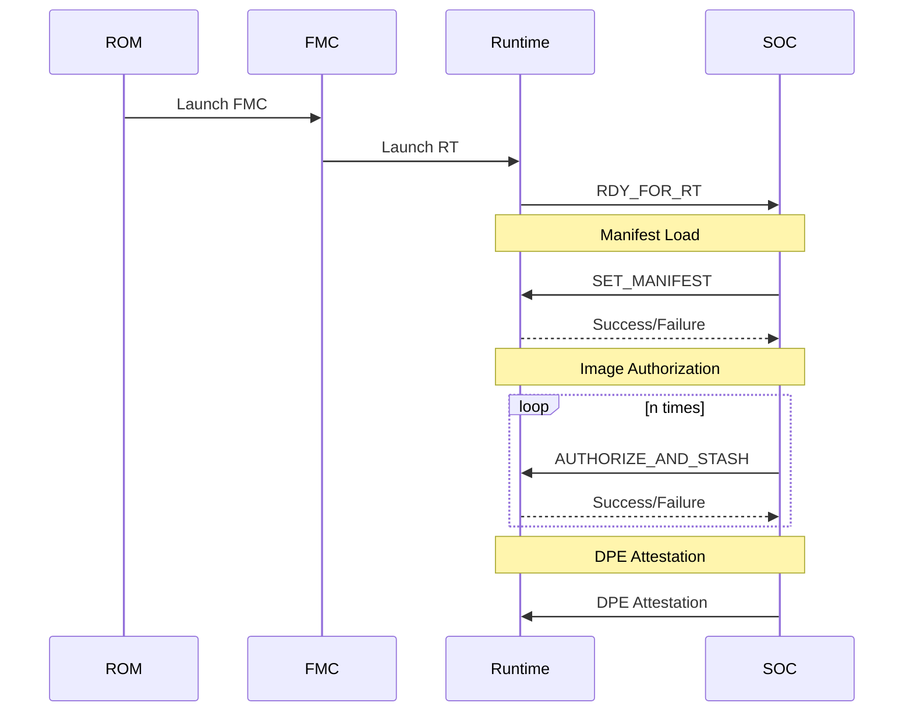

# Caliptra Runtime Firmware v2.0

*Spec version: 0.3*

This specification describes the Caliptra Runtime Firmware.

## Changelog

v1.1:

* [LMS Signature Verification](#lms_signature_verify-new-in-11)

v1.2:

* [Manifest-Based Image Authorization](#manifest-based-image-authorization-new-in-12)

v2.0:

* Add support for passive mode (same as 1.x) and subsystem (or active) mode
* [MCU Runtime loading](#boot-and-initialization) (subsystem mode)
* [Cryptographic mailbox commands](#cryptographic-mailbox-commands-new-in-20)
* `ECDSA384_SIGNATURE_VERIFY` and `LMS_SIGNATURE_VERIFY`require the hash to be included in the message, as the SHA accelerator registers are no longer accessible outside Caliptra.

v2.1:

* [External mailbox commands](#external-mailbox-cmd)

## Spec Opens

* Cryptographic Mailbox: ML-KEM support

## Runtime Firmware environment

This section provides an overview of the Runtime Firmware environment.

### Boot and initialization

The Runtime Firmware main function SHALL perform the following on cold boot reset:

* Initialize the [DICE Protection Environment (DPE)](#dice-protection-environment-dpe)
* Initialize any SRAM structures used by Runtime Firmware
* Upload the firwmare to the Manufacturer Control Unit (2.0, susbystem mode only)

For behavior during other types of reset, see [Runtime firmware updates](#runtime-firmware-updates).

If Runtime Firmware detects that Caliptra was reset during the execution of an operation, Runtime Firmware calls `DISABLE_ATTESTATION` because the internal state of Caliptra may be corrupted.

### Main loop

After booting, Caliptra Runtime Firmware is responsible for the following.

* Wait for mailbox interrupts. On mailbox interrupt, Runtime Firmware:
  * Reads command from mailbox
  * Executes command
  * Writes response to mailbox and sets necessary status registers
  * Sleeps until next interrupt
* On panic, Runtime Firmware:
  * Saves diagnostic information

Callers must wait until Caliptra is no longer busy to call a mailbox command.

### Fault handling

A mailbox command can fail to complete in the following ways:

* Hang or timeout, which result in the watchdog firing
* Unrecoverable panic

In both of these cases, the panic handler writes diagnostic panic information
to registers that are readable by the SoC. Firmware then undergoes an impactless reset.

The caller is expected to check status registers upon reading responses from the
mailbox.

Depending on the type of fault, the SoC may:

* Resubmit the mailbox command
* Attempt to update Runtime Firmware
* Perform a full SoC reset
* Some other SoC-specific behavior

### Drivers

Caliptra Runtime Firmware will share driver code with ROM and FMC where
possible; however, it will have its own copies of all of these drivers linked into
the Runtime Firmware binary.

## Cryptographic Mailbox Commands (new in 2.0)

Cryptographic mailbox (CM) commands are a flexible set of mailbox commands that provide access to Caliptra's cryptographic cabilities.
This is meant for offloaded key storage and use, supporting protocols like SPDM and OCP LOCK.

These commands are not meant to be high-performance as they are accessed via mailbox commands.

CM itself does not provide any storage for the keys: when generated, they are returned to the caller in encrypted form, and must be passed back to be used.

These mailbox commands provide SHA, HMAC, HKDF, AES, RNG, MLDSA, and ECDSA services.

Note that while MLDSA and ECDSA keys can be imported, generated, and used in the cryptographic mailbox commands (i.e., `CM_*` commands) through CMKs, these keys are *NOT* tied DICE or DPE, so their use may be restricted for certain purposes.

MLDSA and ECDSA keys managed by DPE use the separate `ECDSA384_SIGNATURE_VERIFY`, `LMS_SIGNATURE_VERIFY`, and `MLDSA87_SIGNATURE_VERIFY` mailbox commands, which do not use the cryptographic mailbox system and are not managed by CMKs.


### References

* [SPDM 1.3.1 (DSP0274)](https://www.dmtf.org/sites/default/files/standards/documents/DSP0274_1.3.1.pdf), dated 2024-07-01.
* [OCP Attestation v1.1](https://docs.google.com/document/d/1wA0hbJdtCpcQ1NvsVsYr2IeCkwQbgC7e/edit)
* [RFC 5869 (HKDF)](https://www.rfc-editor.org/rfc/rfc5869.html)
* [RFC 8446](https://datatracker.ietf.org/doc/html/rfc8446) Section 7.4.2 & IEEE 1363 (TLS ECDH secret derivation)

### Contexts

Several of the methods, such as SHA and AES, support contexts so that multiple users can have in-flight requests at the same time.

The contexts contain the internal structures necessary to resume operations to support data that may exceed the size of a single mailbox command.

These contexts are intended to be opaque to the user, and SHALL be encrypted and authenticated if they contain sensitive internal data.

### Keys

Cryptographic Mailbox Key (CMKs) are used to store keys. Certain commands generate and return a new CMK. Most commands that use CMKs will also return a new CMK, as it is necessary to track CMKs so that they are not used beyond any relevant limits for their key type.

They are returned from commands that generate keys and must be passed back to Caliptra to be used. These keys are encrypted and opaque to the mailbox caller.

Internally, the unecrypted CMKs have the following structure:

| **Name**      | **Bits** | **Description**                        |
| ------------- | -------- | -------------------------------------- |
| version       | 16       | CMK version. Currently always 1.       |
| length        | 16       | how many bits of key material are used |
| key usage     | 8        | represents which kind of key this is   |
| id            | 24       | ID number                              |
| usage counter | 64       | how many times this key has been used  |
|               |          | This MAY only be tracked for AES keys  |
| key material  | 512      | bits used for the key material         |

The encrypted CMKs have the structure:

| **Name**        | **Bits** | **Description**                |
| --------------- | -------- | ------------------------------ |
| domain          | 32       | reserved                       |
| domain metadata | 128      | reserved                       |
| iv              | 96       |                                |
| ciphertext      | 640      | encrypted CMK data (see above) |
| GCM tag         | 128      |                                |

The total size of the CMK is therefore 128 bytes.

Only the encrypted CMKs will appear in mailbox messages.

The key used to encrypt the CMKs is randomized on reset, which means that CMKs cannot be used between resets.
The IV is a randomized 1-up counter that is incremented for every key created.

#### Key Usage

The internal CMK structure and several commands use a key usage tag to specify how a key can be used:

| **Value** | **Usage** |
| --------- | --------- |
| 0         | Reserved  |
| 1         | HMAC      |
| 2         | HKDF      |
| 3         | AES       |

#### Replay Prevention and Deletion

To prevent replay attacks, Caliptra will have a small table that maps a CMK's internal ID to its last known usage counters.
Whenever a CMK is used, this table is checked and updated.

This is necessary for AES-256-GCM in particular to ensure that keys are only used a certain number of times, as per [NIST SP 800-38D, Section 8.3](https://doi.org/10.6028/NIST.SP.800-38D).
Only AES-256-GCM keys need to be tracked in this table, but other keys MAY be tracked as well.

This requires 96 bits of storage per AES-256-GCM key. These can stored as a sorted list in the DCCM.

## Manifest-Based Image Authorization

Caliptra's goal is to enable integrators to meet standard security requirements for creating cryptographic identity and securely reporting measurements through DICE and DPE Certificate chains and Caliptra-owned private-public key pairs. In addition, Caliptra 1.0 provides an `ECDSA384_SIGNATURE_VERIFY` command to enable an SoC RoT to verify its own FW signatures so that it can develop an SoC secure boot using Caliptra cryptography. Caliptra 1.1 expanded the verify command to a PQC-safe `LMS_SIGNATURE_VERIFY` command. In each of these cases, it is left up to the vendor to ensure that they build a secure environment for introducing and verifying FW integrity and authenticity and then executing mutable FW.

The Caliptra Measurement manifest feature expands on Caliptra-provided secure verifier abilities. The Measurement Manifest feature provides a standard Caliptra-supported definition to enable the following use cases for integrators, vendors, and owners.

* Caliptra-Endorsed Aggregated Measured Boot
* Caliptra-Endorsed Local Verifier

Each of these abilities are tied to Caliptra Vendor and Owner FW signing keys and should be independent of any SoC RoT FW signing keys.

Manifest-based image authorization is implemented via two mailbox commands: [`SET_AUTH_MANIFEST`](#set-auth-manifest), and [`AUTHORIZE_AND_STASH`](#authorize-and-stash).

### Caliptra-Endorsed Aggregated Measured Boot

Aggregated Measured Boot is a verified boot where one signed manifest attests to FW integrity of many different FW measurements. The authenticity of the FW is tied to the trust in the public key signing the measurement manifest, which is endorsed by the Caliptra Vendor and/or Owner FW Keys.

### Caliptra-Endorsed Local Verifier

A local verifier provides an authentication of SoC FW by matching SoC FW measurements with measurements from the Caliptra measurement manifest. In this case, the SoC RoT still has its own FW public-key chain that is verified by the SoC RoT, but in addition the SoC RoT introduces the Caliptra Measurement Manifest, which is endorsed by the Caliptra FW key pair. Caliptra provides approval or disapproval of the measurement of any FW back to the SoC RoT. This effectively provides a multi-factor authentication of SoC FW.

The Caliptra-Endorsed Local Verifier could be required by the owner only or both the vendor and the owner.

The main difference between Caliptra-Endorsed Aggregated Measured Boot and Caliptra-Endorsed Local Verifier is if the SoC RoT is relying on the Measurement Manifest for SoC Secure Boot services as opposed as using it as an additional verification.

### SoC RoT Enforcement of Measurement Manifest

In both use cases, the SoC RoT chooses to provide the Caliptra Measurement Manifest and to enforce the result of the authorization. Caliptra 1.x is not capable of providing any enforcement of measurements for SoC FW execution.

### Caliptra Measurement Manifest Signing Keys Authenticity

Caliptra 1.0 and 1.1 do not put any requirements on how the SoC RoT ensures integrity and authenticity of SoC FW other than requiring the SoC RoT to provide a measurement to Caliptra of any SoC FW before execution. Caliptra Measurement Manifest enables the SoC RoT to perform the integrity check through Caliptra-authorized FW signing keys.

### Unique Measurement Manifest Signing Keys

In order to reduce usage of the Caliptra FW Signing keys, the measurement manifest will be signed by new key pairs: one for the owner and possibly one for the vendor. These new key pairs are endorsed once using a single signature within the Measurement Manifest, thus allowing the measurement manifest keys to be used independently of the Caliptra FW signing keys.

### Caliptra Measurement Manifest Vendor Public Key Authenticity

The Measurement Manifest MUST have an endorsement by the Caliptra Vendor Public Key. In order to fulfill this requirement, the Vendor has 2 options:

* Vendor signing required: The Vendor creates a new Measurement keypair which will sign the measurement manifest and endorses the new public key with the Caliptra FW Vendor Private Key. The signature covers both the new public key as well as the flags field which indicates that the new Measurement Key Pair will be enforced.
* Vendor signing **not** required: Vendor leaves the Vendor public key as all zeros, and clears the flag which enforces vendor signing and then endorses these fields with a signature in the Measurement Manifest. In this case, the Vendor releases ownership of enforcing any specific FW in execution.

### Caliptra Measurement Manifest Owner Public Key Authenticity

Caliptra will always verify the endorsement of the Measurement Manifest Owner Public key and require that it signed the measurement manifest.

This feature is accomplished by having the SoC send a manifest to Caliptra Runtime through the `SET_AUTH_MANIFEST` mailbox command. The manifest will include a set of hashes for the different SoC images. Later, the SOC will ask for authorization for its images from the Caliptra Runtime through the `AUTHORIZE_AND_STASH` new mailbox commands. Caliptra Runtime will authorize the image based on whether its hash was contained in the manifest.

#### Preamble

The manifest begins with the Preamble section, which contains new manifest ECC and either MLDSA or LMS public keys of the vendor and the owner. These public keys correspond to the private keys that sign the Image Metadata Collection (IMC) section. These signatures are included in the Preamble. The Caliptra firmware's private keys endorse the manifest's public keys and these endorsements (i.e., signatures) are part of the Preamble as well.

#### Image Metadata Collection (IMC)

The IMC is a collection of Image Metadata entries (IME). Each IME has a hash that matches one of the multiple SoC images. The manifest vendor and owner private keys sign the IMC. The Preamble holds the IMC signatures. The manifest IMC vendor signatures are optional and are validated only if the Flags field Bit 0 is set to 1. Up to 127 image hashes will be supported.

#### Caliptra Measurement Manifest Keys Endorsement Verification Steps

When Caliptra receives the Measurement Manifest, Caliptra will:

* Verify the vendor endorsement using the Caliptra Vendor FW Public Key and compare with the vendor endorsement signature.
* If the vendor endorsement is invalid, the `SET_AUTH_MANIFEST` command will be rejected.
* If the vendor endorsement is valid, Caliptra will check if a vendor manifest measurement key is required:
    * If the key is required, Caliptra will trust the Vendor Public key that was just endorsed.
    * If the key is not required, Caliptra will not perform any more vendor verifications on this measurement manifest.
* Verify the owner endorsement using the Caliptra owner public key and compare with the owner endorsement signature.
    * If the owner endorsement is invalid, the `SET_AUTH_MANIFEST` command will be rejected.
    * Otherwise, the owner public key will be trusted and Caliptra will use it to verify the overall measurement manifest.

#### Measurement Manifest Version Number

A Measurement Manifest VN is used to ensure that some enforcement is possible if a progression of measurements is required. 32 bits of the existing unused `IDEVID_MANUF_IDENTIFIER` fuse (128 bits) can be repurposed for this. This can be accomplished by updating Caliptra's main specification to redefine the fuse definition and its usage from "Programming time" to "Field Programmable".

### Image Authorization Sequence

The diagram below illustrates how this feature is part of the Caliptra boot flow, and the order of operations needed to use the feature.



## Mailbox commands

All mailbox command codes are little endian.

*Table: Mailbox command result codes*

| **Name**         | **Value**              | Description                                          |
| ---------------- | ---------------------- | ---------------------------------------------------- |
| `SUCCESS`        | `0x0000_0000`          | Mailbox command succeeded                            |
| `BAD_VENDOR_SIG` | `0x5653_4947` ("VSIG") | Vendor signature check failed                        |
| `BAD_OWNER_SIG`  | `0x4F53_4947` ("OSIG") | Owner signature check failed                         |
| `BAD_SIG`        | `0x4253_4947` ("BSIG") | Generic signature check failure (for crypto offload) |
| `BAD_IMAGE`      | `0x4249_4D47` ("BIMG") | Malformed input image                                |
| `BAD_CHKSUM`     | `0x4243_484B` ("BCHK") | Checksum check failed on input arguments             |
| `CME_BAD_CMK`    | `0x434D_424B` ("CMBK") | Invalid CMK                                          |
| `CME_CMK_OFLW`   | `0x434D_424F` ("CMBO") | CMK has been used too many times                     |
| `CME_BAD_CTXT`   | `0x434D_4243` ("CMBC") | Bad context                                          |
| `CME_FULL`       | `0x434D_4546` ("CMEF") | Too many Cryptographic Mailbox usage counters in use |

Relevant registers:

* mbox\_csr -> COMMAND: Command code to execute.
* mbox\_csr -> DLEN: Number of bytes written to mailbox.
* CPTRA\_FW\_ERROR\_NON\_FATAL: Status code of mailbox command. Any result
  other than `SUCCESS` signifies a mailbox command failure.

Mailbox user 0xFFFF_FFFF is reserved for Caliptra internal use. All mailbox
commands from that user will fail.

### FW\_LOAD

The `FIRMWARE_LOAD` command is handled by both ROM and Runtime Firmware.

#### ROM behavior

On cold boot, ROM exposes the `FIRMWARE_LOAD` mailbox command to accept
the firmware image that ROM will boot. This image includes Manifest, FMC, and Runtime
firmware.

#### Runtime Firmware behavior

Caliptra Runtime Firmware also exposes the `FIRMWARE_LOAD` mailbox command for loading
impactless updates. For more information, see [Runtime Firmware updates](#runtime-firmware-updates).

Command Code: `0x4657_4C44` ("FWLD")

*Table: `FIRMWARE_LOAD` input arguments*

| **Name**  | **Type**      | **Description**
| --------  | --------      | ---------------
| data      | u8[...]       | Firmware image to load.

`FIRMWARE_LOAD` returns no output arguments.

### FIRMWARE\_VERIFY

The `FIRMWARE_VERIFY` command is used to verify a Caliptra Firmware Bundle.

Command Code: `0x4657_5652` ("FWVR")

*Table: `FIRMWARE_VERIFY` input arguments*

| **Name**  | **Type**      | **Description**
| --------  | --------      | ---------------
| data      | u8[...]       | Firmware image bundle to verify.

*Table: `FIRMWARE_VERIFY` output arguments*

| **Name** | **Type** | **Description**                                                      |
| -------------- | -------------- | -------------------------------------------------------------------------- |
| chksum         | u32            | Checksum over other output arguments, computed by Caliptra. Little endian. |
| fips_status    | u32            | Indicates if the command is FIPS approved or an error.                     |
| verify_result  | u32            | VERIFY_SUCCESS (0xDEADC0DE), VERIFY_FAILED (0x21523F21)                    |

### CAPABILITIES

Exposes a command to retrieve firmware capabilities

Command Code: `0x4341_5053` ("CAPS")

*Table: `CAPABILITIES` input arguments*

| **Name**  | **Type**      | **Description**
| --------  | --------      | ---------------
| chksum    | u32           | Checksum over other input arguments, computed by the caller. Little endian.

*Table: `CAPABILITIES` output arguments*

| **Name**      | **Type**   | **Description**
| --------      | --------   | ---------------
| chksum        | u32        | Checksum over other output arguments, computed by Caliptra. Little endian.
| fips\_status  | u32        | Indicates if the command is FIPS approved or an error.
| capabilities  | u8[16]     | Firmware capabilities. See table below for details.

*Table: Firmware Capabilities Flags*

| **Name**        | **Bit** | **Description**
| --------------- | ------- | ---------------
| `RT_BASE`       | 64      | Base capabilities for Caliptra Runtime v2.1.
| `RT_OCP_LOCK`   | 65      | Runtime firmware and hardware supports OCP LOCK.

### GET\_IDEV\_ECC384\_CERT

Exposes a command to reconstruct the ECC384 IDEV CERT.

Command Code: `0x4944_4543` ("IDEC")

*Table: `GET_IDEV_ECC384_CERT` input arguments*

| **Name**      | **Type**      | **Description**
| --------      | --------      | ---------------
| chksum        | u32           | Checksum over other input arguments, computed by the caller. Little endian.
| signature\_r  | u8[48]        | R portion of signature of the cert.
| signature\_s  | u8[48]        | S portion of signature of the cert.
| tbs\_size     | u32           | Size of the TBS.
| tbs           | u8[916]       | TBS, with a maximum size of 916. Only bytes up to tbs_size are used.

*Table: `GET_IDEV_ECC384_CERT` output arguments*

| **Name**      | **Type**   | **Description**
| --------      | --------   | ---------------
| chksum        | u32        | Checksum over other output arguments, computed by Caliptra. Little endian.
| fips\_status  | u32        | Indicates if the command is FIPS approved or an error.
| cert\_size    | u32        | Length in bytes of the cert field in use for the IDev ECC384 certificate.
| cert          | u8[1024]   | DER-encoded IDev ECC384 CERT.

### GET\_IDEV\_MLDSA87\_CERT

Exposes a command to reconstruct the MLDSA87 IDEV CERT.

Command Code: `0x4944_4D43` ("IDMC")

*Table: `GET_IDEV_MLDSA87_CERT` input arguments*

| **Name**      | **Type**      | **Description**
| --------      | --------      | ---------------
| chksum        | u32           | Checksum over other input arguments, computed by the caller. Little endian.
| tbs\_size     | u32           | Size of the TBS.
| signature     | u8[4628]      | MLDSA87 signature bytes.
| tbs           | u8[2820]      | TBS, with a maximum size of 2820. Only bytes up to tbs_size are used.

*Table: `GET_IDEV_MLDSA87_CERT` output arguments*

| **Name**      | **Type**   | **Description**
| --------      | --------   | ---------------
| chksum        | u32        | Checksum over other output arguments, computed by Caliptra. Little endian.
| fips\_status  | u32        | Indicates if the command is FIPS approved or an error.
| cert\_size    | u32        | Length in bytes of the cert field in use for the IDev MLDSA87 certificate.
| cert          | u8[...]    | DER-encoded IDev MLDSA87 CERT.

### POPULATE\_IDEV\_ECC384\_CERT

Exposes a command that allows the SoC to provide a DER-encoded
ECC384 IDev certificate on every boot. The ECC384 IDev certificate is added
to the start of the certificate chain.

Command Code: `0x4944_4550` ("IDEP")

*Table: `POPULATE_IDEV_ECC384_CERT` input arguments*

| **Name**     | **Type**      | **Description**
| --------     | --------      | ---------------
| chksum       | u32           | Checksum over other input arguments, computed by the caller. Little endian.
| cert\_size   | u32           | Size of the DER-encoded ECC384 IDevId certificate.
| cert         | u8[1024]      | DER-encoded ECC384 IDev CERT.

*Table: `POPULATE_IDEV_ECC384_CERT` output arguments*

| **Name**      | **Type** | **Description**
| --------      | -------- | ---------------
| chksum        | u32      | Checksum over other output arguments, computed by Caliptra. Little endian.
| fips\_status  | u32      | Indicates if the command is FIPS approved or an error.

### POPULATE\_IDEV\_MLDSA87\_CERT

Exposes a command that allows the SoC to provide a DER-encoded
MLDSA87 IDev certificate on every boot. The MLDSA87 IDev certificate is added
to the start of the certificate chain.

Command Code: `0x4944_4D50` ("IDMP")

*Table: `POPULATE_IDEV_MLDSA87_CERT` input arguments*

| **Name**     | **Type**      | **Description**
| --------     | --------      | ---------------
| chksum       | u32           | Checksum over other input arguments, computed by the caller. Little endian.
| cert\_size   | u32           | Size of the DER-encoded MLDSA87 IDev certificate.
| cert         | u8[8192]      | DER-encoded MLDSA87 IDev CERT.

*Table: `POPULATE_IDEV_MLDSA87_CERT` output arguments*

| **Name**      | **Type** | **Description**
| --------      | -------- | ---------------
| chksum        | u32      | Checksum over other output arguments, computed by Caliptra. Little endian.
| fips\_status  | u32      | Indicates if the command is FIPS approved or an error.

### GET\_IDEV\_ECC384\_INFO

Exposes a command to get the IDEVID ECC384 public key.

Command Code: `0x4944_4549` ("IDEI")

*Table: `GET_IDEV_ECC384_INFO` input arguments*

| **Name**  | **Type**      | **Description**
| --------  | --------      | ---------------
| chksum    | u32           | Checksum over other input arguments, computed by the caller. Little endian.

*Table: `GET_IDEV_ECC384_INFO` output arguments*

| **Name**      | **Type**   | **Description**
| --------      | --------   | ---------------
| chksum        | u32        | Checksum over other output arguments, computed by Caliptra. Little endian.
| fips\_status  | u32        | Indicates if the command is FIPS approved or an error.
| idev\_pub\_x  | u8[48]     | X portion of ECDSA IDevId key.
| idev\_pub\_y  | u8[48]     | Y portion of ECDSA IDevId key.

### GET\_IDEV\_MLDSA87\_INFO

Exposes a command to get the IDEVID MLDSA87 public key.

Command Code: `0x4944_4D49` ("IDMI")

*Table: `GET_IDEV_MLDSA87_INFO` input arguments*

| **Name**  | **Type**      | **Description**
| --------  | --------      | ---------------
| chksum    | u32           | Checksum over other input arguments, computed by the caller. Little endian.

*Table: `GET_IDEV_MLDSA87_INFO` output arguments*

| **Name**       | **Type**   | **Description**
| --------       | --------   | ---------------
| chksum         | u32        | Checksum over other output arguments, computed by Caliptra. Little endian.
| fips\_status   | u32        | Indicates if the command is FIPS approved or an error.
| idev\_pub\_key | u8[2592]   | MLDSA IDevId public key.

### GET\_LDEV\_ECC384\_CERT

Exposes a command to get an LDevID ECC384 certificate signed by ECC384 IDevID private key.

Command Code: `0x4C44_4556` ("LDEV")

*Table: `GET_LDEV_ECC384_CERT` input arguments*

| **Name**  | **Type**      | **Description**
| --------  | --------      | ---------------
| chksum    | u32           | Checksum over other input arguments, computed by the caller. Little endian.

*Table: `GET_LDEV_ECC384_CERT` output arguments*

| **Name**      | **Type**   | **Description**
| --------      | --------   | ---------------
| chksum        | u32        | Checksum over other output arguments, computed by Caliptra. Little endian.
| fips\_status  | u32        | Indicates if the command is FIPS approved or an error.
| data\_size    | u32        | Length in bytes of the valid data in the data field.
| data          | u8[...]    | DER-encoded ECC384 LDevID certificate.

### GET\_LDEV\_MLDSA87\_CERT

Exposes a command to get an LDevID MLDSA87 certificate signed by MLDSA87 IDevID private key.

Command Code: `0x4C44_4D43` ("LDMC")

*Table: `GET_LDEV_MLDSA87_CERT` input arguments*

| **Name**  | **Type**      | **Description**
| --------  | --------      | ---------------
| chksum    | u32           | Checksum over other input arguments, computed by the caller. Little endian.

*Table: `GET_LDEV_MLDSA87_CERT` output arguments*

| **Name**      | **Type**   | **Description**
| --------      | --------   | ---------------
| chksum        | u32        | Checksum over other output arguments, computed by Caliptra. Little endian.
| fips\_status  | u32        | Indicates if the command is FIPS approved or an error.
| data\_size    | u32        | Length in bytes of the valid data in the data field.
| data          | u8[...]    | DER-encoded MLDSA87 LDevID certificate.

### GET\_FMC\_ALIAS\_ECC384\_CERT

Exposes a command to get a FMC alias ECC384 certificate signed by the ECC384 LDevID private key.

Command Code: `0x4345_5246` ("CERF")

*Table: `GET_FMC_ALIAS_ECC384_CERT` input arguments*

| **Name**  | **Type**      | **Description**
| --------  | --------      | ---------------
| chksum    | u32           | Checksum over other input arguments, computed by the caller. Little endian.

*Table: `GET_FMC_ALIAS_ECC384_CERT` output arguments*

| **Name**      | **Type**   | **Description**
| --------      | --------   | ---------------
| chksum        | u32        | Checksum over other output arguments, computed by Caliptra. Little endian.
| fips\_status  | u32        | Indicates if the command is FIPS approved or an error.
| data\_size    | u32        | Length in bytes of the valid data in the data field.
| data          | u8[...]    | DER-encoded FMC alias ECC384 certificate.

### GET\_FMC\_ALIAS\_MLDSA87\_CERT

Exposes a command to get a FMC alias MLDSA87 certificate signed by the MLDSA87 LDevID private key.

Command Code: `0x434D_4346` ("CMCF")

*Table: `GET_FMC_ALIAS_MLDSA87_CERT` input arguments*

| **Name**  | **Type**      | **Description**
| --------  | --------      | ---------------
| chksum    | u32           | Checksum over other input arguments, computed by the caller. Little endian.

*Table: `GET_FMC_ALIAS_MLDSA87_CERT` output arguments*

| **Name**      | **Type**   | **Description**
| --------      | --------   | ---------------
| chksum        | u32        | Checksum over other output arguments, computed by Caliptra. Little endian.
| fips\_status  | u32        | Indicates if the command is FIPS approved or an error.
| data\_size    | u32        | Length in bytes of the valid data in the data field.
| data          | u8[...]    | DER-encoded FMC alias MLDSA87 certificate.

### GET\_RT\_ALIAS\_ECC384\_CERT

Exposes a command to get a Runtime alias ECC384 certificate signed by the ECC384 FMC alias private key.

Command Code: `0x4345_5252` ("CERR")

*Table: `GET_RT_ALIAS_ECC384_CERT` input arguments*

| **Name**  | **Type**      | **Description**
| --------  | --------      | ---------------
| chksum    | u32           | Checksum over other input arguments, computed by the caller. Little endian.

*Table: `GET_RT_ALIAS_ECC384_CERT` output arguments*

| **Name**      | **Type**   | **Description**
| --------      | --------   | ---------------
| chksum        | u32        | Checksum over other output arguments, computed by Caliptra. Little endian.
| fips\_status  | u32        | Indicates if the command is FIPS approved or an error.
| data\_size    | u32        | Length in bytes of the valid data in the data field.
| data          | u8[...]    | DER-encoded Runtime alias ECC384 certificate.

### GET\_RT\_ALIAS\_MLDSA87\_CERT

Exposes a command to get a Runtime alias MLDSA87 certificate signed by the MLDSA87 FMC alias private key.

Command Code: `0x434D_4352` ("CMCR")

*Table: `GET_RT_ALIAS_MLDSA87_CERT` input arguments*

| **Name**  | **Type**      | **Description**
| --------  | --------      | ---------------
| chksum    | u32           | Checksum over other input arguments, computed by the caller. Little endian.

*Table: `GET_RT_ALIAS_MLDSA87_CERT` output arguments*

| **Name**      | **Type**   | **Description**
| --------      | --------   | ---------------
| chksum        | u32        | Checksum over other output arguments, computed by Caliptra. Little endian.
| fips\_status  | u32        | Indicates if the command is FIPS approved or an error.
| data\_size    | u32        | Length in bytes of the valid data in the data field.
| data          | u8[...]    | DER-encoded Runtime alias MLDSA87 certificate.

### ECDSA384\_SIGNATURE\_VERIFY

Verifies an ECDSA P-384 signature. The hash to be verified is taken from the input (new in 2.0).

In the event of an invalid signature, the mailbox command will report CMD_FAILURE
and the cause will be logged as a non-fatal error.

Command Code: `0x4543_5632` ("ECV2")

*Table: `ECDSA384_SIGNATURE_VERIFY` input arguments*

| **Name**     | **Type** | **Description**
| --------     | -------- | ---------------
| chksum       | u32      | Checksum over other input arguments, computed by the caller. Little endian.
| pub\_key\_x  | u8[48]   | X portion of ECDSA verification key.
| pub\_key\_y  | u8[48]   | Y portion of ECDSA verification key.
| signature\_r | u8[48]   | R portion of signature to verify.
| signature\_s | u8[48]   | S portion of signature to verify.
| hash         | u8[48]   | SHA384 digest to verify.

*Table: `ECDSA384_SIGNATURE_VERIFY` output arguments*

| **Name**      | **Type** | **Description**
| --------      | -------- | ---------------
| chksum        | u32      | Checksum over other output arguments, computed by Caliptra. Little endian.
| fips\_status  | u32      | Indicates if the command is FIPS approved or an error.

### LMS\_SIGNATURE\_VERIFY

Verifies an LMS signature. The hash to be verified is taken from the input (new in 2.0).

In the event of an invalid signature, the mailbox command will report CMD_FAILURE
and the cause will be logged as a non-fatal error.

The supported parameter set is limited to those used for the caliptra image signature:
*Table: LMS parameters*
| **Param Name**        | **Value** | **Description**
| --------------        | --------- | ---------------
| LMS algorithm type    | 12        | 12 = LmsSha256N24H15
| LM-OTS algorithm type | 7         | 7 = LmotsSha256N24W4
| n                     | 24        | Bytes of output from sha256/192 hash function
| w                     | 4         | Width (in bits) of the Winternitz coefficient
| h                     | 15        | Height of the tree

Command Code: `0x4C4D_5632` ("LMV2")

*Table: `LMS_SIGNATURE_VERIFY` input arguments*

| **Name**              | **Type** | **Description**
| --------              | -------- | ---------------
| chksum                | u32      | Checksum over other input arguments, computed by the caller. Little endian.
| pub\_key\_tree\_type  | u8[4]    | LMS public key algorithm type. Must equal 12.
| pub\_key\_ots\_type   | u8[4]    | LM-OTS algorithm type. Must equal 7.
| pub\_key\_id          | u8[16]   | "I" Private key identifier
| pub\_key\_digest      | u8[24]   | "T[1]" Public key hash value
| signature\_q          | u8[4]    | Leaf of the Merkle tree where the OTS public key appears
| signature\_ots        | u8[1252] | LM-OTS signature
| signature\_tree\_type | u8[4]    | LMS signature Algorithm type. Must equal 12.
| signature\_tree\_path | u8[360]  | Path through the tree from the leaf associated with the LM-OTS signature to the root
| hash                  | u8[48]   | SHA384 digest to verify.

*Table: `LMS_SIGNATURE_VERIFY` output arguments*

| **Name**    | **Type** | **Description**
| --------    | -------- | ---------------
| chksum      | u32      | Checksum over other output arguments, computed by Caliptra. Little endian.
| fips\_status | u32      | Indicates if the command is FIPS approved or an error.

### MLDSA87_SIGNATURE_VERIFY

Verifies the signature against the message and MLDSA-87 public key.

The public key and signature formats are described in [FIPS 204](https://csrc.nist.gov/pubs/fips/204/final).

The command will only return a success if the signature is valid.

Command Code: `0x4D4C_5632` ("MLV2")

*Table: `MLDSA87_SIGNATURE_VERIFY` input arguments*
| **Name**  | **Type**     | **Description**    |
| --------- | ------------ | ------------------ |
| chksum    | u32          |                    |
| pub_key   | u8[2592]     | Public key         |
| signature | u8[4627]     | Signature to check |
| padding   | u8[1]        |                    |
| data len  | u32          | Length of message  |
| data      | u8[data len] | Message to check   |


*Table: `MLDSA87_SIGNATURE_VERIFY` output arguments*
| **Name**    | **Type** | **Description**            |
| ----------- | -------- | -------------------------- |
| chksum      | u32      |                            |
| fips_status | u32      | FIPS approved or an error  |


### INSTALL\_OWNER\_PK\_HASH

Exposes a command to save the owner public key hash in persistent data.

Command Code: `0x4F57_4E50` ("OWNP")

*Table: `INSTALL_OWNER_PK_HASH` input arguments*

| **Name**  | **Type**      | **Description**
| --------  | --------      | ---------------
| chksum    | u32           | Checksum over other input arguments, computed by the caller. Little endian.
| digest    | u32[12]       | Owner public key hash.

*Table: `INSTALL_OWNER_PK_HASH` output arguments*

| **Name**      | **Type**   | **Description**
| --------      | --------   | ---------------
| chksum        | u32        | Checksum over other output arguments, computed by Caliptra. Little endian.
| fips\_status  | u32        | Indicates if the command is FIPS approved or an error.
| dpe\_result   | u32        | Result code, 0 on success.


### STASH\_MEASUREMENT

Makes a measurement into the DPE default context. This command is intended for
callers who update infrequently and cannot tolerate a changing DPE API surface.

* Call the DPE DeriveContext command with the DefaultContext in the locality of
  the PL0 PAUSER.
* Extend the measurement into PCR31 (`PCR_ID_STASH_MEASUREMENT`).
* **Note**: This command can only be called in the locality of the PL0 PAUSER.

Command Code: `0x4D45_4153` ("MEAS")

*Table: `STASH_MEASUREMENT` input arguments*

| **Name**     | **Type** | **Description**
| --------     | -------- | ---------------
| chksum       | u32      | Checksum over other input arguments, computed by the caller. Little endian.
| metadata     | u8[4]    | 4-byte measurement identifier.
| measurement  | u8[48]   | Data to measure into DPE.
| context      | u8[48]   | Context field for `svn`; e.g., a hash of the public key that authenticated the SVN.
| svn          | u32      | SVN passed to the DPE to be used in the derived child.

*Table: `STASH_MEASUREMENT` output arguments*

| **Name**      | **Type** | **Description**
| --------      | -------- | ---------------
| chksum        | u32      | Checksum over other output arguments, computed by Caliptra. Little endian.
| fips\_status  | u32      | Indicates if the command is FIPS approved or an error.
| dpe\_result   | u32      | Result code of DPE DeriveContext command. Little endian.

### DISABLE\_ATTESTATION

Disables attestation by erasing the CDI and DICE key. This command is intended
for callers who update infrequently and cannot tolerate a changing DPE API
surface. It is intended for situations where Caliptra firmware cannot be loaded
and the SoC must proceed with boot.

Upon receipt of this command, Caliptra's current CDI is replaced with zeroes,
and the associated DICE key is re-derived from the zeroed CDI.

This command is intended to allow the SoC to continue booting for diagnostic
and error reporting. All attestations produced in this mode are expected to
fail certificate chain validation. Caliptra MUST undergo a cold reset in order
to re-enable attestation.

Command Code: `0x4453_424C` ("DSBL")

*Table: `DISABLE_ATTESTATION` input arguments*

| **Name**  | **Type**      | **Description**
| --------  | --------      | ---------------
| chksum    | u32           | Checksum over other input arguments, computed by the caller. Little endian.

*Table: `DISABLE_ATTESTATION` output arguments*

| **Name**      | **Type** | **Description**
| --------      | -------- | ---------------
| chksum        | u32      | Checksum over other output arguments, computed by Caliptra. Little endian.
| fips\_status  | u32      | Indicates if the command is FIPS approved or an error.

### INVOKE\_DPE\_COMMAND

Invokes a serialized DPE command.

Command Code: `0x4450_4543` ("DPEC")

*Table: `INVOKE_DPE_COMMAND` input arguments*

| **Name**     | **Type**      | **Description**
| --------     | --------      | ---------------
| chksum       | u32           | Checksum over other input arguments, computed by the caller. Little endian.
| data\_size   | u32           | Length in bytes of the valid data in the data field.
| data         | u8[...]       | DPE command structure as defined in the DPE iRoT profile.

*Table: `INVOKE_DPE_COMMAND` output arguments*

| **Name**      | **Type**      | **Description**
| --------      | --------      | ---------------
| chksum        | u32           | Checksum over other output arguments, computed by Caliptra. Little endian.
| fips\_status  | u32           | Indicates if the command is FIPS approved or an error.
| data\_size    | u32           | Length in bytes of the valid data in the data field.
| data          | u8[...]       | DPE response structure as defined in the DPE iRoT profile.

### QUOTE\_PCRS\_ECC384

Generates a signed quote over all Caliptra hardware PCRs using the Caliptra PCR ECC384 quoting key.
All PCR values are hashed together with the nonce to produce the quote.

Command Code: `0x5043_5251` ("PCRQ")

*Table: `QUOTE_PCRS_ECC384` input arguments*

| **Name**     | **Type**      | **Description**
| --------     | --------      | ---------------
| chksum       | u32           | Checksum over other input arguments, computed by the caller. Little endian.
| nonce        | u8[32]        | Caller-supplied nonce to be included in signed data.

PcrValue is defined as u8[48]

*Table: `QUOTE_PCRS_ECC384` output arguments*

| **Name**           | **Type**     | **Description**
| --------           | --------     | ---------------
| chksum             | u32          | Checksum over other output arguments, computed by Caliptra. Little endian.
| fips\_status       | u32          | Indicates if the command is FIPS approved or an error.
| PCRs               | PcrValue[32] | Values of all PCRs.
| nonce              | u8[32]       | Return the nonce used as input for convenience.
| reset\_ctrs        | u32[32]      | Reset counters for all PCRs.
| digest             | u8[48]       | Return the lower 48 bytes of SHA2-512 digest over the PCR values and the nonce.
| signature\_r       | u8[48]       | ECC P-384 R portion of the signature over the `ecc_digest`. </br> The FMC Alias ECC P-384 private key stored in Key Vault slot 7 is utilized for the signing operation.
| signature\_s       | u8[48]       | ECC P-384 S portion of the signature over the `ecc_digest`.

### QUOTE\_PCRS\_MLDSA87

Generates a signed quote over all Caliptra hardware PCRs that are using the Caliptra PCR Mldsa87 quoting key.
All PCR values are hashed together with the nonce to produce the quote.

Command Code: `0x5043_524D` ("PCRM")

*Table: `QUOTE_PCRS_MLDSA87` input arguments*

| **Name**     | **Type**      | **Description**
| --------     | --------      | ---------------
| chksum       | u32           | Checksum over other input arguments, computed by the caller. Little endian.
| nonce        | u8[32]        | Caller-supplied nonce to be included in signed data.

PcrValue is defined as u8[48]

*Table: `QUOTE_PCRS_MLDSA87` output arguments*

| **Name**           | **Type**     | **Description**
| --------           | --------     | ---------------
| chksum             | u32          | Checksum over other output arguments, computed by Caliptra. Little endian.
| fips\_status       | u32          | Indicates if the command is FIPS approved or an error.
| PCRs               | PcrValue[32] | Values of all PCRs.
| nonce              | u8[32]       | Return the nonce used as input for convenience.
| reset\_ctrs        | u32[32]      | Reset counters for all PCRs.
| digest             | u8[64]       | Return the SHA2-512 digest over the PCR values and the nonce, in byte reversed order.
| signature          | u8[4628]     | MLDSA-87 signature over the `digest` (4627 bytes + 1 Reserved byte). </br> The FMC Alias MLDSA seed stored in Key Vault slot 8 is utilized to generate the private key, which is subsequently used for the signing operation.

### EXTEND\_PCR

Extends a Caliptra hardware PCR.

Command Code: `0x5043_5245` ("PCRE")

*Table: `EXTEND_PCR` input arguments*

| **Name**     | **Type**      | **Description**
| --------     | --------      | ---------------
| chksum       | u32           | Checksum over other input arguments, computed by the caller. Little endian.
| index        | u32           | Index of the PCR to extend.
| value        | u8[..]        | Value to extend into the PCR at `index`.

*Table: `EXTEND_PCR` output arguments*

| **Name**      | **Type** | **Description**
| --------      | -------- | ---------------
| chksum        | u32      | Checksum over other output arguments, computed by Caliptra. Little endian.
| fips\_status  | u32      | Indicates if the command is FIPS approved or an error.

Note that extensions made into Caliptra's PCRs are _not_ appended to Caliptra's internal PCR log.

### GET\_PCR\_LOG

Gets Caliptra's internal PCR log.

Command Code: `0x504C_4F47` ("PLOG")

*Table: `GET_PCR_LOG` input arguments*

| **Name**  | **Type**      | **Description**
| --------  | --------      | ---------------
| chksum    | u32           | Checksum over other input arguments, computed by the caller. Little endian.

*Table: `GET_PCR_LOG` output arguments*

| **Name**      | **Type**   | **Description**
| --------      | --------   | ---------------
| chksum        | u32        | Checksum over other output arguments, computed by Caliptra. Little endian.
| fips\_status  | u32        | Indicates if the command is FIPS approved or an error.
| data\_size    | u32        | Length in bytes of the valid data in the data field.
| data          | u8[...]    | Internal PCR event log.

See [pcr\_log.rs](../drivers/src/pcr_log.rs) for the format of the log.

Note: the log contents reflect PCR extensions that are made autonomously by Caliptra during boot. The log contents
are not preserved across cold or update resets. Callers who wish to verify PCRs that are autonomously
extended during update reset should cache the log before triggering an update reset.

### INCREMENT\_PCR\_RESET\_COUNTER

Increments the reset counter for a PCR.

Command Code: `0x5043_5252` ("PCRR")

*Table: `INCREMENT_PCR_RESET_COUNTER` input arguments*

| **Name**     | **Type**      | **Description**
| --------     | --------      | ---------------
| chksum       | u32           | Checksum over other input arguments, computed by the caller. Little endian.
| index        | u32           | Index of the PCR for which to increment the reset counter.

*Table: `INCREMENT_PCR_RESET_COUNTER` output arguments*

| **Name**      | **Type** | **Description**
| --------      | -------- | ---------------
| chksum        | u32      | Checksum over other output arguments, computed by Caliptra. Little endian.
| fips\_status  | u32      | Indicates if the command is FIPS approved or an error.

### DPE\_TAG\_TCI

Associates a unique tag with a DPE context.

Command Code: `0x5451_4754` ("TAGT")

*Table: `DPE_TAG_TCI` input arguments*

| **Name**     | **Type**      | **Description**
| --------     | --------      | ---------------
| chksum       | u32           | Checksum over other input arguments, computed by the caller. Little endian.
| handle       | u8[16]        | DPE context handle.
| tag          | u32           | A unique tag that the handle will be associated with.

*Table: `DPE_TAG_TCI` output arguments*

| **Name**      | **Type** | **Description**
| --------      | -------- | ---------------
| chksum        | u32      | Checksum over other output arguments, computed by Caliptra. Little endian.
| fips\_status  | u32      | Indicates if the command is FIPS approved or an error.

### DPE\_GET\_TAGGED\_TCI

Retrieves the TCI measurements corresponding to the tagged DPE context.

Command Code: `0x4754_4744` ("GTGD")

*Table: `DPE_GET_TAGGED_TCI` input arguments*

| **Name**     | **Type**      | **Description**
| --------     | --------      | ---------------
| chksum       | u32           | Checksum over other input arguments, computed by the caller. Little endian.
| tag          | u32           | A unique tag corresponding to a DPE context.

*Table: `DPE_GET_TAGGED_TCI` output arguments*

| **Name**         | **Type**  | **Description**
| --------         | --------  | ---------------
| chksum           | u32       | Checksum over other input arguments, computed by the caller. Little endian.
| fips\_status     | u32       | Indicates if the command is FIPS approved or an error.
| tci\_cumulative  | u8[48]    | Hash of all of the input data provided to the context.
| tci\_current     | u8[48]    | Most recent measurement made into the context.

### FW\_INFO

Retrieves information about the current Runtime Firmware, FMC, and ROM.

NOTE: Additional fields and info may be appended to the response in subsequent FW versions.

Command Code: `0x494E_464F` ("INFO")

*Table: `FW_INFO` input arguments*

| **Name**     | **Type**      | **Description**
| --------     | --------      | ---------------
| chksum       | u32           | Checksum over other input arguments, computed by the caller. Little endian.

*Table: `FW_INFO` output arguments*

| **Name**               | **Type**       | **Description**
| --------               | --------       | ---------------
| chksum                 | u32            | Checksum over other input arguments, computed by the caller. Little endian.
| fips\_status           | u32            | Indicates if the command is FIPS approved or an error.
| pl0_pauser             | u32            | PAUSER with PL0 privileges (from image header).
| firmware_svn           | u32            | Firmware SVN.
| min_firmware_svn       | u32            | Min Firmware SVN.
| cold_boot_fw_svn       | u32            | Cold-boot Firmware SVN.
| attestation_disabled   | u32            | State of attestation disable.
| rom_revision           | u8[20]         | Revision (Git commit ID) of ROM build.
| fmc_revision           | u8[20]         | Revision (Git commit ID) of FMC build.
| runtime_revision       | u8[20]         | Revision (Git commit ID) of runtime build.
| rom_sha256_digest      | u32[8]         | Digest of ROM binary.
| fmc_sha384_digest      | u32[12]        | Digest of FMC binary.
| runtime_sha384_digest  | u32[12]        | Digest of runtime binary.
| owner_pub_key_hash     | u32[12]        | Hash of the owner public keys provided in the image bundle manifest.
| authman_sha384_digest  | u32[12]        | Hash of the authorization manifest provided by SET_AUTH_MANIFEST.
| most_recent_fw_error   | u32            | Most recent FW non-fatal error (shows current non-fatal error if non-zero)

### VERSION

FIPS command to get version info for the module

Command Code: `0x4650_5652` ("FPVR")

Table: `VERSION` input arguments

| **Name**     | **Type**  | **Description**
| --------     | --------  | ---------------
| chksum       | u32       | Checksum over other input arguments, computed by the caller. Little endian.

Table: `VERSION` output arguments

| **Name**     | **Type**  | **Description**
| --------     | --------  | ---------------
| chksum       | u32       | Checksum over other output arguments, computed by Caliptra. Little endian.
| fips_status  | u32       | Indicates if the command is FIPS approved or an error
| mode         | u32       | Mode identifier
| fips_rev     | u32[3]    | [31:0] HW rev ID, [47:32] ROM version, [63:48] FMC version, [95:64] FW version
| name         | u8[12]    | 12 character module name "Caliptra RTM"

### SELF\_TEST\_START

FIPS command to start the self tests

Command Code: `0x4650_4C54`

Table: `SELF_TEST_START` input arguments

| **Name**     | **Type**  | **Description**
| --------     | --------  | ---------------
| chksum       | u32       | Checksum over other input arguments, computed by the caller. Little endian.

Table: `SELF_TEST_START` output arguments

| **Name**     | **Type**  | **Description**
| --------     | --------  | ---------------
| chksum       | u32       | Checksum over other output arguments, computed by Caliptra. Little endian.
| fips_status  | u32       | Indicates if the command is FIPS approved or an error

### SELF\_TEST\_GET\_RESULTS

FIPS command to get the results of the self tests. Mailbox command will return a failure if still active.

Command Code: `0x4650_4C67`

Table: `SELF_TEST_GET_RESULTS` input arguments

| **Name**     | **Type**  | **Description**
| --------     | --------  | ---------------
| chksum       | u32       | Checksum over other input arguments, computed by the caller. Little endian.

Table: `SELF_TEST_GET_RESULTS` output arguments

| **Name**     | **Type**  | **Description**
| --------     | --------  | ---------------
| chksum       | u32       | Checksum over other output arguments, computed by Caliptra. Little endian.
| fips_status  | u32       | Indicates if the command is FIPS approved or an error

### SHUTDOWN

FIPS command to zeroize and shut down the module

Command Code: `0x4650_5344` ("FPSD")

Table: `SHUTDOWN` input arguments

| **Name**     | **Type**  | **Description**
| --------     | --------  | ---------------
| chksum       | u32       | Checksum over other input arguments, computed by the caller. Little endian.

Table: `SHUTDOWN` output arguments

| **Name**     | **Type**  | **Description**
| --------     | --------  | ---------------
| chksum       | u32       | Checksum over other output arguments, computed by Caliptra. Little endian.
| fips_status  | u32       | Indicates if the command is FIPS approved or an error

### ADD\_SUBJECT\_ALT\_NAME

Provides a subject alternative name otherName. Whenever CERTIFY_KEY_EXTENDED is called with the
DMTF_OTHER_NAME flag after ADD_SUBJECT_ALT_NAME is called, the resulting DPE CSR or leaf certificate
will contain a subject alternative name extension containing the provided otherName, which must be a
DMTF device info. All such certificates produced by CERTIFY_KEY_EXTENDED will continue to have the
DMTF otherName subject alternative name extension until reset.

Command Code: `0x414C_544E` ("ALTN")

*Table: `ADD_SUBJECT_ALT_NAME` input arguments*

| **Name**                  | **Type** | **Description**
| --------                  | -------- | ---------------
| chksum                    | u32      | Checksum over other input arguments, computed by the caller. Little endian.
| dmtf\_device\_info\_size  | u32      | The size of the DMTF Device Info UTF8String.
| dmtf\_device\_info        | u8[128]  | The DMTF Device Info UTF8String.

*Table: `ADD_SUBJECT_ALT_NAME` output arguments*

| **Name**     | **Type** | **Description**
| --------     | -------- | ---------------
| chksum       | u32      | Checksum over other output arguments, computed by Caliptra. Little endian.
| fips\_status | u32      | Indicates if the command is FIPS approved or an error.

### CERTIFY\_KEY\_EXTENDED

Produces a DPE leaf certificate or CSR containing custom extensions provided by the SoC.

Command Code: `0x434B_4558` ("CKEX")

*Table: `CERTIFY_KEY_EXTENDED` input arguments*

| **Name**          | **Type** | **Description**                                                             |
| ----------------- | -------- | --------------------------------------------------------------------------- |
| chksum            | u32      | Checksum over other input arguments, computed by the caller. Little endian. |
| certify\_key\_req | u8[72]   | Certify Key Request.                                                        |
| flags             | u32      | Flags determining which custom extensions to include in the certificate.    |

*Table: `CERTIFY_KEY_EXTENDED` input flags*

| **Name**        | **Offset** |
| --------------- | ---------- |
| DMTF_OTHER_NAME | 1 << 31    |

*Table: `CERTIFY_KEY_EXTENDED` output arguments*

| **Name**           | **Type** | **Description**                                                            |
| ------------------ | -------- | -------------------------------------------------------------------------- |
| chksum             | u32      | Checksum over other output arguments, computed by Caliptra. Little endian. |
| fips\_status       | u32      | Indicates if the command is FIPS approved or an error.                     |
| certify\_key\_resp | u8[2176] | Certify Key Response.                                                      |

### SET_AUTH_MANIFEST

The SoC uses this command and `SET_IMAGE_METADTA` to program an image manifest for Manifest-Based Image Authorization to Caliptra. In response to these commands, the Caliptra Runtime will verify the manifest by authenticating the public keys and in turn using them to authenticate the IMC. On successful verification, the Runtime will store the IMEs into DCCM for future use.

Command Code: `0x4154_4D4E` ("ATMN")

*Table: `SET_AUTH_MANIFEST` input arguments*

| **Name**            | **Type**  | **Description**
| --------            | --------  | ---------------
| chksum                        | u32          | Checksum over other input arguments, computed by the caller. Little endian. |
| manifest size                 | u32          | The size of the full Authentication Manifest                                |
| preamble\_marker              | u32          | Marker needs to be 0x4154_4D4E for the preamble to be valid                 |
| preamble\_size                | u32          | Size of the preamble                                                        |
| preamble\_version             | u32          | Version of the preamble                                                     |
| preamble\_flags               | u32          | Manifest flags. See AUTH_MANIFEST_FLAGS below |
| preamble\_vendor\_ecc384\_key | u32[24]      | Vendor ECC384 key with X and Y coordinates in that order                    |
| preamble\_vendor\_pqc\_key    | u32[648]       | Vendor MLDSA-87 or LMS-SHA192-H15 key                                                   |
| preamble\_vendor\_ecc384\_sig | u32[24]      | Vendor ECC384 signature                                                     |
| preamble\_vendor\_PQC\_sig    | u32[1157]    | Vendor MLDSA-87 or LMOTS-SHA192-W4 signature                                            |
| preamble\_owner\_ecc384\_key  | u32[24]      | Owner ECC384 key with X and Y coordinates in that order                     |
| preamble\_owner\_pqc\_key     | u32[648]       | Owner MLDSA-87 or LMS-SHA192-H15 key                                                    |
| preamble\_owner\_ecc384\_sig  | u32[24]      | Owner ECC384 signature                                                      |
| preamble\_owner\_PQC\_sig     | u32[1157]    | Owner MLDSA-87 or LMOTS-SHA192-W4 signature                                             |
| metadata\_vendor\_ecc384\_sig | u32[24]      | Metadata Vendor ECC384 signature                                            |
| metadata\_vendor\_PQC\_sig    | u32[1157]    | Metadata Vendor MLDSA-87 or LMOTS-SHA192-W4 signature                                   |
| metadata\_owner\_ecc384\_sig  | u32[24]      | Metadata Owner ECC384 signature                                             |
| metadata\_owner\_PQC\_sig     | u32[1157]    | Metadata Owner MLDSA-87 or LMOTS-SHA192-W4 signature                                    |
| metadata\_entry\_entry\_count | u32          | number of metadata entries                                                  |
| metadata\_entries             | Metadata[127] | The max number of metadata entries is 127 but less can be used             |


*Table: `AUTH_MANIFEST_FLAGS` input flags*
| **Name**                  | **Value** |
| ------------------------- | --------- |
| VENDOR_SIGNATURE_REQUIRED | 1 << 0    |

*Table: `AUTH_MANIFEST_METADATA_ENTRY` digest entries*


| **Name**               | **Type** | **Description** |
|------------------------|---------|----------------|
| Image Hash              | u8[48]      | SHA2-384 hash of a SOC image. |
| Image_id                | u32            | This corresponds to the `Image Identifier` field in the [SoC Manifest](https://github.com/chipsalliance/caliptra-sw/blob/main-2.x/auth-manifest/README.md)
| Component_id            | u32            | This corresponds to the `Component Id` field in the [SoC Manifest](https://github.com/chipsalliance/caliptra-sw/blob/main-2.x/auth-manifest/README.md)
| flags                   | u32            | This corresponds to the `flags` field in the [SoC Manifest](https://github.com/chipsalliance/caliptra-sw/blob/main-2.x/auth-manifest/README.md)
| Image Load Address High | u32          | This corresponds to the `Image Load Address High` field in the [SoC Manifest](https://github.com/chipsalliance/caliptra-sw/blob/main-2.x/auth-manifest/README.md)
| Image Load Address Low  | u32          | This corresponds to the `Image Load Address Low` field in the [SoC Manifest](https://github.com/chipsalliance/caliptra-sw/blob/main-2.x/auth-manifest/README.md)
| Staging Address High    | u32          | This corresponds to the `Staging Address High` field in the [SoC Manifest](https://github.com/chipsalliance/caliptra-sw/blob/main-2.x/auth-manifest/README.md)
| Staging Address Low     | u32          | This corresponds to the `Staging Address Low` field in the [SoC Manifest](https://github.com/chipsalliance/caliptra-sw/blob/main-2.x/auth-manifest/README.md)
| Classification          | u32          | This corresponds to the `Classification` field in the [SoC Manifest](https://github.com/chipsalliance/caliptra-sw/blob/main-2.x/auth-manifest/README.md)
| Version Number          | u32          | This corresponds to the `Version Number` field in the [SoC Manifest](https://github.com/chipsalliance/caliptra-sw/blob/main-2.x/auth-manifest/README.md)
| Version String          | u8[32]       | This corresponds to the `Version String` field in the [SoC Manifest](https://github.com/chipsalliance/caliptra-sw/blob/main-2.x/auth-manifest/README.md)

### VERIFY_AUTH_MANIFEST

This command verifies the integrity and authenticity of the provided image manifest. Unlike `SET_AUTH_MANIFEST`, it performs validation only and does not persist the manifest in DCCM.

Command Code: `0x4154_564D` ("ATVM")

The input arguments are the same as the `SET_AUTH_MANIFEST` command.


### AUTHORIZE_AND_STASH

The SoC uses this command to request authorization of its various SoC images. This command has the option to receive the image hash directly from SoC or from an external source (e.g., SHA Acc).

The SoC uses this command repeatedly to ask for authorization to run its different images. The Runtime will verify that the image hash is contained in the IMC and will allow or reject the image based on that check. The command also enables stashing of the image hash by default with an option to skip stashing if needed. The SVN field is intended for anti-rollback protection.


Command Code: `0x4154_5348` ("ATSH")

*Table: `AUTHORIZE_AND_STASH` input arguments*

| **Name**    | **Type** | **Description**
| ------------| -------- | ---------------
| chksum      | u32      | Checksum over other input arguments, computed by the caller. Little endian.       |
| fw_id       | u8[4]    | Firmware id of the image, in little-endian format |
| measurement | u8[48]   | Digest of the image requested for authorization. The `source` field needs to be set to '1` for InRequest, otherwise<br />this field is ignored.                                                                                                                                                                                                                                                                                                                                                                                                                                                                                                                                        |
| context     | u8[48]   | Context field for `svn`; e.g., a hash of the public key that authenticated the SVN. |
| svn         | u32      | The version of the image |
| flags       | u32      | See AUTHORIZE_AND_STASH_FLAGS below |
| source      | u32      | This field identifies the source of the digest to be used to compare with the SoC's<br />SHA digest in the SoC Manifest<br /><br />Values<br />1 - InRequest - Use the hash in the 'measurement' field of this command<br /><br />3 - LoadAddress - The image located in the `ImageLoadAddress` will be streamed to the SHA Accelerator to <br />               retrieve the digest that will be used for authorization.<br />4 - ImageStagingAddress - The image located in the `StagingAddress` will be streamed to the SHA Accelerator to<br />               retrieve the digest that will be used for authorization |
| image_size   | u32      | The size of the image to hash. Only valid if source is `ImageLoadAddress` or `StagingAddress` |

*Table: `AUTHORIZE_AND_STASH_FLAGS` input flags*
| **Name**    | **Value** |
| ----------- | --------- |
| SKIP\_STASH | 1 << 0    |

*Table: `AUTHORIZE_AND_STASH` output arguments*
| **Name**        | **Type** | **Description**                                                            |
| --------------- | -------- | -------------------------------------------------------------------------- |
| chksum          | u32      | Checksum over other output arguments, computed by Caliptra. Little endian. |
| fips_status     | u32      | Indicates if the command is FIPS approved or an error.                     |
| auth_req_result | u32      |AUTHORIZE_IMAGE (0xDEADC0DE), IMAGE_NOT_AUTHORIZED (0x21523F21) or IMAGE_HASH_MISMATCH (0x8BFB95CB)

### GET_IMAGE_INFO

The MCU uses this command to retrieve the Image Metadata Entry defined in the SoC Manifest given by an index to the Image Metadata Collection (IMC).

Command Code: `0x494D_4530` ("IME0")

*Table: `GET_IMAGE_INFO` input arguments*

| **Name** | **Type** | **Description**                                                                                                                                                                                   |
| -------------- | -------------- | ------------------------------------------------------------------------------------------------------------------------------------------------------------------------------------------------------- |
| chksum         | u32            | Checksum over other input arguments, computed by the caller. Little endian.                                                                                                                             |
| fw_id          | u32            | Firmware id of the image, in little-endian format

*Table: `GET_IMAGE_INFO` output arguments*

| **Name** | **Type** | **Description**                                                                                                                                                                                         |
| -------------- | -------------- | ------------------------------------------------------------------------------------------------------------------------------------------------------------------------------------------------------------- |
| chksum         | u32            | Checksum over other output arguments, computed by Caliptra. Little endian.                                                                                                                                    |
| fips_status    | u32            | Indicates if the command is FIPS approved or an error.                                                                                                                                                        |
| Component_id      | u32            | This corresponds to the `Component Id` field in the [SoC Manifest](https://github.com/chipsalliance/caliptra-sw/blob/main-2.x/auth-manifest/README.md)
| flags          | u32            | This corresponds to the `flags` field in the [SoC Manifest](https://github.com/chipsalliance/caliptra-sw/blob/main-2.x/auth-manifest/README.md)
| Image Load Address High | u32          | This corresponds to the `Image Load Address High` field in the [SoC Manifest](https://github.com/chipsalliance/caliptra-sw/blob/main-2.x/auth-manifest/README.md)
| Image Load Address Low  | u32          | This corresponds to the `Image Load Address Low` field in the [SoC Manifest](https://github.com/chipsalliance/caliptra-sw/blob/main-2.x/auth-manifest/README.md)
| Staging Address High    | u32          | This corresponds to the `Staging Address High` field in the [SoC Manifest](https://github.com/chipsalliance/caliptra-sw/blob/main-2.x/auth-manifest/README.md)
| Staging Address Low     | u32          | This corresponds to the `Staging Address Low` field in the [SoC Manifest](https://github.com/chipsalliance/caliptra-sw/blob/main-2.x/auth-manifest/README.md)
| Classification          | u32          | This corresponds to the `Classification` field in the [SoC Manifest](https://github.com/chipsalliance/caliptra-sw/blob/main-2.x/auth-manifest/README.md)
| Version Number          | u32          | This corresponds to the `Version Number` field in the [SoC Manifest](https://github.com/chipsalliance/caliptra-sw/blob/main-2.x/auth-manifest/README.md)
| Version String          | u8[32]       | This corresponds to the `Version String` field in the [SoC Manifest](https://github.com/chipsalliance/caliptra-sw/blob/main-2.x/auth-manifest/README.md)


### ACTIVATE_FIRMWARE

The MCU uses this command to 'activate' the image that has been previously downloaded through PLDM - T5.
For the full behavior of this command, refer to the [Subsystem Support for Hitless Updates](https://github.com/chipsalliance/Caliptra/blob/main/doc/Caliptra.md#subsystem-support-for-hitless-updates) specification.

Command Code: `0x4143_5446` ("ACTF")

*Table: `ACTIVATE_FIRMWARE` input arguments*

| **Name** | **Type** | **Description**                                                       |
| -------------- | -------------- | --------------------------------------------------------------------------- |
| chksum         | u32            | Checksum over other input arguments, computed by the caller. Little endian. |
| count          | u32            | Number of image_ids to activate. Item count of image_ids array parameter |
| mcu_image_size | u32            | Size of MCU image, if included in the activation |
| image_ids      | Array of u8[4] | Array of Image ids in little-endian format                           |

*Table: `ACTIVATE_FIRMWARE` output arguments*

| **Name** | **Type** | **Description**                                                      |
| -------------- | -------------- | -------------------------------------------------------------------------- |
| chksum         | u32            | Checksum over other output arguments, computed by Caliptra. Little endian. |
| fips_status    | u32            | Indicates if the command is FIPS approved or an error.                     |

## Mailbox commands: OCP LOCK v1.0

These commands are defined in the OCP LOCK v1.0 [specification](https://github.com/chipsalliance/Caliptra/blob/main/doc/ocp_lock/releases/OCP_LOCK_Specification_v1.0_RC2.pdf).

### ENUMERATE_HPKE_HANDLES
### REPORT_HEK_METADATA
### GET_ALGORITHMS
### INITIALIZE_MEK_SECRET

## Mailbox commands: Cryptographic Mailbox (2.0)

These commands are used by the [Cryptograhic Mailbox](#cryptographic-mailbox-commands-new-in-20) system.

### CM_SHA_INIT

This starts the computation of a SHA hash of data, which may be larger than a single mailbox command allows. It also supports additional algorithms.

The sequence to use these are:
* 1 `CM_SHA_INIT` command
* 0 or more `CM_SHA_UPDATE` commands
* 1 `CM_SHA_FINAL` command

For each command, the context from the previous command's output must be passed as an input.

The `SHA_CONTEXT_SIZE` is always exactly 200 bytes long.

The maximum supported data size for the SHA commands is 4096 bytes.

Command Code: `0x434D_5349` ("CMSI")

*Table: `CM_SHA_INIT` input arguments*

| **Name**       | **Type**      | **Description**    |
| -------------- | ------------- | ------------------ |
| chksum         | u32           |                    |
| hash algorithm | u32           | Enum.              |
|                |               | Value 0 = reserved |
|                |               | Value 1 = SHA2-384 |
|                |               | Value 2 = SHA2-512 |
| data size      | u32           |                    |
| data           | u8[data size] | Data to hash       |

*Table: `CM_SHA_INIT` output arguments*
| **Name**     | **Type**             | **Description**                            |
| ------------ | -------------------- | ------------------------------------------ |
| chksum       | u32                  |                                            |
| fips_status  | u32                  | FIPS approved or an error                  |
| context      | u8[SHA_CONTEXT_SIZE] | Passed to `CM_SHA_UPDATE` / `CM_SHA_FINAL` |

*Table: `CM_SHA_INIT` / `CM_SHA_UPDATE` / `CM_SHA_FINAL` internal context*
| **Name**          | **Type** | **Description** |
| ----------------- | -------- | --------------- |
| input buffer      | u8[128]  |                 |
| intermediate hash | u8[64]   |                 |
| length            | u32      |                 |
| hash algorithm    | u32      |                 |

### CM_SHA_UPDATE

This continues a SHA computation started by `CM_SHA_INIT` or from another `CM_SHA_UPDATE`.

The context MUST be passed in from `CM_SHA_INIT` or `CM_SHA_UPDATE`.

Command Code: `0x434D_5355` ("CMSU")

*Table: `CM_SHA_UPDATE` input arguments*
| **Name**     | **Type**             | **Description**                      |
| ------------ | -------------------- | ------------------------------------ |
| chksum       | u32                  |                                      |
| context      | u8[SHA_CONTEXT_SIZE] | From `CM_SHA_INIT` / `CM_SHA_UPDATE` |
| data size    | u32                  |                                      |
| data         | u8[data size]        | Data to hash                         |

*Table: `CM_SHA_UPDATE` output arguments*
| **Name**     | **Type**             | **Description**                            |
| ------------ | -------------------- | ------------------------------------------ |
| chksum       | u32                  |                                            |
| fips_status  | u32                  | FIPS approved or an error                  |
| context      | u8[SHA_CONTEXT_SIZE] | Passed to `CM_SHA_UPDATE` / `CM_SHA_FINAL` |

### CM_SHA_FINAL

This finalizes the computation of a SHA and produces the hash of all of the data.

The context MUST be passed in from `CM_SHA_INIT` or `CMA_SHA_UPDATE`.

Command Code: `0x434D_5346` ("CMSF")

*Table: `CM_SHA_FINAL` input arguments*
| **Name**     | **Type**             | **Description**                      |
| ------------ | -------------------- | ------------------------------------ |
| chksum       | u32                  |                                      |
| context      | u8[SHA_CONTEXT_SIZE] | From `CM_SHA_INIT` / `CM_SHA_UPDATE` |
| data size    | u32                  | May be 0                             |
| data         | u8[data size]        | Data to hash                         |

*Table: `CM_SHA_FINAL` output arguments*
| **Name**    | **Type**      | **Description**           |
| ----------- | ------------- | ------------------------- |
| chksum      | u32           |                           |
| fips_status | u32           | FIPS approved or an error |
| hash size   | u32           |                           |
| hash        | u8[hash size] |                           |

### CM\_HMAC

Computes an HMAC according to [RFC 2104](https://datatracker.ietf.org/doc/html/rfc2104) with select SHA algorithm support. The data must fit into a single mailbox command.

The CMK must have been created for HMAC / HKDF usage.

Command Code: `0x434D_484D` ("CMHM")

*Table: `CM_HMAC` input arguments*
| **Name**       | **Type**      | **Description**   |
| -------------- | ------------- | ----------------- |
| chksum         | u32           |                   |
| CMK            | CMK           | CMK to use as key |
| hash algorithm | u32           | Enum.             |
|                |               | 0 = reserved      |
|                |               | 1 = SHA2-384      |
|                |               | 2 = SHA2-512      |
| data size      | u32           |                   |
| data           | u8[data size] | Data to MAC       |


*Table: `CM_HMAC` output arguments*
| **Name**    | **Type**     | **Description**           |
| ----------- | ------------ | ------------------------- |
| chksum      | u32          |                           |
| fips_status | u32          | FIPS approved or an error |
| mac size    | u32          |                           |
| mac         | u8[mac size] |                           |

### CM_HMAC_KDF_COUNTER

Implements HMAC KDF in Counter Moder as specified in  as specified in [RFC 5869](https://www.rfc-editor.org/rfc/rfc5869.html) and [NIST SP800-108](https://csrc.nist.gov/pubs/sp/800/108/r1/upd1/final) Section 4.1 (KDF in Counter Mode, Section 4.1).

The CMK must have been created for HMAC usage.

The output length will be automatically chosen to match the key usage.

Command Code: `0x434D_4B43` ("CMKC")

*Table: `CM_HMAC_KDF_COUNTER` input arguments*
| **Name**       | **Type**       | **Description**           |
| -------------- | -------------- | ------------------------- |
| chksum         | u32            |                           |
| KIN CMK        | CMK            | Input key                 |
| hash algorithm | u32            | Enum.                     |
|                |                | Value 0 = reserved        |
|                |                | Value 1 = SHA2-384        |
|                |                | Value 2 = SHA2-512        |
| key usage      | u32            | usage tag of output key   |
| key size       | u32            | size (in bytes) for the output key; MUST be valid for the key usage |
| label size     | u32            |                           |
| label          | u8[label size] |                           |

*Table: `CM_HMAC_KDF_COUNTER` output arguments*
| **Name**    | **Type** | **Description**                         |
| ----------- | -------- | --------------------------------------- |
| chksum      | u32      |                                         |
| fips_status | u32      | FIPS approved or an error               |
| KOUT CMK    | CMK      | CMK that stores the output key material |

### CM_HKDF_EXTRACT

Implements HKDF-Extract as specified in [RFC 5869](https://www.rfc-editor.org/rfc/rfc5869.html).

The CMKs for IKM and salt must have been created for HMAC usage. The output will be tagged for HMAC usage.

Use CM_IMPORT to import non-secret (plaintext) salt or IKMs to use
with HKDF-Extract after right-padding to 48 or 64 bytes with zeros.

Command Code: `0x434D_4B54` ("CMKT")

*Table: `CM_HKDF_EXTRACT` input arguments*
| **Name**       | **Type** | **Description**           |
| -------------- | -------- | ------------------------- |
| chksum         | u32      |                           |
| hash algorithm | u32      | Enum.                     |
|                |          | Value 0 = reserved        |
|                |          | Value 1 = SHA2-384        |
|                |          | Value 2 = SHA2-512        |
| salt CMK       | CMK      | Salt CMK.                 |
| IKM CMK        | CMK      | Input key material CMK    |

*Table: `CM_HKDF_EXTRACT` output arguments*
| **Name**    | **Type** | **Description**                         |
| ----------- | -------- | --------------------------------------- |
| chksum      | u32      |                                         |
| fips_status | u32      | FIPS approved or an error               |
| PRK CMK     | u8[32]   | CMK that stores the output (PRK) to use |
|             |          | with HKDF-Expand                        |

### CM_HKDF_EXPAND

Implements HKDF-Expand as specified in [RFC 5869](https://www.rfc-editor.org/rfc/rfc5869.html).

The CMK must have been created for HMAC usage.

The output length will be automatically chosen to match the key usage.

Command Code: `0x434D_4B50` ("CMKP")

*Table: `CM_HKDF_EXPAND` input arguments*
| **Name**       | **Type**      | **Description**                 |
| -------------- | ------------- | ------------------------------- |
| chksum         | u32           |                                 |
| PRK CMK        | CMK           |                                 |
| hash algorithm | u32           | Enum.                           |
|                |               | Value 0 = reserved              |
|                |               | Value 1 = SHA2-384              |
|                |               | Value 2 = SHA2-512              |
| key usage      | u32           | usage tag of output key         |
| key size       | u32           | size (in bytes) for the OKM;    |
|                |               | MUST be valid for the key usage |
| info size      | u32           |                                 |
| info           | u8[info size] |                                 |

*Table: `CM_HKDF_EXPAND` output arguments*
Command Code: `0x434D_4B43` ("CMKC")

| **Name**    | **Type** | **Description**                         |
| ----------- | -------- | --------------------------------------- |
| chksum      | u32      |                                         |
| fips_status | u32      | FIPS approved or an error               |
| OKM CMK     | CMK      | CMK that stores the output key material |


### CM_MLDSA_PUBLIC_KEY

Returns the public key associated with the MLDSA-87 key (seed) in a CMK.

The public key format is described in [FIPS 204](https://csrc.nist.gov/pubs/fips/204/final).

Command Code: `0x434D_4D50` ("CMMP")

*Table: `CM_MLDSA_PUBLIC_KEY` input arguments*
| **Name** | **Type** | **Description**   |
| -------- | -------- | ----------------- |
| chksum   | u32      |                   |
| CMK      | CMK      | Private key seed  |

*Table: `CM_MLDSA_PUBLIC_KEY` output arguments*
| **Name**    | **Type** | **Description**            |
| ----------- | -------- | -------------------------- |
| chksum      | u32      |                            |
| fips_status | u32      | FIPS approved or an error  |
| Public key  | u8[2592] | Public key                 |

### CM_MLDSA_SIGN

Signs the message with the MLDSA-87 key.

The signature format is described in [FIPS 204](https://csrc.nist.gov/pubs/fips/204/final).

Command Code: `0x434D_4D53` ("CMMS")

*Table: `CM_MLDSA_SIGN` input arguments*
| **Name** | **Type**     | **Description**   |
| -------- | ------------ | ----------------- |
| chksum   | u32          |                   |
| CMK      | CMK          | Private key seed  |
| data len | u32          | Length of message |
| data     | u8[data len] | Message to sign   |

*Table: `CM_MLDSA_SIGN` output arguments*
| **Name**    | **Type** | **Description**            |
| ----------- | -------- | -------------------------- |
| chksum      | u32      |                            |
| fips_status | u32      | FIPS approved or an error  |
| signature   | u8[4627] | Signature                  |
| padding     | u8[1]    |                            |

### CM_MLDSA_VERIFY

Verifies the signature against the message and MLDSA-87 key.

The signature format is described in [FIPS 204](https://csrc.nist.gov/pubs/fips/204/final).

The command will only return a success if the signature is valid.

Command Code: `0x434D_4D56` ("CMMV")

*Table: `CM_MLDSA_VERIFY` input arguments*
| **Name**  | **Type**     | **Description**    |
| --------- | ------------ | ------------------ |
| chksum    | u32          |                    |
| CMK       | CMK          | Private key seed   |
| signature | u8[4627]     | Signature to check |
| padding   | u8[1]        |                    |
| data len  | u32          | Length of message  |
| data      | u8[data len] | Message to check   |

*Table: `CM_MLDSA_VERIFY` output arguments*
| **Name**    | **Type** | **Description**            |
| ----------- | -------- | -------------------------- |
| chksum      | u32      |                            |
| fips_status | u32      | FIPS approved or an error  |

### CM_ECDSA_PUBLIC_KEY

Returns the public key associated with the ECDSA-384 key seed in a CMK.

The public key consists of its `x` and `y` values described in [FIPS 186-5](https://csrc.nist.gov/pubs/fips/186-5/final) encoded in big-endian byte order.

Command Code: `0x434D_4550` ("CMEP")

*Table: `CM_ECDSA_PUBLIC_KEY` input arguments*
| **Name** | **Type** | **Description**   |
| -------- | -------- | ----------------- |
| chksum   | u32      |                   |
| CMK      | CMK      | Private key seed  |

*Table: `CM_ECDSA_PUBLIC_KEY` output arguments*
| **Name**    | **Type** | **Description**            |
| ----------- | -------- | -------------------------- |
| chksum      | u32      |                            |
| fips_status | u32      | FIPS approved or an error  |
| pubkey_x    | u8[48]   | The X BigNum of the ECDSA public key generated from the seed  |
| pubkey_y    | u8[48]   | The Y BigNum of the ECDSA public key generated from the seed  |

### CM_ECDSA_SIGN

Signs the SHA384 hash of the message with the ECDSA-384 key.

The signature consists of its `r` and `s` values described in [FIPS 186-5](https://csrc.nist.gov/pubs/fips/186-5/final) encoded in big-endian byte order.

Command Code: `0x434D_5D53` ("CMES")

*Table: `CM_ECDSA_SIGN` input arguments*
| **Name** | **Type**     | **Description**   |
| -------- | ------------ | ----------------- |
| chksum   | u32          |                   |
| CMK      | CMK          | Private key seed  |
| data len | u32          | Length of message |
| data     | u8[data len] | Message to sign   |

*Table: `CM_ECDSA_SIGN` output arguments*
| **Name**     | **Type** | **Description**                      |
| ------------ | -------- | ------------------------------------ |
| chksum       | u32      |                                      |
| fips_status  | u32      | FIPS approved or an error            |
| signature_r  | u8[48]   | The R BigNum of the ECDSA signature  |
| signature_s  | u8[48]   | The S BigNum of the ECDSA signature  |

### CM_ECDSA_VERIFY

Verifies the signature against the SHA384 hash of the message and ECDSA-384 key.

The signature consists of its `r` and `s` values described in [FIPS 186-5](https://csrc.nist.gov/pubs/fips/186-5/final) encoded in big-endian byte order.

The command will only return a success if the signature is valid.

Command Code: `0x434D_4556` ("CMEV")

*Table: `CM_ECDSA_VERIFY` input arguments*
| **Name**     | **Type**     | **Description**                     |
| ------------ | ------------ | ----------------------------------- |
| chksum       | u32          |                                     |
| CMK          | CMK          | Private key seed                    |
| signature_r  | u8[48]       | The R BigNum of an ECDSA signature  |
| signature_s  | u8[48]       | The S BigNum of an ECDSA signature  |
| data len     | u32          | Length of message  |
| data         | u8[data len] | Message to check   |

*Table: `CM_ECDSA_VERIFY` output arguments*
| **Name**    | **Type** | **Description**            |
| ----------- | -------- | -------------------------- |
| chksum      | u32      |                            |
| fips_status | u32      | FIPS approved or an error  |

### CM_AES_ENCRYPT_INIT

Generic AES operation for unauthenticated AES operations.
AES GCM operations use separate commands elsewhere.

AES-256-CBC only supports using a random 128-bit IV.

For CBC, the size must be a multiple of 16 bytes.
CTR mode supports input of any size up to the maximum cryptographic mailbox size.

The CMK must have been created for AES usage.

Command Code: `0x434D_4349` ("CMCI")

*Table: `CM_AES_ENCRYPT_INIT` input arguments*
| **Name**       | **Type**           | **Description**                       |
| -------------- | ------------------ | ------------------------------------- |
| chksum         | u32                |                                       |
| CMK            | CMK                | CMK of the key to use to encrypt      |
| mode/flags     | u32                | Requested mode and flags.             |
|                |                    | 0 = Reserved                          |
|                |                    | 1 = CBC                               |
|                |                    | 2 = CTR                               |
| plaintext size | u32                | MUST be non-zero                      |
| plaintext      | u8[plaintext size] | Data to encrypt                       |

*Table: `CM_AES_ENCRYPT_INIT` output arguments*
| **Name**        | **Type**            | **Description**                  |
| --------------- | ------------------- | -------------------------------- |
| chksum          | u32                 |                                  |
| fips_status     | u32                 | FIPS approved or an error        |
| context         | AES_CONTEXT         |                                  |
| iv              | u8[16]              |                                  |
| ciphertext size | u32                 |                                  |
| ciphertext      | u8[ciphertext size] | Output encrypted data            |

The encrypted and authenticated context's internal structure will be:

*Table: internal context for CM_AES_* operations*
| **Name**       | **Type** | **Description**                |
| -------------- | -------- | ------------------------------ |
| mode           | u32      |                                |
| key            | u8[32]   |                                |
| iv             | u8[16]   |                                |
| reserved       | u8[76]   | Reserved for additional fields |

The size of the (encrypted) context is always exactly 156 bytes,
and we will use the type `AES_CONTEXT` to represent `u8[156]`.

### CM_AES_ENCRYPT_UPDATE

This continues (or finishes) an AES computation started by `CM_AES_ENCRYPT_INIT` or from another `CM_AES_ENCRYPT_UPDATE`.

There is no `CM_AES_ENCRYPT_FINISH` since unauthenticated AES modes do not output a final tag.

The context MUST be passed in from `CM_AES_ENCRYPT_INIT` or `CM_AES_ENCRYPT_UPDATE`.

For CBC, the size must be a multiple of 16 bytes.
CTR mode supports input of any size up to the maximum cryptographic mailbox size.

Command Code: `0x434D_4355` ("CMCU")

*Table: `CM_AES_ENCRYPT_UPDATE` input arguments*
| **Name**       | **Type**           | **Description**  |
| -------------- | ------------------ | ---------------- |
| chksum         | u32                |                  |
| context        | AES_CONTEXT        |                  |
| plaintext size | u32                | MUST be non-zero |
| plaintext      | u8[plaintext size] | Data to encrypt  |

*Table: `CM_AES_ENCRYPT_UPDATE` output arguments*
| **Name**       | **Type**            | **Description**           |
| -------------- | ------------------- | ------------------------- |
| chksum         | u32                 |                           |
| fips_status    | u32                 | FIPS approved or an error |
| context        | AES_CONTEXT     |                               |
| cipertext size | u32                 |                           |
| ciphertext     | u8[ciphertext size] |                           |

### CM_AES_DECRYPT_INIT

Starts an AES-256 unauthenaticed decryption computation.

The CMK must have been created for AES usage.

For CBC, the size must be a multiple of 16 bytes.
CTR mode supports input of any size up to the maximum cryptographic mailbox size.

The IV must match what was passed and returned from the initial encryption operation.

Command Code: `0x434D_414A` ("CMAJ")

*Table: `CM_AES_DECRYPT_INIT` input arguments*
| **Name**        | **Type**            | **Description**           |
| --------------- | ------------------- | ------------------------- |
| chksum          | u32                 |                           |
| CMK             | CMK                 | CMK to use for decryption |
| mode/flags      | u32                 | Requested mode and flags. |
|                 |                     | 0 = Reserved              |
|                 |                     | 1 = CBC                   |
|                 |                     | 2 = CTR                   |
| iv              | u8[16]              |                           |
| ciphertext size | u32                 | MUST be non-zero          |
| ciphertext      | u8[ciphertext size] | Data to decrypt           |

*Table: `CM_AES_DECRYPT_INIT` output arguments*
| **Name**       | **Type**           | **Description**           |
| -------------- | ------------------ | ------------------------- |
| chksum         | u32                |                           |
| fips_status    | u32                | FIPS approved or an error |
| context        | AES_CONTEXT        |                           |
| plaintext size | u32                |                           |
| plaintext      | u8[plaintext size] | Decrypted data            |

The encrypted and authenticated context's internal structure will be the same as for encryption.

### CM_AES_DECRYPT_UPDATE

This continues an AES computation started by `CM_AES_DECRYPT_INIT` or from another `CM_AES_DECRYPT_UPDATE`.

There is no `CM_AES_DECRYPT_FINISH` since unauthenticated modes do not output a final tag.

The context MUST be passed in from `CM_AES_DECRYPT_INIT` or `CM_AES_DECRYPT_UPDATE`.

For CBC, the size must be a multiple of 16 bytes.
CTR mode supports input of any size up to the maximum cryptographic mailbox size.

Command Code: `0x434D_4155` ("CMAU")

*Table: `CM_AES_DECRYPT_UPDATE` input arguments*
| **Name**        | **Type**            | **Description**  |
| --------------- | ------------------- | ---------------- |
| chksum          | u32                 |                  |
| context         | AES_CONTEXT         |                  |
| ciphertext size | u32                 | MUST be non-zero |
| ciphertext      | u8[ciphertext size] | Data to decrypt  |

*Table: `CM_AES_DECRYPT_UPDATE` output arguments*
| **Name**       | **Type**           | **Description**           |
| -------------- | ------------------ | ------------------------- |
| chksum         | u32                |                           |
| fips_status    | u32                | FIPS approved or an error |
| context        | AES_CONTEXT        |                           |
| plaintext size | u32                |                           |
| plaintext      | u8[plaintext size] | Decrypted data            |

### CM_AES_GCM_ENCRYPT_INIT

Currently only supports AES-256-GCM with a random 96-bit IV.

Additional authenticated data (AAD) can only be passed during the `INIT` command, so is limited to the maximum cryptographic mailbox data size (4096 bytes).

The CMK must have been created for AES usage, except if the SPDM mode flag has been used, in which case the CMK must have been created for HMAC usage.

Command Code: `0x434D_4749` ("CMGI")

*Table: `CM_AES_GCM_ENCRYPT_INIT` input arguments*
| **Name**       | **Type**           | **Description**                  |
| -------------- | ------------------ | -------------------------------- |
| chksum         | u32                |                                  |
| reserved       | u32                |                                  |
| CMK            | CMK                | CMK of the key to use to encrypt |
| aad size       | u32                |                                  |
| aad            | u8[aad size]       | Additional authenticated data    |

*Table: `CM_AES_GCM_ENCRYPT_INIT` output arguments*
| **Name**       | **Type**            | **Description**                  |
| -------------- | ------------------- | -------------------------------- |
| chksum         | u32                 |                                  |
| fips_status    | u32                 | FIPS approved or an error        |
| context        | AES_GCM_CONTEXT     |                                  |
| iv             | u8[12]              |                                  |

The encrypted and authenticated context's internal structure will be:

*Table: internal context for CM_AES_GCM_ENCRYPT_* operations*
| **Name**       | **Type** | **Description**             |
| -------------- | -------- | --------------------------- |
| key            | u8[32]   |                             |
| iv             | u8[12]   |                             |
| aad length     | u32      |                             |
| GHASH state    | u8[16]   |                             |
| current length | u32      | value mod 16 is buffer size |
| buffer         | u8[16]   |                             |
| reserved       | u8[16]   |                             |

The size of the (encrypted) context is always exactly 128 bytes,
and we will use the type `AES_GCM_CONTEXT` to represent `u8[128]` below.


### CM_AES_GCM_SPDM_ENCRYPT_INIT

Derives the AES key and IV following the [SPDM 1.4](https://www.dmtf.org/dsp/dsp0274) and [Secured Messages using SPDM 1.1](https://www.dmtf.org/dsp/dsp0277) specifications.

Currently only supports AES-256-GCM.

Additional authenticated data (AAD) can only be passed during the `INIT` command, so is limited to the maximum cryptographic mailbox data size (4096 bytes).

The CMK must have been created for **HMAC** usage.

The CMK passed in should be the SPDM major secret CMK created for HMAC usage. The key and IV used for encryption shall follow the [SPDM 1.4](https://www.dmtf.org/dsp/dsp0274) section 12.7 derivation with `key_length` equal to 32 bytes and `iv_length` equal to 12 bytes.

```
EncryptionKey = HKDF-Expand(major-secret, bin_str5, key_length);
IV = HKDF-Expand(major-secret, bin_str6, iv_length);
bin_str5 = BinConcat(key_length, Version, "key", null);
bin_str6 = BinConcat(iv_length, Version, "iv", null);
```

The provided 64-bit message counter will be XOR'd with the IV to produce the message IV. The Secure SPDM standard requires the counter endianness flag to be little, but big endian is also supported to aid in compatibility with some implementations.

Note that it is **critical** that the same CMK and counter never be used more than once when encrypting or decrypting in SPDM mode as doing so could compromise the plaintext of the messages.

For the update and final operations, there are not any SPDM-specific commands; `CM_AES_GCM_ENCRYPT_UPDATE` and `CM_AES_GCM_ENCRYPT_FINAL` should be used.

Command Code: `0x434D_5345` ("CMSE")

*Table: `CM_AES_GCM_SPDM_ENCRYPT_INIT` input arguments*
| **Name**           | **Type**           | **Description**                   |
| ------------------ | ------------------ | --------------------------------- |
| chksum             | u32                |                                   |
| spdm version       | u8                 | The value should be equal to the  |
|                    |                    | byte representation of the SPDM   |
|                    |                    | version, e.g., 0x13 = SPDM 1.3    |
| counter endianness | u8                 | XOR the counter with the IV using |
|                    |                    | the given endianness.             |
|                    |                    | 0 = Little endian (standard)      |
|                    |                    | 1 = Big endian                    |
| reserved           | u8[2]              | Reserved                          |
| counter            | u8[8]              | 8-byte counter in little-endian   |
|                    |                    | format that is XOR'd into the IV  |
| CMK                | CMK                | CMK of the key to use to encrypt  |
| aad size           | u32                |                                   |
| aad                | u8[aad size]       | Additional authenticated data     |

*Table: `CM_AES_GCM_SPDM_ENCRYPT_INIT` output arguments*
| **Name**       | **Type**            | **Description**                  |
| -------------- | ------------------- | -------------------------------- |
| chksum         | u32                 |                                  |
| fips_status    | u32                 | FIPS approved or an error        |
| context        | AES_GCM_CONTEXT     |                                  |

Unlike in the standard AES GCM encrypt init command, the IV is *not* returned.

The encrypted and authenticated context's internal structure will be the same as for described in [CM_AES_GCM_ENCRYPT_INIT](#CM_AES_GCM_ENCRYPT_INIT).

### CM_AES_GCM_ENCRYPT_UPDATE

This continues an AES computation started by `CM_AES_GCM_ENCRYPT_INIT` or from another `CM_AES_GCM_ENCRYPT_UPDATE`.

The context MUST be passed in from `CM_AES_GCM_ENCRYPT_INIT` or `CM_AES_GCM_ENCRYPT_UPDATE`.

Command Code: `0x434D_4755` ("CMGU")

*Table: `CM_AES_GCM_ENCRYPT_UPDATE` input arguments*
| **Name**       | **Type**           | **Description**  |
| -------------- | ------------------ | ---------------- |
| chksum         | u32                |                  |
| context        | AES_GCM_CONTEXT    |                  |
| plaintext size | u32                | MUST be non-zero |
| plaintext      | u8[plaintext size] | Data to encrypt  |

*Table: `CM_AES_GCM_ENCRYPT_UPDATE` output arguments*
| **Name**       | **Type**            | **Description**                 |
| -------------- | ------------------- | ------------------------------- |
| chksum         | u32                 |                                 |
| fips_status    | u32                 | FIPS approved or an error       |
| context        | AES_GCM_CONTEXT     |                                 |
| cipertext size | u32                 | could be greater than plaintext by 16 bytes |
| ciphertext     | u8[ciphertext size] |                                 |

### CM_AES_GCM_ENCRYPT_FINAL

This finalizes the computation of the AES GCM encryption and produces the final ciphertext and tag.

The context MUST be passed in from `CM_AES_GCM_ENCRYPT_INIT` or `CM_AES_GCM_ENCRYPT_UPDATE`.

Command Code: `0x434D_4746` ("CMGF")

*Table: `CM_AES_GCM_ENCRYPT_FINAL` input arguments*
| **Name**       | **Type**           | **Description** |
| -------------- | ------------------ | --------------- |
| chksum         | u32                |                 |
| context        | AES_GCM_CONTEXT    |                  |
| plaintext size | u32                | MAY be 0        |
| plaintext      | u8[plaintext size] | Data to encrypt |

*Table: `CM_AES_GCM_ENCRYPT_FINAL` output arguments*
| **Name**       | **Type**            | **Description**                  |
| -------------- | ------------------- | -------------------------------- |
| chksum         | u32                 |                                  |
| fips_status    | u32                 | FIPS approved or an error        |
| tag            | u8[16]              |                                  |
| cipertext size | u32                 | could be greater than plaintext by 16 bytes |
| ciphertext     | u8[ciphertext size] |                                  |

The tag returned will always be 16 bytes. Shorter tags can be constructed by truncating.

### CM_AES_GCM_DECRYPT_INIT

Starts an AES-256-GCM decryption computation.

Currently only supports AES-256-GCM with a 96-bit IV.

Additional authenticated data (AAD) can only be passed during the `INIT` command, so is limited to the maximum cryptographic mailbox data size (4096 bytes).

The AAD and IV must match what was passed and returned from the encryption operation.

The CMK must have been created for **AES** usage.

Command Code: `0x434D_4449` ("CMDI")

*Table: `CM_AES_GCM_DECRYPT_INIT` input arguments*
| **Name**        | **Type**     | **Description**                  |
| --------------- | ------------ | -------------------------------- |
| chksum          | u32          |                                  |
| reserved        | u32          | Reserved                         |
| CMK             | CMK          | CMK to use for decryption        |
| iv              | u8[12]       |                                  |
| aad size        | u32          |                                  |
| aad             | u8[aad size] | Additional authenticated data    |

*Table: `CM_AES_GCM_DECRYPT_INIT` output arguments*
| **Name**       | **Type**           | **Description**           |
| -------------- | ------------------ | ------------------------- |
| chksum         | u32                |                           |
| fips_status    | u32                | FIPS approved or an error |
| context        | AES_GCM_CONTEXT    |                           |

The encrypted and authenticated context's internal structure will be the same as for encryption.

### CM_AES_SPDM_GCM_DECRYPT_INIT

Starts an AES-256-GCM decryption computation in SPDM mode.

Currently only supports AES-256-GCM with a 96-bit IV.

Additional authenticated data (AAD) can only be passed during the `INIT` command, so is limited to the maximum cryptographic mailbox data size (4096 bytes).

The AAD must match what was passed and returned from the encryption operation.

The CMK must have been created for **HMAC** usage.

The CMK passed in should be the SPDM major secret CMK created for HMAC usage. The key and IV used for encryption shall follow the [SPDM 1.4](https://www.dmtf.org/dsp/dsp0274) section 12.7 derivation with `key_length` 256 and `iv_length` 96.

```
EncryptionKey = HKDF-Expand(major-secret, bin_str5, key_length);
IV = HKDF-Expand(major-secret, bin_str6, iv_length);
bin_str5 = BinConcat(key_length, Version, "key", null);
bin_str6 = BinConcat(iv_length, Version, "iv", null);
```

The provided 64-bit message counter will be XOR'd with the IV to produce the message IV. The Secure SPDM standard requires the counter endianness flag to be little, but big endian is also supported to aid in compatibility with some implementations.

Note that it is **critical** that the same CMK and counter never be used more than once when encrypting or decrypting in SPDM mode as doing so could compromise the plaintext of the messages.

Command Code: `0x434D_5344` ("CMSD")

*Table: `CM_AES_GCM_SPDM_DECRYPT_INIT` input arguments*
| **Name**           | **Type**           | **Description**                   |
| ------------------ | ------------------ | --------------------------------- |
| chksum             | u32                |                                   |
| spdm version       | u8                 | The value should be equal to the  |
|                    |                    | byte representation of the SPDM   |
|                    |                    | version, e.g., 0x13 = SPDM 1.3    |
| counter endianness | u8                 | XOR the counter with the IV using |
|                    |                    | the given endianness.             |
|                    |                    | 0 = Little endian (standard)      |
|                    |                    | 1 = Big endian                    |
| reserved           | u8[2]              | Reserved                          |
| counter            | u8[8]              | 8-byte counter in little-endian   |
|                    |                    | format that is XOR'd into the IV  |
| CMK                | CMK                | CMK to use for decryption         |
| aad size           | u32                |                                   |
| aad                | u8[aad size]       | Additional authenticated data     |

*Table: `CM_AES_GCM_SPDM_DECRYPT_INIT` output arguments*
| **Name**       | **Type**           | **Description**           |
| -------------- | ------------------ | ------------------------- |
| chksum         | u32                |                           |
| fips_status    | u32                | FIPS approved or an error |
| context        | AES_GCM_CONTEXT    |                           |

The encrypted and authenticated context's internal structure will be the same as for encryption.

### CM_AES_GCM_DECRYPT_UPDATE

This continues an AES computation started by `CM_AES_GCM_DECRYPT_INIT` or from another `CM_AES_GCM_DECRYPT_UPDATE`.

The context MUST be passed in from `CM_AES_GCM_DECRYPT_INIT` or `CM_AES_GCM_DECRYPT_UPDATE`.

Command Code: `0x434D_4455` ("CMDU")

*Table: `CM_AES_GCM_DECRYPT_UPDATE` input arguments*
| **Name**        | **Type**            | **Description**  |
| --------------- | ------------------- | ---------------- |
| chksum          | u32                 |                  |
| context         | AES_GCM_CONTEXT     |                  |
| ciphertext size | u32                 | MUST be non-zero |
| ciphertext      | u8[ciphertext size] | Data to decrypt  |

*Table: `CM_AES_GCM_DECRYPT_UPDATE` output arguments*
| **Name**       | **Type**           | **Description**           |
| -------------- | ------------------ | ------------------------- |
| chksum         | u32                |                           |
| fips_status    | u32                | FIPS approved or an error |
| context        | AES_GCM_CONTEXT    |                           |
| plaintext size | u32                | MAY be 0                  |
| plaintext      | u8[plaintext size] |                           |

### CM_AES_GCM_DECRYPT_FINAL

This finalizes the computation of the AES GCM decryption and produces the final ciphertext.

The context MUST be passed in from `CM_AES_GCM_DECRYPT_INIT` or `CM_AES_GCM_DECRYPT_UPDATE`.

Tags between 0 and 16 bytes are supported but must be passed (on the right) with zeroes to 16 bytes.

The caller MUST verify that the tag verified field is set to 1 before using the result.

Command Code: `0x434D_4446` ("CMDF")

*Table: `CM_AES_GCM_DECRYPT_FINAL` input arguments*
| **Name**        | **Type**            | **Description**                   |
| --------------- | ------------------- | --------------------------------- |
| chksum          | u32                 |                                   |
| context         | AES_GCM_CONTEXT     |                                   |
| tag size        | u32                 | Can be 8, 9, ..., 16              |
| tag             | u8[16]              | Right-padded with zeroes          |
| ciphertext size | u32                 | MAY be 0                          |
| ciphertext      | u8[ciphertext size] | Data to decrypt                   |

*Table: `CM_AES_GCM_DECRYPT_FINAL` output arguments*
| **Name**       | **Type**           | **Description**                      |
| -------------- | ------------------ | ------------------------------------ |
| chksum         | u32                |                                      |
| fips_status    | u32                | FIPS approved or an error            |
| tag verified   | u32                | 1 if tags matched, 0 if they did not |
| plaintext size | u32                | MAY be 0                             |
| plaintext      | u8[plaintext size] |                                      |

### CM_ECDH_GENERATE

This computes the first half of an Elliptic Curve Diffie-Hellman exchange to compute an ephemeral shared key pair with another party.

Currently only supports the NIST P-384 curve.

The returned context must be passed to the `CM_ECDH_FINISH` command. The context contains the (encrypted) secret coefficient.

The returned exchange data format is the concatenation of the x- and y-coordinates of the public point encoded as big-endian integers, padded to 48 bytes each.

Command Code: `0x434D_4547` ("CMEG")

*Table: `CM_ECDH_GENERATE` input arguments*
| **Name**    | **Type** | **Description**      |
| ----------- | -------- | -------------------- |
| chksum      | u32      |                      |

*Table: `CM_ECDH_GENERATE` output arguments*
| **Name**      | **Type** | **Description**                       |
| ------------- | -------- | ------------------------------------- |
| chksum        | u32      |                                       |
| fips_status   | u32      | FIPS approved or an error             |
| context       | u8[76]   | Used as the input to `CM_ECDH_FINISH` |
| exchange data | u8[96]   | i.e., the public point                |

*Table: `CM_ECDH_GENERATE` / `CM_ECDH_FINISH` internal context*
| **Name**           | **Type** | **Description** |
| ------------------ | -------- | --------------- |
| Secret coefficient | u8[48]   |                 |

The encrypted context size (76 bytes) is the size of the internal context (48 bytes) plus as 12-byte IV and a 16-byte authentication tag.

### CM_ECDH_FINISH

This computes the second half of an Elliptic Curve Diffie-Hellman exchange.

Currently only supports the NIST P-384 curve.

The context must be passed from the `CM_ECDH_GENERATE` command.

The incoming exchange data MUST be the concatenation of the x- and y- coordinates of the other side's public point, encoded as big-endian integers, padded to 48 bytes each.

The produced shared secret is 384 bits.

Command Code: `0x434D_4546` ("CMEF")

*Table: `CM_ECDH_FINISH` input arguments*
| **Name**               | **Type** | **Description**                                          |
| ---------------------- | -------- | -------------------------------------------------------- |
| chksum                   |          |                                                              |
| context                | u8[76]   | This MUST come from the output of the `CM_ECDH_GENERATE` |
| key usage              | u32      | usage tag of the kind of key that will be output             |
| incoming exchange data | u8[96]   | the other side's public point              |

The context used as an input is the same as the output context from `CM_ECDH_GENERATE` above.

*Table: `CM_ECDH_FINISH` output arguments*
| **Name**    | **Type** | **Description**                 |
| ----------- | -------- | ------------------------------- |
| chksum      | u32      |                                 |
| fips_status | u32      | FIPS approved or an error       |
| output CMK  | CMK      | Output CMK of the shared secret |


### CM_RANDOM_STIR

This allows additional entropy to be added to the underlying deterministic random bit generator, if the hardware is using a CSRNG DRBG.

Command Code: `0x434D_5253` ("CMRS")

*Table: `CM_RANDOM_STIR` input arguments*

| **Name**   | **Type**       | **Description** |
| ---------- | -------------- | --------------- |
| chksum     | u32            |                 |
| input size | u32            |                 |
| input      | u8[input size] |                 |

*Table: `CM_RANDOM_STIR` output arguments*
| **Name**    | **Type** | **Description**           |
| ----------- | -------- | ------------------------- |
| chksum      | u32      |                           |
| fips_status | u32      | FIPS approved or an error |

### CM_RANDOM_GENERATE

This generates random bytes that are returned from the internal RNG.

Command Code: `0x434D_5247` ("CMRG")

*Table: `CM_RANDOM_GENERATE` input arguments*

| **Name**            | **Type** | **Description** |
| ------------------- | -------- | --------------- |
| chksum              | u32      |                 |
| data size to return | u32      |                 |


*Table: `CM_RANDOM_GENERATE` output arguments*
| **Name**    | **Type**        | **Description**           |
| ----------- | --------------- | ------------------------- |
| chksum      | u32             |                           |
| fips_status | u32             | FIPS approved or an error |
| output size | u32             | size of output            |
| output      | u8[output size] |                           |

### CM\_DERIVE\_STABLE\_KEY

Derives an HMAC key that has a stable value across resets from either
IDevId or LDevId.

The (interior) value of the returned CMK will be the stable across resets as it is derived indirectly from the IDevId or LDevId CDIs.
The actual encrypted bytes of the CMK will *not* be the same, and
the encrypted CMK itself cannot be used across resets. So, the key
will always need to be re-derived after every *cold* reset.

If a key usage other than HMAC is desired, then the KDF or HKDF
mailbox functions can be used to derive a key from the returned CMK.

Command Code: `0x434D_4453` ("CMDS")

*Table: `CM_DERIVE_STABLE_KEY` input arguments*

| **Name**      | **Type** | **Description**
| --------      | -------- | ---------------
| chksum        | u32      | Checksum over other input arguments, computed by the caller. Little endian.  |
| key_type      | u32      | Source key to derive the stable key from. **0x0000_0001:** IDevId  <br> **0x0000_0002:** LDevId |
| info          | u8[32]   | Data to use in the key derivation. |

*Table: `CM_DERIVE_STABLE_KEY` output arguments*
| **Name**      | **Type** | **Description**
| --------      | -------- | ---------------
| chksum        | u32      | Checksum over other output arguments, computed by Caliptra. Little endian. |
| cmk           | CMK      | CMK that stores the stable key material |

### CM_IMPORT

Imports the specified key and returns a CMK for it.

Usage information is required so that the key can be verified and used appropriately.

Command Code: `0x434D_494D` ("CMIM")

*Table: `CM_IMPORT` input arguments*

| **Name**   | **Type**       | **Description**                         |
| ---------- | -------------- | --------------------------------------- |
| chksum     | u32            |                                         |
| key usage  | u32            | Tag to specify how the data can be used |
| input size | u32            | This MUST agree with the key usage      |
| input      | u8[input size] |                                         |

*Table: `CM_IMPORT` output arguments*
| **Name**    | **Type** | **Description**             |
| ----------- | -------- | --------------------------- |
| chksum      | u32      |                             |
| fips_status | u32      | FIPS approved or an error   |
| CMK         | CMK      | CMK containing imported key |

### CM_DELETE

Deletes the object stored with the given mailbox ID.

Command Code: `0x434D_444C` ("CMDL")

*Table: `CM_DELETE` input arguments*

| **Name** | **Type** | **Description** |
| -------- | -------- | --------------- |
| chksum   | u32      |                 |
| CMK      | CMK      | CMK to delete   |

*Table: `CM_DELETE` output arguments*
| **Name**    | **Type** | **Description**           |
| ----------- | -------- | ------------------------- |
| chksum      | u32      |                           |
| fips_status | u32      | FIPS approved or an error |

### CM_CLEAR

The entire contents of the CMK storage is wiped. All known keys will be invalidated.

Command Code: `0x434D_434C` ("CMCL")

`CM_CLEAR` takes no input arguments.

*Table: `CM_CLEAR` output arguments*
| **Name**    | **Type** | **Description**           |
| ----------- | -------- | ------------------------- |
| chksum      | u32      |                           |
| fips_status | u32      | FIPS approved or an error |

### CM_STATUS

Queries the status cryptographic mailbox system.

The usage storage records the number of entries used and total for for usage tracking.
Usage tracking is only currently implemented for AES, so this is is effectively the number of AES keys used and total potential available AES keys.

Command Code: `0x434D_5354` ("CMST")

`CM_STATUS` takes no input arguments.

*Table: `CM_STATUS` output arguments*
| **Name**            | **Type** | **Description**                      |
| ------------------- | -------- | ------------------------------------ |
| chksum              | u32      |                                      |
| fips_status         | u32      | FIPS approved or an error            |
| used usage storage  | u32      | CMK usage storage (in entries)       |
| total usage storage | u32      | Total CMK usage storage (in entries) |


### GET\_IDEV\_ECC384\_CSR

Command Code: `0x4944_4352` ("IDCR")

*Table: `GET_IDEV_ECC384_CSR` input arguments*

| **Name**      | **Type** | **Description**
| --------      | -------- | ---------------
| chksum      | u32      | Checksum over other input arguments, computed by the caller. Little endian.  |

*Table: `GET_IDEV_ECC384_CSR` output arguments*
| **Name**      | **Type** | **Description**
| --------      | -------- | ---------------
| chksum        | u32      | Checksum over other output arguments, computed by Caliptra. Little endian. |
| data\_size    | u32      | Length in bytes of the valid data in the data field.                       |
| data          | u8[...]  | DER-encoded ECC384 IDevID certificate signing request.                     |

### GET\_IDEV\_MLDSA87\_CSR

Command Code: `0x4944_4d52` ("IDMR")

*Table: `GET_IDEV_MLDSA87_CSR` input arguments*

| **Name**      | **Type** | **Description**
| --------      | -------- | ---------------
| chksum      | u32      | Checksum over other input arguments, computed by the caller. Little endian.  |

*Table: `GET_IDEV_MLDSA87_CSR` output arguments*
| **Name**      | **Type** | **Description**
| --------      | -------- | ---------------
| chksum        | u32      | Checksum over other output arguments, computed by Caliptra. Little endian. |
| data\_size    | u32      | Length in bytes of the valid data in the data field.                       |
| data          | u8[...]  | DER-encoded MLDSA87 IDevID certificate signing request.                    |

The `mfg_flag_gen_idev_id_csr` manufacturing flag **MUST** have been set to generate a CSR.

When called from ROM, if the CSR was not previously provisioned this command will return `FW_PROC_MAILBOX_UNPROVISIONED_CSR(0x0102000A)`.

When called from runtime, if the CSR was not previously provisioned this command will return `RUNTIME_GET_IDEV_ID_UNPROVISIONED(0x000E0051)`. If the ROM did not support CSR generation, this command will return `RUNTIME_GET_IDEV_ID_UNSUPPORTED_ROM(0x000E0052)`.

When the `mfg_flag_gen_idev_id_csr` flag has been set, the SoC **MUST** wait for the `flow_status_set_idevid_csr_ready` bit to be set by Caliptra. Once set, the SoC **MUST** clear the `mfg_flag_gen_idev_id_csr` flag for Caliptra to progress.

### GET\_FMC\_ALIAS\_ECC384\_CSR

Command Code: `0x464D_4352` ("FMCR")

*Table: `GET_FMC_ALIAS_ECC384_CSR` input arguments*

| **Name**      | **Type** | **Description**
| --------      | -------- | ---------------
| chksum      | u32      | Checksum over other input arguments, computed by the caller. Little endian.  |

*Table: `GET_FMC_ALIAS_ECC384_CSR` output arguments*
| **Name**      | **Type** | **Description**
| --------      | -------- | ---------------
| chksum        | u32      | Checksum over other output arguments, computed by Caliptra. Little endian. |
| data\_size    | u32      | Length in bytes of the valid data in the data field.                       |
| data          | u8[...]  | DER-encoded ECC384 FMC Alias certificate signing request.                  |

### GET\_FMC\_ALIAS\_MLDSA87\_CSR

Command Code: `0x464d_4452` ("FMDR")

*Table: `GET_FMC_ALIAS_MLDSA87_CSR` input arguments*

| **Name**      | **Type** | **Description**
| --------      | -------- | ---------------
| chksum      | u32      | Checksum over other input arguments, computed by the caller. Little endian.  |

*Table: `GET_FMC_ALIAS_MLDSA87_CSR` output arguments*
| **Name**      | **Type** | **Description**
| --------      | -------- | ---------------
| chksum        | u32      | Checksum over other output arguments, computed by Caliptra. Little endian. |
| data\_size    | u32      | Length in bytes of the valid data in the data field.                       |
| data          | u8[...]  | DER-encoded MLDSA87 FMC Alias certificate signing request.                 |

### GET_ENVELOPE_SIGNED_ECC384_CSR

Generates an envelope-signed ECC384 certificate signing request (CSR) in Entity Attestation Token (EAT) format as per the [OCP Device Identity Provisioning](https://opencomputeproject.github.io/Security/device-identity-provisioning/HEAD/) specification, signed by the `RT Alias` key for the requested Device Identity Key.

Command Code: `0x4545_4352` ("EECR")

*Table: `GET_ENVELOPE_SIGNED_ECC384_CSR` input arguments*

| **Name**      | **Type** | **Description**
| --------      | -------- | ---------------
| chksum        | u32      | Checksum over other input arguments, computed by the caller. Little endian.  |
| key_id        | u32      | Key ID for which CSR is requested.<br> **0x0000_0001:** LDevId <br> **0x0000_0002:** FMC Alias <br> **0x0000_0003:** RT Alias |
| nonce         | u8[32]   | Nonce to be included in the CSR EAT.|

*Table: `GET_ENVELOPE_SIGNED_ECC384_CSR` output arguments*

| **Name**      | **Type** | **Description**
| --------      | -------- | ---------------
| chksum        | u32      | Checksum over other output arguments, computed by Caliptra. Little endian. |
| data\_size     | u32      | Length in bytes of the valid data in the data field.                      |
| data          | u8[...]  | DER-encoded ECC384 Envelope-signed certificate signing request.            |

### GET_ENVELOPE_SIGNED_MLDSA87_CSR

Command Code: `0x454D_4352` ("EMCR")

*Table: `GET_ENVELOPE_SIGNED_MLDSA87_CSR` input arguments*

| **Name**      | **Type** | **Description**
| --------      | -------- | ---------------
| chksum        | u32      | Checksum over other input arguments, computed by the caller. Little endian.  |
| key_id        | u32      | Key ID for which CSR is requested.<br> **0x0000_0001:** LDevId <br> **0x0000_0002:** FMC Alias <br> **0x0000_0003:** RT Alias |
| nonce         | u8[32]   | Nonce to be included in the CSR EAT. | 

*Table: `GET_ENVELOPE_SIGNED_MLDSA87_CSR` output arguments*

| **Name**      | **Type** | **Description**
| --------      | -------- | ---------------


### SIGN\_WITH\_EXPORTED\_ECDSA

Command Code: `0x5357_4545` ("SWEE")

**Note**: This command is only available in the locality of the PL0 PAUSER.

*Table: `SIGN_WITH_EXPORTED_ECDSA` input arguments*

| **Name**             | **Type** | **Description**
| --------             | -------- | ---------------
| chksum               | u32      | Checksum over other input arguments, computed by the caller. Little endian.         |
| exported_cdi_handle  | u8[32]   | The Exported CDI handle returned by the DPE `DeriveContext` command. Little endian. |
| tbs                  | u8[48]   | The bytes to be signed. Little endian.                                              |

*Table: `SIGN_WITH_EXPORTED_ECDSA` output arguments*
| **Name**           | **Type** | **Description**
| --------           | -------- | ---------------
| derived_pubkey_x   | u8[48]   | The X BigNum of the ECDSA public key associated with the signing key.      |
| derived_pubkey_y   | u8[48]   | The Y BigNum of the ECDSA public key associated with the signing key.      |
| signature_r        | u8[48]   | The R BigNum of an ECDSA signature.                                        |
| signature_s        | u8[48]   | The S BigNum of an ECDSA signature.                                        |

The `exported_cdi` can be created by calling `DeriveContext` with the `export-cdi` and `create-certificate` flags.

### REVOKE\_EXPORTED\_CDI\_HANDLE

Command Code: `5256_4348` ("RVCH")

**Note**: This command is only available in the locality of the PL0 PAUSER.

*Table: `REVOKE_EXPORTED_CDI_HANDLE` input arguments*

| **Name**             | **Type** | **Description**
| --------             | -------- | ---------------
| chksum               | u32      | Checksum over other input arguments, computed by the caller. Little endian.         |
| exported_cdi_handle  | u8[32]   | The Exported CDI handle returned by the DPE `DeriveContext` command. Little endian. |

The `exported_cdi` can be created by calling `DeriveContext` with the `export-cdi` and `create-certificate` flags.

The `exported_cdi_handle` is no longer usable after calling `REVOKE_EXPORTED_CDI_HANDLE` with it. After the `exported_cdi_handle`
has been revoked, a new exported CDI can be created by calling `DeriveContext` with the `export-cdi` and `create-certificate` flags.

### EXTERNAL_MAILBOX_CMD

Command Code: `0x4558_544D` ("EXTM")

**Note**: This command is only available in subsystem mode in 2.1+.

Executes a mailbox command located at an AXI address.
This allows for executing mailbox commands that are larger than the mailbox allows.

This is currently mostly useful for FIRMWARE_LOAD (as part of an update) or SET_AUTH_MANIFEST.

The response is still written to the mailbox.

The checksum is over the EXTM command, *not* the command that is loaded over AXI.
That external command will still need its own checksum, if applicable.

*Table: `EXTERNAL_MAILBOX_CMD` input arguments*

| **Name**             | **Type** | **Description**
| --------             | -------- | ---------------
| chksum               | u32      | Checksum over other input arguments, computed by the caller. Little endian.       |
| command_id           | u32      | Command ID for the mailbox command to be executed. Little endian.                     |
| command_size         | u32      | Size of the mailbox command to be executed. Little endian.                               |
| axi_address_low      | u32      | Lower 32 bits of the AXI address that contains the mailbox command. Little endian. |
| axi_address_high     | u32      | High 32 bits of the AXI address that contains the mailbox command. Little endian. |

The response will be the response of the executed external command.

### REALLOCATE\_DPE\_CONTEXT\_LIMITS

Command Code: '5243_5458` ("RCTX")

**Note**: This command is only available in the locality of the PL0 PAUSER.

*Table: `REALLOCATE_DPE_CONTEXT_LIMITS` input arguments*

| **Name**           | **Type** | **Description**
| --------           | -------- | ---------------
| chksum             | u32      | Checksum over other input arguments, computed by the caller. Little endian.         |
| pl0_context_limit  | u32      | Number of contexts to allocate to PL0. PL1 will receive remaining contexts. |

*Table: `REALLOCATE_DPE_CONTEXT_LIMITS` output arguments*
| **Name**              | **Type** | **Description**
| --------              | -------- | ---------------
| chksum                | u32      | Checksum over other output arguments, computed by Caliptra. Little endian. |
| fips_status           | u32      | Indicates if the command is FIPS approved or an error.                     |
| new_pl0_context_limit | u32      | Number of contexts assigned to PL0 after the reallocation                  |
| new_pl1_context_limit | u32      | Number of contexts assigned to PL1 after the reallocation                  |

This allows the user to reallocate the 32 DPE contexts between PL0 and PL1. By default, each gets 16 contexts.

**Note**: 2 PL0 contexts are used by Caliptra itself during initialization.

## Checksum

For every command except for FIRMWARE_LOAD, the request and response feature a checksum. This
mitigates glitches between clients and Caliptra.

The checksum is a little-endian 32-bit value, defined as:

```text
0 - (SUM(command code bytes) + SUM(request/response bytes))
```

The sum of all bytes in a request/response body, and command code, should be
zero.

If Caliptra detects an invalid checksum in input parameters, it returns
`BAD_CHKSUM` as the result.

Caliptra also computes a checksum over all of the responses and writes it to the
chksum field.

## FIPS status

For every command, the firmware responds with a FIPS status of FIPS approved. There is
currently no use case for any other responses or error values.

*Table: FIPS status codes*

| **Name**        | **Value**                   | Description                                         |
| --------------- | --------------------------- | --------------------------------------------------- |
| `FIPS_APPROVED` | `0x0000_0000`               | Status of command is FIPS approved                  |
| `RESERVED`      | `0x0000_0001 - 0xFFFF_FFFF` | Other values reserved, will not be sent by Caliptra |

## Runtime Firmware updates

Caliptra Runtime Firmware accepts impactless updates that update
Caliptra’s firmware without resetting other cores in the SoC.

### Applying updates

A Runtime Firmware update is triggered by the `FIRMWARE_LOAD` command. Upon
receiving this command, Runtime Firmware does the following:

1. Locks the mailbox to writes
1. Invokes impactless reset

After impactless reset is invoked, FMC loads the hash of the image
from the verified Manifest into the necessary PCRs:

1. Runtime Journey PCR
1. Runtime Latest PCR

If ROM validation of the image fails:

* ROM SHALL NOT clear the Runtime Latest PCR. It SHALL still re-lock this
  PCR with the existing value.
* FMC SHALL NOT extend either of the Runtime PCRs.

### Boot process after update

After an impactless update is applied, the new Runtime Firmware is
able to sample a register to determine if it has undergone an Impactless Reset. In
this case, the new Runtime Firmware must:

1. Validate DPE state in SRAM
    1. Ensure the TCI tree is well-formed
    1. Ensure all nodes chain to the root (TYPE = RTMR, “Internal TCI” flag is set)
1. Verify that the “Latest TCI” field of the TCI Node that contains the
   Runtime PCRs (TYPE = RTMR, “Internal TCI” flag is set) matches the
   “Latest” and Journey Runtime PCR values.
    1. Ensure `SHA384_HASH(0x00..00, TCI from SRAM) == RT_FW_JOURNEY_PCR`
1. Check that retired and inactive contexts do not have tags
1. If any validations fail, Runtime Firmware executes the
   `DISABLE_ATTESTATION` command

## DICE Protection Environment (DPE)

Caliptra Runtime Firmware SHALL implement a profile of the DICE Protection
Environment (DPE) API.

### PAUSER privilege levels

Caliptra uses PAUSER as a HW mechanism to distinguish DPE Client localities.
Caliptra models PAUSER callers to its mailbox as having 1 of 2 privilege levels:

* PL0 - High privilege. Only 1 PAUSER in the SoC may be at PL0. The PL0 PAUSER
  is denoted in the signed Caliptra firmware image. The PL0 PAUSER may call any
  supported DPE commands. Only PL0 can use the CertifyKey command. Success of the
  CertifyKey command signifies to the caller that it is at PL0. Only PL0 can use
  the POPULATE\_IDEV\_ECC384\_CERT and POPULATE\_IDEV\_MLDSA87\_CERT mailbox commands.
* PL1 - Restricted privilege. All other PAUSERs in the SoC are PL1. Caliptra
  SHALL fail any calls to the DPE CertifyKey with format=X509 by PL1 callers.
  PL1 callers should use the CSR format instead.

PAUSER and Locality map 1:1. Consequently, only the single DPE Client associated
with PL0 level, is authorized to invoke CertifyKey DPE command with format=x509.
All other DPE Clients have instead restricted privileges associated to PL1 (as
described above).

#### PAUSER privilege level active context limits

Each active context in DPE is activated from either PL0 or PL1 through the
InvokeDpe mailbox command calling the DeriveContext or InitializeContext DPE
commands. However, a caller could easily exhaust space in DPE's context array
by repeatedly calling the aforementioned DPE commands with certain flags set.

To prevent this, we establish active context limits for each PAUSER
privilege level:

* PL0 - 16 active contexts
* PL1 - 16 active contexts

If a DPE command were to activate a new context such that the total number of
active contexts in a privilege level is above its active context limit, the
InvokeDpe command should fail.

At boot Caliptra Runtime FW consumes part of the PL0 active contexts (initially 16) to DeriveContext for:
   - RTFW Journey (RTFJ) Measurement (1)
   - Mailbox Valid Pauser digest (MBVP) (1)
   - ROM Stashed Measurements (max 8)

Further, it is not allowed for PL1 to call DeriveContext with the intent to change locality to PL0's locality; this would increase the number
of active contexts in PL0's locality, and hence allow PL1 to DOS PL0.

### DPE profile implementation

The DPE iRoT profile leaves some choices up to implementers. This section
describes specific requirements for the Caliptra DPE implementation.

| Name                       | Value                          | Description                                                                                            |
| -------------------------- | ------------------------------ | ------------------------------------------------------------------------------------------------------ |
| Profile Variant            | `DPE_PROFILE_IROT_P384_SHA384` | The profile variant that Caliptra implements.                                                          |
| KDF                        | SP800-108 HMAC-CTR             | KDF to use for CDI (tcg.derive.kdf-sha384) and asymmetric key (tcg.derive.kdf-sha384-p384) derivation. |
| Simulation Context Support | Yes                            | Whether Caliptra implements the optional Simulation Contexts feature.                                  |
| Supports ExtendTci         | Yes                            | Whether Caliptra implements the optional ExtendTci command.                                            |
| Supports Auto Init         | Yes                            | Whether Caliptra will automatically initialize the default DPE context.                                |
| Supports Rotate Context    | Yes                            | Whether Caliptra supports the optional RotateContextHandle command.                                    |
| CertifyKey Alias Key       | Caliptra Runtime Alias Key     | The key that will be used to sign certificates that are produced by the DPE CertifyKey command.        |

### Supported DPE commands

Caliptra DPE supports the following commands:

* GetProfile
* InitializeContext
* DeriveContext
    * **Note**: The "export-cdi" flag is only available in the locality of the PL0 PAUSER.
* CertifyKey
  * Caliptra DPE supports two formats for CertifyKey: X.509 and PKCS#10 CSR.
    X.509 is only available to PL0 PAUSERs.
* Sign
* RotateContextHandle
* DestroyContext
* GetCertificateChain

### DPE state atomicity

This implementation guarantees that no internal DPE state is changed if a
command fails for any reason. This includes context handle rotation; single-use
context handles are not rotated if a command fails.

On failure, DPE only returns a command header, with no additional
command-specific response parameters. This is in line with the CBOR-based
main DPE spec, which does not return a response payload on failure.

### Initializing DPE

Caliptra Runtime Firmware is responsible for initializing DPE’s default context.

* Runtime Firmware SHALL initialize the default context in “internal-cdi” mode.
* Perform the following initial measurements:
  * Call DeriveContext with Caliptra RT PCRs
    * INPUT\_DATA = PCRX (RT journey PCR as defined in the FHT)
    * TYPE = “RTMR”
    * CONTEXT\_HANDLE = default context
    * TARGET\_LOCALITY = Caliptra locality (0xFFFFFFFF)
  * Call DeriveContext with mailbox valid PAUSERS
    * INPUT\_DATA = Hash of [CPTRA\_VALID\_PAUSER register](https://chipsalliance.github.io/caliptra-rtl/main/internal-regs/?p=clp.soc_ifc_reg.CPTRA_MBOX_VALID_PAUSER%5B0%5D).
    * TYPE = “MBVP”
    * CONTEXT\_HANDLE = default context
    * TARGET\_LOCALITY = PL0 PAUSER
  * Call DeriveContext for each STASH\_MEASUREMENT call made during Caliptra ROM execution
    * INPUT\_DATA = `measurement` parameter to STASH\_MEASUREMENT
    * TYPE = `type` parameter to STASH\_MEASUREMENT
    * CONTEXT\_HANDLE = default context
    * TARGET\_LOCALITY = PL0 PAUSER

### CDI derivation

The DPE Sign and CertifyKey commands derive an asymmetric key for that handle.

DPE first collects measurements and concatenates them in a byte buffer,
`MEASUREMENT_DATA`:

* LABEL parameter passed to Sign or CertifyKey.
* The `TCI_NODE_DATA` structures in the path from the current TCI node to the
  root, inclusive, starting with the current node.

To derive a CDI for a given context, DPE shall use KeyVault hardware with the
following inputs:

* CDI = Runtime Firmware CDI (from KeyVault)
* Label = LABEL parameter provided to Sign or CertifyKey
* Context = `MEASUREMENT_DATA`

The CDI shall be loaded into KeyVault slot 8.

### Leaf key derivation

To derive an asymmetric key for Sign and CertifyKey, Runtime Firmware does the following:

* Derives an ECC P384 keypair from KV slot 8 CDI into KV slot 9
* For CertifyKey: Requests the public key
* For Sign: Signs passed data
* Erases KeyVault slots 8 and 9

### Internal representation of TCI nodes

| **Byte offset** | **Bits** | **Name**         | **Description**                                                                       |
| --------------- | -------- | ---------------- | ------------------------------------------------------------------------------------- |
| 0x00            | 383:0    | `TCI_CURRENT`    | Current TCI measurement value                                                         |
| 0x30            | 383:0    | `TCI_CUMULATIVE` | TCI measurement value                                                                 |
| 0x60            | 31:0     | `TYPE`           | `TYPE` parameter to the DeriveContext call that created this node                     |
| 0x64            | 31:0     | `LOCALITY`       | `TARGET_LOCALITY` parameter to the DeriveContext call that created this node (PAUSER) |

### Certificate generation

The DPE Runtime Alias Key SHALL sign DPE leaf certificates and CSRs.

The DPE `GET_CERTIFICATE_CHAIN` command shall return the following certificates:

* IDevID (optionally added by the SoC via POPULATE\_IDEV\_ECC384\_CERT)
* LDevID
* FMC Alias
* Runtime Alias

### DPE leaf certificate definition

| Field                          | Sub field          | Value
| -------------                  | ---------          | ---------
| Version                        | v3                 | 2
| Serial Number                  |                    | First 20 bytes of sha256 hash of DPE Alias public key
| Issuer Name                    | CN                 | Caliptra Runtime Alias
|                                | serialNumber       | First 20 bytes of sha384 hash of Runtime Alias public key
| Validity                       | notBefore          | notBefore from firmware manifest
|                                | notAfter           | notAfter from firmware manifest
| Subject Name                   | CN                 | Caliptra DPE Leaf
|                                | serialNumber       | SHA384 hash of Subject public key
| Subject Public Key Info        | Algorithm          | ecdsa-with-SHA384
|                                | Parameters         | Named Curve = prime384v1
|                                | Public Key         | DPE Alias Public Key value
| Signature Algorithm Identifier | Algorithm          | ecdsa-with-SHA384
|                                | Parameters         | Named Curve = prime384v1
| Signature Value                |                    | Digital signature for the certificate
| KeyUsage                       | keyCertSign        | 1
| Basic Constraints              | CA                 | False
| Policy OIDs                    |                    | id-tcg-kp-attestLoc
| tcg-dice-MultiTcbInfo\*        | FWIDs              | [0] "Current" TCI Value. Latest `INPUT_DATA` made by DeriveContext
|                                | IntegrityRegisters | [0] "Journey" TCI Value.
|                                | Type               | 4-byte TYPE field of TCI node
|                                | VendorInfo         | Locality of the caller (analog for PAUSER)

\*MultiTcbInfo contains one TcbInfo for each TCI Node in the path from the
current TCI Node to the root. Max of 32.
